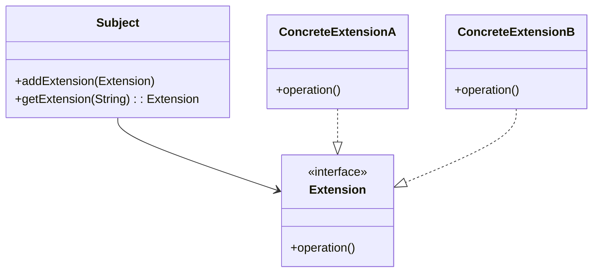

## 4.10 Extension Object Pattern

In the ever-evolving landscape of software development, the ability to adapt and extend functionality without altering existing code is invaluable. The Extension Object Pattern is a structural design pattern that facilitates this adaptability by allowing new functionalities to be added to objects dynamically. This pattern is particularly useful in scenarios where the system needs to be scalable and flexible, accommodating future changes with minimal disruption.

### Introduction to the Extension Object Pattern

The Extension Object Pattern is designed to address the need for adding new behaviors to objects without modifying their existing class structure. This pattern enables developers to attach new functionalities to objects at runtime, promoting a flexible and scalable architecture. By decoupling the core functionality of an object from its extensions, the pattern supports open-ended functionality and dynamic behavior addition.

#### Problem Statement

In traditional object-oriented design, adding new behavior to a class often requires modifying the class itself or creating subclasses. This approach can lead to a rigid system that is difficult to maintain and extend. The Extension Object Pattern solves this problem by allowing new behaviors to be added to objects dynamically, without altering their class definitions. This is particularly beneficial in large systems where changes need to be made frequently or where the system needs to accommodate unforeseen future requirements.

### Structure of the Extension Object Pattern

The Extension Object Pattern consists of several key components:

- **Subject**: The core object to which extensions can be added. It maintains a reference to its extensions and provides an interface for adding and retrieving extensions.
- **Extension**: An interface or abstract class that defines the behavior of extensions. Concrete extensions implement this interface to provide specific functionalities.
- **ConcreteExtension**: A concrete implementation of the Extension interface, providing specific behavior that can be added to the Subject.

#### UML Diagram

Below is a UML diagram illustrating the relationships between the components of the Extension Object Pattern:



In this diagram, the `Subject` class maintains a collection of `Extension` objects. Each `ConcreteExtension` implements the `Extension` interface, allowing the `Subject` to interact with them polymorphically.

### Dynamic Behavior Addition

The Extension Object Pattern supports dynamic behavior addition by allowing extensions to be attached to objects at runtime. This is achieved through the `addExtension` method in the `Subject` class, which accepts an `Extension` object and adds it to the Subject's collection of extensions. The `getExtension` method allows retrieval of a specific extension by its identifier, enabling the Subject to utilize the added functionalities as needed.

### Practical Implementation Strategies

When implementing the Extension Object Pattern in Java, consider the following strategies:

1. **Use Interfaces for Extensions**: Define a common interface for all extensions to ensure they can be added and retrieved uniformly.
2. **Leverage Java Collections**: Use Java's collection framework to manage extensions within the Subject. This allows for efficient addition, retrieval, and management of extensions.
3. **Ensure Loose Coupling**: Design extensions to be loosely coupled with the Subject, allowing them to be developed and maintained independently.
4. **Consider Thread Safety**: If the Subject and its extensions are accessed concurrently, ensure that the implementation is thread-safe to prevent race conditions.

### Code Example

Let's explore a practical implementation of the Extension Object Pattern in Java. We'll create a simple example where a `Document` object can have various extensions added to it, such as spell checking and grammar checking.

```java
import java.util.HashMap;
import java.util.Map;

// Extension interface
interface Extension {
    void execute();
}

// Concrete extension for spell checking
class SpellCheckExtension implements Extension {
    @Override
    public void execute() {
        System.out.println("Performing spell check...");
    }
}

// Concrete extension for grammar checking
class GrammarCheckExtension implements Extension {
    @Override
    public void execute() {
        System.out.println("Performing grammar check...");
    }
}

// Subject class
class Document {
    private Map<String, Extension> extensions = new HashMap<>();

    public void addExtension(String name, Extension extension) {
        extensions.put(name, extension);
    }

    public Extension getExtension(String name) {
        return extensions.get(name);
    }

    public void executeExtension(String name) {
        Extension extension = getExtension(name);
        if (extension != null) {
            extension.execute();
        } else {
            System.out.println("No such extension found.");
        }
    }
}

// Main class to demonstrate the pattern
public class ExtensionObjectPatternDemo {
    public static void main(String[] args) {
        Document document = new Document();

        // Adding extensions
        document.addExtension("spellCheck", new SpellCheckExtension());
        document.addExtension("grammarCheck", new GrammarCheckExtension());

        // Executing extensions
        document.executeExtension("spellCheck");
        document.executeExtension("grammarCheck");
    }
}
```

In this example, the `Document` class acts as the Subject, maintaining a collection of `Extension` objects. The `SpellCheckExtension` and `GrammarCheckExtension` are concrete implementations of the `Extension` interface, providing specific functionalities that can be added to the `Document`.

### Try It Yourself

To deepen your understanding of the Extension Object Pattern, try modifying the code example above:

- Add a new extension for `WordCount` that counts the number of words in a document.
- Implement a method in the `Document` class to list all available extensions.
- Experiment with thread safety by making the `Document` class thread-safe.

### Use Cases for the Extension Object Pattern

The Extension Object Pattern is particularly useful in scenarios where:

- **Open-Ended Functionality**: Systems need to accommodate new features without altering existing code.
- **Dynamic Behavior**: Objects require different behaviors at runtime based on varying conditions.
- **Plug-in Architectures**: Applications need to support plug-ins or modules that can be added or removed dynamically.
- **Scalability**: Systems must scale by adding new functionalities without impacting existing operations.

### Knowledge Check

Before we conclude, let's reinforce what we've learned:

- How does the Extension Object Pattern promote flexibility in software design?
- What are the key components of the Extension Object Pattern?
- How can the pattern be implemented in a thread-safe manner?

### Summary

The Extension Object Pattern is a powerful tool in the software engineer's arsenal, enabling dynamic addition of functionalities to objects. By decoupling core object behavior from extensions, this pattern promotes flexibility, scalability, and maintainability. As you continue to explore design patterns, consider how the Extension Object Pattern can be applied to enhance your software projects.

### Embrace the Journey

Remember, mastering design patterns is a journey. As you progress, you'll discover new ways to apply these patterns to solve complex problems. Keep experimenting, stay curious, and enjoy the journey!

## Quiz Time!



### What is the primary intent of the Extension Object Pattern?

- [x] To add new functionalities to objects dynamically without modifying their class.
- [ ] To create a single instance of a class.
- [ ] To encapsulate a request as an object.
- [ ] To provide a simplified interface to a complex subsystem.

> **Explanation:** The Extension Object Pattern is designed to add new functionalities to objects dynamically without altering their existing class structure.

### Which component in the Extension Object Pattern acts as the core object to which extensions are added?

- [x] Subject
- [ ] Extension
- [ ] ConcreteExtension
- [ ] Adapter

> **Explanation:** The Subject is the core object that maintains a reference to its extensions and provides an interface for adding and retrieving them.

### How does the Extension Object Pattern support dynamic behavior addition?

- [x] By allowing extensions to be attached to objects at runtime.
- [ ] By creating subclasses for each new behavior.
- [ ] By modifying the existing class structure.
- [ ] By using inheritance to add new functionalities.

> **Explanation:** The pattern allows extensions to be attached to objects at runtime, enabling dynamic behavior addition without modifying the existing class structure.

### What is the role of the ConcreteExtension in the Extension Object Pattern?

- [x] To provide specific behavior that can be added to the Subject.
- [ ] To act as the core object.
- [ ] To define the interface for extensions.
- [ ] To simplify complex subsystems.

> **Explanation:** ConcreteExtension is a concrete implementation of the Extension interface, providing specific behavior that can be added to the Subject.

### Which Java feature can be leveraged to manage extensions within the Subject?

- [x] Java Collections
- [ ] Java Reflection
- [ ] Java Annotations
- [ ] Java Streams

> **Explanation:** Java's collection framework can be used to efficiently manage extensions within the Subject.

### What is a practical use case for the Extension Object Pattern?

- [x] Plug-in architectures where modules can be added or removed dynamically.
- [ ] Creating a single instance of a class.
- [ ] Encapsulating a request as an object.
- [ ] Providing a simplified interface to a complex subsystem.

> **Explanation:** The pattern is particularly useful in plug-in architectures where modules can be added or removed dynamically.

### How can thread safety be ensured when implementing the Extension Object Pattern?

- [x] By making the Subject class thread-safe.
- [ ] By using inheritance to add new functionalities.
- [ ] By modifying the existing class structure.
- [ ] By creating subclasses for each new behavior.

> **Explanation:** Ensuring that the Subject class is thread-safe can prevent race conditions when accessing extensions concurrently.

### Which method in the Subject class is used to add an extension?

- [x] addExtension
- [ ] executeExtension
- [ ] getExtension
- [ ] removeExtension

> **Explanation:** The addExtension method is used to add an extension to the Subject's collection of extensions.

### What is the benefit of using interfaces for extensions in the Extension Object Pattern?

- [x] Ensures extensions can be added and retrieved uniformly.
- [ ] Simplifies complex subsystems.
- [ ] Provides a single instance of a class.
- [ ] Encapsulates a request as an object.

> **Explanation:** Using interfaces for extensions ensures they can be added and retrieved uniformly, promoting flexibility and scalability.

### True or False: The Extension Object Pattern requires modifying the existing class structure to add new behaviors.

- [ ] True
- [x] False

> **Explanation:** False. The pattern allows new behaviors to be added without modifying the existing class structure.


