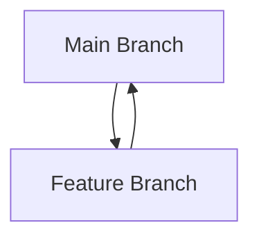
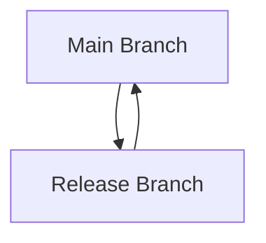
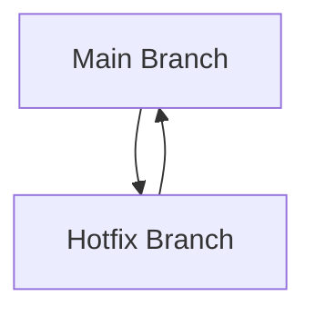

## 4.12 Versioning and Release Management

In the realm of software development, particularly in Java, versioning and release management are critical components that ensure the reliability, maintainability, and scalability of applications. This section delves into the best practices for managing software versions and releases, facilitating collaboration among developers, and ensuring reliable deployments.

### The Role of Version Control Systems

Version control systems (VCS) are indispensable tools in modern software development. They allow developers to track changes, collaborate efficiently, and maintain a history of code evolution. Among the various VCS options, **Git** stands out as the most popular choice due to its distributed nature and robust feature set.

#### Key Features of Git

- **Distributed Version Control**: Unlike centralized systems, Git allows every developer to have a complete copy of the repository, enabling offline work and reducing dependency on a central server.
- **Branching and Merging**: Git's branching model is lightweight, allowing developers to create, merge, and delete branches with ease.
- **Staging Area**: Git introduces a staging area where changes can be reviewed before committing, providing an additional layer of control.

For more information on Git, visit the [official Git website](https://git-scm.com/).

### Branching Strategies

Effective branching strategies are crucial for managing parallel development efforts and ensuring code stability. Here are some common strategies:

#### Feature Branches

Feature branches are used to develop new features in isolation from the main codebase. This approach minimizes the risk of introducing unstable code into the main branch.

*Diagram: Feature branches allow developers to work on new features independently.*

#### Release Branches

Release branches are created when a set of features is ready for release. This branch is used for final testing and bug fixes before merging into the main branch.

*Diagram: Release branches facilitate the stabilization of code before deployment.*

#### Hotfix Branches

Hotfix branches are used to address critical issues in the production environment. They are created from the main branch and merged back after the fix is applied.

*Diagram: Hotfix branches enable quick resolution of production issues.*

### Semantic Versioning (SemVer)

Semantic Versioning, or SemVer, is a versioning scheme that conveys meaning about the underlying changes with each new release. It follows the format `MAJOR.MINOR.PATCH`.

- **MAJOR**: Incremented for incompatible API changes.
- **MINOR**: Incremented for backward-compatible functionality.
- **PATCH**: Incremented for backward-compatible bug fixes.

#### SemVer Example

Consider a library with version `1.4.2`:
- `1`: Major version, indicating potential breaking changes.
- `4`: Minor version, indicating new features.
- `2`: Patch version, indicating bug fixes.

### Tagging Releases and Maintaining Changelogs

Tagging releases in a VCS like Git helps in identifying specific points in the history of the repository. Tags are often used to mark release versions.

#### Guidelines for Tagging

- Use consistent naming conventions, e.g., `v1.0.0`.
- Tag releases after thorough testing and validation.
- Include release notes or changelogs with each tag.

#### Maintaining Changelogs

Changelogs provide a record of changes made in each release, helping users and developers understand what has changed.

- **Automate Changelog Generation**: Use tools like `conventional-changelog` to automate the process.
- **Categorize Changes**: Group changes into categories like features, bug fixes, and breaking changes.

### Continuous Integration and Continuous Deployment (CI/CD)

CI/CD pipelines automate the process of integrating code changes and deploying applications. They play a vital role in modern release management.

#### Benefits of CI/CD

- **Automated Testing**: Ensures code quality by running tests automatically on each commit.
- **Faster Releases**: Reduces the time between development and deployment.
- **Consistent Environments**: Ensures that applications are deployed in consistent environments.

#### Implementing CI/CD

- Use tools like Jenkins, Travis CI, or GitHub Actions to set up CI/CD pipelines.
- Define stages for building, testing, and deploying applications.

### Tools for Automated Deployment and Artifact Repositories

Automated deployment tools and artifact repositories streamline the release process and manage dependencies effectively.

#### Automated Deployment Tools

- **Ansible**: Automates application deployment, configuration management, and orchestration.
- **Docker**: Containerizes applications, ensuring consistency across environments.

#### Artifact Repositories

Artifact repositories store and manage build artifacts, such as JAR files, libraries, and dependencies.

- **Nexus**: A repository manager that supports various formats, including Maven and npm.
- **Artifactory**: Provides advanced features for managing artifacts and dependencies.

### Reproducible Builds and Dependency Locking

Reproducible builds ensure that the same source code produces identical binaries, enhancing reliability and security.

#### Achieving Reproducible Builds

- **Lock Dependencies**: Use tools like Maven or Gradle to lock dependencies to specific versions.
- **Use Build Scripts**: Automate the build process with scripts to ensure consistency.

### Conclusion

Versioning and release management are integral to successful Java development. By adopting best practices in version control, branching strategies, semantic versioning, and CI/CD, developers can ensure reliable and efficient software releases. Tools like Git, Jenkins, and Nexus further enhance the process, providing robust solutions for managing code and dependencies.

### Key Takeaways

- **Version Control**: Use Git for distributed version control and efficient collaboration.
- **Branching Strategies**: Implement feature, release, and hotfix branches to manage development workflows.
- **Semantic Versioning**: Follow SemVer conventions for clear versioning.
- **CI/CD Pipelines**: Automate testing and deployment to streamline releases.
- **Artifact Repositories**: Use Nexus or Artifactory for managing build artifacts.
- **Reproducible Builds**: Lock dependencies and automate builds for consistency.

### Reflection

Consider how these practices can be applied to your projects. How can you improve your current versioning and release management processes?

---

## Test Your Knowledge: Versioning and Release Management Quiz



### What is the primary purpose of using a version control system like Git?

- [x] To track changes and facilitate collaboration among developers.
- [ ] To automate deployment processes.
- [ ] To manage build artifacts.
- [ ] To lock dependencies.

> **Explanation:** Version control systems like Git are used to track changes in code and facilitate collaboration among developers by maintaining a history of code evolution.

### Which branching strategy is used for developing new features in isolation?

- [x] Feature branches
- [ ] Release branches
- [ ] Hotfix branches
- [ ] Main branch

> **Explanation:** Feature branches are used to develop new features in isolation from the main codebase, minimizing the risk of introducing unstable code.

### What does the PATCH version in Semantic Versioning indicate?

- [x] Backward-compatible bug fixes
- [ ] Incompatible API changes
- [ ] Backward-compatible functionality
- [ ] New features

> **Explanation:** In Semantic Versioning, the PATCH version is incremented for backward-compatible bug fixes.

### What is the role of CI/CD pipelines in release management?

- [x] To automate the process of integrating code changes and deploying applications.
- [ ] To manage version control and branching strategies.
- [ ] To store and manage build artifacts.
- [ ] To lock dependencies.

> **Explanation:** CI/CD pipelines automate the process of integrating code changes and deploying applications, ensuring consistent and reliable releases.

### Which tool is commonly used for automated deployment in Java development?

- [x] Ansible
- [ ] Git
- [ ] Nexus
- [ ] Maven

> **Explanation:** Ansible is commonly used for automated deployment, configuration management, and orchestration in Java development.

### What is the benefit of maintaining a changelog for software releases?

- [x] It provides a record of changes made in each release.
- [ ] It automates the build process.
- [ ] It locks dependencies to specific versions.
- [ ] It containerizes applications.

> **Explanation:** Maintaining a changelog provides a record of changes made in each release, helping users and developers understand what has changed.

### Which artifact repository supports various formats, including Maven and npm?

- [x] Nexus
- [ ] GitHub
- [ ] Jenkins
- [ ] Docker

> **Explanation:** Nexus is a repository manager that supports various formats, including Maven and npm, for managing build artifacts.

### What is a key practice for achieving reproducible builds?

- [x] Locking dependencies to specific versions
- [ ] Using feature branches
- [ ] Automating deployment processes
- [ ] Maintaining a changelog

> **Explanation:** Locking dependencies to specific versions is a key practice for achieving reproducible builds, ensuring that the same source code produces identical binaries.

### What is the main advantage of using Docker in deployment?

- [x] It containerizes applications, ensuring consistency across environments.
- [ ] It tracks changes in code.
- [ ] It manages build artifacts.
- [ ] It automates testing.

> **Explanation:** Docker containerizes applications, ensuring consistency across environments, which is a significant advantage in deployment.

### True or False: Semantic Versioning helps convey meaning about the underlying changes with each new release.

- [x] True
- [ ] False

> **Explanation:** True. Semantic Versioning helps convey meaning about the underlying changes with each new release by following a structured versioning scheme.


