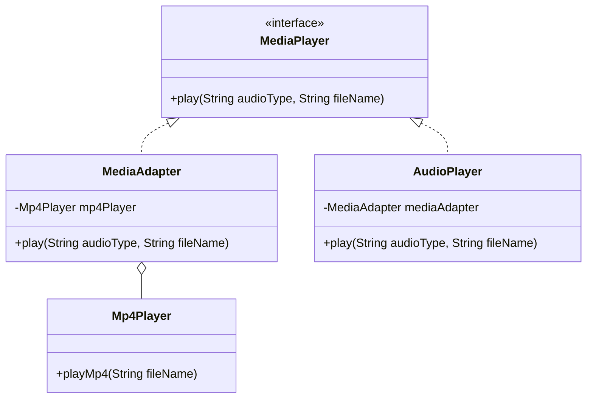

## 4.2.1 Implementing Adapter in Java

The Adapter pattern is a structural design pattern that allows objects with incompatible interfaces to collaborate. It acts as a bridge between two incompatible interfaces by converting the interface of a class into another interface that a client expects. This pattern is particularly useful when you want to use a class that does not meet the interface requirements of the system you are working with.

### Understanding the Adapter Pattern

Before diving into implementation, let's clarify the key components of the Adapter pattern:

- **Target Interface**: This is the interface that the client expects to work with.
- **Adaptee**: This is the existing class that needs to be adapted.
- **Adapter**: This class implements the Target interface and holds an instance of the Adaptee. It translates the requests from the Target interface to the Adaptee.

### Why Use the Adapter Pattern?

The Adapter pattern is beneficial in scenarios where:

- You want to use an existing class but its interface is not compatible with the rest of your code.
- You want to create a reusable class that cooperates with unrelated or unforeseen classes, that is, classes that don't necessarily have compatible interfaces.
- You need to use several existing subclasses, but it's impractical to adapt their interface by subclassing every one. An adapter can be used to wrap these classes.

### Implementing the Adapter Pattern Using Composition

In Java, the Adapter pattern is often implemented using composition, also known as the object adapter pattern. This approach is preferred over class adapters (which use inheritance) because it adheres to the principle of composition over inheritance, providing more flexibility and reducing coupling.

#### Step-by-Step Implementation

Let's walk through the process of implementing the Adapter pattern using composition in Java.

#### Step 1: Define the Target Interface

The Target interface is what the client expects to work with. It defines the domain-specific interface that the Adapter will implement.

```java
// Target Interface
public interface MediaPlayer {
    void play(String audioType, String fileName);
}
```

#### Step 2: Create the Adaptee Class

The Adaptee class contains some useful behavior, but its interface is incompatible with the client’s code. In our example, this class can play MP4 files.

```java
// Adaptee Class
public class Mp4Player {
    public void playMp4(String fileName) {
        System.out.println("Playing mp4 file. Name: " + fileName);
    }
}
```

#### Step 3: Implement the Adapter Class

The Adapter class implements the Target interface and holds an instance of the Adaptee. It translates the requests from the Target interface to the Adaptee.

```java
// Adapter Class
public class MediaAdapter implements MediaPlayer {
    private Mp4Player mp4Player;

    public MediaAdapter() {
        mp4Player = new Mp4Player();
    }

    @Override
    public void play(String audioType, String fileName) {
        if (audioType.equalsIgnoreCase("mp4")) {
            mp4Player.playMp4(fileName);
        } else {
            System.out.println("Invalid media. " + audioType + " format not supported");
        }
    }
}
```

#### Step 4: Use the Adapter in the Client

Finally, we use the Adapter in the client code. The client interacts with the Target interface, and the Adapter handles the translation to the Adaptee.

```java
// Client Code
public class AudioPlayer implements MediaPlayer {
    private MediaAdapter mediaAdapter;

    @Override
    public void play(String audioType, String fileName) {
        // Inbuilt support to play mp3 music files
        if (audioType.equalsIgnoreCase("mp3")) {
            System.out.println("Playing mp3 file. Name: " + fileName);
        }
        // MediaAdapter is providing support to play other file formats
        else if (audioType.equalsIgnoreCase("mp4")) {
            mediaAdapter = new MediaAdapter();
            mediaAdapter.play(audioType, fileName);
        } else {
            System.out.println("Invalid media. " + audioType + " format not supported");
        }
    }

    public static void main(String[] args) {
        AudioPlayer audioPlayer = new AudioPlayer();

        audioPlayer.play("mp3", "beyond_the_horizon.mp3");
        audioPlayer.play("mp4", "alone.mp4");
        audioPlayer.play("vlc", "far_far_away.vlc");
    }
}
```

### How the Adapter Translates Requests

In the above example, the `MediaAdapter` class acts as a bridge between the `AudioPlayer` (client) and the `Mp4Player` (adaptee). The `MediaAdapter` implements the `MediaPlayer` interface, which is the target interface expected by the `AudioPlayer`. When the `AudioPlayer` calls the `play` method with an "mp4" audio type, the `MediaAdapter` translates this request to the `playMp4` method of the `Mp4Player`.

### Visualizing the Adapter Pattern

To better understand the relationships between the components, let's visualize the Adapter pattern using a class diagram.



**Diagram Explanation**: The `MediaPlayer` interface is implemented by both `MediaAdapter` and `AudioPlayer`. The `MediaAdapter` uses composition to hold an instance of `Mp4Player`, allowing it to translate requests from `AudioPlayer` to `Mp4Player`.

### Scenarios for Using Object Adapters

Object adapters are often preferred over class adapters for several reasons:

- **Flexibility**: Object adapters can work with any subclass of the Adaptee class, making them more flexible than class adapters.
- **Single Responsibility**: By using composition, the Adapter class can focus solely on translating requests, adhering to the Single Responsibility Principle.
- **Decoupling**: Object adapters reduce coupling between the client and the adaptee, as they rely on interfaces rather than concrete implementations.

### Best Practices

When implementing the Adapter pattern, consider the following best practices:

- **Program to Interfaces**: Always program to interfaces rather than concrete classes. This approach enhances flexibility and testability.
- **Use Composition Over Inheritance**: Favor composition over inheritance to achieve greater flexibility and adhere to the Open/Closed Principle.
- **Keep Adapters Simple**: The Adapter class should be as simple as possible, focusing on translating requests without adding unnecessary complexity.

### Try It Yourself

To deepen your understanding of the Adapter pattern, try modifying the code examples:

- **Add Support for Additional Formats**: Extend the `MediaAdapter` to support additional media formats, such as "vlc" or "avi".
- **Implement a Class Adapter**: Try implementing a class adapter using inheritance and compare it with the object adapter approach.
- **Refactor the Code**: Refactor the code to adhere more closely to the SOLID principles, particularly the Open/Closed Principle.

### References and Further Reading

For more information on the Adapter pattern and other design patterns, consider the following resources:

- [Design Patterns: Elements of Reusable Object-Oriented Software](https://www.amazon.com/Design-Patterns-Elements-Reusable-Object-Oriented/dp/0201633612) by Erich Gamma, Richard Helm, Ralph Johnson, and John Vlissides.
- [Java Design Patterns](https://www.journaldev.com/1827/java-design-patterns-example-tutorial) - JournalDev
- [Adapter Pattern - Refactoring Guru](https://refactoring.guru/design-patterns/adapter)

### Knowledge Check

To reinforce your understanding of the Adapter pattern, consider the following questions:

- What is the primary purpose of the Adapter pattern?
- How does the Adapter pattern adhere to the principle of composition over inheritance?
- In what scenarios would you prefer an object adapter over a class adapter?
- How can the Adapter pattern improve code reusability and flexibility?

## Quiz Time!



### What is the primary role of the Adapter pattern in software design?

- [x] To allow incompatible interfaces to work together
- [ ] To provide a simplified interface to a complex subsystem
- [ ] To compose objects into tree structures
- [ ] To attach additional responsibilities to an object dynamically

> **Explanation:** The Adapter pattern allows incompatible interfaces to work together by converting the interface of a class into another interface expected by the client.

### Which principle does the Adapter pattern adhere to when using composition over inheritance?

- [x] Composition over inheritance
- [ ] Single Responsibility Principle
- [ ] Liskov Substitution Principle
- [ ] Interface Segregation Principle

> **Explanation:** The Adapter pattern adheres to the principle of composition over inheritance by using object composition to achieve flexibility.

### In the Adapter pattern, what is the role of the Target interface?

- [x] It defines the domain-specific interface that the Adapter will implement
- [ ] It contains the existing functionality that needs to be adapted
- [ ] It translates requests from the client to the Adaptee
- [ ] It acts as a bridge between two incompatible interfaces

> **Explanation:** The Target interface defines the domain-specific interface that the Adapter will implement, which the client expects to work with.

### What is the advantage of using an object adapter over a class adapter?

- [x] Greater flexibility and reduced coupling
- [ ] Simpler implementation using inheritance
- [ ] Direct access to the Adaptee's methods
- [ ] Ability to override Adaptee's methods

> **Explanation:** Object adapters provide greater flexibility and reduced coupling by using composition, allowing them to work with any subclass of the Adaptee.

### Which of the following is a best practice when implementing the Adapter pattern?

- [x] Program to interfaces rather than concrete classes
- [ ] Use inheritance to achieve flexibility
- [ ] Add as much functionality as possible to the Adapter
- [ ] Avoid using interfaces to simplify the design

> **Explanation:** Programming to interfaces rather than concrete classes enhances flexibility and testability, which is a best practice in implementing the Adapter pattern.

### What is the primary difference between object adapters and class adapters?

- [x] Object adapters use composition, while class adapters use inheritance
- [ ] Object adapters use inheritance, while class adapters use composition
- [ ] Object adapters are less flexible than class adapters
- [ ] Object adapters can only work with a single Adaptee

> **Explanation:** Object adapters use composition to achieve flexibility, while class adapters use inheritance, which can lead to tighter coupling.

### How does the Adapter pattern improve code reusability?

- [x] By allowing existing classes to be used with new interfaces
- [ ] By simplifying the implementation of complex algorithms
- [ ] By reducing the number of classes in the system
- [ ] By providing a single entry point for all requests

> **Explanation:** The Adapter pattern improves code reusability by allowing existing classes to be used with new interfaces, facilitating integration.

### In the provided example, what is the role of the MediaAdapter class?

- [x] It implements the Target interface and translates requests to the Adaptee
- [ ] It acts as the client that interacts with the Target interface
- [ ] It provides the existing functionality that needs to be adapted
- [ ] It defines the domain-specific interface expected by the client

> **Explanation:** The MediaAdapter class implements the Target interface and translates requests to the Adaptee, acting as a bridge.

### What is a potential drawback of using the Adapter pattern?

- [x] It can introduce additional complexity to the system
- [ ] It reduces the flexibility of the system
- [ ] It tightly couples the client and the Adaptee
- [ ] It limits the reusability of existing classes

> **Explanation:** While the Adapter pattern provides flexibility, it can introduce additional complexity by adding extra layers of abstraction.

### True or False: The Adapter pattern can only be used with object-oriented programming languages.

- [ ] True
- [x] False

> **Explanation:** The Adapter pattern can be applied in various programming paradigms, not just object-oriented programming, as it focuses on interface compatibility.



Remember, mastering design patterns like the Adapter pattern is a journey. Keep experimenting, stay curious, and enjoy the process of refining your software design skills!
