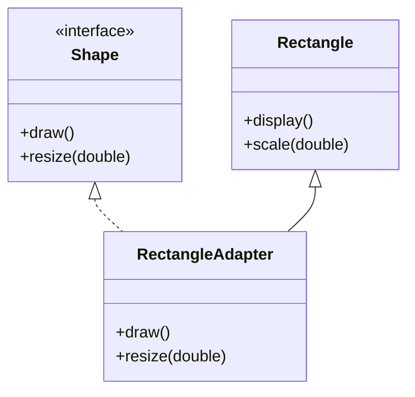
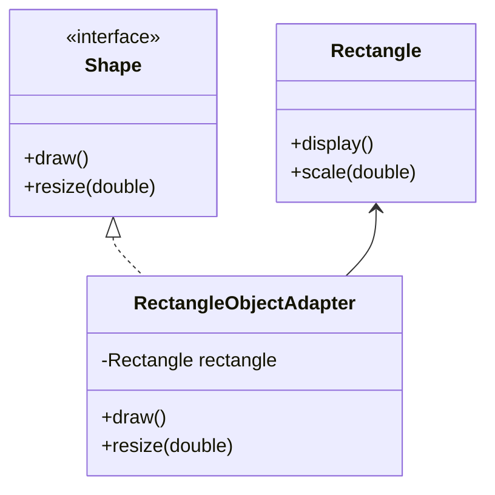

## 4.2.2 Class Adapter vs. Object Adapter

In the realm of software design patterns, the Adapter pattern stands out as a structural pattern that allows incompatible interfaces to work together. It acts as a bridge between two incompatible interfaces, enabling them to collaborate seamlessly. Within the Adapter pattern, there are two primary variations: the Class Adapter and the Object Adapter. Each has its unique approach to achieving interface compatibility, leveraging inheritance and composition, respectively. In this section, we will delve into these two variations, exploring their implementations, advantages, disadvantages, and use cases in Java.

### Understanding the Class Adapter

The Class Adapter pattern leverages inheritance to adapt one interface to another. In Java, this involves implementing an interface and extending a class simultaneously. This approach is feasible because Java supports multiple interface implementations, even though it restricts multiple class inheritance.

#### Implementing Class Adapter in Java

To illustrate the Class Adapter pattern, consider a scenario where we have an existing `Rectangle` class that we want to adapt to work with a `Shape` interface. The `Shape` interface expects methods like `draw()` and `resize()`, while the `Rectangle` class has methods `display()` and `scale()`.

```java
// Existing class
class Rectangle {
    public void display() {
        System.out.println("Displaying Rectangle");
    }

    public void scale(double factor) {
        System.out.println("Scaling Rectangle by " + factor);
    }
}

// Target interface
interface Shape {
    void draw();
    void resize(double factor);
}

// Class Adapter
class RectangleAdapter extends Rectangle implements Shape {
    @Override
    public void draw() {
        display(); // Adapting display() to draw()
    }

    @Override
    public void resize(double factor) {
        scale(factor); // Adapting scale() to resize()
    }
}

public class ClassAdapterDemo {
    public static void main(String[] args) {
        Shape shape = new RectangleAdapter();
        shape.draw();
        shape.resize(2.0);
    }
}
```

In this example, `RectangleAdapter` extends `Rectangle` and implements `Shape`. This allows `RectangleAdapter` to adapt the `Rectangle` class to the `Shape` interface by providing implementations for `draw()` and `resize()` that internally call `display()` and `scale()`.

#### Advantages of Class Adapter

- **Simplicity**: The Class Adapter pattern is straightforward to implement when you have control over the source class.
- **Performance**: Since it uses inheritance, there is no additional overhead of object composition.
- **Direct Access**: The adapter has direct access to the adapted class's protected members.

#### Disadvantages of Class Adapter

- **Single Inheritance Limitation**: Java's single inheritance model restricts the adapter to extend only one class.
- **Tight Coupling**: The adapter is tightly coupled to the adapted class, reducing flexibility.
- **Limited Flexibility**: It cannot adapt multiple classes simultaneously.

### Understanding the Object Adapter

The Object Adapter pattern uses composition to achieve interface adaptation. Instead of extending a class, the adapter holds a reference to an instance of the class it adapts. This approach is more flexible and aligns well with Java's single inheritance constraint.

#### Implementing Object Adapter in Java

Let's revisit the previous example, but this time we'll implement it using the Object Adapter pattern.

```java
// Existing class
class Rectangle {
    public void display() {
        System.out.println("Displaying Rectangle");
    }

    public void scale(double factor) {
        System.out.println("Scaling Rectangle by " + factor);
    }
}

// Target interface
interface Shape {
    void draw();
    void resize(double factor);
}

// Object Adapter
class RectangleObjectAdapter implements Shape {
    private Rectangle rectangle;

    public RectangleObjectAdapter(Rectangle rectangle) {
        this.rectangle = rectangle;
    }

    @Override
    public void draw() {
        rectangle.display(); // Adapting display() to draw()
    }

    @Override
    public void resize(double factor) {
        rectangle.scale(factor); // Adapting scale() to resize()
    }
}

public class ObjectAdapterDemo {
    public static void main(String[] args) {
        Rectangle rectangle = new Rectangle();
        Shape shape = new RectangleObjectAdapter(rectangle);
        shape.draw();
        shape.resize(2.0);
    }
}
```

In this example, `RectangleObjectAdapter` holds a reference to a `Rectangle` instance. It implements the `Shape` interface and delegates the calls to the `Rectangle` instance, adapting its methods to the `Shape` interface.

#### Advantages of Object Adapter

- **Flexibility**: The Object Adapter pattern can adapt multiple classes and interfaces, providing greater flexibility.
- **Loose Coupling**: It promotes loose coupling by using composition, making it easier to modify or replace the adapted class.
- **Multiple Adaptees**: It can work with multiple adaptees, adapting different classes to the same interface.

#### Disadvantages of Object Adapter

- **Slight Overhead**: There is a minor performance overhead due to the additional layer of composition.
- **Complexity**: It can be slightly more complex to implement compared to the Class Adapter pattern.

### Class Adapter vs. Object Adapter: A Comparative Analysis

#### Flexibility and Reusability

The Object Adapter pattern is generally more flexible and reusable than the Class Adapter pattern. By using composition, it allows the adapter to work with different implementations of the adaptee, making it more versatile. This flexibility is crucial in scenarios where the adaptee class might change or when multiple classes need to be adapted to the same interface.

#### Coupling and Complexity

The Class Adapter pattern tends to be more tightly coupled to the adaptee class because it relies on inheritance. This tight coupling can make it challenging to modify or extend the adapter without affecting the adaptee. On the other hand, the Object Adapter pattern promotes loose coupling by using composition, which enhances maintainability and scalability.

#### Performance Considerations

In terms of performance, the Class Adapter pattern may have a slight edge due to the absence of an additional layer of composition. However, this performance gain is often negligible, especially in modern Java applications where the benefits of flexibility and maintainability outweigh the minor performance overhead of the Object Adapter pattern.

#### Language Constraints

Java's single inheritance model significantly influences the choice between Class Adapter and Object Adapter patterns. Since Java does not support multiple class inheritance, the Class Adapter pattern is limited to adapting a single class. In contrast, the Object Adapter pattern can adapt multiple classes, making it a more suitable choice in Java.

### Selecting the Appropriate Adapter Type

When deciding between the Class Adapter and Object Adapter patterns, consider the following factors:

- **Use Class Adapter** when:
  - You have control over the source class and can extend it.
  - The performance overhead of composition is a concern.
  - You need direct access to the adaptee's protected members.

- **Use Object Adapter** when:
  - You need to adapt multiple classes or interfaces.
  - Flexibility and loose coupling are priorities.
  - You are working within Java's single inheritance constraints.

### Visualizing Class Adapter vs. Object Adapter

To better understand the differences between Class Adapter and Object Adapter patterns, let's visualize their structures using Mermaid.js diagrams.

#### Class Adapter Diagram



**Caption**: The Class Adapter pattern uses inheritance to adapt the `Rectangle` class to the `Shape` interface.

#### Object Adapter Diagram



**Caption**: The Object Adapter pattern uses composition to adapt the `Rectangle` class to the `Shape` interface.

### Try It Yourself

To deepen your understanding of the Class Adapter and Object Adapter patterns, try modifying the code examples provided:

1. **Experiment with Additional Methods**: Add more methods to the `Rectangle` class and adapt them in both the Class Adapter and Object Adapter patterns.
2. **Adapt Multiple Classes**: Create another class, such as `Circle`, and adapt it to the `Shape` interface using the Object Adapter pattern.
3. **Explore Performance**: Measure the performance of both patterns in a Java application to observe any differences.

### Knowledge Check

Before moving on, let's reinforce what we've learned:

- **What is the primary difference between Class Adapter and Object Adapter patterns?**
- **How does Java's single inheritance model influence the choice between these patterns?**
- **What are the advantages of using the Object Adapter pattern over the Class Adapter pattern?**

### Conclusion

The Class Adapter and Object Adapter patterns offer distinct approaches to adapting interfaces in Java. While the Class Adapter pattern leverages inheritance for simplicity and performance, the Object Adapter pattern uses composition for flexibility and loose coupling. Understanding the strengths and limitations of each pattern is crucial for selecting the appropriate adapter type based on specific use cases and constraints. As you continue to explore design patterns, remember to consider the unique requirements of your application and the trade-offs involved in each approach.

## Quiz Time!



### What is the primary advantage of the Class Adapter pattern?

- [x] Simplicity and direct access to protected members
- [ ] Flexibility and loose coupling
- [ ] Ability to adapt multiple classes
- [ ] Performance overhead reduction

> **Explanation:** The Class Adapter pattern is simpler to implement and provides direct access to protected members of the adaptee class.

### How does the Object Adapter pattern achieve interface adaptation?

- [ ] Through inheritance
- [x] Through composition
- [ ] By implementing multiple interfaces
- [ ] By modifying the adaptee class

> **Explanation:** The Object Adapter pattern uses composition to hold a reference to the adaptee class and delegate method calls.

### Which pattern is more flexible in adapting multiple classes?

- [ ] Class Adapter
- [x] Object Adapter
- [ ] Both are equally flexible
- [ ] Neither can adapt multiple classes

> **Explanation:** The Object Adapter pattern is more flexible because it can adapt multiple classes using composition.

### What is a disadvantage of the Class Adapter pattern?

- [ ] It promotes loose coupling
- [x] It is tightly coupled to the adaptee class
- [ ] It can adapt multiple classes simultaneously
- [ ] It has a performance overhead

> **Explanation:** The Class Adapter pattern is tightly coupled to the adaptee class due to its reliance on inheritance.

### Why is the Object Adapter pattern preferred in Java?

- [x] Because Java supports single inheritance
- [ ] Because it is simpler to implement
- [ ] Because it has no performance overhead
- [ ] Because it provides direct access to protected members

> **Explanation:** The Object Adapter pattern is preferred in Java due to its flexibility and ability to work within Java's single inheritance constraint.

### What is a key benefit of using the Object Adapter pattern?

- [ ] Direct access to protected members
- [x] Loose coupling and flexibility
- [ ] Simplicity in implementation
- [ ] Reduced performance overhead

> **Explanation:** The Object Adapter pattern promotes loose coupling and flexibility by using composition.

### Which pattern should you use if you need to adapt multiple classes?

- [ ] Class Adapter
- [x] Object Adapter
- [ ] Both are suitable
- [ ] Neither is suitable

> **Explanation:** The Object Adapter pattern is suitable for adapting multiple classes due to its use of composition.

### What is a potential downside of the Object Adapter pattern?

- [ ] It is tightly coupled to the adaptee class
- [ ] It cannot adapt multiple classes
- [x] It has a slight performance overhead
- [ ] It is less flexible

> **Explanation:** The Object Adapter pattern may have a slight performance overhead due to the additional layer of composition.

### How does the Class Adapter pattern adapt interfaces?

- [x] By using inheritance
- [ ] By using composition
- [ ] By modifying the adaptee class
- [ ] By implementing multiple interfaces

> **Explanation:** The Class Adapter pattern adapts interfaces by using inheritance to extend the adaptee class.

### Java's single inheritance model affects which adapter pattern?

- [x] Class Adapter
- [ ] Object Adapter
- [ ] Both patterns equally
- [ ] Neither pattern

> **Explanation:** Java's single inheritance model affects the Class Adapter pattern because it restricts the adapter to extend only one class.



Remember, this is just the beginning. As you progress, you'll build more complex and interactive applications using these patterns. Keep experimenting, stay curious, and enjoy the journey!
