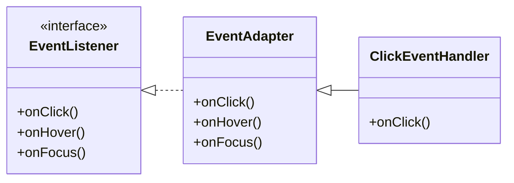
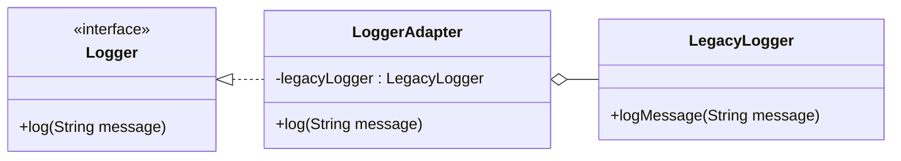

## 4.2.3 Interface vs. Implementation Adapters

In the realm of software design patterns, the Adapter Pattern is a structural pattern that allows objects with incompatible interfaces to work together. This pattern is particularly useful in Java, where it helps bridge the gap between disparate interfaces and implementations. In this section, we will delve into the nuances of interface adapters and implementation adapters, exploring their differences, use cases, and practical applications in Java.

### Understanding the Adapter Pattern

Before we differentiate between interface and implementation adapters, let's briefly revisit the Adapter Pattern itself. The primary goal of this pattern is to convert the interface of a class into another interface that a client expects. This allows classes to work together that otherwise couldn't due to incompatible interfaces.

The Adapter Pattern can be implemented in two main ways:

- **Class Adapter**: Uses inheritance to adapt one interface to another.
- **Object Adapter**: Uses composition to achieve the same goal.

Both approaches have their merits and are chosen based on the specific requirements of the application.

### Interface Adapters

#### Definition and Purpose

Interface adapters, also known as adapter classes, provide default implementations for interfaces. They are particularly useful when an interface contains multiple methods, but the client is only interested in implementing a subset of those methods. By providing default implementations, interface adapters allow developers to focus on the methods they care about without being burdened by the rest.

#### How Interface Adapters Work

In Java, interface adapters are typically implemented using abstract classes. These abstract classes implement the interface and provide default (often empty) implementations for all its methods. Clients can then extend these abstract classes and override only the methods they need.

#### Example: Event Handling with Interface Adapters

Consider a scenario where we have an interface for handling various types of events:

```java
public interface EventListener {
    void onClick();
    void onHover();
    void onFocus();
}
```

If a client is only interested in handling click events, implementing the entire interface becomes cumbersome. Instead, we can use an interface adapter:

```java
public abstract class EventAdapter implements EventListener {
    @Override
    public void onClick() {
        // Default implementation
    }

    @Override
    public void onHover() {
        // Default implementation
    }

    @Override
    public void onFocus() {
        // Default implementation
    }
}

public class ClickEventHandler extends EventAdapter {
    @Override
    public void onClick() {
        System.out.println("Click event handled.");
    }
}
```

In this example, `ClickEventHandler` only overrides the `onClick` method, leaving the other methods with their default implementations.

#### Use Cases for Interface Adapters

Interface adapters are particularly useful in the context of listeners and event handlers, where interfaces often define multiple methods. They simplify the implementation process by allowing developers to focus on the methods relevant to their specific use case.

#### Benefits and Drawbacks

**Benefits:**

- **Simplified Implementation**: Developers can implement only the methods they need.
- **Reduced Boilerplate**: Default implementations reduce the amount of code required.
- **Flexibility**: Easily extendable for future requirements.

**Drawbacks:**

- **Overhead**: Additional layer of abstraction can introduce slight overhead.
- **Limited to Interfaces**: Primarily useful for interfaces with multiple methods.

### Implementation Adapters

#### Definition and Purpose

Implementation adapters, on the other hand, adapt one class's implementation to match another's expected interface. This is typically achieved through composition, where the adapter holds an instance of the class it is adapting and delegates calls to it.

#### How Implementation Adapters Work

Implementation adapters are used when you need to adapt an existing class to work with a new interface. This is common when integrating third-party libraries or legacy code that doesn't conform to the desired interface.

#### Example: Adapting a Legacy Logger

Imagine we have a legacy logging system with the following interface:

```java
public class LegacyLogger {
    public void logMessage(String message) {
        System.out.println("Legacy log: " + message);
    }
}
```

We want to integrate this with a new logging interface:

```java
public interface Logger {
    void log(String message);
}
```

We can create an implementation adapter to bridge the gap:

```java
public class LoggerAdapter implements Logger {
    private LegacyLogger legacyLogger;

    public LoggerAdapter(LegacyLogger legacyLogger) {
        this.legacyLogger = legacyLogger;
    }

    @Override
    public void log(String message) {
        legacyLogger.logMessage(message);
    }
}
```

In this example, `LoggerAdapter` adapts `LegacyLogger` to work with the `Logger` interface.

#### Use Cases for Implementation Adapters

Implementation adapters are ideal for integrating existing classes with new interfaces, especially when dealing with third-party libraries or legacy code. They provide a seamless way to adapt existing functionality without modifying the original class.

#### Benefits and Drawbacks

**Benefits:**

- **Reusability**: Allows existing classes to be reused with new interfaces.
- **Encapsulation**: Encapsulates the adaptation logic within the adapter.
- **Flexibility**: Can adapt classes without modifying their source code.

**Drawbacks:**

- **Complexity**: Can introduce additional complexity if not managed properly.
- **Performance**: May introduce slight performance overhead due to delegation.

### When to Use Interface vs. Implementation Adapters

Choosing between interface and implementation adapters depends on the specific requirements of your application. Here are some guidelines to help you decide:

- **Use Interface Adapters When:**
  - You have an interface with multiple methods, and clients only need to implement a subset.
  - You want to provide default implementations for an interface.
  - You are dealing with event handling or listener interfaces.

- **Use Implementation Adapters When:**
  - You need to adapt an existing class to work with a new interface.
  - You are integrating third-party libraries or legacy code.
  - You want to encapsulate adaptation logic without modifying the original class.

### Visualizing Interface vs. Implementation Adapters

To better understand the differences between interface and implementation adapters, let's visualize their structures using Mermaid.js diagrams.

#### Interface Adapter Diagram



**Description**: This diagram illustrates how `EventAdapter` provides default implementations for the `EventListener` interface, and `ClickEventHandler` extends `EventAdapter` to override specific methods.

#### Implementation Adapter Diagram



**Description**: This diagram shows how `LoggerAdapter` adapts `LegacyLogger` to work with the `Logger` interface, using composition to delegate method calls.

### Try It Yourself

Now that we've explored the concepts and examples, it's time to try it yourself. Modify the code examples to experiment with different scenarios:

- **Experiment with Interface Adapters**: Create a new interface with additional methods and see how an interface adapter simplifies implementation.
- **Experiment with Implementation Adapters**: Adapt a different legacy class to work with a new interface, and observe how the adapter handles method delegation.

### Key Takeaways

- **Interface Adapters**: Provide default implementations for interfaces, simplifying the implementation process for clients.
- **Implementation Adapters**: Adapt existing classes to work with new interfaces, facilitating integration with third-party libraries or legacy code.
- **Choosing the Right Adapter**: Consider the application's needs, the complexity of the interfaces, and the existing codebase when deciding between interface and implementation adapters.

### References and Further Reading

- [Adapter Pattern in Java](https://www.geeksforgeeks.org/adapter-pattern/)
- [Java Interface and Abstract Class](https://www.javatpoint.com/interface-vs-abstract-class-in-java)
- [Design Patterns: Elements of Reusable Object-Oriented Software](https://www.amazon.com/Design-Patterns-Elements-Reusable-Object-Oriented/dp/0201633612)

### Embrace the Journey

Remember, mastering design patterns is a journey. As you continue to explore and implement these patterns, you'll gain a deeper understanding of how to write maintainable and scalable code. Keep experimenting, stay curious, and enjoy the process!

## Quiz Time!



### Which type of adapter provides default implementations for interfaces?

- [x] Interface Adapter
- [ ] Implementation Adapter
- [ ] Class Adapter
- [ ] Object Adapter

> **Explanation:** Interface adapters provide default implementations for interfaces, allowing clients to implement only the methods they need.

### What is a primary use case for implementation adapters?

- [x] Integrating legacy code with new interfaces
- [ ] Providing default implementations for interfaces
- [ ] Simplifying event handling
- [ ] Reducing code complexity

> **Explanation:** Implementation adapters are used to adapt existing classes to work with new interfaces, often when integrating legacy code.

### In Java, how are interface adapters typically implemented?

- [x] Using abstract classes
- [ ] Using interfaces
- [ ] Using concrete classes
- [ ] Using enums

> **Explanation:** Interface adapters in Java are typically implemented using abstract classes that provide default implementations for interface methods.

### What is a drawback of using implementation adapters?

- [x] They can introduce additional complexity
- [ ] They simplify code implementation
- [ ] They provide default method implementations
- [ ] They reduce code flexibility

> **Explanation:** Implementation adapters can introduce additional complexity due to the need for method delegation and encapsulation.

### Which pattern is used to adapt one class's implementation to match another's expected interface?

- [x] Implementation Adapter
- [ ] Interface Adapter
- [ ] Singleton Pattern
- [ ] Observer Pattern

> **Explanation:** Implementation adapters adapt one class's implementation to match another's expected interface, often using composition.

### What is a benefit of using interface adapters?

- [x] Simplified implementation for clients
- [ ] Increased code complexity
- [ ] Reduced code flexibility
- [ ] Enhanced performance

> **Explanation:** Interface adapters simplify implementation for clients by providing default implementations for interface methods.

### When should you use an interface adapter?

- [x] When dealing with interfaces with multiple methods
- [ ] When adapting legacy code
- [ ] When integrating third-party libraries
- [ ] When reducing code complexity

> **Explanation:** Interface adapters are useful when dealing with interfaces that have multiple methods, allowing clients to implement only the necessary ones.

### How do implementation adapters achieve adaptation?

- [x] Through composition and delegation
- [ ] Through inheritance
- [ ] Through default method implementations
- [ ] Through method overloading

> **Explanation:** Implementation adapters achieve adaptation through composition and delegation, allowing existing classes to work with new interfaces.

### What is a common use case for interface adapters?

- [x] Event handling and listener interfaces
- [ ] Adapting legacy code
- [ ] Integrating third-party libraries
- [ ] Reducing code complexity

> **Explanation:** Interface adapters are commonly used in event handling and listener interfaces to simplify the implementation process.

### True or False: Implementation adapters are primarily used to provide default implementations for interfaces.

- [ ] True
- [x] False

> **Explanation:** False. Implementation adapters are used to adapt existing classes to work with new interfaces, not to provide default implementations.


