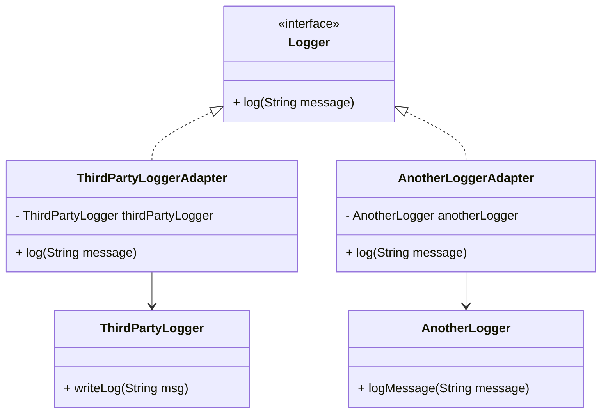
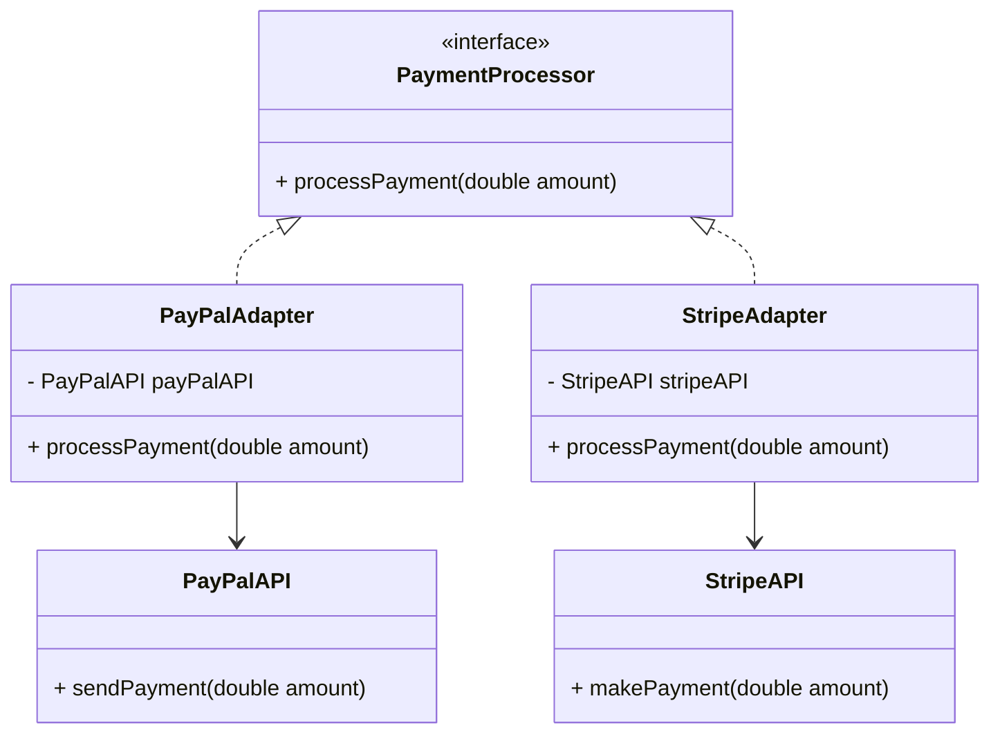
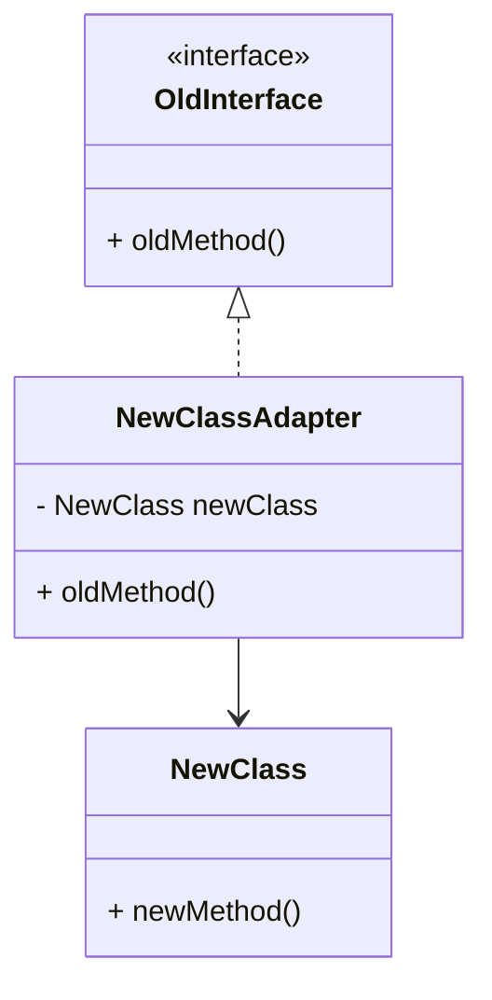
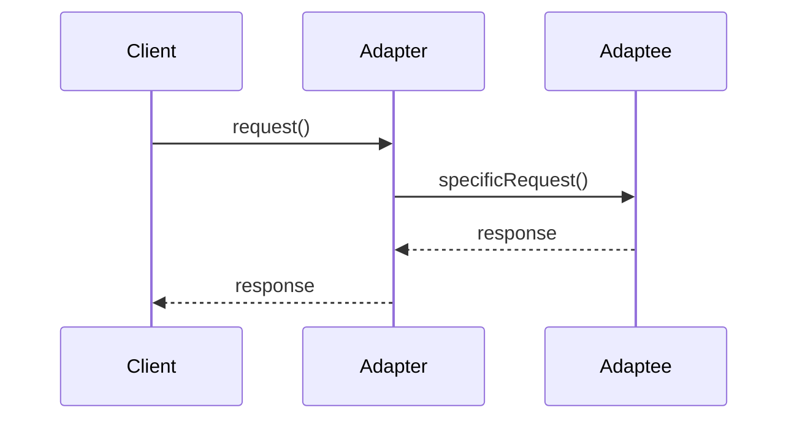

## 4.2.4 Use Cases and Examples

The Adapter Pattern is a structural design pattern that enables objects with incompatible interfaces to collaborate. It acts as a bridge between two interfaces, allowing them to work together without modifying their existing code. This pattern is particularly useful when integrating legacy systems or third-party libraries into a new or existing system. Let's delve into some practical scenarios where the Adapter Pattern shines, along with code examples and diagrams to illustrate its application.

### Real-World Use Cases

#### 1. Adapting Different Logging Frameworks

In large-scale applications, different modules might use various logging frameworks. Standardizing logging across an application can be challenging if each module uses a different framework. The Adapter Pattern can be employed to create a unified logging interface, allowing different logging frameworks to be used interchangeably.

**Why Use the Adapter Pattern?**

- **Uniformity**: It provides a consistent interface for logging across the application.
- **Flexibility**: Allows for easy switching between different logging frameworks without altering the core application logic.
- **Code Reuse**: Encourages reuse of existing logging frameworks without modification.

**Code Example:**

```java
// Target interface
interface Logger {
    void log(String message);
}

// Adaptee 1: A third-party logging framework
class ThirdPartyLogger {
    void writeLog(String msg) {
        System.out.println("ThirdPartyLogger: " + msg);
    }
}

// Adaptee 2: Another logging framework
class AnotherLogger {
    void logMessage(String message) {
        System.out.println("AnotherLogger: " + message);
    }
}

// Adapter for ThirdPartyLogger
class ThirdPartyLoggerAdapter implements Logger {
    private ThirdPartyLogger thirdPartyLogger;

    public ThirdPartyLoggerAdapter(ThirdPartyLogger thirdPartyLogger) {
        this.thirdPartyLogger = thirdPartyLogger;
    }

    @Override
    public void log(String message) {
        thirdPartyLogger.writeLog(message);
    }
}

// Adapter for AnotherLogger
class AnotherLoggerAdapter implements Logger {
    private AnotherLogger anotherLogger;

    public AnotherLoggerAdapter(AnotherLogger anotherLogger) {
        this.anotherLogger = anotherLogger;
    }

    @Override
    public void log(String message) {
        anotherLogger.logMessage(message);
    }
}

// Client code
public class LoggingClient {
    public static void main(String[] args) {
        Logger logger1 = new ThirdPartyLoggerAdapter(new ThirdPartyLogger());
        Logger logger2 = new AnotherLoggerAdapter(new AnotherLogger());

        logger1.log("Logging with ThirdPartyLogger");
        logger2.log("Logging with AnotherLogger");
    }
}
```

**Diagram:**



### 2. Integrating Incompatible APIs

When developing applications that rely on external APIs, it's common to encounter APIs with varying interfaces. The Adapter Pattern can be used to create a common interface for these APIs, simplifying integration and usage.

**Why Use the Adapter Pattern?**

- **Simplification**: Provides a unified interface for interacting with different APIs.
- **Decoupling**: Reduces direct dependencies on specific API implementations.
- **Maintainability**: Makes it easier to update or replace APIs without affecting the rest of the application.

**Code Example:**

```java
// Target interface for payment processing
interface PaymentProcessor {
    void processPayment(double amount);
}

// Adaptee 1: PayPal API
class PayPalAPI {
    void sendPayment(double amount) {
        System.out.println("Processing payment through PayPal: $" + amount);
    }
}

// Adaptee 2: Stripe API
class StripeAPI {
    void makePayment(double amount) {
        System.out.println("Processing payment through Stripe: $" + amount);
    }
}

// Adapter for PayPalAPI
class PayPalAdapter implements PaymentProcessor {
    private PayPalAPI payPalAPI;

    public PayPalAdapter(PayPalAPI payPalAPI) {
        this.payPalAPI = payPalAPI;
    }

    @Override
    public void processPayment(double amount) {
        payPalAPI.sendPayment(amount);
    }
}

// Adapter for StripeAPI
class StripeAdapter implements PaymentProcessor {
    private StripeAPI stripeAPI;

    public StripeAdapter(StripeAPI stripeAPI) {
        this.stripeAPI = stripeAPI;
    }

    @Override
    public void processPayment(double amount) {
        stripeAPI.makePayment(amount);
    }
}

// Client code
public class PaymentClient {
    public static void main(String[] args) {
        PaymentProcessor payPalProcessor = new PayPalAdapter(new PayPalAPI());
        PaymentProcessor stripeProcessor = new StripeAdapter(new StripeAPI());

        payPalProcessor.processPayment(100.0);
        stripeProcessor.processPayment(200.0);
    }
}
```

**Diagram:**



### 3. Allowing Clients to Work with New Classes

In scenarios where new classes are introduced with interfaces that differ from existing ones, the Adapter Pattern can facilitate seamless integration without altering the client code.

**Why Use the Adapter Pattern?**

- **Backward Compatibility**: Ensures new classes can be used without modifying existing client code.
- **Scalability**: Allows for the addition of new functionality with minimal disruption.
- **Code Isolation**: Keeps changes isolated to the adapter, reducing the risk of introducing bugs.

**Code Example:**

```java
// Existing interface
interface OldInterface {
    void oldMethod();
}

// New class with a different interface
class NewClass {
    void newMethod() {
        System.out.println("Executing new method");
    }
}

// Adapter to allow NewClass to be used as OldInterface
class NewClassAdapter implements OldInterface {
    private NewClass newClass;

    public NewClassAdapter(NewClass newClass) {
        this.newClass = newClass;
    }

    @Override
    public void oldMethod() {
        newClass.newMethod();
    }
}

// Client code
public class Client {
    public static void main(String[] args) {
        OldInterface oldInterface = new NewClassAdapter(new NewClass());
        oldInterface.oldMethod();
    }
}
```

**Diagram:**



### Benefits of Using the Adapter Pattern

- **Increased Flexibility**: The Adapter Pattern allows systems to interact with new or legacy components without significant changes to the existing codebase.
- **Code Reuse**: By enabling the integration of existing components, the Adapter Pattern encourages code reuse, reducing development time and effort.
- **Decoupling**: It helps decouple the client code from specific implementations, making the system more modular and easier to maintain.
- **Ease of Integration**: The Adapter Pattern simplifies the integration of third-party libraries and APIs, making it easier to extend the functionality of an application.

### When to Consider the Adapter Pattern

- When you need to integrate a component with an incompatible interface into your system.
- When you want to create a reusable class that cooperates with unrelated or unforeseen classes.
- When you need to use several existing subclasses, but it's impractical to adapt their interface by subclassing each one.

### Try It Yourself

To deepen your understanding of the Adapter Pattern, try modifying the code examples provided:

- **Experiment with Different Adaptees**: Create additional adapters for other logging frameworks or payment APIs.
- **Modify the Target Interface**: Change the method signatures in the target interface and update the adapters accordingly.
- **Add New Functionality**: Extend the adapters to include additional methods or features.

### Visualizing the Adapter Pattern

Let's visualize the Adapter Pattern in action using a sequence diagram to demonstrate how the client interacts with the adapter and adaptee:



**Diagram Description**: In this sequence diagram, the client makes a request to the adapter, which then translates the request into a format that the adaptee understands. The adaptee processes the request and returns a response to the adapter, which then forwards it to the client.

### Knowledge Check

- **What is the primary purpose of the Adapter Pattern?**
- **How does the Adapter Pattern promote code reuse?**
- **In what scenarios is the Adapter Pattern particularly useful?**

### Conclusion

The Adapter Pattern is a powerful tool for integrating systems with incompatible interfaces. By providing a consistent interface, it simplifies the integration of legacy systems and third-party libraries, enhances code reuse, and promotes flexibility. As you encounter challenges with incompatible interfaces in your projects, consider leveraging the Adapter Pattern to streamline integration and maintainability.

## Quiz Time!



### What is the primary purpose of the Adapter Pattern?

- [x] To allow incompatible interfaces to work together
- [ ] To enhance performance of a system
- [ ] To facilitate database connections
- [ ] To improve user interface design

> **Explanation:** The Adapter Pattern is designed to enable objects with incompatible interfaces to collaborate by providing a bridge between them.

### How does the Adapter Pattern promote code reuse?

- [x] By allowing existing components to be used without modification
- [ ] By duplicating code across different modules
- [ ] By simplifying the user interface
- [ ] By optimizing database queries

> **Explanation:** The Adapter Pattern encourages code reuse by enabling the integration of existing components without altering their code, thus reducing development time and effort.

### In what scenarios is the Adapter Pattern particularly useful?

- [x] Integrating legacy systems
- [x] Using third-party libraries with different interfaces
- [ ] Enhancing graphical user interfaces
- [ ] Optimizing network protocols

> **Explanation:** The Adapter Pattern is especially useful for integrating legacy systems and third-party libraries with incompatible interfaces, allowing them to work together seamlessly.

### What is a key benefit of using the Adapter Pattern?

- [x] Increased flexibility in integrating components
- [ ] Improved graphical user interface design
- [ ] Enhanced data processing speed
- [ ] Simplified user authentication

> **Explanation:** The Adapter Pattern increases flexibility by allowing systems to interact with new or legacy components without significant changes to the existing codebase.

### Which of the following is true about the Adapter Pattern?

- [x] It decouples client code from specific implementations
- [ ] It is primarily used for database optimization
- [x] It simplifies the integration of third-party libraries
- [ ] It enhances graphical rendering

> **Explanation:** The Adapter Pattern decouples client code from specific implementations, making the system more modular and easier to maintain. It also simplifies the integration of third-party libraries.

### What is a common use case for the Adapter Pattern?

- [x] Standardizing logging across an application
- [ ] Improving network security
- [ ] Enhancing database performance
- [ ] Designing user interfaces

> **Explanation:** A common use case for the Adapter Pattern is to standardize logging across an application by providing a consistent interface for different logging frameworks.

### How does the Adapter Pattern affect system maintainability?

- [x] It makes the system more modular and easier to maintain
- [ ] It complicates the system architecture
- [ ] It reduces system performance
- [ ] It increases the complexity of user interfaces

> **Explanation:** The Adapter Pattern enhances system maintainability by decoupling the client code from specific implementations, making the system more modular and easier to maintain.

### What is a potential drawback of using the Adapter Pattern?

- [x] It can introduce additional layers of abstraction
- [ ] It decreases system flexibility
- [ ] It complicates user interface design
- [ ] It reduces code reuse

> **Explanation:** A potential drawback of using the Adapter Pattern is that it can introduce additional layers of abstraction, which may increase complexity.

### What role does the adapter play in the Adapter Pattern?

- [x] It acts as a bridge between the client and the adaptee
- [ ] It enhances the performance of the adaptee
- [ ] It simplifies the user interface
- [ ] It optimizes database queries

> **Explanation:** In the Adapter Pattern, the adapter acts as a bridge between the client and the adaptee, translating requests and responses between them.

### True or False: The Adapter Pattern can be used to integrate new classes with existing client code without modification.

- [x] True
- [ ] False

> **Explanation:** True. The Adapter Pattern allows new classes to be integrated with existing client code by providing a consistent interface, eliminating the need for client code modification.



Remember, this is just the beginning. As you progress, you'll build more complex and interactive systems. Keep experimenting, stay curious, and enjoy the journey!
