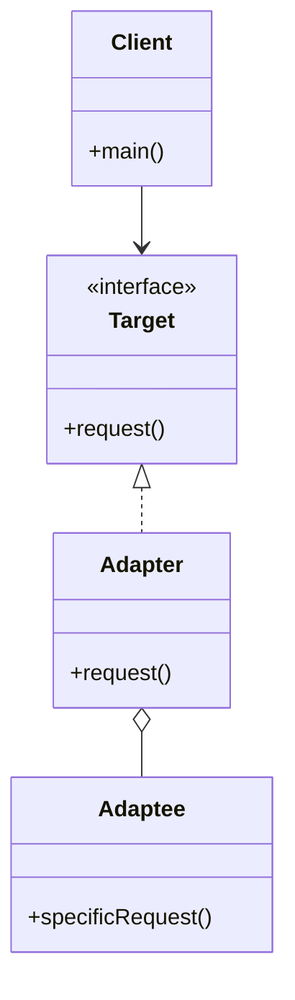
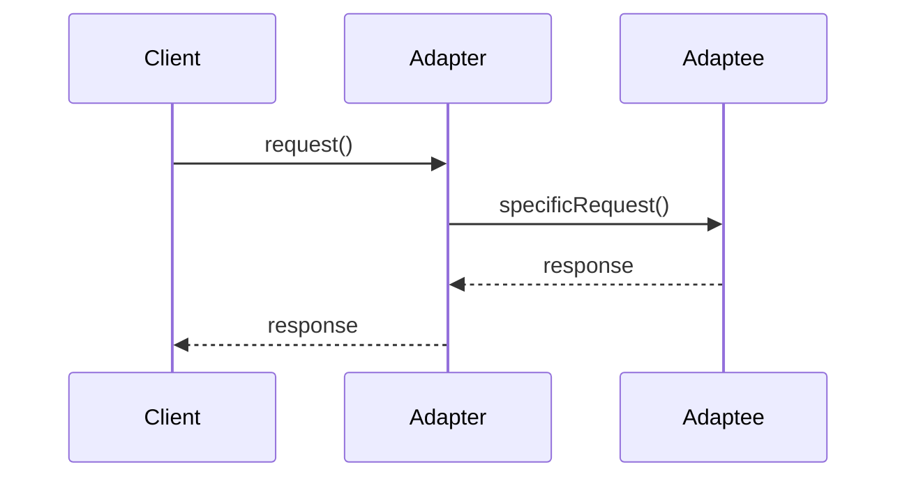

## 4.2 Adapter Pattern

In the realm of software engineering, the Adapter Pattern is a structural design pattern that plays a crucial role in ensuring that incompatible interfaces can work together seamlessly. This pattern acts as a bridge between two incompatible interfaces, allowing them to communicate effectively. Let's delve into the intricacies of the Adapter Pattern, exploring its intent, structure, and practical applications in Java.

### Understanding the Adapter Pattern

#### Definition and Intent

The Adapter Pattern is designed to allow objects with incompatible interfaces to collaborate. It achieves this by providing a wrapper or mediator that translates one interface into another. This pattern is particularly useful when integrating legacy code or third-party libraries that do not match the current system's interface requirements. By employing an adapter, developers can ensure that these disparate components can interact without modifying their existing codebases.

#### Problem Solved by the Adapter Pattern

In software development, it's common to encounter situations where you need to integrate components with incompatible interfaces. These components might be legacy systems, third-party libraries, or even new modules that do not align with the existing code structure. The Adapter Pattern addresses this issue by creating an intermediary that translates the interface of one component into a form that the other component can understand. This approach promotes code reusability and flexibility, allowing developers to leverage existing components without extensive modifications.

### Structure of the Adapter Pattern

The Adapter Pattern consists of four primary components: the Target interface, the Adapter, the Adaptee, and the Client. Let's explore each of these components in detail:

- **Target Interface**: This is the interface that the Client expects to interact with. It defines the methods that the Client will use to communicate with the Adaptee.

- **Adapter**: The Adapter is the intermediary that implements the Target interface and translates the Client's requests into a format that the Adaptee can understand. It acts as a bridge between the Client and the Adaptee.

- **Adaptee**: The Adaptee is the existing component with an incompatible interface. It contains the functionality that the Client needs but does not conform to the Target interface.

- **Client**: The Client is the component that requires the services of the Adaptee. It interacts with the Adaptee through the Adapter, using the Target interface.

#### UML Diagram

To visualize the interaction between these components, let's examine a UML diagram of the Adapter Pattern:



In this diagram, the `Adapter` class implements the `Target` interface and holds a reference to the `Adaptee`. The `Client` interacts with the `Target` interface, which the `Adapter` implements, allowing it to communicate with the `Adaptee`.

### Class Adapter vs. Object Adapter

The Adapter Pattern can be implemented in two primary ways: using class adapters and object adapters. Each approach has its own advantages and considerations.

#### Class Adapter

A class adapter uses inheritance to adapt one interface to another. It inherits from both the Target interface and the Adaptee class, allowing it to override methods and provide the necessary translations.

```java
// Class Adapter Example
interface Target {
    void request();
}

class Adaptee {
    void specificRequest() {
        System.out.println("Specific request from Adaptee");
    }
}

class ClassAdapter extends Adaptee implements Target {
    @Override
    public void request() {
        specificRequest();
    }
}

public class Client {
    public static void main(String[] args) {
        Target target = new ClassAdapter();
        target.request();
    }
}
```

In this example, `ClassAdapter` inherits from `Adaptee` and implements the `Target` interface, allowing it to translate the `request()` method into a call to `specificRequest()`.

#### Object Adapter

An object adapter uses composition to achieve the same goal. Instead of inheriting from the Adaptee, it holds a reference to an instance of the Adaptee and delegates method calls.

```java
// Object Adapter Example
interface Target {
    void request();
}

class Adaptee {
    void specificRequest() {
        System.out.println("Specific request from Adaptee");
    }
}

class ObjectAdapter implements Target {
    private Adaptee adaptee;

    public ObjectAdapter(Adaptee adaptee) {
        this.adaptee = adaptee;
    }

    @Override
    public void request() {
        adaptee.specificRequest();
    }
}

public class Client {
    public static void main(String[] args) {
        Adaptee adaptee = new Adaptee();
        Target target = new ObjectAdapter(adaptee);
        target.request();
    }
}
```

Here, the `ObjectAdapter` holds a reference to an `Adaptee` instance and delegates the `request()` call to `specificRequest()`.

### Promoting Code Reusability and Flexibility

The Adapter Pattern is instrumental in promoting code reusability and flexibility. By decoupling the Client from the Adaptee, it allows developers to integrate existing components without altering their code. This approach not only saves time and effort but also ensures that the system remains adaptable to future changes.

### Practical Implementation Details and Considerations

When implementing the Adapter Pattern in Java, there are several practical considerations to keep in mind:

1. **Choosing Between Class and Object Adapters**: The choice between class and object adapters depends on the specific requirements of your project. Class adapters are more straightforward but require multiple inheritance, which Java does not support. Object adapters, on the other hand, use composition, which is more flexible and aligns with Java's single inheritance model.

2. **Handling Multiple Adaptees**: If your system needs to adapt multiple Adaptees, consider using a single Adapter class with multiple constructors or methods to handle different Adaptees.

3. **Performance Considerations**: While the Adapter Pattern adds an additional layer of abstraction, it should not significantly impact performance. However, in performance-critical applications, it's essential to measure and optimize where necessary.

4. **Testing and Maintenance**: Ensure thorough testing of the Adapter to verify that it correctly translates requests between the Client and Adaptee. Regular maintenance is crucial to accommodate any changes in the Adaptee's interface.

### Real-World Examples of the Adapter Pattern

The Adapter Pattern is widely used in various real-world scenarios. Here are a few examples:

- **Legacy System Integration**: When integrating legacy systems with modern applications, adapters can translate old interfaces into new ones, enabling seamless communication.

- **Third-Party Library Integration**: Adapters are often used to integrate third-party libraries that do not conform to the application's interface requirements.

- **Cross-Platform Development**: In cross-platform development, adapters can translate platform-specific interfaces into a common interface, facilitating code reuse across different platforms.

### Visualizing the Adapter Pattern

To further illustrate the Adapter Pattern, let's consider a scenario where we need to integrate a legacy payment processing system with a modern e-commerce platform. The legacy system uses a different interface for processing payments, and we need to adapt it to the new platform's interface.



In this sequence diagram, the `Client` sends a `request()` to the `Adapter`, which translates it into a `specificRequest()` for the `Adaptee`. The `Adaptee` processes the request and sends a response back through the `Adapter` to the `Client`.

### Try It Yourself

To gain a deeper understanding of the Adapter Pattern, try modifying the code examples provided. Experiment with different Adaptees and see how the Adapter can be adjusted to accommodate them. Consider implementing both class and object adapters to observe their differences in practice.

### Conclusion

The Adapter Pattern is a powerful tool in a software engineer's arsenal, enabling the integration of incompatible interfaces without modifying existing code. By providing a flexible and reusable solution, it enhances the adaptability and maintainability of software systems. As you continue to explore design patterns, remember that the Adapter Pattern is just one of many strategies available to address the challenges of software development. Keep experimenting, stay curious, and enjoy the journey!

## Quiz Time!



### What is the primary purpose of the Adapter Pattern?

- [x] To allow incompatible interfaces to work together
- [ ] To provide a simplified interface to a complex subsystem
- [ ] To compose objects into tree structures
- [ ] To attach additional responsibilities to an object dynamically

> **Explanation:** The Adapter Pattern is designed to allow objects with incompatible interfaces to collaborate by providing a wrapper or mediator that translates one interface into another.

### Which of the following components is NOT part of the Adapter Pattern?

- [ ] Target
- [ ] Adapter
- [x] Observer
- [ ] Adaptee

> **Explanation:** The Observer is not a component of the Adapter Pattern. The primary components are the Target, Adapter, Adaptee, and Client.

### How does a class adapter differ from an object adapter?

- [x] A class adapter uses inheritance, while an object adapter uses composition.
- [ ] A class adapter uses composition, while an object adapter uses inheritance.
- [ ] A class adapter and an object adapter are the same.
- [ ] A class adapter uses both inheritance and composition.

> **Explanation:** A class adapter uses inheritance to adapt one interface to another, while an object adapter uses composition by holding a reference to an instance of the Adaptee.

### In the Adapter Pattern, which component does the Client interact with?

- [ ] Adaptee
- [x] Target
- [ ] Adapter
- [ ] Observer

> **Explanation:** The Client interacts with the Target interface, which the Adapter implements, allowing it to communicate with the Adaptee.

### What is a common use case for the Adapter Pattern?

- [x] Integrating legacy systems with modern applications
- [ ] Providing multiple interfaces to a single object
- [ ] Managing a collection of objects
- [ ] Defining a family of algorithms

> **Explanation:** A common use case for the Adapter Pattern is integrating legacy systems with modern applications by translating old interfaces into new ones.

### Which of the following is a benefit of using the Adapter Pattern?

- [x] Promotes code reusability and flexibility
- [ ] Increases coupling between components
- [ ] Simplifies the implementation of algorithms
- [ ] Reduces the number of classes in a system

> **Explanation:** The Adapter Pattern promotes code reusability and flexibility by allowing incompatible interfaces to work together without modifying existing code.

### What is the role of the Adaptee in the Adapter Pattern?

- [ ] It defines the interface that the Client expects to interact with.
- [ ] It acts as a bridge between the Client and the Target.
- [x] It is the existing component with an incompatible interface.
- [ ] It is the component that requires the services of the Adapter.

> **Explanation:** The Adaptee is the existing component with an incompatible interface that contains the functionality needed by the Client.

### What should you consider when choosing between a class adapter and an object adapter?

- [x] Whether multiple inheritance is supported
- [ ] The number of methods in the Target interface
- [ ] The complexity of the Adaptee
- [ ] The number of Clients interacting with the Adapter

> **Explanation:** When choosing between a class adapter and an object adapter, consider whether multiple inheritance is supported, as class adapters require inheritance.

### True or False: The Adapter Pattern can only be used with legacy systems.

- [ ] True
- [x] False

> **Explanation:** False. The Adapter Pattern can be used in various scenarios, including integrating third-party libraries and cross-platform development, not just with legacy systems.

### Which diagram best represents the interaction in the Adapter Pattern?

- [ ] Class Diagram
- [x] Sequence Diagram
- [ ] State Diagram
- [ ] Activity Diagram

> **Explanation:** A Sequence Diagram best represents the interaction in the Adapter Pattern, showing how the Client interacts with the Adapter, which in turn communicates with the Adaptee.


