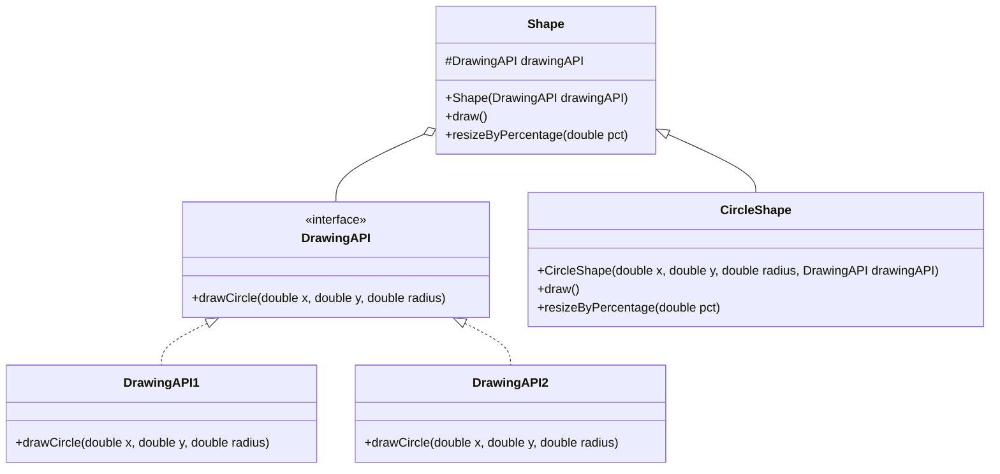

## 4.3.1 Implementing Bridge in Java

The Bridge pattern is a structural design pattern that decouples an abstraction from its implementation, allowing them to vary independently. This pattern is particularly useful when both the abstraction and the implementation may change over time, and you want to avoid a combinatorial explosion of subclasses.

### Understanding the Bridge Pattern

The Bridge pattern involves four main components:

1. **Abstraction**: This is the high-level control layer for some entity. It contains a reference to the implementor.
2. **Refined Abstraction**: This extends the abstraction to add more specific functionality.
3. **Implementor**: This is the interface for the implementation classes.
4. **Concrete Implementor**: These classes implement the `Implementor` interface and provide concrete implementations.

The pattern allows the abstraction and implementation to evolve independently, making it easier to extend and maintain.

### Step-by-Step Guide to Implementing the Bridge Pattern in Java

Let's walk through the process of implementing the Bridge pattern in Java with a practical example. We'll create a simple drawing application where shapes can be drawn in different colors.

#### Step 1: Define the Implementor Interface

The `Implementor` interface defines the methods that the concrete implementors will need to implement. In our example, this will involve methods related to drawing.

```java
// Implementor
interface DrawingAPI {
    void drawCircle(double x, double y, double radius);
}
```

#### Step 2: Create Concrete Implementors

Concrete implementors provide the specific implementations of the `Implementor` interface. These classes encapsulate the details of the drawing mechanism.

```java
// Concrete Implementor 1
class DrawingAPI1 implements DrawingAPI {
    @Override
    public void drawCircle(double x, double y, double radius) {
        System.out.println("API1.circle at " + x + ":" + y + " radius " + radius);
    }
}

// Concrete Implementor 2
class DrawingAPI2 implements DrawingAPI {
    @Override
    public void drawCircle(double x, double y, double radius) {
        System.out.println("API2.circle at " + x + ":" + y + " radius " + radius);
    }
}
```

#### Step 3: Define the Abstraction

The `Abstraction` class contains a reference to the `Implementor` interface. It delegates the actual work to the implementor.

```java
// Abstraction
abstract class Shape {
    protected DrawingAPI drawingAPI;

    protected Shape(DrawingAPI drawingAPI) {
        this.drawingAPI = drawingAPI;
    }

    public abstract void draw(); // low-level
    public abstract void resizeByPercentage(double pct); // high-level
}
```

#### Step 4: Create Refined Abstractions

Refined abstractions extend the `Abstraction` class and provide more specific implementations.

```java
// Refined Abstraction
class CircleShape extends Shape {
    private double x, y, radius;

    public CircleShape(double x, double y, double radius, DrawingAPI drawingAPI) {
        super(drawingAPI);
        this.x = x;
        this.y = y;
        this.radius = radius;
    }

    @Override
    public void draw() {
        drawingAPI.drawCircle(x, y, radius);
    }

    @Override
    public void resizeByPercentage(double pct) {
        radius *= (1.0 + pct / 100.0);
    }
}
```

#### Step 5: Demonstrate the Bridge Pattern

Now, let's see how we can use the Bridge pattern to draw circles using different drawing APIs.

```java
public class BridgePatternDemo {
    public static void main(String[] args) {
        Shape[] shapes = new Shape[] {
            new CircleShape(1, 2, 3, new DrawingAPI1()),
            new CircleShape(5, 7, 11, new DrawingAPI2()),
        };

        for (Shape shape : shapes) {
            shape.resizeByPercentage(2.5);
            shape.draw();
        }
    }
}
```

### Explanation of the Code

- **Implementor Interface**: `DrawingAPI` defines the interface for drawing operations.
- **Concrete Implementors**: `DrawingAPI1` and `DrawingAPI2` provide specific implementations for drawing circles.
- **Abstraction**: `Shape` is the base class that holds a reference to the `DrawingAPI`.
- **Refined Abstraction**: `CircleShape` extends `Shape` and implements the specific behavior for a circle.

### Benefits of the Bridge Pattern

- **Separation of Concerns**: The abstraction and implementation are separated, allowing them to evolve independently.
- **Flexibility**: New abstractions and implementations can be introduced without affecting existing code.
- **Scalability**: The pattern supports the addition of new features without a combinatorial explosion of subclasses.

### Designing for Change

When implementing the Bridge pattern, it's important to anticipate future changes. Consider the following:

- **Future Variations in Abstraction**: Think about how the abstraction might evolve. For example, you might want to add new shapes or operations.
- **Future Variations in Implementation**: Consider how the implementation might change. You might want to support new drawing APIs or platforms.

### Try It Yourself

To deepen your understanding of the Bridge pattern, try modifying the code examples:

- **Add a New Shape**: Implement a new shape, such as a rectangle, and integrate it with the existing drawing APIs.
- **Introduce a New Drawing API**: Create a new `DrawingAPI` implementation that uses a different drawing mechanism.
- **Experiment with Different Implementations**: Try using different data structures or algorithms in the `ConcreteImplementor` classes.

### Visualizing the Bridge Pattern

To better understand the Bridge pattern, let's visualize the relationships between the components using a class diagram.



This diagram illustrates how the `Shape` class is connected to the `DrawingAPI` interface, and how the `CircleShape` class extends `Shape` to provide specific functionality.

### References and Further Reading

For more information on the Bridge pattern and its applications, consider exploring the following resources:

- [Design Patterns: Elements of Reusable Object-Oriented Software](https://en.wikipedia.org/wiki/Design_Patterns) by Erich Gamma, Richard Helm, Ralph Johnson, and John Vlissides.
- [Java Design Patterns](https://www.journaldev.com/1827/java-design-patterns-example-tutorial) on JournalDev.
- [Bridge Pattern on Refactoring Guru](https://refactoring.guru/design-patterns/bridge).

### Knowledge Check

Before we conclude, let's reinforce what we've learned with a few questions:

1. What is the main purpose of the Bridge pattern?
2. How does the Bridge pattern differ from the Adapter pattern?
3. Why is it beneficial to separate abstraction from implementation?
4. How can you extend the Bridge pattern to support new features?

### Embrace the Journey

Remember, mastering design patterns is a journey. As you continue to explore and implement patterns like Bridge, you'll gain a deeper understanding of how to create flexible and maintainable software architectures. Keep experimenting, stay curious, and enjoy the journey!

## Quiz Time!



### What is the primary goal of the Bridge pattern?

- [x] To separate abstraction from implementation
- [ ] To combine multiple interfaces
- [ ] To simplify complex interfaces
- [ ] To enhance performance

> **Explanation:** The Bridge pattern's primary goal is to separate abstraction from implementation, allowing both to vary independently.

### Which component in the Bridge pattern defines the interface for the implementation classes?

- [x] Implementor
- [ ] Abstraction
- [ ] Refined Abstraction
- [ ] Concrete Implementor

> **Explanation:** The Implementor defines the interface for the implementation classes in the Bridge pattern.

### How does the Bridge pattern differ from the Adapter pattern?

- [x] Bridge separates abstraction from implementation, while Adapter makes incompatible interfaces compatible
- [ ] Bridge and Adapter are the same
- [ ] Bridge is used for enhancing performance, while Adapter is for simplifying interfaces
- [ ] Bridge is for combining interfaces, while Adapter is for separating them

> **Explanation:** The Bridge pattern separates abstraction from implementation, while the Adapter pattern makes incompatible interfaces compatible.

### In the Bridge pattern, what role does the Refined Abstraction play?

- [x] It extends the Abstraction to add more specific functionality
- [ ] It provides the concrete implementation
- [ ] It defines the interface for the implementation classes
- [ ] It acts as a placeholder for the abstraction

> **Explanation:** The Refined Abstraction extends the Abstraction to add more specific functionality.

### What is a key benefit of using the Bridge pattern?

- [x] It allows for independent evolution of abstraction and implementation
- [ ] It simplifies complex interfaces
- [ ] It enhances performance
- [ ] It reduces the number of classes

> **Explanation:** The Bridge pattern allows for the independent evolution of abstraction and implementation, making it easier to extend and maintain.

### Which of the following is NOT a component of the Bridge pattern?

- [ ] Abstraction
- [ ] Implementor
- [ ] Concrete Implementor
- [x] Adapter

> **Explanation:** Adapter is not a component of the Bridge pattern; it is a separate design pattern.

### How can the Bridge pattern be extended to support new features?

- [x] By adding new Refined Abstractions and Concrete Implementors
- [ ] By merging Abstraction and Implementor
- [ ] By simplifying the Implementor interface
- [ ] By reducing the number of Concrete Implementors

> **Explanation:** The Bridge pattern can be extended by adding new Refined Abstractions and Concrete Implementors.

### What is the role of the Concrete Implementor in the Bridge pattern?

- [x] To provide specific implementations of the Implementor interface
- [ ] To define the interface for the implementation classes
- [ ] To extend the Abstraction
- [ ] To act as a placeholder for the abstraction

> **Explanation:** The Concrete Implementor provides specific implementations of the Implementor interface.

### In the Bridge pattern, which class holds a reference to the Implementor?

- [x] Abstraction
- [ ] Refined Abstraction
- [ ] Concrete Implementor
- [ ] Adapter

> **Explanation:** The Abstraction class holds a reference to the Implementor in the Bridge pattern.

### True or False: The Bridge pattern is useful when both the abstraction and implementation may change over time.

- [x] True
- [ ] False

> **Explanation:** True. The Bridge pattern is particularly useful when both the abstraction and implementation may change over time, as it allows them to vary independently.


