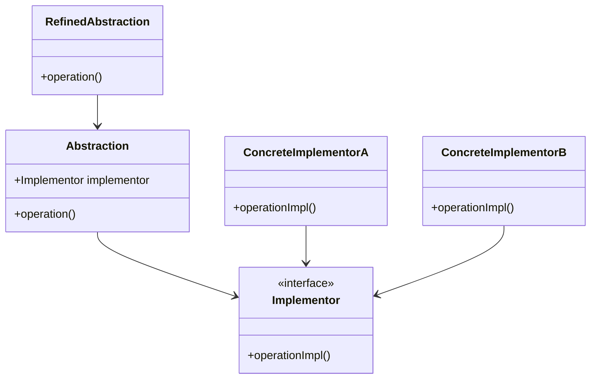
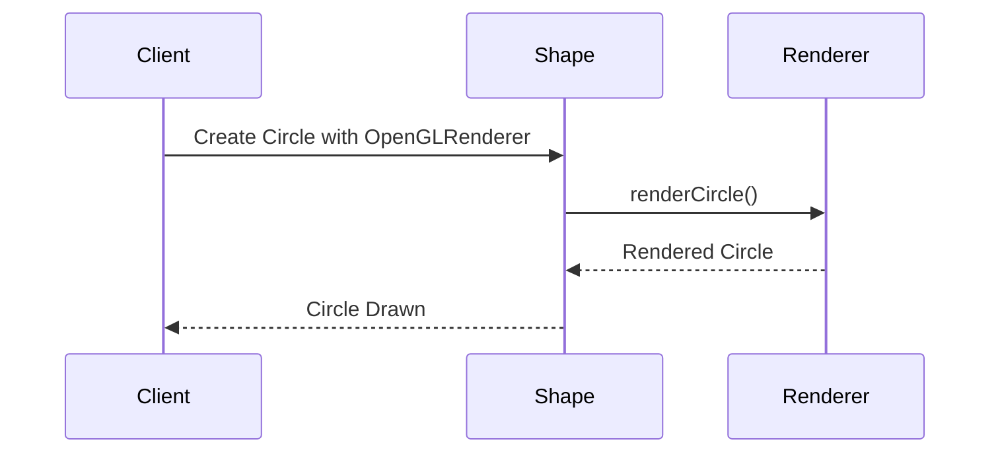

## 4.3.2 Decoupling Abstraction and Implementation

In the realm of software design, achieving a balance between flexibility and maintainability is crucial. One of the key strategies to attain this balance is by decoupling abstraction from implementation. This section delves into the importance of this decoupling, the pitfalls of tightly coupled systems, and how the Bridge Pattern in Java serves as an effective solution.

### The Importance of Decoupling Abstraction from Implementation

Decoupling abstraction from implementation is a fundamental principle in software design that facilitates modularity, scalability, and ease of maintenance. By separating the high-level logic (abstraction) from the low-level details (implementation), developers can modify or extend one without affecting the other. This separation leads to several benefits:

- **Independent Development**: Teams can work on different parts of the system simultaneously without interfering with each other.
- **Ease of Maintenance**: Changes in implementation do not require changes in the abstraction, reducing the risk of introducing bugs.
- **Increased Flexibility**: New implementations can be added without altering existing code, making the system more adaptable to changing requirements.

### The Pitfalls of Tightly Coupled Systems

Tightly coupled systems are characterized by a strong dependency between abstraction and implementation. This dependency can lead to rigid and unmanageable code structures, as any change in the implementation may necessitate changes in the abstraction. Some of the negative impacts of tightly coupled hierarchies include:

- **Limited Reusability**: Components are often specific to a particular context and cannot be easily reused in different scenarios.
- **Difficult Testing**: Testing becomes challenging as changes in one part of the system can have unforeseen effects on other parts.
- **Inflexibility**: Adapting the system to new requirements is cumbersome, often requiring significant rewrites.

#### Example of Tightly Coupled Hierarchies

Consider a simple graphics rendering system where different shapes are rendered using various rendering engines. In a tightly coupled design, each shape class might directly reference a specific rendering engine, leading to a rigid structure.

```java
// Tightly Coupled Example
class Circle {
    private OpenGLRenderer renderer;

    public Circle(OpenGLRenderer renderer) {
        this.renderer = renderer;
    }

    public void draw() {
        renderer.renderCircle();
    }
}

class Square {
    private OpenGLRenderer renderer;

    public Square(OpenGLRenderer renderer) {
        this.renderer = renderer;
    }

    public void draw() {
        renderer.renderSquare();
    }
}
```

In this example, the `Circle` and `Square` classes are tightly coupled to the `OpenGLRenderer`, making it difficult to switch to a different rendering engine without modifying the shape classes.

### The Bridge Pattern: A Solution to Decoupling

The Bridge Pattern addresses the problem of tight coupling by separating abstraction from implementation, allowing them to vary independently. It involves creating two separate class hierarchies: one for the abstraction and another for the implementation. The abstraction contains a reference to an implementation object, which it delegates the work to.

#### Structure of the Bridge Pattern

The Bridge Pattern consists of the following components:

- **Abstraction**: Defines the interface for the high-level control logic and maintains a reference to an `Implementor`.
- **Refined Abstraction**: Extends the interface defined by `Abstraction`.
- **Implementor**: Defines the interface for the low-level operations.
- **Concrete Implementor**: Implements the `Implementor` interface.



### Implementing the Bridge Pattern in Java

Let's revisit the graphics rendering example and apply the Bridge Pattern to decouple the shape abstraction from the rendering implementation.

```java
// Implementor Interface
interface Renderer {
    void renderCircle();
    void renderSquare();
}

// Concrete Implementor A
class OpenGLRenderer implements Renderer {
    public void renderCircle() {
        System.out.println("Rendering Circle with OpenGL");
    }

    public void renderSquare() {
        System.out.println("Rendering Square with OpenGL");
    }
}

// Concrete Implementor B
class DirectXRenderer implements Renderer {
    public void renderCircle() {
        System.out.println("Rendering Circle with DirectX");
    }

    public void renderSquare() {
        System.out.println("Rendering Square with DirectX");
    }
}

// Abstraction
abstract class Shape {
    protected Renderer renderer;

    public Shape(Renderer renderer) {
        this.renderer = renderer;
    }

    public abstract void draw();
}

// Refined Abstraction
class Circle extends Shape {
    public Circle(Renderer renderer) {
        super(renderer);
    }

    public void draw() {
        renderer.renderCircle();
    }
}

// Refined Abstraction
class Square extends Shape {
    public Square(Renderer renderer) {
        super(renderer);
    }

    public void draw() {
        renderer.renderSquare();
    }
}
```

In this implementation, the `Shape` class acts as the `Abstraction`, and the `Renderer` interface serves as the `Implementor`. The `Circle` and `Square` classes are `Refined Abstractions`, while `OpenGLRenderer` and `DirectXRenderer` are `Concrete Implementors`.

### Advantages of the Bridge Pattern

By applying the Bridge Pattern, we gain several advantages:

- **Independent Development**: The shape and rendering hierarchies can be developed independently, allowing for parallel development.
- **Ease of Maintenance**: Changes in rendering logic do not affect the shape classes, and vice versa.
- **Increased Flexibility**: New shapes or rendering engines can be added without modifying existing code, enhancing the system's adaptability.

### Visualizing the Bridge Pattern

To better understand how the Bridge Pattern decouples abstraction from implementation, consider the following diagram illustrating the interaction between components:



### Try It Yourself

To solidify your understanding of the Bridge Pattern, try modifying the code example to include a new shape, such as a `Triangle`, and a new rendering engine, such as `VulkanRenderer`. Observe how easily these additions can be integrated without altering existing classes.

### Knowledge Check

- **Why is decoupling abstraction from implementation important?**
- **What are the negative impacts of tightly coupled systems?**
- **How does the Bridge Pattern facilitate decoupling?**
- **What are the components of the Bridge Pattern?**

### Conclusion

Decoupling abstraction from implementation is a powerful strategy for enhancing the modularity, scalability, and maintainability of software systems. The Bridge Pattern provides a robust solution to achieve this decoupling, allowing for independent development and increased flexibility. By understanding and applying this pattern, developers can create systems that are more adaptable to change and easier to maintain.

Remember, this is just the beginning. As you progress, you'll build more complex and interactive systems. Keep experimenting, stay curious, and enjoy the journey!

## Quiz Time!



### Why is decoupling abstraction from implementation important?

- [x] It enhances modularity and scalability.
- [ ] It increases the complexity of the code.
- [ ] It makes the code harder to maintain.
- [ ] It reduces the flexibility of the system.

> **Explanation:** Decoupling abstraction from implementation enhances modularity and scalability by allowing independent development and maintenance of different components.

### What is a negative impact of tightly coupled systems?

- [x] Limited reusability
- [ ] Increased flexibility
- [ ] Easier testing
- [ ] Simplified code structure

> **Explanation:** Tightly coupled systems have limited reusability because components are often specific to a particular context and cannot be easily reused.

### Which pattern effectively decouples abstraction from implementation?

- [x] Bridge Pattern
- [ ] Singleton Pattern
- [ ] Factory Pattern
- [ ] Observer Pattern

> **Explanation:** The Bridge Pattern effectively decouples abstraction from implementation by separating them into independent hierarchies.

### What are the components of the Bridge Pattern?

- [x] Abstraction, Implementor, Refined Abstraction, Concrete Implementor
- [ ] Singleton, Factory, Observer, Mediator
- [ ] Client, Server, Database, Network
- [ ] Controller, Model, View, Router

> **Explanation:** The Bridge Pattern consists of Abstraction, Implementor, Refined Abstraction, and Concrete Implementor components.

### How does the Bridge Pattern increase flexibility?

- [x] By allowing new implementations to be added without altering existing code
- [ ] By tightly coupling components
- [ ] By reducing the number of classes
- [ ] By making the code more complex

> **Explanation:** The Bridge Pattern increases flexibility by allowing new implementations to be added without altering existing code, making the system more adaptable.

### What is the role of the Implementor in the Bridge Pattern?

- [x] It defines the interface for low-level operations.
- [ ] It provides the high-level control logic.
- [ ] It acts as the client of the system.
- [ ] It manages the user interface.

> **Explanation:** The Implementor in the Bridge Pattern defines the interface for low-level operations, which the Abstraction delegates work to.

### What is a benefit of independent development in decoupled systems?

- [x] Teams can work on different parts of the system simultaneously.
- [ ] Changes in one part require changes in all parts.
- [ ] Testing becomes more difficult.
- [ ] The system becomes less adaptable.

> **Explanation:** Independent development allows teams to work on different parts of the system simultaneously without interfering with each other.

### What does the Abstraction component do in the Bridge Pattern?

- [x] It defines the interface for high-level control logic.
- [ ] It implements low-level operations.
- [ ] It acts as a client of the system.
- [ ] It manages database connections.

> **Explanation:** The Abstraction component defines the interface for high-level control logic and maintains a reference to an Implementor.

### How does the Bridge Pattern facilitate ease of maintenance?

- [x] By allowing changes in implementation without affecting the abstraction
- [ ] By increasing the number of dependencies
- [ ] By making the code more complex
- [ ] By reducing the number of classes

> **Explanation:** The Bridge Pattern facilitates ease of maintenance by allowing changes in implementation without affecting the abstraction, reducing the risk of introducing bugs.

### True or False: The Bridge Pattern allows for parallel development of abstraction and implementation.

- [x] True
- [ ] False

> **Explanation:** True. The Bridge Pattern allows for parallel development of abstraction and implementation by separating them into independent hierarchies.


