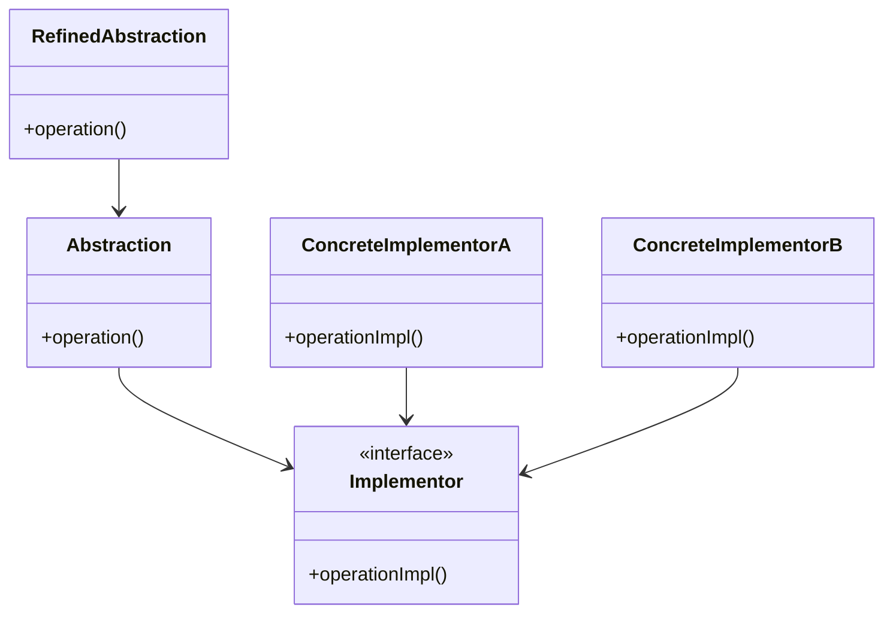
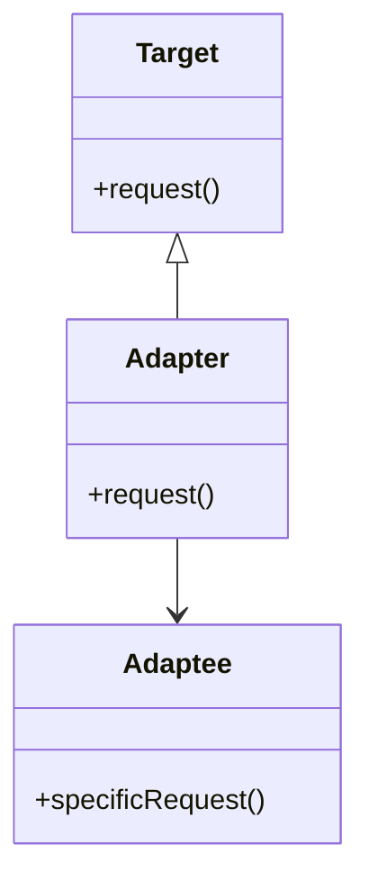
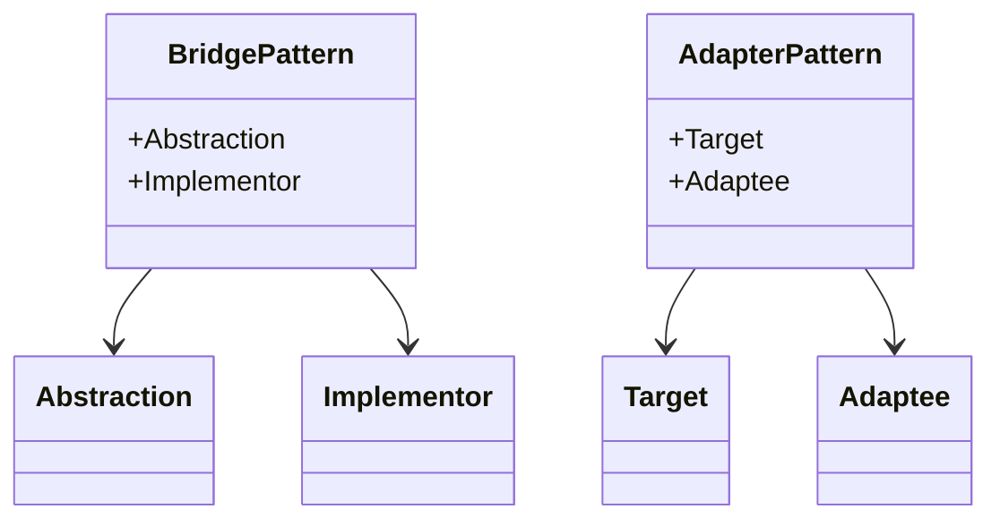

## 4.3.3 Bridge Pattern vs. Adapter Pattern

In the realm of software design patterns, the Bridge and Adapter patterns are two structural patterns that often cause confusion due to their overlapping functionalities. However, they serve distinct purposes and are applied in different scenarios. In this section, we will delve into the primary intents of both patterns, explore their structural differences, and provide guidance on when to use each pattern.

### Understanding the Intent

#### Bridge Pattern

The primary intent of the Bridge pattern is to **decouple an abstraction from its implementation** so that the two can vary independently. This pattern is particularly useful when you want to avoid a permanent binding between an abstraction and its implementation. The Bridge pattern allows you to change the implementation without affecting the client code that uses the abstraction.

**Key Characteristics of the Bridge Pattern:**

- **Decoupling Abstraction and Implementation:** The pattern separates the abstraction's interface from its implementation, allowing them to evolve independently.
- **Designed Upfront:** The Bridge pattern is often designed into a system from the beginning, anticipating the need for flexibility in implementation.
- **Enhances Extensibility:** By decoupling, it becomes easier to extend both the abstraction and the implementation hierarchies.

#### Adapter Pattern

The primary intent of the Adapter pattern is to **allow incompatible interfaces to work together**. This pattern acts as a bridge between two incompatible interfaces, enabling them to collaborate. The Adapter pattern is typically used when you want to integrate existing components into your system without modifying their source code.

**Key Characteristics of the Adapter Pattern:**

- **Interface Compatibility:** The pattern allows objects with incompatible interfaces to interact by converting the interface of one class into another.
- **Retrofitting Existing Code:** The Adapter pattern is often applied to integrate legacy components or third-party libraries into a new system.
- **Focus on Reusability:** It promotes reusability by allowing existing classes to be used in new contexts without modification.

### Structural Differences

To better understand the differences between the Bridge and Adapter patterns, let's examine their structures using UML diagrams.

#### Bridge Pattern Structure

The Bridge pattern involves two main hierarchies: the abstraction and the implementation. The abstraction defines the interface, while the implementation provides the concrete functionality. These hierarchies are connected through a bridge interface.



**Diagram Explanation:**

- **Abstraction:** Defines the interface for the client.
- **RefinedAbstraction:** Extends the abstraction and implements additional functionality.
- **Implementor:** Interface for the implementation classes.
- **ConcreteImplementorA/B:** Concrete classes that implement the `Implementor` interface.

#### Adapter Pattern Structure

The Adapter pattern involves a target interface, an adapter, and an adaptee. The adapter converts the interface of the adaptee into the target interface.



**Diagram Explanation:**

- **Target:** Defines the domain-specific interface that the client uses.
- **Adapter:** Adapts the interface of the adaptee to the target interface.
- **Adaptee:** Defines an existing interface that needs adapting.

### Practical Examples

#### Bridge Pattern Example

Consider a scenario where you are developing a graphics library that supports multiple rendering engines. You want to separate the abstraction (shapes) from the implementation (rendering engines).

```java
// Abstraction
interface Shape {
    void draw();
}

// Refined Abstraction
class Circle implements Shape {
    private Renderer renderer;

    public Circle(Renderer renderer) {
        this.renderer = renderer;
    }

    @Override
    public void draw() {
        renderer.renderCircle();
    }
}

// Implementor
interface Renderer {
    void renderCircle();
    void renderSquare();
}

// Concrete Implementor A
class OpenGLRenderer implements Renderer {
    @Override
    public void renderCircle() {
        System.out.println("Rendering circle with OpenGL");
    }

    @Override
    public void renderSquare() {
        System.out.println("Rendering square with OpenGL");
    }
}

// Concrete Implementor B
class DirectXRenderer implements Renderer {
    @Override
    public void renderCircle() {
        System.out.println("Rendering circle with DirectX");
    }

    @Override
    public void renderSquare() {
        System.out.println("Rendering square with DirectX");
    }
}

// Client code
public class BridgePatternDemo {
    public static void main(String[] args) {
        Renderer opengl = new OpenGLRenderer();
        Shape circle = new Circle(opengl);
        circle.draw();

        Renderer directx = new DirectXRenderer();
        Shape anotherCircle = new Circle(directx);
        anotherCircle.draw();
    }
}
```

**Explanation:**

- The `Shape` interface acts as the abstraction, while `Circle` is a refined abstraction.
- The `Renderer` interface is the implementor, with `OpenGLRenderer` and `DirectXRenderer` as concrete implementors.
- The client code can switch rendering engines without modifying the `Circle` class.

#### Adapter Pattern Example

Imagine you are working with a legacy system that provides logging functionality through a specific interface. You want to integrate this logging system with a new application that expects a different logging interface.

```java
// Target interface
interface Logger {
    void log(String message);
}

// Adaptee
class LegacyLogger {
    void writeLog(String msg) {
        System.out.println("Legacy log: " + msg);
    }
}

// Adapter
class LoggerAdapter implements Logger {
    private LegacyLogger legacyLogger;

    public LoggerAdapter(LegacyLogger legacyLogger) {
        this.legacyLogger = legacyLogger;
    }

    @Override
    public void log(String message) {
        legacyLogger.writeLog(message);
    }
}

// Client code
public class AdapterPatternDemo {
    public static void main(String[] args) {
        LegacyLogger legacyLogger = new LegacyLogger();
        Logger logger = new LoggerAdapter(legacyLogger);
        logger.log("Adapter pattern in action");
    }
}
```

**Explanation:**

- The `Logger` interface is the target interface expected by the new application.
- The `LegacyLogger` class is the adaptee with an incompatible interface.
- The `LoggerAdapter` class adapts the `LegacyLogger` to the `Logger` interface.

### Choosing Between Bridge and Adapter

When deciding between the Bridge and Adapter patterns, consider the following factors:

- **Design Intent:** Use the Bridge pattern when you anticipate the need for flexibility in both abstraction and implementation. Use the Adapter pattern when you need to integrate existing components with incompatible interfaces.
- **Timing:** The Bridge pattern is typically designed upfront, while the Adapter pattern is applied as a retrofit solution.
- **Complexity:** The Bridge pattern can introduce additional complexity due to the separation of abstraction and implementation. The Adapter pattern is generally simpler and focuses on interface compatibility.

### Try It Yourself

To better understand these patterns, try modifying the examples provided:

- **Bridge Pattern:** Add a new shape class, such as `Square`, and implement it using the existing renderers. Observe how the pattern allows you to extend the abstraction without modifying the existing implementation.
- **Adapter Pattern:** Create a new adapter for a different legacy system with a unique logging method. Experiment with integrating multiple legacy systems into the new application.

### Visualizing the Differences

To further illustrate the differences between the Bridge and Adapter patterns, consider the following diagram that highlights their distinct roles and interactions:



**Diagram Explanation:**

- **Bridge Pattern:** Focuses on decoupling abstraction from implementation, allowing both to evolve independently.
- **Adapter Pattern:** Focuses on making incompatible interfaces work together by adapting one to the other.

### Knowledge Check

Before moving on, let's reinforce what we've learned:

- **Question:** What is the primary intent of the Bridge pattern?
  - **Answer:** To decouple an abstraction from its implementation so that the two can vary independently.

- **Question:** When is the Adapter pattern typically applied?
  - **Answer:** When integrating existing components with incompatible interfaces.

### Summary

In summary, both the Bridge and Adapter patterns play crucial roles in software design by addressing different challenges. The Bridge pattern provides a way to separate abstraction from implementation, enhancing flexibility and extensibility. The Adapter pattern, on the other hand, focuses on interface compatibility, allowing existing components to be reused in new contexts.

By understanding the intents, structures, and appropriate use cases of these patterns, you can make informed decisions about which pattern to apply in your software design. Remember, the key is to choose the pattern that best aligns with your design goals and system requirements.

## Quiz Time!



### What is the primary intent of the Bridge pattern?

- [x] To decouple an abstraction from its implementation so that the two can vary independently.
- [ ] To allow incompatible interfaces to work together.
- [ ] To simplify complex subsystems.
- [ ] To provide a simplified interface to a complex system.

> **Explanation:** The Bridge pattern is designed to separate an abstraction from its implementation, allowing them to evolve independently.

### When is the Adapter pattern typically used?

- [x] When integrating existing components with incompatible interfaces.
- [ ] When separating abstraction from implementation.
- [ ] When simplifying complex subsystems.
- [ ] When providing a simplified interface to a complex system.

> **Explanation:** The Adapter pattern is used to make incompatible interfaces work together, often when integrating legacy systems or third-party libraries.

### Which pattern is designed upfront in the software?

- [x] Bridge pattern
- [ ] Adapter pattern
- [ ] Both patterns
- [ ] Neither pattern

> **Explanation:** The Bridge pattern is typically designed upfront to anticipate the need for flexibility in abstraction and implementation.

### What is a key characteristic of the Adapter pattern?

- [x] It allows objects with incompatible interfaces to interact.
- [ ] It decouples an abstraction from its implementation.
- [ ] It simplifies complex subsystems.
- [ ] It provides a simplified interface to a complex system.

> **Explanation:** The Adapter pattern focuses on interface compatibility, enabling objects with incompatible interfaces to work together.

### Which pattern is often applied as a retrofit solution?

- [x] Adapter pattern
- [ ] Bridge pattern
- [ ] Both patterns
- [ ] Neither pattern

> **Explanation:** The Adapter pattern is often applied to integrate existing components into a new system without modifying their source code.

### What is the main focus of the Bridge pattern?

- [x] Decoupling abstraction from implementation
- [ ] Interface compatibility
- [ ] Simplifying complex subsystems
- [ ] Providing a simplified interface to a complex system

> **Explanation:** The Bridge pattern focuses on separating abstraction from implementation to allow both to evolve independently.

### Which pattern is generally simpler and focuses on interface compatibility?

- [x] Adapter pattern
- [ ] Bridge pattern
- [ ] Both patterns
- [ ] Neither pattern

> **Explanation:** The Adapter pattern is generally simpler and focuses on making incompatible interfaces work together.

### What is a common use case for the Bridge pattern?

- [x] Supporting multiple rendering engines in a graphics library
- [ ] Integrating a legacy logging system into a new application
- [ ] Simplifying complex subsystems
- [ ] Providing a simplified interface to a complex system

> **Explanation:** The Bridge pattern is useful for separating abstraction from implementation, such as supporting multiple rendering engines in a graphics library.

### What is a common use case for the Adapter pattern?

- [x] Integrating a legacy logging system into a new application
- [ ] Supporting multiple rendering engines in a graphics library
- [ ] Simplifying complex subsystems
- [ ] Providing a simplified interface to a complex system

> **Explanation:** The Adapter pattern is often used to integrate legacy systems or third-party libraries with incompatible interfaces into a new application.

### True or False: The Bridge pattern is typically applied as a retrofit solution.

- [ ] True
- [x] False

> **Explanation:** The Bridge pattern is typically designed upfront to separate abstraction from implementation, while the Adapter pattern is applied as a retrofit solution.



Remember, understanding these patterns and their appropriate applications will enhance your ability to design flexible and maintainable software systems. Keep experimenting, stay curious, and enjoy the journey of mastering design patterns in Java!
