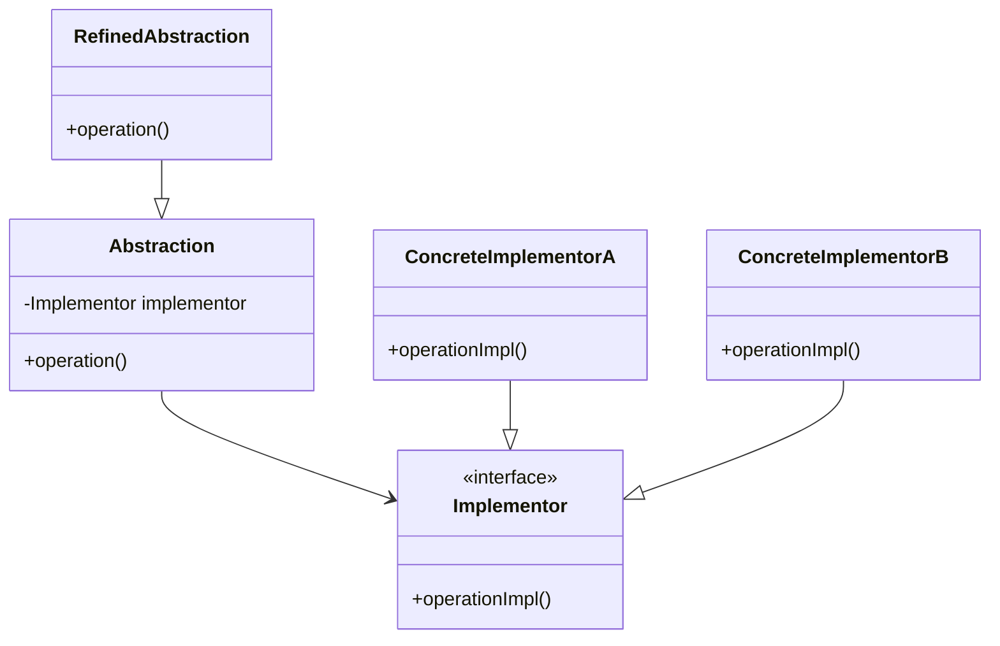

## 4.3.4 Use Cases and Examples

The Bridge pattern is a powerful structural design pattern that decouples an abstraction from its implementation, allowing the two to vary independently. This pattern is particularly useful in scenarios where you need to support multiple platforms, devices, or variations in functionality. In this section, we will explore real-world examples of the Bridge pattern, such as graphic libraries supporting different rendering APIs, device drivers for multiple hardware implementations, and remote interfaces operating over various network protocols. We will also provide code snippets, diagrams, and discuss the benefits of using the Bridge pattern.

### Understanding the Bridge Pattern

Before diving into use cases, let's briefly revisit the Bridge pattern's structure. The pattern involves four main components:

1. **Abstraction**: Defines the abstraction's interface and maintains a reference to an object of type `Implementor`.
2. **Refined Abstraction**: Extends the interface defined by `Abstraction`.
3. **Implementor**: Defines the interface for implementation classes.
4. **Concrete Implementor**: Implements the `Implementor` interface.

The key idea is to separate the abstraction from its implementation so that both can evolve independently.

### Real-World Use Cases

#### 1. Graphic Libraries Supporting Different Rendering APIs

In graphics programming, applications often need to support multiple rendering APIs, such as DirectX and OpenGL. The Bridge pattern is ideal for this scenario, as it allows the abstraction (the graphics library) to work with different implementations (rendering APIs) without being tightly coupled to any specific one.

**Example:**

Consider a graphics library that can render shapes using either DirectX or OpenGL. The `Shape` class acts as the abstraction, while `DirectXRenderer` and `OpenGLRenderer` are concrete implementors.

```java
// Implementor
interface Renderer {
    void renderCircle(float radius);
    void renderRectangle(float width, float height);
}

// Concrete Implementor A
class DirectXRenderer implements Renderer {
    @Override
    public void renderCircle(float radius) {
        System.out.println("Rendering circle with DirectX, radius: " + radius);
    }

    @Override
    public void renderRectangle(float width, float height) {
        System.out.println("Rendering rectangle with DirectX, width: " + width + ", height: " + height);
    }
}

// Concrete Implementor B
class OpenGLRenderer implements Renderer {
    @Override
    public void renderCircle(float radius) {
        System.out.println("Rendering circle with OpenGL, radius: " + radius);
    }

    @Override
    public void renderRectangle(float width, float height) {
        System.out.println("Rendering rectangle with OpenGL, width: " + width + ", height: " + height);
    }
}

// Abstraction
abstract class Shape {
    protected Renderer renderer;

    protected Shape(Renderer renderer) {
        this.renderer = renderer;
    }

    public abstract void draw();
}

// Refined Abstraction
class Circle extends Shape {
    private float radius;

    public Circle(Renderer renderer, float radius) {
        super(renderer);
        this.radius = radius;
    }

    @Override
    public void draw() {
        renderer.renderCircle(radius);
    }
}

// Refined Abstraction
class Rectangle extends Shape {
    private float width, height;

    public Rectangle(Renderer renderer, float width, float height) {
        super(renderer);
        this.width = width;
        this.height = height;
    }

    @Override
    public void draw() {
        renderer.renderRectangle(width, height);
    }
}

// Client code
public class GraphicsDemo {
    public static void main(String[] args) {
        Renderer directXRenderer = new DirectXRenderer();
        Renderer openGLRenderer = new OpenGLRenderer();

        Shape circle = new Circle(directXRenderer, 5);
        Shape rectangle = new Rectangle(openGLRenderer, 10, 20);

        circle.draw();
        rectangle.draw();
    }
}
```

**Explanation:**

- The `Shape` class is the abstraction, and it uses a `Renderer` to perform the actual rendering.
- `Circle` and `Rectangle` are refined abstractions that specify the shape to draw.
- `DirectXRenderer` and `OpenGLRenderer` are concrete implementors that provide specific rendering logic.

**Benefits:**

- **Scalability**: Easily add new shapes or rendering APIs without modifying existing code.
- **Flexibility**: Switch rendering APIs at runtime or compile-time.

#### 2. Device Drivers for Multiple Hardware Implementations

Device drivers often need to work with different hardware implementations, such as printers or network cards. The Bridge pattern allows the driver to interact with various hardware without being tightly coupled to any specific implementation.

**Example:**

Consider a printer driver that can work with different printer models. The `Printer` class acts as the abstraction, while `InkjetPrinter` and `LaserPrinter` are concrete implementors.

```java
// Implementor
interface PrinterDriver {
    void print(String document);
}

// Concrete Implementor A
class InkjetPrinter implements PrinterDriver {
    @Override
    public void print(String document) {
        System.out.println("Printing with Inkjet Printer: " + document);
    }
}

// Concrete Implementor B
class LaserPrinter implements PrinterDriver {
    @Override
    public void print(String document) {
        System.out.println("Printing with Laser Printer: " + document);
    }
}

// Abstraction
abstract class Printer {
    protected PrinterDriver driver;

    protected Printer(PrinterDriver driver) {
        this.driver = driver;
    }

    public abstract void printDocument(String document);
}

// Refined Abstraction
class OfficePrinter extends Printer {
    public OfficePrinter(PrinterDriver driver) {
        super(driver);
    }

    @Override
    public void printDocument(String document) {
        driver.print(document);
    }
}

// Client code
public class PrinterDemo {
    public static void main(String[] args) {
        PrinterDriver inkjetDriver = new InkjetPrinter();
        PrinterDriver laserDriver = new LaserPrinter();

        Printer officePrinter = new OfficePrinter(inkjetDriver);
        officePrinter.printDocument("Annual Report");

        officePrinter = new OfficePrinter(laserDriver);
        officePrinter.printDocument("Project Plan");
    }
}
```

**Explanation:**

- The `Printer` class is the abstraction, and it uses a `PrinterDriver` to perform the actual printing.
- `OfficePrinter` is a refined abstraction that specifies the type of printer.
- `InkjetPrinter` and `LaserPrinter` are concrete implementors that provide specific printing logic.

**Benefits:**

- **Code Reusability**: Reuse the same abstraction for different hardware implementations.
- **Ease of Maintenance**: Add new printer models without changing the existing codebase.

#### 3. Remote Interfaces Operating Over Various Network Protocols

In distributed systems, remote interfaces often need to operate over different network protocols, such as HTTP, TCP, or WebSockets. The Bridge pattern allows the interface to communicate over various protocols without being tightly coupled to any specific one.

**Example:**

Consider a remote service that can communicate using either HTTP or WebSocket. The `RemoteService` class acts as the abstraction, while `HttpProtocol` and `WebSocketProtocol` are concrete implementors.

```java
// Implementor
interface NetworkProtocol {
    void sendData(String data);
}

// Concrete Implementor A
class HttpProtocol implements NetworkProtocol {
    @Override
    public void sendData(String data) {
        System.out.println("Sending data over HTTP: " + data);
    }
}

// Concrete Implementor B
class WebSocketProtocol implements NetworkProtocol {
    @Override
    public void sendData(String data) {
        System.out.println("Sending data over WebSocket: " + data);
    }
}

// Abstraction
abstract class RemoteService {
    protected NetworkProtocol protocol;

    protected RemoteService(NetworkProtocol protocol) {
        this.protocol = protocol;
    }

    public abstract void sendRequest(String request);
}

// Refined Abstraction
class DataService extends RemoteService {
    public DataService(NetworkProtocol protocol) {
        super(protocol);
    }

    @Override
    public void sendRequest(String request) {
        protocol.sendData(request);
    }
}

// Client code
public class RemoteServiceDemo {
    public static void main(String[] args) {
        NetworkProtocol httpProtocol = new HttpProtocol();
        NetworkProtocol webSocketProtocol = new WebSocketProtocol();

        RemoteService dataService = new DataService(httpProtocol);
        dataService.sendRequest("GET /data");

        dataService = new DataService(webSocketProtocol);
        dataService.sendRequest("CONNECT /data");
    }
}
```

**Explanation:**

- The `RemoteService` class is the abstraction, and it uses a `NetworkProtocol` to send data.
- `DataService` is a refined abstraction that specifies the type of service.
- `HttpProtocol` and `WebSocketProtocol` are concrete implementors that provide specific communication logic.

**Benefits:**

- **Protocol Independence**: Easily switch between different network protocols.
- **Extensibility**: Add new protocols without modifying existing code.

### Visualizing the Bridge Pattern

To better understand the Bridge pattern, let's visualize its structure using a class diagram.



**Diagram Explanation:**

- The `Abstraction` class maintains a reference to an `Implementor`.
- `RefinedAbstraction` extends `Abstraction` to provide additional functionality.
- `Implementor` is an interface that defines the implementation-specific operations.
- `ConcreteImplementorA` and `ConcreteImplementorB` provide concrete implementations of the `Implementor` interface.

### Benefits of the Bridge Pattern

The Bridge pattern offers several benefits, including:

- **Decoupling**: Separates abstraction from implementation, allowing both to vary independently.
- **Scalability**: Easily add new abstractions or implementations without modifying existing code.
- **Flexibility**: Switch implementations at runtime or compile-time.
- **Reusability**: Reuse the same abstraction for different implementations.

### When to Use the Bridge Pattern

Consider using the Bridge pattern when:

- You need to vary both abstractions and implementations independently.
- You want to avoid a permanent binding between an abstraction and its implementation.
- You anticipate that new implementations will be added frequently.
- You want to hide implementation details from the client.

### Try It Yourself

To deepen your understanding of the Bridge pattern, try modifying the code examples provided:

- Add a new shape, such as a triangle, to the graphics library example.
- Implement a new printer model, such as a dot matrix printer, in the device driver example.
- Introduce a new network protocol, such as TCP, in the remote service example.

Experiment with these modifications to see how easily the Bridge pattern accommodates changes and extensions.

### Conclusion

The Bridge pattern is a versatile design pattern that provides a robust solution for scenarios requiring the decoupling of abstraction and implementation. By applying the Bridge pattern, you can achieve greater flexibility, scalability, and maintainability in your software designs. As you encounter situations where you need to support multiple platforms, devices, or variations in functionality, consider leveraging the Bridge pattern to address these challenges effectively.

## Quiz Time!



### What is the primary benefit of using the Bridge pattern?

- [x] Decoupling abstraction from implementation
- [ ] Increasing code complexity
- [ ] Reducing the number of classes
- [ ] Simplifying single-use cases

> **Explanation:** The Bridge pattern decouples abstraction from implementation, allowing both to vary independently.

### In the graphics library example, what role does the `Shape` class play?

- [x] Abstraction
- [ ] Implementor
- [ ] Concrete Implementor
- [ ] Client

> **Explanation:** The `Shape` class acts as the abstraction in the Bridge pattern, defining the interface for drawing shapes.

### Which of the following is a concrete implementor in the printer driver example?

- [ ] Printer
- [x] InkjetPrinter
- [ ] OfficePrinter
- [ ] PrintManager

> **Explanation:** The `InkjetPrinter` class is a concrete implementor that provides specific printing logic.

### How does the Bridge pattern enhance scalability?

- [x] By allowing new abstractions and implementations to be added without modifying existing code
- [ ] By reducing the number of classes in the system
- [ ] By simplifying the code structure
- [ ] By tightly coupling abstraction and implementation

> **Explanation:** The Bridge pattern enhances scalability by allowing new abstractions and implementations to be added independently.

### In the remote service example, what is the role of the `NetworkProtocol` interface?

- [ ] Abstraction
- [x] Implementor
- [ ] Refined Abstraction
- [ ] Client

> **Explanation:** The `NetworkProtocol` interface acts as the implementor, defining the interface for communication protocols.

### What is a key characteristic of the Bridge pattern?

- [x] It allows abstraction and implementation to vary independently.
- [ ] It tightly couples abstraction and implementation.
- [ ] It reduces the number of classes in the system.
- [ ] It simplifies single-use cases.

> **Explanation:** A key characteristic of the Bridge pattern is that it allows abstraction and implementation to vary independently.

### Which of the following scenarios is suitable for applying the Bridge pattern?

- [x] Supporting multiple rendering APIs in a graphics library
- [ ] Implementing a simple calculator
- [ ] Creating a single-use utility function
- [ ] Designing a basic data structure

> **Explanation:** The Bridge pattern is suitable for scenarios requiring support for multiple implementations, such as rendering APIs.

### What is the role of the `Refined Abstraction` in the Bridge pattern?

- [x] It extends the interface defined by the `Abstraction`.
- [ ] It implements the `Implementor` interface.
- [ ] It acts as the client.
- [ ] It provides a concrete implementation of the abstraction.

> **Explanation:** The `Refined Abstraction` extends the interface defined by the `Abstraction`, providing additional functionality.

### How does the Bridge pattern facilitate flexibility?

- [x] By allowing implementations to be switched at runtime or compile-time
- [ ] By reducing the number of classes in the system
- [ ] By simplifying the code structure
- [ ] By tightly coupling abstraction and implementation

> **Explanation:** The Bridge pattern facilitates flexibility by allowing implementations to be switched at runtime or compile-time.

### True or False: The Bridge pattern is ideal for scenarios where you need to vary both abstractions and implementations independently.

- [x] True
- [ ] False

> **Explanation:** True. The Bridge pattern is designed to decouple abstraction from implementation, allowing both to vary independently.


