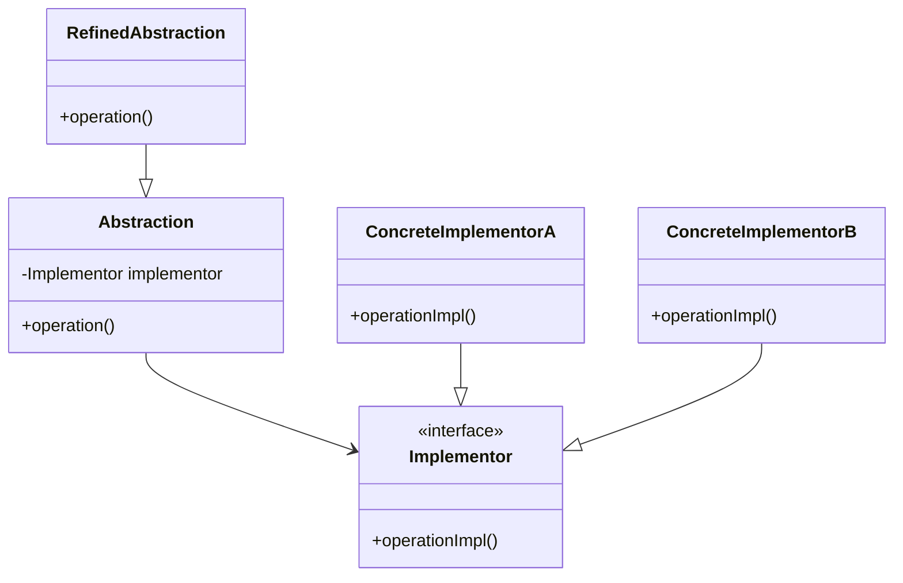
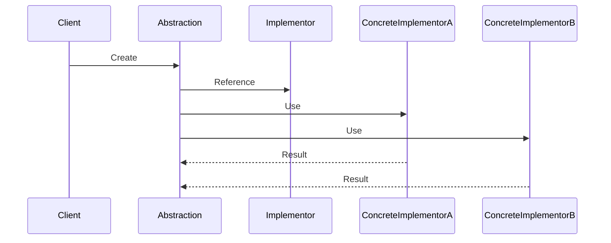

## 4.3 Bridge Pattern

The Bridge Pattern is a structural design pattern that plays a crucial role in software engineering by decoupling an abstraction from its implementation, allowing both to vary independently. This pattern is particularly beneficial in scenarios where you anticipate changes in both the abstraction and the implementation, providing a flexible and scalable solution.

### Understanding the Bridge Pattern

The primary intent of the Bridge Pattern is to separate an abstraction from its implementation so that the two can evolve independently. This separation is achieved by creating two separate class hierarchies: one for the abstraction and another for the implementation. The abstraction contains a reference to an implementation object, which it delegates to perform the actual work.

#### Problem Solved by the Bridge Pattern

In traditional designs, a tight coupling between an abstraction and its implementation can lead to a proliferation of classes. For example, consider a graphics application that needs to support multiple shapes (e.g., circles, squares) and multiple rendering methods (e.g., vector, raster). Without the Bridge Pattern, you might end up with a class for each combination of shape and rendering method, such as `VectorCircle`, `RasterCircle`, `VectorSquare`, and `RasterSquare`. This approach quickly becomes unmanageable as the number of shapes and rendering methods increases.

The Bridge Pattern addresses this issue by decoupling the abstraction (shape) from the implementation (rendering method), allowing each to vary independently.

### Structure of the Bridge Pattern

The Bridge Pattern involves the following key components:

- **Abstraction**: Defines the abstraction's interface and maintains a reference to an implementor object.
- **Implementor**: Defines the interface for implementation classes. This interface does not need to correspond exactly to the abstraction's interface; in fact, the two interfaces can be quite different.
- **RefinedAbstraction**: Extends the abstraction interface and maintains a reference to an implementor object.
- **ConcreteImplementor**: Implements the implementor interface and provides concrete implementations.

#### UML Diagram

Below is a UML diagram illustrating the Bridge Pattern structure:



### How the Bridge Pattern Works

The Bridge Pattern allows the abstraction and the implementation to evolve independently. The abstraction delegates the implementation of its operations to an implementor object. This delegation is the key to the pattern's flexibility, as it allows the abstraction to change its implementation dynamically.

#### Promoting Extensibility

The Bridge Pattern promotes extensibility by allowing you to add new abstractions and implementations without modifying existing code. This is achieved through the use of interfaces and abstract classes, which provide a stable foundation for extension.

### Practical Implementation Strategies

When implementing the Bridge Pattern in Java, consider the following strategies:

1. **Define Clear Interfaces**: Clearly define the interfaces for both the abstraction and the implementor. This separation is crucial for maintaining flexibility and scalability.
2. **Use Composition Over Inheritance**: Favor composition over inheritance to achieve the separation of concerns. The abstraction should hold a reference to the implementor, allowing for dynamic changes.
3. **Leverage Java Interfaces and Abstract Classes**: Utilize Java's interfaces and abstract classes to define the abstraction and implementor hierarchies. This approach provides a clear contract for each component and facilitates independent evolution.
4. **Consider Performance Implications**: While the Bridge Pattern offers flexibility, it can introduce additional layers of indirection, which may impact performance. Evaluate the trade-offs based on your application's requirements.

### Code Example: Implementing the Bridge Pattern in Java

Let's explore a practical example of the Bridge Pattern in Java. We'll implement a simple drawing application that supports different shapes and rendering methods.

```java
// Implementor interface
interface Renderer {
    void renderCircle(float radius);
    void renderSquare(float side);
}

// ConcreteImplementorA
class VectorRenderer implements Renderer {
    @Override
    public void renderCircle(float radius) {
        System.out.println("Drawing a circle of radius " + radius + " using vector rendering.");
    }

    @Override
    public void renderSquare(float side) {
        System.out.println("Drawing a square of side " + side + " using vector rendering.");
    }
}

// ConcreteImplementorB
class RasterRenderer implements Renderer {
    @Override
    public void renderCircle(float radius) {
        System.out.println("Drawing a circle of radius " + radius + " using raster rendering.");
    }

    @Override
    public void renderSquare(float side) {
        System.out.println("Drawing a square of side " + side + " using raster rendering.");
    }
}

// Abstraction
abstract class Shape {
    protected Renderer renderer;

    public Shape(Renderer renderer) {
        this.renderer = renderer;
    }

    public abstract void draw();
}

// RefinedAbstraction
class Circle extends Shape {
    private float radius;

    public Circle(Renderer renderer, float radius) {
        super(renderer);
        this.radius = radius;
    }

    @Override
    public void draw() {
        renderer.renderCircle(radius);
    }
}

// RefinedAbstraction
class Square extends Shape {
    private float side;

    public Square(Renderer renderer, float side) {
        super(renderer);
        this.side = side;
    }

    @Override
    public void draw() {
        renderer.renderSquare(side);
    }
}

// Client code
public class BridgePatternDemo {
    public static void main(String[] args) {
        Renderer vectorRenderer = new VectorRenderer();
        Renderer rasterRenderer = new RasterRenderer();

        Shape circle = new Circle(vectorRenderer, 5);
        Shape square = new Square(rasterRenderer, 10);

        circle.draw();
        square.draw();
    }
}
```

### Explanation of the Code

- **Renderer Interface**: Defines the interface for rendering methods. It includes methods for rendering circles and squares.
- **VectorRenderer and RasterRenderer**: Concrete implementations of the `Renderer` interface. Each provides a specific rendering method.
- **Shape Class**: Represents the abstraction. It holds a reference to a `Renderer` object and delegates the drawing operation to it.
- **Circle and Square Classes**: Refined abstractions that extend the `Shape` class. Each implements the `draw` method to render the shape using the specified renderer.

### Try It Yourself

Experiment with the code by adding new shapes or rendering methods. For example, you could add a `Triangle` class or a `3DRenderer` class. Observe how the Bridge Pattern allows you to extend the application without modifying existing code.

### Use Cases for the Bridge Pattern

The Bridge Pattern is particularly useful in scenarios where you need to support multiple variations of an abstraction and its implementation. Some common use cases include:

- **Cross-Platform Applications**: When developing applications that need to run on multiple platforms, the Bridge Pattern allows you to separate platform-specific code from the core application logic.
- **Graphical User Interfaces (GUIs)**: In GUI frameworks, the Bridge Pattern can be used to separate the interface from the underlying rendering engine, allowing for flexible UI design.
- **Device Drivers**: For systems that need to support multiple hardware devices, the Bridge Pattern can decouple the device interface from the implementation, facilitating the addition of new devices.

### Visualizing the Bridge Pattern

Let's visualize the Bridge Pattern with a sequence diagram to understand the interaction between the components.



### Key Takeaways

- The Bridge Pattern decouples an abstraction from its implementation, allowing both to vary independently.
- It addresses the problem of class proliferation by separating the abstraction and implementation hierarchies.
- The pattern promotes extensibility and flexibility, making it suitable for applications that require multiple variations of an abstraction and its implementation.
- Java's interfaces and abstract classes are instrumental in implementing the Bridge Pattern, providing a clear contract for each component.

### Knowledge Check

- Can you identify a scenario in your current project where the Bridge Pattern might be beneficial?
- How would you implement a new shape or rendering method in the provided example?
- What are the trade-offs of using the Bridge Pattern in terms of performance and complexity?

### Embrace the Journey

Remember, the Bridge Pattern is just one of many design patterns that can enhance your software design. As you continue your journey in software engineering, keep exploring new patterns and techniques. Stay curious, experiment with different approaches, and enjoy the process of building robust and scalable applications.

## Quiz Time!



### What is the primary intent of the Bridge Pattern?

- [x] To decouple an abstraction from its implementation
- [ ] To provide a simplified interface to a complex subsystem
- [ ] To allow incompatible interfaces to work together
- [ ] To compose objects into tree structures

> **Explanation:** The Bridge Pattern's primary intent is to decouple an abstraction from its implementation, allowing both to vary independently.

### Which of the following is NOT a component of the Bridge Pattern?

- [ ] Abstraction
- [ ] Implementor
- [ ] RefinedAbstraction
- [x] Adapter

> **Explanation:** The Adapter is not a component of the Bridge Pattern. The Bridge Pattern consists of Abstraction, Implementor, RefinedAbstraction, and ConcreteImplementor.

### How does the Bridge Pattern promote extensibility?

- [x] By allowing independent variation of abstraction and implementation hierarchies
- [ ] By providing a single class for all use cases
- [ ] By enforcing a strict class hierarchy
- [ ] By using only inheritance

> **Explanation:** The Bridge Pattern promotes extensibility by allowing independent variation of abstraction and implementation hierarchies, enabling new abstractions and implementations to be added without modifying existing code.

### In the provided Java example, what role does the `Renderer` interface play?

- [x] Implementor
- [ ] Abstraction
- [ ] RefinedAbstraction
- [ ] ConcreteImplementor

> **Explanation:** The `Renderer` interface acts as the Implementor in the Bridge Pattern, defining the interface for rendering methods.

### Which pattern is particularly useful for cross-platform applications?

- [x] Bridge Pattern
- [ ] Singleton Pattern
- [ ] Factory Method Pattern
- [ ] Observer Pattern

> **Explanation:** The Bridge Pattern is particularly useful for cross-platform applications as it allows separation of platform-specific code from the core application logic.

### What is the benefit of using composition over inheritance in the Bridge Pattern?

- [x] It allows for dynamic changes in implementation
- [ ] It enforces a strict hierarchy
- [ ] It simplifies the code by reducing classes
- [ ] It eliminates the need for interfaces

> **Explanation:** Using composition over inheritance in the Bridge Pattern allows for dynamic changes in implementation, providing greater flexibility.

### How does the Bridge Pattern address the problem of class proliferation?

- [x] By separating abstraction and implementation hierarchies
- [ ] By using a single class for all functionalities
- [ ] By enforcing strict type checking
- [ ] By eliminating the need for interfaces

> **Explanation:** The Bridge Pattern addresses class proliferation by separating abstraction and implementation hierarchies, reducing the number of classes needed for different combinations.

### What is a common use case for the Bridge Pattern?

- [x] Graphical User Interfaces (GUIs)
- [ ] Database connections
- [ ] Logging systems
- [ ] Authentication mechanisms

> **Explanation:** A common use case for the Bridge Pattern is in Graphical User Interfaces (GUIs), where it separates the interface from the rendering engine.

### In the sequence diagram, what does the Abstraction do?

- [x] It holds a reference to an Implementor and delegates operations
- [ ] It directly implements all operations
- [ ] It acts as a facade for complex subsystems
- [ ] It provides a simplified interface to the client

> **Explanation:** In the sequence diagram, the Abstraction holds a reference to an Implementor and delegates operations to it, allowing for flexibility and independent variation.

### True or False: The Bridge Pattern can introduce additional layers of indirection, which may impact performance.

- [x] True
- [ ] False

> **Explanation:** True. While the Bridge Pattern offers flexibility, it can introduce additional layers of indirection, which may impact performance.


