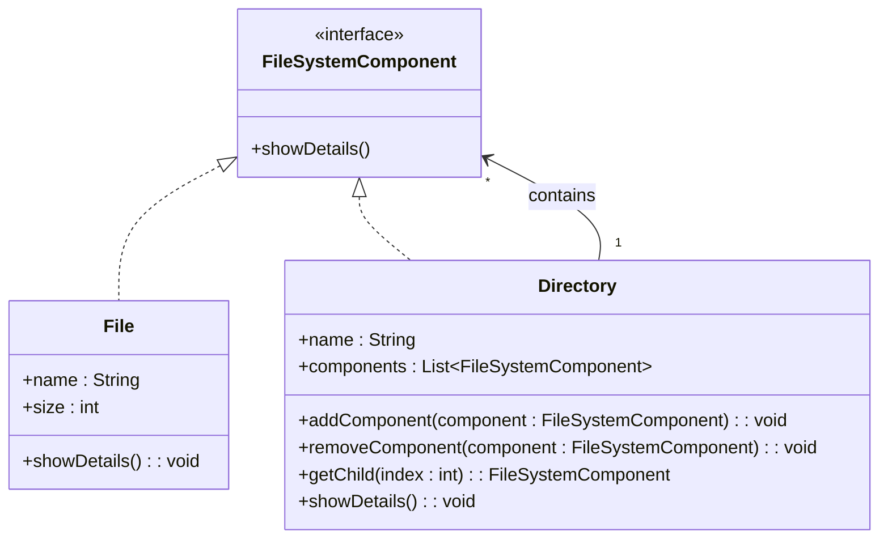

## 4.4.1 Implementing Composite in Java

The Composite pattern is a structural design pattern that enables you to compose objects into tree structures to represent part-whole hierarchies. This pattern treats individual objects and compositions of objects uniformly, allowing clients to interact with complex and simple elements in the same way. In this guide, we will explore how to implement the Composite pattern in Java, providing you with the tools to create flexible and scalable software architectures.

### Understanding the Composite Pattern

Before diving into the implementation, let's understand the core concepts of the Composite pattern:

- **Component**: This is the common interface or abstract class for all objects in the composition, both composite and leaf nodes. It declares the interface for objects in the composition and implements default behavior for the interface common to all classes, as appropriate.
  
- **Leaf**: These are the end objects of a composition. A leaf has no children and implements the Component interface directly. Leaf objects define behavior for primitive objects in the composition.

- **Composite**: These are the objects that have children. Composite objects store child components and implement child-related operations in the Component interface. They can add, remove, and access children.

### Step-by-Step Implementation

Let's walk through the implementation of the Composite pattern in Java with a practical example. We'll create a file system structure where files and directories are treated uniformly.

#### Step 1: Define the Component Interface

The first step is to define a `Component` interface that declares common operations for both leaf and composite objects.

```java
// Component interface
public interface FileSystemComponent {
    void showDetails();
}
```

The `showDetails` method will be implemented by both files and directories to display their details.

#### Step 2: Implement the Leaf Class

Next, we implement the `Leaf` class. In our file system example, a `File` is a leaf node.

```java
// Leaf class
public class File implements FileSystemComponent {
    private String name;
    private int size;

    public File(String name, int size) {
        this.name = name;
        this.size = size;
    }

    @Override
    public void showDetails() {
        System.out.println("File: " + name + ", Size: " + size + "KB");
    }
}
```

The `File` class implements the `FileSystemComponent` interface and provides its own implementation of the `showDetails` method.

#### Step 3: Implement the Composite Class

Now, let's implement the `Composite` class. In our example, a `Directory` is a composite node that can contain files and other directories.

```java
// Composite class
import java.util.ArrayList;
import java.util.List;

public class Directory implements FileSystemComponent {
    private String name;
    private List<FileSystemComponent> components = new ArrayList<>();

    public Directory(String name) {
        this.name = name;
    }

    public void addComponent(FileSystemComponent component) {
        components.add(component);
    }

    public void removeComponent(FileSystemComponent component) {
        components.remove(component);
    }

    public FileSystemComponent getChild(int index) {
        return components.get(index);
    }

    @Override
    public void showDetails() {
        System.out.println("Directory: " + name);
        for (FileSystemComponent component : components) {
            component.showDetails();
        }
    }
}
```

The `Directory` class maintains a list of child components and implements methods to add, remove, and access these components. The `showDetails` method uses recursion to display details of all its children.

#### Step 4: Demonstrate the Composite Pattern

Let's create a simple file system structure to demonstrate the Composite pattern in action.

```java
public class CompositePatternDemo {
    public static void main(String[] args) {
        // Create files
        File file1 = new File("File1.txt", 10);
        File file2 = new File("File2.txt", 20);
        File file3 = new File("File3.txt", 30);

        // Create directories
        Directory dir1 = new Directory("Directory1");
        Directory dir2 = new Directory("Directory2");

        // Add files to directories
        dir1.addComponent(file1);
        dir1.addComponent(file2);

        dir2.addComponent(file3);
        dir2.addComponent(dir1);

        // Display details
        dir2.showDetails();
    }
}
```

In this example, `Directory2` contains `File3` and `Directory1`, which in turn contains `File1` and `File2`. The `showDetails` method recursively displays the details of all files and directories.

### Recursion in Composite Pattern

Recursion is a key aspect of the Composite pattern, allowing you to traverse the composite structure. The `showDetails` method in the `Directory` class demonstrates this by iterating over its children and calling `showDetails` on each one. This recursive call continues until all leaf nodes are reached.

### Best Practices for Managing Component Hierarchies

1. **Type Safety**: Ensure that your composite structure maintains type safety by using generic types or appropriate interfaces. This prevents runtime errors and enhances code readability.

2. **Uniform Operations**: Design components to support uniform operations. This allows clients to interact with both leaf and composite objects without needing to know their specific types.

3. **Lazy Initialization**: Consider using lazy initialization for components that are expensive to create. This can improve performance by deferring the creation of components until they are actually needed.

4. **Caching**: Implement caching mechanisms for frequently accessed components to reduce the overhead of repeated operations.

5. **Error Handling**: Implement robust error handling to manage exceptions that may occur during operations on the composite structure.

### Try It Yourself

Experiment with the Composite pattern by modifying the code examples:

- Add more files and directories to the structure and observe how the `showDetails` method displays them.
- Implement additional operations in the `Component` interface, such as `getSize`, to calculate the total size of files in a directory.
- Create a method to search for a file by name within the composite structure.

### Visualizing the Composite Pattern

To better understand the Composite pattern, let's visualize the structure using a class diagram.



**Diagram Explanation**: This class diagram illustrates the relationship between the `FileSystemComponent`, `File`, and `Directory` classes. The `FileSystemComponent` interface is implemented by both `File` and `Directory`. The `Directory` class contains a list of `FileSystemComponent` objects, representing its children.

### References and Further Reading

- [Composite Pattern on Wikipedia](https://en.wikipedia.org/wiki/Composite_pattern)
- [Java Design Patterns - Composite Pattern](https://www.journaldev.com/1535/composite-design-pattern-in-java)
- [Design Patterns: Elements of Reusable Object-Oriented Software](https://en.wikipedia.org/wiki/Design_Patterns) by Erich Gamma et al.

### Knowledge Check

Let's reinforce your understanding of the Composite pattern with some exercises:

1. **Exercise**: Implement a method in the `Directory` class to calculate the total size of all files within it.

2. **Exercise**: Modify the `showDetails` method to display the hierarchy level of each component.

3. **Exercise**: Create a new type of `FileSystemComponent` that represents a symbolic link and implement its behavior.

### Embrace the Journey

Remember, mastering design patterns like Composite is a journey. As you continue to explore and implement these patterns, you'll gain deeper insights into creating flexible and scalable software architectures. Keep experimenting, stay curious, and enjoy the process!

## Quiz Time!



### What is the primary purpose of the Composite pattern?

- [x] To treat individual objects and compositions uniformly.
- [ ] To encapsulate a request as an object.
- [ ] To define a family of algorithms.
- [ ] To provide a simplified interface to a complex subsystem.

> **Explanation:** The Composite pattern allows you to treat individual objects and compositions of objects uniformly, enabling you to work with complex structures in a consistent manner.

### Which class in the Composite pattern represents end objects without children?

- [ ] Component
- [x] Leaf
- [ ] Composite
- [ ] Node

> **Explanation:** The Leaf class represents end objects in the Composite pattern. These objects do not have children and implement the Component interface directly.

### What method is commonly used in the Composite pattern to traverse the structure?

- [ ] addComponent()
- [x] showDetails()
- [ ] removeComponent()
- [ ] getChild()

> **Explanation:** The `showDetails` method is used to traverse the composite structure, often implemented recursively to display details of all components.

### In the Composite pattern, what does the Composite class typically contain?

- [ ] Only leaf nodes
- [ ] Only other composite nodes
- [x] Both leaf and composite nodes
- [ ] Only the root node

> **Explanation:** The Composite class can contain both leaf and composite nodes, allowing it to build complex structures.

### What is a key benefit of using the Composite pattern?

- [x] It simplifies client code by allowing uniform treatment of objects.
- [ ] It enhances performance by reducing memory usage.
- [ ] It allows dynamic addition of new operations.
- [ ] It provides a way to encapsulate algorithms.

> **Explanation:** The Composite pattern simplifies client code by allowing uniform treatment of individual objects and compositions, making it easier to work with complex structures.

### Which of the following is a best practice when implementing the Composite pattern?

- [x] Ensure type safety by using appropriate interfaces.
- [ ] Avoid using recursion to traverse the structure.
- [ ] Use inheritance instead of composition.
- [ ] Implement caching for all components.

> **Explanation:** Ensuring type safety by using appropriate interfaces is a best practice in the Composite pattern, as it prevents runtime errors and enhances code readability.

### What is the role of the Component interface in the Composite pattern?

- [ ] To store child components
- [x] To declare common operations for all objects in the composition
- [ ] To represent end objects without children
- [ ] To encapsulate a request as an object

> **Explanation:** The Component interface declares common operations for all objects in the composition, both composite and leaf nodes.

### How does the Composite pattern handle operations on child components?

- [ ] By using inheritance
- [ ] By encapsulating requests as objects
- [x] By implementing child-related operations in the Composite class
- [ ] By providing a simplified interface

> **Explanation:** The Composite class implements child-related operations, such as adding, removing, and accessing child components, allowing it to manage its children.

### True or False: The Composite pattern is only useful for file system structures.

- [ ] True
- [x] False

> **Explanation:** False. The Composite pattern is versatile and can be applied to various hierarchical structures beyond file systems, such as GUI components, organizational structures, and more.

### What is a common use case for the Composite pattern?

- [ ] Implementing a logging system
- [ ] Creating a simplified API interface
- [x] Building a tree structure of GUI components
- [ ] Encapsulating a request as an object

> **Explanation:** The Composite pattern is commonly used to build tree structures, such as GUI components, where both individual elements and compositions need to be treated uniformly.


