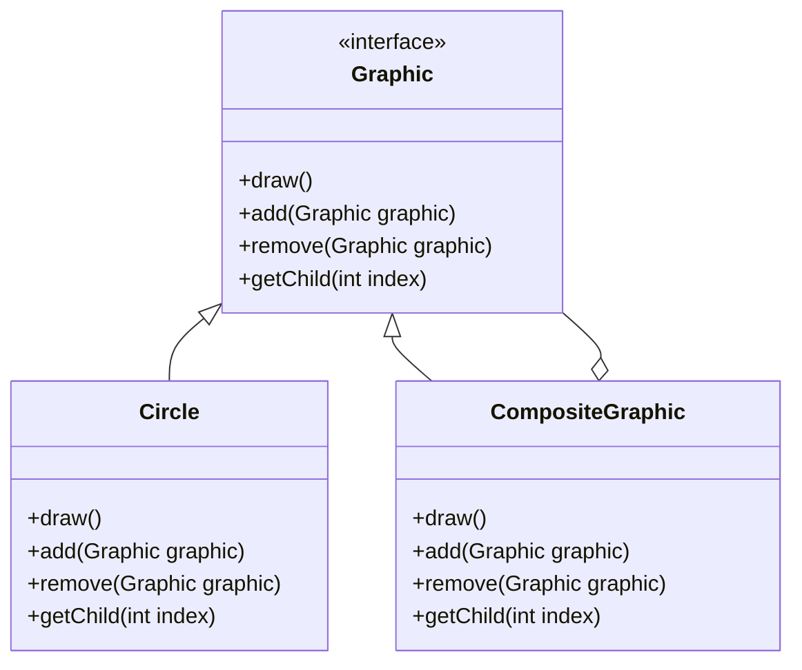

## 4.4.2 Component, Leaf, and Composite Classes

The Composite pattern is a structural design pattern that allows you to compose objects into tree-like structures to represent part-whole hierarchies. This pattern enables clients to treat individual objects and compositions of objects uniformly. In this section, we will delve into the roles of Component, Leaf, and Composite classes within the Composite pattern's structure, exploring how they interact and contribute to flexible and scalable systems.

### Understanding the Composite Pattern

Before we dive into the specific roles of Component, Leaf, and Composite classes, let's briefly review the Composite pattern itself. The Composite pattern is particularly useful when you need to work with tree structures, such as file systems, organizational hierarchies, or GUI components. It allows you to treat individual objects (Leafs) and compositions of objects (Composites) uniformly, simplifying client code and making it easier to add new component types.

### The Component Interface or Abstract Class

The Component is the core interface or abstract class in the Composite pattern. It defines the common methods that both Leafs and Composites must implement. The Component class is crucial because it provides a consistent interface for clients to interact with both individual objects and composite structures.

#### Responsibilities of the Component

1. **Define Common Operations**: The Component interface or abstract class declares operations that are common to both Leafs and Composites. These operations can include methods like `add()`, `remove()`, and `getChild()`, which are relevant for managing child components in a Composite.

2. **Provide Default Implementations**: In some cases, the Component class may provide default implementations for certain methods. This can be useful for simplifying the implementation of Leaf and Composite classes.

3. **Ensure Uniformity**: By defining a common interface, the Component class ensures that clients can treat Leafs and Composites uniformly. This uniformity is a key benefit of the Composite pattern.

#### Example of a Component Interface

```java
// Component interface
public interface Graphic {
    void draw();
    void add(Graphic graphic);
    void remove(Graphic graphic);
    Graphic getChild(int index);
}
```

In this example, `Graphic` is the Component interface, defining common operations like `draw()`, `add()`, `remove()`, and `getChild()`. These methods will be implemented by both Leaf and Composite classes.

### Leaf Classes

Leaf classes implement the Component interface but represent objects with no children. Leafs are the building blocks of the Composite pattern, representing individual objects in the tree structure.

#### Characteristics of Leaf Classes

1. **No Children**: Leafs do not have any children. They represent the end nodes in the tree structure.

2. **Implement Component Methods**: Leaf classes implement the methods defined in the Component interface. However, methods related to child management (like `add()` and `remove()`) may throw exceptions or do nothing, as Leafs do not have children.

3. **Perform Specific Operations**: Leafs perform the specific operations defined by the Component interface. For example, a Leaf might implement the `draw()` method to render itself on the screen.

#### Example of a Leaf Class

```java
// Leaf class
public class Circle implements Graphic {
    @Override
    public void draw() {
        System.out.println("Drawing a circle");
    }

    @Override
    public void add(Graphic graphic) {
        throw new UnsupportedOperationException("Cannot add to a leaf");
    }

    @Override
    public void remove(Graphic graphic) {
        throw new UnsupportedOperationException("Cannot remove from a leaf");
    }

    @Override
    public Graphic getChild(int index) {
        throw new UnsupportedOperationException("No children for a leaf");
    }
}
```

In this example, `Circle` is a Leaf class that implements the `Graphic` interface. It provides a specific implementation for the `draw()` method and throws exceptions for methods related to child management.

### Composite Classes

Composite classes also implement the Component interface but are responsible for managing child Components. Composites can have both Leafs and other Composites as children, allowing you to build complex tree structures.

#### Characteristics of Composite Classes

1. **Manage Children**: Composites have the ability to add, remove, and access child components. This allows them to build complex structures by combining multiple components.

2. **Implement Component Methods**: Like Leafs, Composites implement the methods defined in the Component interface. However, they provide meaningful implementations for methods related to child management.

3. **Delegate Operations to Children**: Composites often delegate operations to their children. For example, a Composite might implement the `draw()` method by iterating over its children and calling their `draw()` methods.

#### Example of a Composite Class

```java
// Composite class
import java.util.ArrayList;
import java.util.List;

public class CompositeGraphic implements Graphic {
    private List<Graphic> children = new ArrayList<>();

    @Override
    public void draw() {
        for (Graphic graphic : children) {
            graphic.draw();
        }
    }

    @Override
    public void add(Graphic graphic) {
        children.add(graphic);
    }

    @Override
    public void remove(Graphic graphic) {
        children.remove(graphic);
    }

    @Override
    public Graphic getChild(int index) {
        return children.get(index);
    }
}
```

In this example, `CompositeGraphic` is a Composite class that implements the `Graphic` interface. It manages a list of child components and delegates the `draw()` operation to its children.

### Using Leafs and Composites in a Client Application

The Composite pattern simplifies client code by allowing clients to interact with both individual objects and composite structures through a common interface. This uniformity makes it easy to build complex structures and perform operations on them.

#### Example Client Code

```java
public class GraphicClient {
    public static void main(String[] args) {
        // Create leaf components
        Graphic circle1 = new Circle();
        Graphic circle2 = new Circle();

        // Create a composite component
        CompositeGraphic composite = new CompositeGraphic();
        composite.add(circle1);
        composite.add(circle2);

        // Create another composite component
        CompositeGraphic composite2 = new CompositeGraphic();
        composite2.add(composite);
        composite2.add(new Circle());

        // Draw all components
        composite2.draw();
    }
}
```

In this example, the client code creates several Leaf and Composite components and adds them to a composite structure. The `draw()` method is called on the top-level Composite, which delegates the operation to its children, demonstrating the power of the Composite pattern.

### Benefits of the Composite Pattern

1. **Simplified Client Code**: The Composite pattern simplifies client code by providing a uniform interface for interacting with both individual objects and composite structures.

2. **Ease of Adding New Component Types**: The pattern makes it easy to add new component types. You can create new Leaf or Composite classes without modifying existing code.

3. **Flexible and Scalable Structures**: The Composite pattern allows you to build flexible and scalable structures by combining individual objects and composite structures.

4. **Promotes Reusability**: By defining common operations in the Component interface, the pattern promotes reusability and consistency across different component types.

### Visualizing the Composite Pattern

To better understand the relationships and hierarchy within the Composite pattern, let's visualize it using a UML diagram.



In this UML diagram, `Graphic` is the Component interface, `Circle` is a Leaf class, and `CompositeGraphic` is a Composite class. The diagram illustrates the relationships between these classes and how they interact within the Composite pattern.

### Try It Yourself

To deepen your understanding of the Composite pattern, try modifying the code examples provided in this section. Here are some suggestions:

1. **Create a New Leaf Class**: Implement a new Leaf class, such as `Rectangle`, and add it to the composite structure.

2. **Add Additional Operations**: Extend the Component interface to include additional operations, such as `resize()`, and implement them in both Leaf and Composite classes.

3. **Experiment with Different Structures**: Create more complex composite structures by nesting Composites within each other and observe how the `draw()` operation is delegated.

### Knowledge Check

To reinforce your understanding of the Composite pattern, consider the following questions:

- What are the key responsibilities of the Component interface in the Composite pattern?
- How do Leaf classes differ from Composite classes in terms of child management?
- What are the benefits of using the Composite pattern in a client application?
- How does the Composite pattern promote reusability and scalability?

### Conclusion

The Composite pattern is a powerful tool for building flexible and scalable systems. By defining a common interface for both individual objects and composite structures, the pattern simplifies client code and makes it easy to add new component types. Whether you're working with file systems, organizational hierarchies, or GUI components, the Composite pattern provides a robust framework for managing complex structures.

## Quiz Time!



### What is the primary role of the Component interface in the Composite pattern?

- [x] To define common operations for both Leafs and Composites
- [ ] To manage child components in a composite structure
- [ ] To represent individual objects with no children
- [ ] To provide a default implementation for all methods

> **Explanation:** The Component interface defines common operations that both Leafs and Composites must implement, ensuring uniformity in the pattern.

### How do Leaf classes differ from Composite classes?

- [x] Leaf classes do not have children, while Composite classes manage child components.
- [ ] Leaf classes manage child components, while Composite classes do not.
- [ ] Leaf classes provide default implementations for all methods, while Composite classes do not.
- [ ] Leaf classes are abstract, while Composite classes are concrete.

> **Explanation:** Leaf classes represent individual objects with no children, while Composite classes manage child components and build complex structures.

### What is a benefit of using the Composite pattern?

- [x] Simplified client code
- [ ] Increased complexity in client code
- [ ] Difficulty in adding new component types
- [ ] Reduced flexibility in system design

> **Explanation:** The Composite pattern simplifies client code by providing a uniform interface for interacting with both individual objects and composite structures.

### In the Composite pattern, what operation might a Composite class delegate to its children?

- [x] draw()
- [ ] add()
- [ ] remove()
- [ ] getChild()

> **Explanation:** A Composite class might delegate operations like `draw()` to its children, allowing each child to perform its specific operation.

### What is a key characteristic of Leaf classes in the Composite pattern?

- [x] They do not have any children.
- [ ] They manage child components.
- [ ] They provide default implementations for all methods.
- [ ] They are abstract classes.

> **Explanation:** Leaf classes represent individual objects with no children, serving as the end nodes in the tree structure.

### How does the Composite pattern promote reusability?

- [x] By defining common operations in the Component interface
- [ ] By requiring each class to implement unique methods
- [ ] By limiting the number of component types
- [ ] By increasing the complexity of the system

> **Explanation:** The Composite pattern promotes reusability by defining common operations in the Component interface, ensuring consistency across different component types.

### What is a common method that both Leafs and Composites implement in the Composite pattern?

- [x] draw()
- [ ] resize()
- [ ] calculate()
- [ ] transform()

> **Explanation:** Both Leafs and Composites implement the `draw()` method, which is a common operation defined in the Component interface.

### What is a key advantage of using the Composite pattern in a client application?

- [x] Ease of adding new component types
- [ ] Increased difficulty in managing components
- [ ] Reduced flexibility in system design
- [ ] Increased complexity in client code

> **Explanation:** The Composite pattern makes it easy to add new component types, allowing for flexible and scalable system design.

### What does the UML diagram of the Composite pattern illustrate?

- [x] The relationships between Component, Leaf, and Composite classes
- [ ] The implementation details of each class
- [ ] The specific operations performed by each class
- [ ] The client code that uses the Composite pattern

> **Explanation:** The UML diagram illustrates the relationships between Component, Leaf, and Composite classes, showing how they interact within the Composite pattern.

### True or False: In the Composite pattern, a Composite class can have both Leafs and other Composites as children.

- [x] True
- [ ] False

> **Explanation:** True. A Composite class can have both Leafs and other Composites as children, allowing for the creation of complex tree structures.


