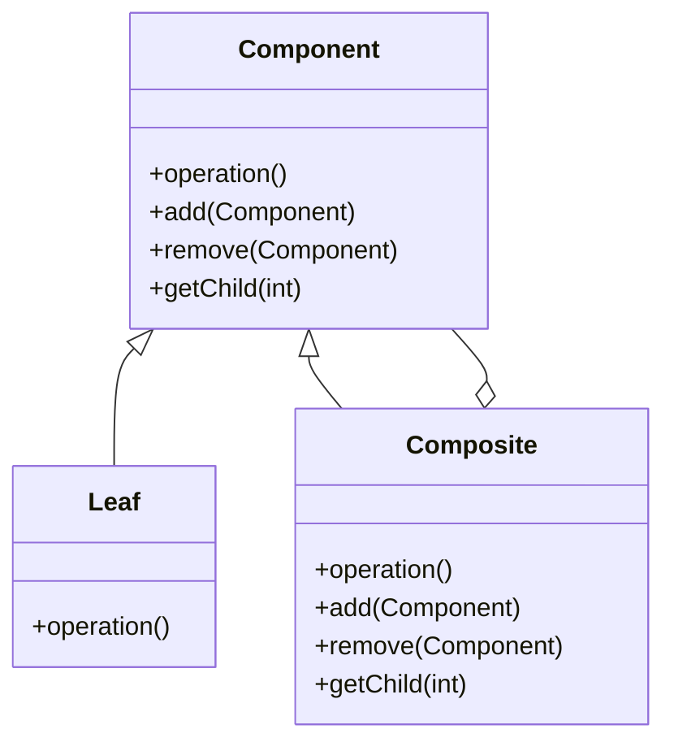
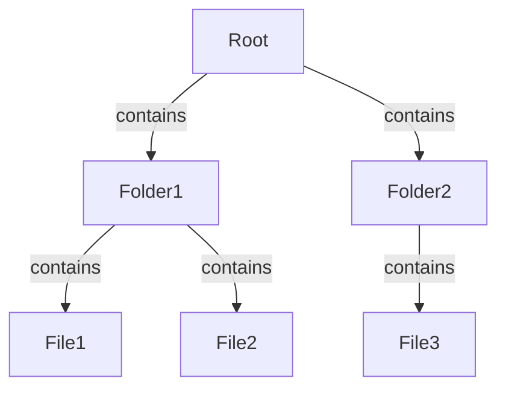

## 4.4.3 Managing Hierarchical Structures

In software engineering, managing hierarchical structures is a common requirement, whether you're dealing with file systems, organizational charts, or graphical user interfaces. The Composite Pattern is a structural design pattern that allows you to compose objects into tree structures to represent part-whole hierarchies. It lets clients treat individual objects and compositions of objects uniformly, simplifying the client code that interacts with these structures.

### Understanding the Composite Pattern

The Composite Pattern is particularly useful when you want to represent a tree structure and have clients treat both individual objects and compositions uniformly. This pattern involves three main components:

- **Component**: An abstract class or interface that defines the common interface for all objects in the composition, including both leaf and composite nodes.
- **Leaf**: A class that represents the end objects of a composition. A leaf has no children.
- **Composite**: A class that represents a group of leaf objects. It can contain leaf nodes and other composite nodes.

Let's visualize this structure with a class diagram:



### Adding and Removing Child Components

In a composite structure, managing child components is crucial. You need methods to add, remove, and access children within composite objects. Here's how you can implement these operations in Java:

```java
import java.util.ArrayList;
import java.util.List;

// Component interface
interface Component {
    void operation();
    default void add(Component component) {
        throw new UnsupportedOperationException();
    }
    default void remove(Component component) {
        throw new UnsupportedOperationException();
    }
    default Component getChild(int index) {
        throw new UnsupportedOperationException();
    }
}

// Leaf class
class Leaf implements Component {
    private String name;

    public Leaf(String name) {
        this.name = name;
    }

    @Override
    public void operation() {
        System.out.println("Leaf " + name + " operation");
    }
}

// Composite class
class Composite implements Component {
    private List<Component> children = new ArrayList<>();

    @Override
    public void operation() {
        for (Component child : children) {
            child.operation();
        }
    }

    @Override
    public void add(Component component) {
        children.add(component);
    }

    @Override
    public void remove(Component component) {
        children.remove(component);
    }

    @Override
    public Component getChild(int index) {
        return children.get(index);
    }
}
```

### Traversal Strategies

Traversing a composite structure is essential for processing or rendering the hierarchy. Two common strategies are recursion and iteration.

#### Recursive Traversal

Recursive traversal is a natural fit for tree structures. You can recursively call the `operation` method on each child component:

```java
public void traverse(Component component) {
    component.operation();
    if (component instanceof Composite) {
        Composite composite = (Composite) component;
        for (int i = 0; i < composite.getChildCount(); i++) {
            traverse(composite.getChild(i));
        }
    }
}
```

#### Iterative Traversal

While recursion is straightforward, it can lead to stack overflow errors with deep hierarchies. Iterative traversal using a stack can mitigate this risk:

```java
import java.util.Stack;

public void iterativeTraverse(Component root) {
    Stack<Component> stack = new Stack<>();
    stack.push(root);

    while (!stack.isEmpty()) {
        Component component = stack.pop();
        component.operation();

        if (component instanceof Composite) {
            Composite composite = (Composite) component;
            for (int i = composite.getChildCount() - 1; i >= 0; i--) {
                stack.push(composite.getChild(i));
            }
        }
    }
}
```

### Operations on Composite Structures

Composite structures can perform various operations, such as calculating totals or rendering graphical elements. Here are some examples:

#### Calculating Totals

Imagine a file system where each file or directory has a size. You can calculate the total size of a directory by summing the sizes of its children:

```java
public int calculateTotalSize(Component component) {
    int totalSize = 0;
    if (component instanceof Leaf) {
        totalSize += ((Leaf) component).getSize();
    } else if (component instanceof Composite) {
        Composite composite = (Composite) component;
        for (int i = 0; i < composite.getChildCount(); i++) {
            totalSize += calculateTotalSize(composite.getChild(i));
        }
    }
    return totalSize;
}
```

#### Rendering Graphical Elements

In a graphical user interface, you might have a composite structure representing a window with buttons and text fields. Each component can render itself:

```java
public void render(Component component) {
    component.render();
    if (component instanceof Composite) {
        Composite composite = (Composite) component;
        for (int i = 0; i < composite.getChildCount(); i++) {
            render(composite.getChild(i));
        }
    }
}
```

### Challenges in Managing Complex Hierarchies

Managing complex hierarchies comes with challenges, such as performance considerations and avoiding circular references.

#### Performance Considerations

- **Memory Usage**: Large hierarchies can consume significant memory. Optimize by minimizing the number of objects and using lightweight data structures.
- **Traversal Efficiency**: Recursive traversal can be inefficient for deep hierarchies. Consider iterative approaches or tail recursion optimization.

#### Circular References

Circular references can lead to infinite loops and memory leaks. To prevent them:

- **Validation**: Implement checks to prevent adding a component as a child of itself or creating cycles.
- **Weak References**: Use weak references to break cycles and allow garbage collection.

### Best Practices for Maintaining Structure Integrity

- **Encapsulation**: Keep child management methods private or protected to prevent unauthorized modifications.
- **Consistency**: Ensure that add and remove operations maintain the integrity of the structure.
- **Testing**: Regularly test the structure with various scenarios to catch potential issues early.

### Code Snippets for Traversal and Management

Here's a complete example demonstrating traversal and management of a composite structure:

```java
public class CompositePatternDemo {
    public static void main(String[] args) {
        Composite root = new Composite();
        Composite branch1 = new Composite();
        Composite branch2 = new Composite();
        Leaf leaf1 = new Leaf("Leaf 1");
        Leaf leaf2 = new Leaf("Leaf 2");
        Leaf leaf3 = new Leaf("Leaf 3");

        root.add(branch1);
        root.add(branch2);
        branch1.add(leaf1);
        branch1.add(leaf2);
        branch2.add(leaf3);

        System.out.println("Recursive Traversal:");
        traverse(root);

        System.out.println("\nIterative Traversal:");
        iterativeTraverse(root);
    }

    public static void traverse(Component component) {
        component.operation();
        if (component instanceof Composite) {
            Composite composite = (Composite) component;
            for (int i = 0; i < composite.getChildCount(); i++) {
                traverse(composite.getChild(i));
            }
        }
    }

    public static void iterativeTraverse(Component root) {
        Stack<Component> stack = new Stack<>();
        stack.push(root);

        while (!stack.isEmpty()) {
            Component component = stack.pop();
            component.operation();

            if (component instanceof Composite) {
                Composite composite = (Composite) component;
                for (int i = composite.getChildCount() - 1; i >= 0; i--) {
                    stack.push(composite.getChild(i));
                }
            }
        }
    }
}
```

### Try It Yourself

Experiment with the code by:

- Adding more leaf and composite nodes to the structure.
- Implementing additional operations, such as searching for a specific node.
- Modifying the traversal methods to handle different scenarios, like depth-first or breadth-first traversal.

### Visualizing Hierarchical Structures

To better understand hierarchical structures, let's visualize a simple file system hierarchy:



This diagram represents a root directory containing two folders, each with files. The Composite Pattern allows you to manage such structures efficiently.

### References and Links

For further reading on the Composite Pattern and hierarchical structures, consider these resources:

- [Design Patterns: Elements of Reusable Object-Oriented Software](https://en.wikipedia.org/wiki/Design_Patterns) by Erich Gamma, Richard Helm, Ralph Johnson, and John Vlissides.
- [Java Design Patterns](https://www.journaldev.com/1827/java-design-patterns-example-tutorial) on JournalDev.
- [Composite Pattern in Java](https://www.baeldung.com/java-composite-pattern) on Baeldung.

### Knowledge Check

To reinforce your understanding, consider these questions:

- How does the Composite Pattern simplify client code?
- What are the benefits of using recursive traversal in composite structures?
- How can you prevent circular references in a composite hierarchy?

### Embrace the Journey

Remember, mastering hierarchical structures and the Composite Pattern is a journey. As you explore more complex scenarios, you'll gain deeper insights into managing and traversing these structures efficiently. Keep experimenting, stay curious, and enjoy the process!

## Quiz Time!



### What is the primary purpose of the Composite Pattern?

- [x] To compose objects into tree structures to represent part-whole hierarchies.
- [ ] To create a single instance of a class.
- [ ] To encapsulate a request as an object.
- [ ] To define a family of algorithms.

> **Explanation:** The Composite Pattern is used to compose objects into tree structures to represent part-whole hierarchies, allowing clients to treat individual objects and compositions uniformly.

### Which method is typically used to add a child component to a composite object?

- [x] add(Component component)
- [ ] remove(Component component)
- [ ] getChild(int index)
- [ ] operation()

> **Explanation:** The `add(Component component)` method is used to add a child component to a composite object.

### What is a common challenge when managing complex hierarchical structures?

- [x] Circular references
- [ ] Lack of encapsulation
- [ ] Excessive memory usage
- [ ] Insufficient abstraction

> **Explanation:** Circular references are a common challenge in managing complex hierarchical structures, as they can lead to infinite loops and memory leaks.

### How can you traverse a composite structure without using recursion?

- [x] By using an iterative approach with a stack
- [ ] By using a queue
- [ ] By using a linked list
- [ ] By using a map

> **Explanation:** An iterative approach with a stack can be used to traverse a composite structure without recursion, preventing stack overflow errors in deep hierarchies.

### What is a benefit of using the Composite Pattern in graphical user interfaces?

- [x] It allows for uniform treatment of individual and composite elements.
- [ ] It reduces the number of classes needed.
- [ ] It simplifies the rendering process.
- [ ] It eliminates the need for event handling.

> **Explanation:** The Composite Pattern allows for uniform treatment of individual and composite elements, which is beneficial in graphical user interfaces where components can be nested.

### Which of the following is a traversal strategy for composite structures?

- [x] Recursive traversal
- [ ] Binary traversal
- [ ] Linear traversal
- [ ] Hash traversal

> **Explanation:** Recursive traversal is a common strategy for traversing composite structures, as it naturally fits the tree-like nature of these structures.

### What is a best practice for maintaining the integrity of a composite structure?

- [x] Encapsulation of child management methods
- [ ] Using global variables
- [ ] Avoiding object-oriented principles
- [ ] Hardcoding child components

> **Explanation:** Encapsulation of child management methods is a best practice for maintaining the integrity of a composite structure, as it prevents unauthorized modifications.

### How can you optimize memory usage in large composite hierarchies?

- [x] By minimizing the number of objects and using lightweight data structures
- [ ] By increasing the number of leaf nodes
- [ ] By using complex data structures
- [ ] By avoiding encapsulation

> **Explanation:** Minimizing the number of objects and using lightweight data structures can optimize memory usage in large composite hierarchies.

### What is a potential issue with recursive traversal in deep hierarchies?

- [x] Stack overflow errors
- [ ] Memory leaks
- [ ] Circular references
- [ ] Lack of encapsulation

> **Explanation:** Recursive traversal in deep hierarchies can lead to stack overflow errors due to the limited stack size in most programming environments.

### True or False: The Composite Pattern can only be used for graphical user interfaces.

- [ ] True
- [x] False

> **Explanation:** False. The Composite Pattern can be used in various contexts, not just graphical user interfaces, wherever hierarchical structures need to be managed.


