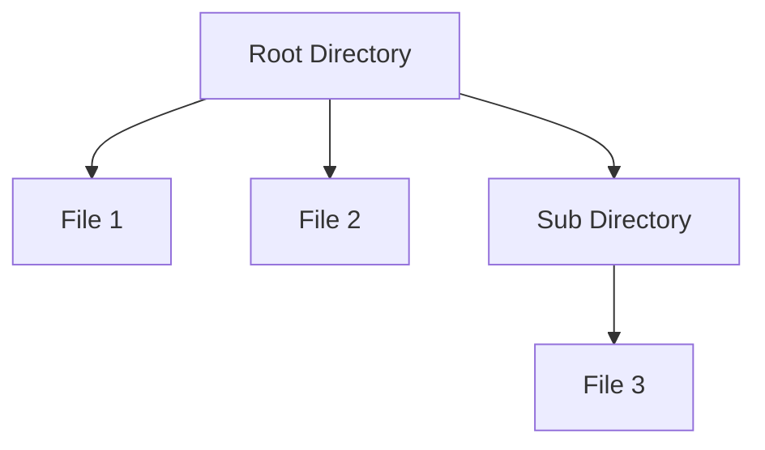

## 4.4.4 Iteration and Recursion in Composites

In this section, we delve into the intricacies of traversing composite structures using iteration and recursion. Understanding these techniques is crucial for efficiently managing hierarchical data structures in Java. We'll explore recursive methods, scenarios where iteration is preferable, and how design patterns like the Iterator pattern can be leveraged to traverse composites without exposing their underlying structure.

### Understanding Composite Structures

Composite structures allow you to treat individual objects and compositions of objects uniformly. This is particularly useful when dealing with tree-like structures, such as file systems, organizational hierarchies, or GUI components. The Composite pattern is a structural pattern that lets you compose objects into tree structures to represent part-whole hierarchies. It allows clients to treat individual objects and compositions of objects uniformly.

### Recursion in Composite Structures

Recursion is a natural fit for traversing composite structures due to their hierarchical nature. Recursive methods can perform operations on all components of a composite structure by calling themselves on each child component. This approach is intuitive and aligns well with the tree-like nature of composites.

#### Implementing Recursive Traversal

Let's consider a simple example of a composite structure representing a file system, where directories can contain files or other directories:

```java
// Component interface
interface FileSystemComponent {
    void showDetails();
}

// Leaf class
class File implements FileSystemComponent {
    private String name;

    public File(String name) {
        this.name = name;
    }

    @Override
    public void showDetails() {
        System.out.println("File: " + name);
    }
}

// Composite class
class Directory implements FileSystemComponent {
    private String name;
    private List<FileSystemComponent> components = new ArrayList<>();

    public Directory(String name) {
        this.name = name;
    }

    public void addComponent(FileSystemComponent component) {
        components.add(component);
    }

    @Override
    public void showDetails() {
        System.out.println("Directory: " + name);
        for (FileSystemComponent component : components) {
            component.showDetails();
        }
    }
}

// Client code
public class CompositeDemo {
    public static void main(String[] args) {
        Directory root = new Directory("root");
        File file1 = new File("file1.txt");
        File file2 = new File("file2.txt");

        Directory subDir = new Directory("subDir");
        File file3 = new File("file3.txt");

        root.addComponent(file1);
        root.addComponent(file2);
        root.addComponent(subDir);
        subDir.addComponent(file3);

        root.showDetails();
    }
}
```

In this example, the `showDetails` method in the `Directory` class is a recursive method that calls itself for each component in the directory. This allows us to traverse the entire structure and print details of each file and directory.

#### Advantages of Recursive Traversal

- **Simplicity**: Recursive solutions are often more straightforward and easier to understand.
- **Alignment with Structure**: Recursion naturally aligns with the hierarchical nature of composite structures.

#### Potential Pitfalls of Recursion

While recursion is powerful, it can lead to issues such as stack overflow if the composite structure is too deep. Java's call stack has a limited size, and deep recursion can exhaust it, leading to a `StackOverflowError`.

### Mitigating Recursion Pitfalls

To mitigate the risk of stack overflow, consider the following strategies:

- **Tail Recursion**: If possible, refactor your recursive methods to use tail recursion, which some compilers can optimize to avoid growing the call stack.
- **Iterative Solutions**: For very deep structures, consider using an iterative approach with an explicit stack data structure to simulate recursion.

### Iteration in Composite Structures

Iteration can be a more efficient approach in scenarios where recursion might lead to stack overflow or when you need more control over the traversal process. Iteration involves using loops to traverse the composite structure.

#### Implementing Iterative Traversal

To implement an iterative traversal, we can use a stack data structure to simulate the recursive process. Here's how you can do it:

```java
public class IterativeCompositeDemo {
    public static void main(String[] args) {
        Directory root = new Directory("root");
        File file1 = new File("file1.txt");
        File file2 = new File("file2.txt");

        Directory subDir = new Directory("subDir");
        File file3 = new File("file3.txt");

        root.addComponent(file1);
        root.addComponent(file2);
        root.addComponent(subDir);
        subDir.addComponent(file3);

        Stack<FileSystemComponent> stack = new Stack<>();
        stack.push(root);

        while (!stack.isEmpty()) {
            FileSystemComponent component = stack.pop();
            component.showDetails();

            if (component instanceof Directory) {
                Directory directory = (Directory) component;
                for (FileSystemComponent child : directory.components) {
                    stack.push(child);
                }
            }
        }
    }
}
```

In this example, we use a `Stack` to keep track of the components to be processed. This approach avoids the risk of stack overflow and gives us more control over the traversal process.

#### Advantages of Iterative Traversal

- **Stack Safety**: Iterative solutions do not risk stack overflow, making them suitable for very deep structures.
- **Control**: Iteration provides more control over the traversal process, allowing for custom traversal strategies.

### Using the Iterator Pattern

The Iterator pattern provides a way to access the elements of an aggregate object sequentially without exposing its underlying representation. This pattern is particularly useful for traversing composite structures as it encapsulates the traversal logic and provides a consistent interface for accessing elements.

#### Implementing the Iterator Pattern

Let's enhance our file system example by implementing the Iterator pattern:

```java
// Iterator interface
interface Iterator {
    boolean hasNext();
    FileSystemComponent next();
}

// Concrete Iterator
class CompositeIterator implements Iterator {
    private Stack<Iterator> stack = new Stack<>();

    public CompositeIterator(Iterator iterator) {
        stack.push(iterator);
    }

    @Override
    public boolean hasNext() {
        if (stack.isEmpty()) {
            return false;
        } else {
            Iterator iterator = stack.peek();
            if (!iterator.hasNext()) {
                stack.pop();
                return hasNext();
            } else {
                return true;
            }
        }
    }

    @Override
    public FileSystemComponent next() {
        if (hasNext()) {
            Iterator iterator = stack.peek();
            FileSystemComponent component = iterator.next();
            if (component instanceof Directory) {
                stack.push(((Directory) component).createIterator());
            }
            return component;
        } else {
            return null;
        }
    }
}

// Directory class with iterator support
class Directory implements FileSystemComponent {
    private String name;
    private List<FileSystemComponent> components = new ArrayList<>();

    public Directory(String name) {
        this.name = name;
    }

    public void addComponent(FileSystemComponent component) {
        components.add(component);
    }

    @Override
    public void showDetails() {
        System.out.println("Directory: " + name);
    }

    public Iterator createIterator() {
        return new CompositeIterator(new FileSystemComponentIterator(components));
    }
}

// Concrete Iterator for FileSystemComponent
class FileSystemComponentIterator implements Iterator {
    private List<FileSystemComponent> components;
    private int position = 0;

    public FileSystemComponentIterator(List<FileSystemComponent> components) {
        this.components = components;
    }

    @Override
    public boolean hasNext() {
        return position < components.size();
    }

    @Override
    public FileSystemComponent next() {
        FileSystemComponent component = components.get(position);
        position++;
        return component;
    }
}

// Client code
public class IteratorCompositeDemo {
    public static void main(String[] args) {
        Directory root = new Directory("root");
        File file1 = new File("file1.txt");
        File file2 = new File("file2.txt");

        Directory subDir = new Directory("subDir");
        File file3 = new File("file3.txt");

        root.addComponent(file1);
        root.addComponent(file2);
        root.addComponent(subDir);
        subDir.addComponent(file3);

        Iterator iterator = root.createIterator();
        while (iterator.hasNext()) {
            FileSystemComponent component = iterator.next();
            component.showDetails();
        }
    }
}
```

In this implementation, the `CompositeIterator` manages a stack of iterators, allowing us to traverse the composite structure without exposing its internal representation.

#### Advantages of the Iterator Pattern

- **Encapsulation**: The Iterator pattern encapsulates the traversal logic, providing a clean interface for accessing elements.
- **Flexibility**: It allows for different traversal strategies without changing the composite structure.

### Choosing the Right Traversal Strategy

When deciding between recursion, iteration, and the Iterator pattern, consider the following factors:

- **Structure Depth**: For shallow structures, recursion is often simpler and more intuitive. For deeper structures, iteration or the Iterator pattern may be more appropriate to avoid stack overflow.
- **Control Needs**: If you need fine-grained control over the traversal process, iteration or the Iterator pattern can provide more flexibility.
- **Encapsulation**: If you want to encapsulate the traversal logic and provide a consistent interface, the Iterator pattern is a good choice.

### Try It Yourself

Experiment with the provided code examples by making the following modifications:

1. **Add More Levels**: Extend the directory structure to include more levels and observe how the traversal methods handle deeper hierarchies.
2. **Modify Traversal Order**: Change the order of traversal in the iterative example to see how it affects the output.
3. **Implement Additional Operations**: Add methods to perform operations like counting files or calculating total file sizes during traversal.

### Visualizing Composite Traversal

To better understand the traversal process, let's visualize a simple composite structure and its traversal using a diagram:



This diagram represents a composite structure with a root directory containing two files and a subdirectory, which in turn contains another file. Traversal involves visiting each node in the structure.

### References and Further Reading

- [Oracle Java Documentation](https://docs.oracle.com/javase/tutorial/collections/interfaces/index.html) - Learn more about Java collections and iterators.
- [Design Patterns: Elements of Reusable Object-Oriented Software](https://en.wikipedia.org/wiki/Design_Patterns) - The classic book on design patterns by Erich Gamma, Richard Helm, Ralph Johnson, and John Vlissides.
- [Stack Overflow](https://stackoverflow.com/) - A great resource for asking questions and finding solutions related to Java and design patterns.

### Knowledge Check

- What are the advantages and disadvantages of using recursion for traversing composite structures?
- How can you mitigate the risk of stack overflow in deep recursive traversals?
- When might iteration be a more appropriate choice than recursion for traversing composites?
- How does the Iterator pattern encapsulate traversal logic and provide flexibility?

### Embrace the Journey

Remember, mastering design patterns and traversal techniques is a journey. As you continue to explore and experiment with these concepts, you'll become more adept at designing efficient and maintainable software. Keep experimenting, stay curious, and enjoy the journey!

## Quiz Time!



### What is a primary advantage of using recursion for traversing composite structures?

- [x] Simplicity and alignment with hierarchical structures
- [ ] Avoiding stack overflow
- [ ] Providing more control over traversal
- [ ] Encapsulating traversal logic

> **Explanation:** Recursion is simple and aligns well with the hierarchical nature of composite structures, making it intuitive for traversal.

### How can you mitigate the risk of stack overflow in deep recursive traversals?

- [x] Use iterative solutions with an explicit stack
- [ ] Increase the stack size
- [ ] Avoid recursion altogether
- [ ] Use more memory

> **Explanation:** Using an iterative approach with an explicit stack can simulate recursion without risking stack overflow.

### When might iteration be more appropriate than recursion for traversing composites?

- [x] When dealing with very deep structures
- [ ] When simplicity is the primary concern
- [ ] When encapsulating traversal logic
- [ ] When using shallow structures

> **Explanation:** Iteration is more appropriate for very deep structures to avoid stack overflow.

### What does the Iterator pattern provide when traversing composite structures?

- [x] Encapsulation of traversal logic
- [ ] Simplicity and alignment with structure
- [ ] Risk of stack overflow
- [ ] Direct access to underlying representation

> **Explanation:** The Iterator pattern encapsulates traversal logic, providing a consistent interface for accessing elements.

### What is a potential pitfall of using recursion in composite structures?

- [x] Stack overflow in deep recursion
- [ ] Lack of encapsulation
- [ ] Complexity in implementation
- [ ] Inefficient memory usage

> **Explanation:** Deep recursion can lead to stack overflow due to limited stack size.

### Which pattern is particularly useful for traversing composites without exposing their structure?

- [x] Iterator pattern
- [ ] Singleton pattern
- [ ] Factory pattern
- [ ] Observer pattern

> **Explanation:** The Iterator pattern is designed to traverse composites without exposing their underlying structure.

### How does the Iterator pattern enhance flexibility in traversal?

- [x] By allowing different traversal strategies
- [ ] By simplifying the structure
- [ ] By providing more control over recursion
- [ ] By increasing stack size

> **Explanation:** The Iterator pattern allows different traversal strategies without changing the composite structure.

### What is a key benefit of using iteration over recursion in composite traversal?

- [x] Avoiding stack overflow
- [ ] Simplicity and alignment with structure
- [ ] Encapsulation of traversal logic
- [ ] Direct access to underlying representation

> **Explanation:** Iteration avoids stack overflow, making it suitable for deep structures.

### How can you implement a traversal order change in an iterative composite traversal?

- [x] Modify the order of processing in the loop
- [ ] Use a different data structure
- [ ] Change the composite structure
- [ ] Increase the stack size

> **Explanation:** Changing the order of processing in the loop can alter the traversal order.

### True or False: The Composite pattern allows clients to treat individual objects and compositions of objects uniformly.

- [x] True
- [ ] False

> **Explanation:** The Composite pattern is designed to allow clients to treat individual objects and compositions uniformly, facilitating operations on composite structures.


