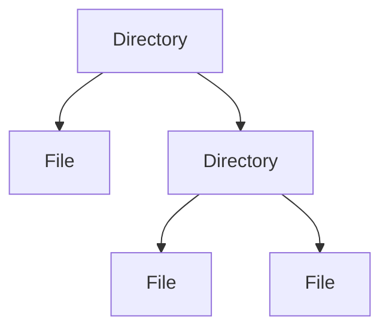
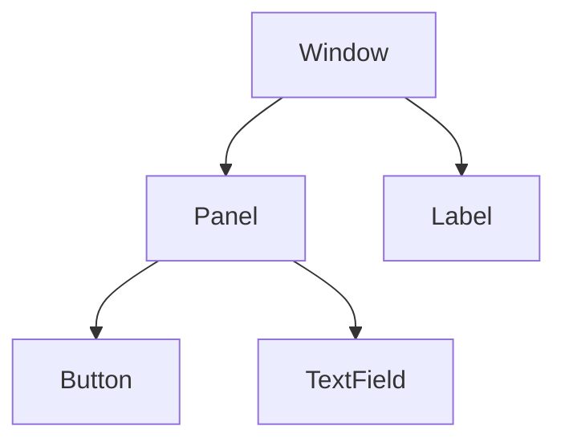
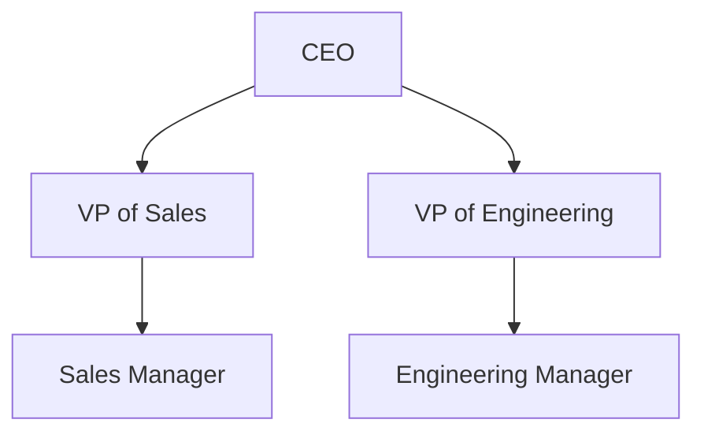
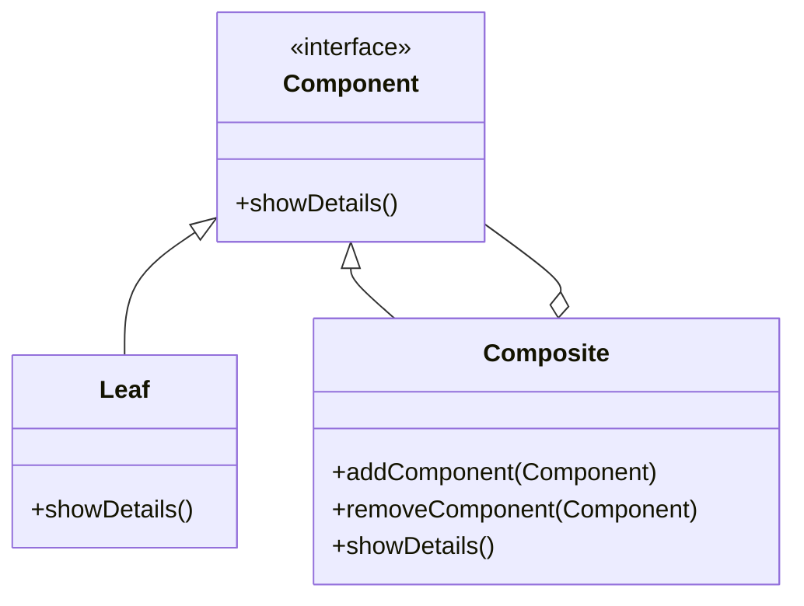

## 4.4.5 Use Cases and Examples

The Composite pattern is a structural design pattern that allows you to compose objects into tree structures to represent part-whole hierarchies. This pattern treats individual objects and compositions of objects uniformly, making it easier to work with complex structures. In this section, we'll explore practical applications of the Composite pattern in Java, including file systems, GUI component hierarchies, and organizational charts. We'll also provide code snippets and diagrams to illustrate how the pattern can be implemented and discuss the benefits it offers.

### Real-World Examples of the Composite Pattern

#### 1. File System Directories and Files

One of the most common examples of the Composite pattern is a file system, where directories can contain files or other directories. In this structure, both files and directories can be treated uniformly through a common interface.

**Conceptual Diagram: File System Structure**



**Java Code Example: File System Composite**

```java
// Component
interface FileSystemComponent {
    void showDetails();
}

// Leaf
class File implements FileSystemComponent {
    private String name;

    public File(String name) {
        this.name = name;
    }

    @Override
    public void showDetails() {
        System.out.println("File: " + name);
    }
}

// Composite
class Directory implements FileSystemComponent {
    private String name;
    private List<FileSystemComponent> components = new ArrayList<>();

    public Directory(String name) {
        this.name = name;
    }

    public void addComponent(FileSystemComponent component) {
        components.add(component);
    }

    public void removeComponent(FileSystemComponent component) {
        components.remove(component);
    }

    @Override
    public void showDetails() {
        System.out.println("Directory: " + name);
        for (FileSystemComponent component : components) {
            component.showDetails();
        }
    }
}

// Client code
public class FileSystemClient {
    public static void main(String[] args) {
        FileSystemComponent file1 = new File("file1.txt");
        FileSystemComponent file2 = new File("file2.txt");

        Directory directory = new Directory("MyDocuments");
        directory.addComponent(file1);
        directory.addComponent(file2);

        directory.showDetails();
    }
}
```

In this example, both `File` and `Directory` implement the `FileSystemComponent` interface, allowing them to be treated uniformly. The `Directory` class can contain multiple `FileSystemComponent` objects, demonstrating the Composite pattern's ability to handle complex structures.

#### 2. GUI Frameworks: Containers and Components

Graphical User Interface (GUI) frameworks often use the Composite pattern to manage components. A container can hold other components, including other containers, creating a tree-like structure.

**Conceptual Diagram: GUI Component Hierarchy**



**Java Code Example: GUI Composite**

```java
// Component
interface GUIComponent {
    void render();
}

// Leaf
class Button implements GUIComponent {
    private String label;

    public Button(String label) {
        this.label = label;
    }

    @Override
    public void render() {
        System.out.println("Rendering Button: " + label);
    }
}

// Composite
class Panel implements GUIComponent {
    private List<GUIComponent> components = new ArrayList<>();

    public void addComponent(GUIComponent component) {
        components.add(component);
    }

    public void removeComponent(GUIComponent component) {
        components.remove(component);
    }

    @Override
    public void render() {
        System.out.println("Rendering Panel");
        for (GUIComponent component : components) {
            component.render();
        }
    }
}

// Client code
public class GUIClient {
    public static void main(String[] args) {
        GUIComponent button1 = new Button("OK");
        GUIComponent button2 = new Button("Cancel");

        Panel panel = new Panel();
        panel.addComponent(button1);
        panel.addComponent(button2);

        panel.render();
    }
}
```

In GUI frameworks, the Composite pattern allows for flexible and dynamic user interfaces. Components can be added or removed from containers without affecting the overall structure, making it easy to manage complex UI layouts.

#### 3. Organizational Charts: Employees and Departments

Organizational charts can also benefit from the Composite pattern, where employees and departments are represented as nodes in a hierarchy. This approach simplifies the management of complex organizational structures.

**Conceptual Diagram: Organizational Chart**



**Java Code Example: Organizational Composite**

```java
// Component
interface Employee {
    void showDetails();
}

// Leaf
class Developer implements Employee {
    private String name;
    private String position;

    public Developer(String name, String position) {
        this.name = name;
        this.position = position;
    }

    @Override
    public void showDetails() {
        System.out.println(position + ": " + name);
    }
}

// Composite
class Manager implements Employee {
    private String name;
    private String position;
    private List<Employee> subordinates = new ArrayList<>();

    public Manager(String name, String position) {
        this.name = name;
        this.position = position;
    }

    public void addSubordinate(Employee employee) {
        subordinates.add(employee);
    }

    public void removeSubordinate(Employee employee) {
        subordinates.remove(employee);
    }

    @Override
    public void showDetails() {
        System.out.println(position + ": " + name);
        for (Employee employee : subordinates) {
            employee.showDetails();
        }
    }
}

// Client code
public class OrganizationClient {
    public static void main(String[] args) {
        Employee dev1 = new Developer("Alice", "Developer");
        Employee dev2 = new Developer("Bob", "Developer");

        Manager manager = new Manager("Carol", "Engineering Manager");
        manager.addSubordinate(dev1);
        manager.addSubordinate(dev2);

        manager.showDetails();
    }
}
```

In this example, `Developer` and `Manager` both implement the `Employee` interface, allowing them to be treated uniformly. The `Manager` class can contain multiple `Employee` objects, demonstrating the Composite pattern's ability to handle hierarchical structures.

### Benefits of the Composite Pattern

The Composite pattern offers several benefits, including:

- **Uniformity**: By treating individual objects and composites uniformly, the Composite pattern simplifies client interactions with complex structures.
- **Flexibility**: The pattern allows for easy addition or removal of components, making it ideal for dynamic structures.
- **Scalability**: The Composite pattern can handle large and complex hierarchies, making it suitable for applications with tree-like data structures.
- **Reusability**: Components can be reused across different composites, reducing redundancy and improving maintainability.

### When to Use the Composite Pattern

Consider using the Composite pattern when:

- You need to represent part-whole hierarchies in your application.
- You want to treat individual objects and compositions uniformly.
- You need a flexible and scalable solution for managing complex structures.

### Try It Yourself

To deepen your understanding of the Composite pattern, try modifying the code examples provided:

- **Add New Component Types**: Extend the examples by adding new types of components, such as a `TextField` in the GUI example or a `Tester` in the organizational chart.
- **Implement Additional Operations**: Add new methods to the component interface, such as `remove()` or `getChild()`, and implement them in the leaf and composite classes.
- **Create a More Complex Structure**: Expand the hierarchy in the file system example by adding subdirectories and more files.

### Visualizing the Composite Pattern

To further illustrate the Composite pattern, let's visualize the interaction between components using a class diagram.

**Class Diagram: Composite Pattern**



This diagram shows the relationship between the `Component`, `Leaf`, and `Composite` classes. The `Composite` class maintains a collection of `Component` objects, demonstrating the pattern's ability to handle complex structures.

### Knowledge Check

Before we conclude, let's reinforce what we've learned about the Composite pattern:

- **What is the main benefit of using the Composite pattern?**
  - It allows you to treat individual objects and compositions uniformly, simplifying client interactions.
- **In which scenarios is the Composite pattern most useful?**
  - When dealing with tree-like data structures, such as file systems, GUI hierarchies, and organizational charts.
- **How does the Composite pattern improve scalability?**
  - By allowing for easy addition or removal of components, the pattern can handle large and complex hierarchies.

### Conclusion

The Composite pattern is a powerful tool for managing complex structures in Java applications. By treating individual objects and compositions uniformly, it simplifies client interactions and enhances flexibility and scalability. Whether you're working with file systems, GUI frameworks, or organizational charts, the Composite pattern provides a robust solution for handling part-whole hierarchies.

## Quiz Time!



### What is a key benefit of the Composite pattern?

- [x] It allows treating individual objects and compositions uniformly.
- [ ] It simplifies algorithm complexity.
- [ ] It enhances data security.
- [ ] It reduces memory usage.

> **Explanation:** The Composite pattern allows you to treat individual objects and compositions uniformly, simplifying client interactions with complex structures.

### In which scenario is the Composite pattern most useful?

- [x] When dealing with tree-like data structures.
- [ ] When optimizing algorithm performance.
- [ ] When managing database transactions.
- [ ] When securing network communications.

> **Explanation:** The Composite pattern is most useful when dealing with tree-like data structures, such as file systems, GUI hierarchies, and organizational charts.

### How does the Composite pattern improve scalability?

- [x] By allowing easy addition or removal of components.
- [ ] By reducing the number of classes.
- [ ] By minimizing code duplication.
- [ ] By enhancing data encryption.

> **Explanation:** The Composite pattern improves scalability by allowing for easy addition or removal of components, making it suitable for large and complex hierarchies.

### What is a common use case for the Composite pattern?

- [x] File system directories and files.
- [ ] Sorting algorithms.
- [ ] Network protocols.
- [ ] Data encryption.

> **Explanation:** A common use case for the Composite pattern is representing file system directories and files as composites and leaf nodes.

### Which of the following is a benefit of the Composite pattern?

- [x] Uniformity
- [x] Flexibility
- [ ] Data encryption
- [ ] Algorithm optimization

> **Explanation:** The Composite pattern offers benefits such as uniformity and flexibility, allowing for consistent operation handling and easy modification of structures.

### What does the Composite pattern allow you to do?

- [x] Compose objects into tree structures.
- [ ] Encrypt data efficiently.
- [ ] Optimize algorithm performance.
- [ ] Manage database connections.

> **Explanation:** The Composite pattern allows you to compose objects into tree structures to represent part-whole hierarchies.

### What is a common component in a GUI framework using the Composite pattern?

- [x] Panel
- [x] Button
- [ ] Database
- [ ] Network socket

> **Explanation:** In a GUI framework using the Composite pattern, components like panels and buttons are common, allowing for flexible and dynamic user interfaces.

### What is the role of a Composite class in the Composite pattern?

- [x] To maintain a collection of Component objects.
- [ ] To encrypt data.
- [ ] To optimize algorithms.
- [ ] To manage network connections.

> **Explanation:** The Composite class maintains a collection of Component objects, demonstrating the pattern's ability to handle complex structures.

### How does the Composite pattern simplify client interactions?

- [x] By treating individual objects and compositions uniformly.
- [ ] By reducing the number of classes.
- [ ] By enhancing data encryption.
- [ ] By optimizing algorithm performance.

> **Explanation:** The Composite pattern simplifies client interactions by treating individual objects and compositions uniformly, making it easier to work with complex structures.

### True or False: The Composite pattern is only useful for GUI frameworks.

- [ ] True
- [x] False

> **Explanation:** False. The Composite pattern is useful for various applications, including file systems, GUI frameworks, and organizational charts, where tree-like data structures are present.



Remember, the Composite pattern is just one of many design patterns that can help you build more maintainable and scalable Java applications. Keep experimenting, stay curious, and enjoy the journey of mastering design patterns!
