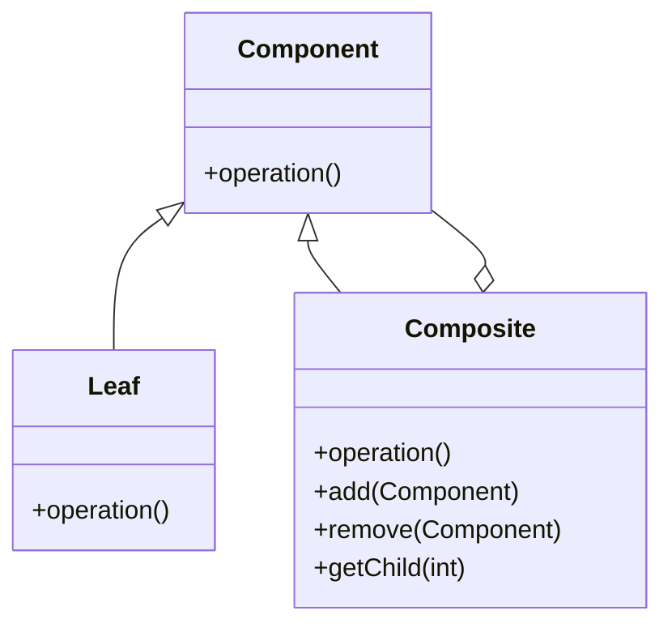
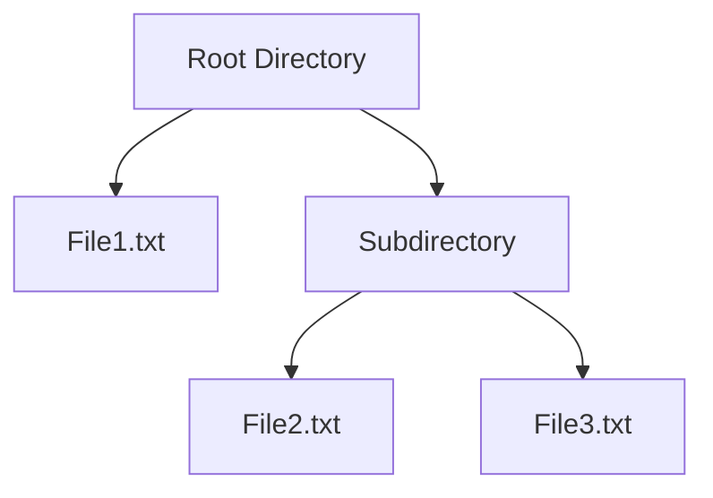

## 4.4 Composite Pattern

In the realm of software design, the Composite Pattern stands as a pivotal structural pattern that addresses the challenge of representing part-whole hierarchies. This pattern is particularly useful when you need to treat individual objects and compositions of objects uniformly. Let’s delve into the intricacies of the Composite Pattern, exploring its intent, structure, and practical applications.

### Understanding the Composite Pattern

The Composite Pattern is a structural design pattern that allows you to compose objects into tree-like structures to represent part-whole hierarchies. This pattern enables clients to treat individual objects and compositions of objects uniformly, simplifying the client code and enhancing flexibility.

#### Intent of the Composite Pattern

The primary intent of the Composite Pattern is to allow clients to work with individual objects and groups of objects in the same way. This is achieved by defining a unified interface for both simple and complex elements of the hierarchy. The pattern is particularly useful in scenarios where you need to represent a hierarchy of objects, such as file systems, GUI components, or organizational structures.

### The Problem It Solves

In many software applications, there is a need to work with both individual objects and groups of objects. For instance, consider a graphical application where you have basic shapes like circles and rectangles, as well as complex shapes composed of these basic shapes. Without the Composite Pattern, you would need to write separate code to handle individual shapes and composite shapes, leading to code duplication and increased complexity.

The Composite Pattern solves this problem by allowing you to treat individual objects and compositions uniformly. This means you can perform operations on both simple and complex objects without worrying about their specific types.

### Structure of the Composite Pattern

The Composite Pattern is composed of three main roles: Component, Leaf, and Composite. Let’s explore each of these roles in detail.

#### Component

The Component is an abstract class or interface that defines the common interface for all objects in the composition. This interface declares operations that can be performed on both simple and complex objects.

#### Leaf

The Leaf represents the basic building blocks of the composition. It implements the Component interface and defines behavior for primitive objects in the composition. Leaves do not have any children.

#### Composite

The Composite is a class that represents complex objects that may have children. It implements the Component interface and defines behavior for components that have children. The Composite stores child components and implements child-related operations.

### UML Diagram of the Composite Pattern

To better understand the structure of the Composite Pattern, let’s visualize it using a UML diagram.



**Diagram Description**: The UML diagram illustrates the hierarchical structure of the Composite Pattern. The `Component` interface is implemented by both `Leaf` and `Composite` classes. The `Composite` class can contain child components, allowing it to represent complex structures.

### Simplifying Client Code

One of the key benefits of the Composite Pattern is that it simplifies client code by allowing uniform treatment of all objects. Clients can interact with individual objects and compositions through the same interface, reducing the need for type-checking and conditional logic.

#### Example: File System

Consider a file system where you have files and directories. Files are individual objects, while directories can contain both files and other directories. Using the Composite Pattern, you can treat files and directories uniformly, allowing you to perform operations like listing contents or calculating total size without distinguishing between files and directories.

### Practical Implementation Strategies

When implementing the Composite Pattern in Java, consider the following strategies:

1. **Define a Common Interface**: Start by defining a common interface for all components in the hierarchy. This interface should declare operations that can be performed on both simple and complex objects.

2. **Implement Leaf and Composite Classes**: Implement the Leaf class for individual objects and the Composite class for objects that can contain children. Ensure that the Composite class maintains a list of child components.

3. **Use Polymorphism**: Leverage polymorphism to allow clients to interact with components through the common interface. This enables uniform treatment of all objects in the hierarchy.

4. **Consider Performance**: Be mindful of performance implications when dealing with large hierarchies. Optimize operations that involve traversing the hierarchy, such as calculating total size or rendering graphical components.

### Use Cases for the Composite Pattern

The Composite Pattern is particularly useful in scenarios where you need to represent hierarchical structures. Here are some common use cases:

- **File Systems**: Represent files and directories as a hierarchy, allowing uniform operations on both.
- **GUI Component Hierarchies**: Compose graphical components into complex interfaces, enabling uniform rendering and event handling.
- **Organizational Structures**: Model organizational hierarchies, allowing uniform operations on employees and departments.

### Code Example: Implementing the Composite Pattern in Java

Let’s explore a practical example of implementing the Composite Pattern in Java. We’ll create a simple graphical application with shapes and groups of shapes.

```java
// Component interface
interface Graphic {
    void draw();
}

// Leaf class
class Circle implements Graphic {
    @Override
    public void draw() {
        System.out.println("Drawing a circle");
    }
}

// Leaf class
class Rectangle implements Graphic {
    @Override
    public void draw() {
        System.out.println("Drawing a rectangle");
    }
}

// Composite class
class CompositeGraphic implements Graphic {
    private List<Graphic> childGraphics = new ArrayList<>();

    @Override
    public void draw() {
        for (Graphic graphic : childGraphics) {
            graphic.draw();
        }
    }

    public void add(Graphic graphic) {
        childGraphics.add(graphic);
    }

    public void remove(Graphic graphic) {
        childGraphics.remove(graphic);
    }
}

// Client code
public class CompositePatternDemo {
    public static void main(String[] args) {
        // Create leaf objects
        Graphic circle = new Circle();
        Graphic rectangle = new Rectangle();

        // Create composite objects
        CompositeGraphic compositeGraphic = new CompositeGraphic();
        compositeGraphic.add(circle);
        compositeGraphic.add(rectangle);

        // Draw all graphics
        compositeGraphic.draw();
    }
}
```

**Code Explanation**: In this example, we define a `Graphic` interface as the Component. The `Circle` and `Rectangle` classes are Leaf implementations, while the `CompositeGraphic` class is a Composite that can contain child graphics. The client code creates individual shapes and a composite shape, demonstrating uniform treatment of all objects.

### Try It Yourself

Experiment with the code example by adding new shapes or modifying the `CompositeGraphic` class to support additional operations, such as scaling or rotating all child graphics.

### Visualizing the Composite Pattern in Action

To further illustrate the Composite Pattern, let’s visualize a file system hierarchy using a tree diagram.



**Diagram Description**: This tree diagram represents a file system hierarchy with a root directory containing a file and a subdirectory. The subdirectory contains two files, illustrating the part-whole hierarchy.

### References and Further Reading

For more information on the Composite Pattern and its applications, consider exploring the following resources:

- [Design Patterns: Elements of Reusable Object-Oriented Software](https://en.wikipedia.org/wiki/Design_Patterns) by Erich Gamma, Richard Helm, Ralph Johnson, and John Vlissides.
- [Java Design Patterns](https://www.journaldev.com/1827/java-design-patterns-example-tutorial) - JournalDev
- [Composite Pattern in Java](https://www.geeksforgeeks.org/composite-design-pattern/) - GeeksforGeeks

### Knowledge Check

To reinforce your understanding of the Composite Pattern, consider the following questions:

- What is the primary intent of the Composite Pattern?
- How does the Composite Pattern simplify client code?
- In what scenarios is the Composite Pattern particularly useful?

### Embrace the Journey

Remember, mastering design patterns like the Composite Pattern is a journey. As you continue to explore and apply these patterns, you’ll gain deeper insights into software design and architecture. Keep experimenting, stay curious, and enjoy the journey!

## Quiz Time!



### What is the primary intent of the Composite Pattern?

- [x] To allow clients to treat individual objects and compositions uniformly.
- [ ] To optimize the performance of hierarchical structures.
- [ ] To simplify the creation of complex objects.
- [ ] To enhance the security of object hierarchies.

> **Explanation:** The Composite Pattern aims to allow clients to treat individual objects and compositions uniformly, simplifying client code and enhancing flexibility.


### Which role in the Composite Pattern represents the basic building blocks of the composition?

- [ ] Component
- [x] Leaf
- [ ] Composite
- [ ] Client

> **Explanation:** The Leaf represents the basic building blocks of the composition and implements the Component interface.


### What is a key benefit of using the Composite Pattern?

- [x] Simplifies client code by allowing uniform treatment of all objects.
- [ ] Increases the complexity of the codebase.
- [ ] Enhances the security of the application.
- [ ] Reduces the need for polymorphism.

> **Explanation:** The Composite Pattern simplifies client code by allowing uniform treatment of all objects, reducing the need for type-checking and conditional logic.


### In the Composite Pattern, which class can contain child components?

- [ ] Leaf
- [ ] Component
- [x] Composite
- [ ] Client

> **Explanation:** The Composite class can contain child components, allowing it to represent complex structures.


### Which of the following is a common use case for the Composite Pattern?

- [x] File systems
- [ ] Authentication systems
- [ ] Network protocols
- [ ] Database connections

> **Explanation:** The Composite Pattern is commonly used in file systems to represent files and directories as a hierarchy.


### How does the Composite Pattern handle operations on both simple and complex objects?

- [x] By defining a unified interface for all components.
- [ ] By using separate interfaces for simple and complex objects.
- [ ] By relying on conditional logic in client code.
- [ ] By using inheritance to differentiate object types.

> **Explanation:** The Composite Pattern handles operations on both simple and complex objects by defining a unified interface for all components.


### What is the role of the Component in the Composite Pattern?

- [x] It defines the common interface for all objects in the composition.
- [ ] It represents the basic building blocks of the composition.
- [ ] It is responsible for storing child components.
- [ ] It simplifies client code by providing utility methods.

> **Explanation:** The Component defines the common interface for all objects in the composition, allowing uniform treatment.


### Which class in the Composite Pattern is responsible for implementing child-related operations?

- [ ] Leaf
- [ ] Component
- [x] Composite
- [ ] Client

> **Explanation:** The Composite class is responsible for implementing child-related operations, such as adding or removing child components.


### What is a practical strategy for implementing the Composite Pattern in Java?

- [x] Define a common interface for all components in the hierarchy.
- [ ] Use separate classes for each type of object in the hierarchy.
- [ ] Avoid using polymorphism to simplify the implementation.
- [ ] Implement the pattern without considering performance implications.

> **Explanation:** A practical strategy for implementing the Composite Pattern in Java is to define a common interface for all components in the hierarchy, enabling uniform treatment.


### True or False: The Composite Pattern is only applicable to graphical applications.

- [ ] True
- [x] False

> **Explanation:** False. The Composite Pattern is applicable to various scenarios, including file systems, organizational structures, and more, not just graphical applications.


