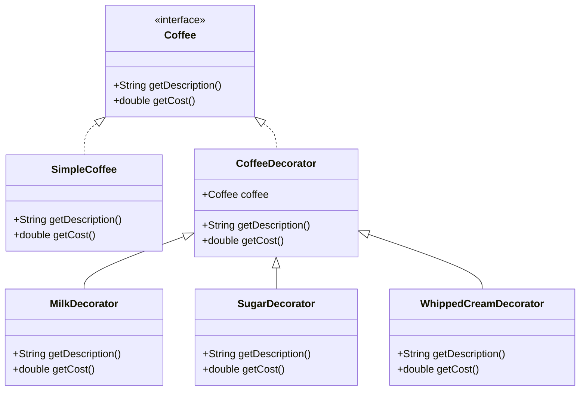

## 4.5.1 Implementing Decorator in Java

The Decorator Pattern is a structural design pattern that allows behavior to be added to individual objects, either statically or dynamically, without affecting the behavior of other objects from the same class. This pattern is particularly useful when you need to add responsibilities to objects without subclassing, thus promoting flexibility and reusability in your code.

### Understanding the Decorator Pattern

The Decorator Pattern involves a set of decorator classes that are used to wrap concrete components. Decorators provide a flexible alternative to subclassing for extending functionality. The key idea is to create a set of decorator classes that are used to wrap concrete components.

#### Key Concepts

- **Component Interface**: This defines the interface for objects that can have responsibilities added to them dynamically.
- **Concrete Component**: This is the class that we want to add new behavior to.
- **Decorator**: This abstract class implements the component interface and has a reference to a component object. It delegates all component methods to the component object.
- **Concrete Decorators**: These are the classes that extend the decorator class and add additional behavior.

### Implementing the Decorator Pattern in Java

Let's walk through the implementation of the Decorator Pattern in Java with a practical example. We'll create a simple coffee shop application where we can dynamically add ingredients to a coffee order.

#### Step 1: Define the Component Interface

The first step is to define a `Coffee` interface that will be implemented by both the concrete component and the decorators.

```java
// Component Interface
public interface Coffee {
    String getDescription();
    double getCost();
}
```

#### Step 2: Create the Concrete Component

Next, we create a `SimpleCoffee` class that implements the `Coffee` interface. This class represents a basic coffee without any additional ingredients.

```java
// Concrete Component
public class SimpleCoffee implements Coffee {
    @Override
    public String getDescription() {
        return "Simple Coffee";
    }

    @Override
    public double getCost() {
        return 5.0;
    }
}
```

#### Step 3: Create the Decorator Abstract Class

The `CoffeeDecorator` class implements the `Coffee` interface and holds a reference to a `Coffee` object. It delegates the method calls to the wrapped `Coffee` object.

```java
// Decorator
public abstract class CoffeeDecorator implements Coffee {
    protected Coffee coffee;

    public CoffeeDecorator(Coffee coffee) {
        this.coffee = coffee;
    }

    @Override
    public String getDescription() {
        return coffee.getDescription();
    }

    @Override
    public double getCost() {
        return coffee.getCost();
    }
}
```

#### Step 4: Create Concrete Decorators

Now, we create concrete decorators that extend the `CoffeeDecorator` class. These decorators add additional functionality to the coffee.

```java
// Concrete Decorator
public class MilkDecorator extends CoffeeDecorator {
    public MilkDecorator(Coffee coffee) {
        super(coffee);
    }

    @Override
    public String getDescription() {
        return coffee.getDescription() + ", Milk";
    }

    @Override
    public double getCost() {
        return coffee.getCost() + 1.5;
    }
}

// Another Concrete Decorator
public class SugarDecorator extends CoffeeDecorator {
    public SugarDecorator(Coffee coffee) {
        super(coffee);
    }

    @Override
    public String getDescription() {
        return coffee.getDescription() + ", Sugar";
    }

    @Override
    public double getCost() {
        return coffee.getCost() + 0.5;
    }
}
```

#### Step 5: Combine Decorators

To use the decorators, we create a `SimpleCoffee` object and wrap it with the desired decorators.

```java
public class CoffeeShop {
    public static void main(String[] args) {
        Coffee coffee = new SimpleCoffee();
        System.out.println(coffee.getDescription() + " $" + coffee.getCost());

        coffee = new MilkDecorator(coffee);
        System.out.println(coffee.getDescription() + " $" + coffee.getCost());

        coffee = new SugarDecorator(coffee);
        System.out.println(coffee.getDescription() + " $" + coffee.getCost());
    }
}
```

### Explanation of the Code

- **Component Interface**: The `Coffee` interface defines the methods that both the concrete component and decorators must implement.
- **Concrete Component**: The `SimpleCoffee` class provides a basic implementation of the `Coffee` interface.
- **Decorator Class**: The `CoffeeDecorator` abstract class implements the `Coffee` interface and holds a reference to a `Coffee` object. It provides default implementations for the methods by delegating them to the wrapped object.
- **Concrete Decorators**: The `MilkDecorator` and `SugarDecorator` classes extend `CoffeeDecorator` and override the methods to add their specific behavior.

### Adding New Behaviors

To add new behaviors, simply create new decorator classes that extend the `CoffeeDecorator` class. For example, you can create a `WhippedCreamDecorator` to add whipped cream to the coffee.

```java
// New Concrete Decorator
public class WhippedCreamDecorator extends CoffeeDecorator {
    public WhippedCreamDecorator(Coffee coffee) {
        super(coffee);
    }

    @Override
    public String getDescription() {
        return coffee.getDescription() + ", Whipped Cream";
    }

    @Override
    public double getCost() {
        return coffee.getCost() + 2.0;
    }
}
```

### Best Practices

- **Conform to Component Interface**: Ensure that all decorators conform to the component interface. This allows decorators to be used interchangeably with components.
- **Single Responsibility**: Keep decorators focused on a single responsibility. This makes them easier to maintain and extend.
- **Lightweight Decorators**: Avoid adding unnecessary complexity to decorators. They should be lightweight and focused on adding specific behavior.

### Visualizing the Decorator Pattern

Below is a class diagram that illustrates the relationships between the component, decorators, and concrete decorators.



### Try It Yourself

Experiment with the code by adding new decorators or modifying existing ones. Here are some suggestions:

- **Create a `VanillaDecorator`**: Add a new decorator that adds vanilla flavor to the coffee.
- **Modify the `SugarDecorator`**: Change the cost of sugar or add a new method to specify the amount of sugar.
- **Chain Multiple Decorators**: Try combining multiple decorators in different orders and observe how it affects the final output.

### References and Further Reading

- [Java Design Patterns](https://www.journaldev.com/1540/decorator-design-pattern-in-java-example) - JournalDev
- [Decorator Pattern](https://refactoring.guru/design-patterns/decorator) - Refactoring Guru

### Knowledge Check

- **What is the primary purpose of the Decorator Pattern?**
- **How does the Decorator Pattern differ from subclassing?**
- **Why is it important for decorators to conform to the component interface?**

### Embrace the Journey

Remember, mastering design patterns is a journey. As you continue to explore and apply these patterns, you'll find new ways to enhance your code's flexibility and maintainability. Keep experimenting, stay curious, and enjoy the process!

## Quiz Time!



### What is the primary purpose of the Decorator Pattern?

- [x] To add behavior to individual objects dynamically
- [ ] To create a single instance of a class
- [ ] To provide a simplified interface to a complex system
- [ ] To separate the construction of a complex object from its representation

> **Explanation:** The Decorator Pattern is used to add behavior to individual objects dynamically without affecting other objects from the same class.

### How does the Decorator Pattern differ from subclassing?

- [x] It allows behavior to be added dynamically at runtime
- [ ] It requires modifying the existing class hierarchy
- [ ] It is less flexible than subclassing
- [ ] It is used to create a single instance of a class

> **Explanation:** The Decorator Pattern allows behavior to be added dynamically at runtime, whereas subclassing requires modifying the class hierarchy and is less flexible.

### Why is it important for decorators to conform to the component interface?

- [x] To ensure they can be used interchangeably with components
- [ ] To improve performance
- [ ] To reduce memory usage
- [ ] To simplify the code

> **Explanation:** Conforming to the component interface ensures that decorators can be used interchangeably with components, maintaining transparency.

### What is a key benefit of using the Decorator Pattern?

- [x] It promotes code reusability and flexibility
- [ ] It simplifies the code
- [ ] It reduces the number of classes
- [ ] It improves performance

> **Explanation:** The Decorator Pattern promotes code reusability and flexibility by allowing behavior to be added to objects dynamically.

### Which of the following is a best practice when implementing decorators?

- [x] Keep decorators focused on a single responsibility
- [ ] Use decorators to reduce the number of classes
- [ ] Avoid using interfaces in decorators
- [ ] Ensure decorators are heavyweight

> **Explanation:** Keeping decorators focused on a single responsibility makes them easier to maintain and extend.

### What does the `CoffeeDecorator` class do in the provided example?

- [x] It holds a reference to a `Coffee` object and delegates method calls
- [ ] It provides a concrete implementation of the `Coffee` interface
- [ ] It adds new methods to the `Coffee` interface
- [ ] It modifies the `SimpleCoffee` class directly

> **Explanation:** The `CoffeeDecorator` class holds a reference to a `Coffee` object and delegates method calls, allowing additional behavior to be added.

### How can you add new behavior to a coffee order in the example?

- [x] By creating a new decorator class that extends `CoffeeDecorator`
- [ ] By modifying the `SimpleCoffee` class
- [ ] By adding methods to the `Coffee` interface
- [ ] By changing the `CoffeeShop` class

> **Explanation:** New behavior can be added by creating a new decorator class that extends `CoffeeDecorator`.

### What is the role of the `SimpleCoffee` class in the example?

- [x] It provides a basic implementation of the `Coffee` interface
- [ ] It serves as a decorator
- [ ] It modifies the behavior of other coffee objects
- [ ] It is an abstract class

> **Explanation:** The `SimpleCoffee` class provides a basic implementation of the `Coffee` interface, serving as the concrete component.

### Which of the following is NOT a characteristic of the Decorator Pattern?

- [ ] It allows behavior to be added dynamically
- [x] It requires modifying the existing class hierarchy
- [ ] It promotes code reusability
- [ ] It conforms to the component interface

> **Explanation:** The Decorator Pattern does not require modifying the existing class hierarchy; it adds behavior dynamically.

### True or False: The Decorator Pattern is used to create a single instance of a class.

- [ ] True
- [x] False

> **Explanation:** False. The Decorator Pattern is not used to create a single instance of a class; that's the purpose of the Singleton Pattern.


