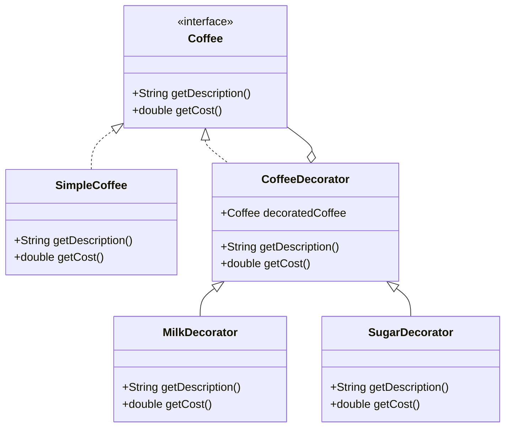

## 4.5.2 Interface-Based Decorators

In the realm of software design, the Decorator Pattern is a structural pattern that allows behavior to be added to individual objects, either statically or dynamically, without affecting the behavior of other objects from the same class. When we talk about **Interface-Based Decorators**, we delve into a specific implementation strategy where decorators adhere to the same interface as the components they wrap. This ensures that decorators can be used interchangeably with the original components, enhancing flexibility and maintainability.

### Why Decorators Must Adhere to the Same Interface

The primary reason decorators must adhere to the same interface as the components they wrap is to maintain a consistent contract. This consistency allows objects to be treated uniformly, regardless of whether they are the original component or a decorated version. By implementing the same interface, decorators can be seamlessly integrated into existing systems without requiring changes to the code that interacts with the components.

#### Key Benefits:

1. **Interchangeability**: Decorators can be swapped in and out without altering the client code, as they present the same interface as the original components.
2. **Open/Closed Principle**: This approach adheres to the Open/Closed Principle, one of the SOLID principles, by allowing classes to be open for extension but closed for modification.
3. **Flexibility**: New functionalities can be added dynamically at runtime, enhancing the flexibility of the system.
4. **Reusability**: Interface-based decorators can be reused across different components that share the same interface.

### Using Interfaces in Java to Define the Component's Contract

In Java, interfaces are used to define a contract that classes must adhere to. This contract specifies the methods that must be implemented, ensuring that any class implementing the interface can be used interchangeably with other classes that implement the same interface.

#### Example Interface:

```java
public interface Coffee {
    String getDescription();
    double getCost();
}
```

In this example, the `Coffee` interface defines two methods: `getDescription()` and `getCost()`. Any class implementing this interface must provide implementations for these methods.

### Implementing Interface-Based Decorators in Java

To illustrate the concept of interface-based decorators, let's consider a simple example involving coffee beverages. We'll create a base coffee class and then use decorators to add various ingredients like milk, sugar, and whipped cream.

#### Base Component:

```java
public class SimpleCoffee implements Coffee {
    @Override
    public String getDescription() {
        return "Simple Coffee";
    }

    @Override
    public double getCost() {
        return 5.00;
    }
}
```

#### Decorator Base Class:

```java
public abstract class CoffeeDecorator implements Coffee {
    protected Coffee decoratedCoffee;

    public CoffeeDecorator(Coffee decoratedCoffee) {
        this.decoratedCoffee = decoratedCoffee;
    }

    @Override
    public String getDescription() {
        return decoratedCoffee.getDescription();
    }

    @Override
    public double getCost() {
        return decoratedCoffee.getCost();
    }
}
```

#### Concrete Decorators:

```java
public class MilkDecorator extends CoffeeDecorator {
    public MilkDecorator(Coffee decoratedCoffee) {
        super(decoratedCoffee);
    }

    @Override
    public String getDescription() {
        return decoratedCoffee.getDescription() + ", Milk";
    }

    @Override
    public double getCost() {
        return decoratedCoffee.getCost() + 1.50;
    }
}

public class SugarDecorator extends CoffeeDecorator {
    public SugarDecorator(Coffee decoratedCoffee) {
        super(decoratedCoffee);
    }

    @Override
    public String getDescription() {
        return decoratedCoffee.getDescription() + ", Sugar";
    }

    @Override
    public double getCost() {
        return decoratedCoffee.getCost() + 0.50;
    }
}
```

#### Using the Decorators:

```java
public class CoffeeShop {
    public static void main(String[] args) {
        Coffee coffee = new SimpleCoffee();
        System.out.println(coffee.getDescription() + " $" + coffee.getCost());

        coffee = new MilkDecorator(coffee);
        System.out.println(coffee.getDescription() + " $" + coffee.getCost());

        coffee = new SugarDecorator(coffee);
        System.out.println(coffee.getDescription() + " $" + coffee.getCost());
    }
}
```

### How Interface-Based Decorators Enable Interchangeability

By adhering to the same interface, decorators can be used interchangeably with the original components. This means that client code can work with both decorated and undecorated objects without any modifications.

#### Example Scenario:

Consider a scenario where a coffee shop application needs to calculate the total cost of an order. Whether the order consists of plain coffee or coffee with multiple ingredients, the application can use the same method to calculate the cost, thanks to the consistent interface.

### Potential Challenges and Considerations

While interface-based decorators offer numerous benefits, there are some challenges and considerations to keep in mind:

1. **Complexity**: As the number of decorators increases, the system can become complex and harder to manage.
2. **Performance Overhead**: Each decorator adds a layer of abstraction, which can introduce performance overhead.
3. **Understanding the Decorator Chain**: It can be challenging to understand the final behavior of an object when multiple decorators are applied.
4. **Circular Dependencies**: Care must be taken to avoid circular dependencies between decorators.

### Visualizing Interface-Based Decorators

To better understand the structure and flow of interface-based decorators, let's visualize the relationships between the components, decorators, and the interface.



### Try It Yourself

To deepen your understanding of interface-based decorators, try modifying the code examples provided. Here are some suggestions:

- **Add More Decorators**: Create additional decorators, such as `WhippedCreamDecorator` or `VanillaDecorator`, to extend the functionality.
- **Experiment with Order**: Change the order in which decorators are applied and observe the impact on the final description and cost.
- **Implement a New Interface**: Define a new interface for another type of beverage and implement decorators for it.

### References and Links

For further reading on the Decorator Pattern and interface-based design, consider the following resources:

- [Decorator Pattern on Wikipedia](https://en.wikipedia.org/wiki/Decorator_pattern)
- [Java Design Patterns](https://www.journaldev.com/1540/decorator-design-pattern-in-java-example)
- [Oracle's Java Documentation](https://docs.oracle.com/javase/tutorial/java/IandI/createinterface.html)

### Knowledge Check

Before we conclude, let's reinforce what we've learned with a few questions:

- Why is it important for decorators to adhere to the same interface as the components they wrap?
- What are the benefits of using interfaces in Java to define a component's contract?
- How do interface-based decorators enhance flexibility and interchangeability in a system?

### Embrace the Journey

Remember, mastering design patterns is a journey. As you continue to explore and experiment with different patterns, you'll gain a deeper understanding of how to build flexible, maintainable, and scalable software systems. Keep experimenting, stay curious, and enjoy the journey!

## Quiz Time!



### Why must decorators adhere to the same interface as the components they wrap?

- [x] To maintain a consistent contract and ensure interchangeability
- [ ] To increase the complexity of the system
- [ ] To allow decorators to have different methods
- [ ] To make the code harder to understand

> **Explanation:** Decorators must adhere to the same interface to maintain a consistent contract, allowing them to be used interchangeably with the original components.

### What is a key benefit of using interfaces in Java for defining a component's contract?

- [x] It ensures that any class implementing the interface can be used interchangeably
- [ ] It makes the code less flexible
- [ ] It restricts the number of methods a class can have
- [ ] It increases the performance overhead

> **Explanation:** Using interfaces ensures that any class implementing the interface can be used interchangeably, enhancing flexibility and maintainability.

### What is a potential challenge when using interface-based decorators?

- [x] Increased complexity and potential performance overhead
- [ ] Lack of flexibility in adding new functionalities
- [ ] Difficulty in maintaining a consistent interface
- [ ] Reduced reusability of decorators

> **Explanation:** Interface-based decorators can increase complexity and introduce performance overhead due to additional layers of abstraction.

### How do interface-based decorators enhance flexibility in a system?

- [x] By allowing new functionalities to be added dynamically at runtime
- [ ] By making the system more rigid
- [ ] By reducing the number of available methods
- [ ] By enforcing a strict class hierarchy

> **Explanation:** Interface-based decorators enhance flexibility by allowing new functionalities to be added dynamically at runtime without altering the existing code.

### What is a common use case for the Decorator Pattern?

- [x] Adding additional responsibilities to an object dynamically
- [ ] Creating a new class hierarchy
- [ ] Reducing the number of classes in a system
- [ ] Simplifying the codebase

> **Explanation:** The Decorator Pattern is commonly used to add additional responsibilities to an object dynamically without affecting other objects from the same class.

### What is the role of the `CoffeeDecorator` class in the example?

- [x] It serves as a base class for all decorators, implementing the `Coffee` interface
- [ ] It provides the main functionality of the coffee
- [ ] It defines the interface for coffee components
- [ ] It restricts the addition of new decorators

> **Explanation:** The `CoffeeDecorator` class serves as a base class for all decorators, implementing the `Coffee` interface and delegating method calls to the decorated object.

### What is the advantage of using the Open/Closed Principle in decorators?

- [x] It allows classes to be open for extension but closed for modification
- [ ] It makes the codebase more complex
- [ ] It restricts the addition of new functionalities
- [ ] It reduces the number of classes

> **Explanation:** The Open/Closed Principle allows classes to be open for extension but closed for modification, enabling new functionalities to be added without altering existing code.

### How can decorators be used interchangeably with original components?

- [x] By implementing the same interface as the original components
- [ ] By having different methods than the original components
- [ ] By being part of the same class hierarchy
- [ ] By using inheritance instead of composition

> **Explanation:** Decorators can be used interchangeably with original components by implementing the same interface, ensuring consistent behavior.

### What is a potential drawback of using multiple decorators?

- [x] It can make it challenging to understand the final behavior of an object
- [ ] It simplifies the codebase
- [ ] It reduces the number of available functionalities
- [ ] It enforces a strict class hierarchy

> **Explanation:** Using multiple decorators can make it challenging to understand the final behavior of an object due to the layered nature of decorators.

### True or False: Interface-based decorators can be used to add functionality to objects at runtime.

- [x] True
- [ ] False

> **Explanation:** True. Interface-based decorators can add functionality to objects at runtime, enhancing flexibility and adaptability.


