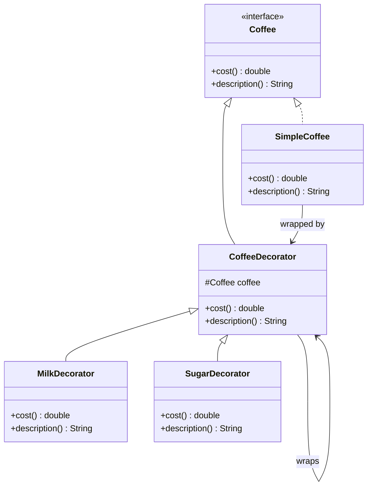

## 4.5.3 Chaining Decorators

In the world of software design, flexibility and adaptability are key. The Decorator Pattern is a powerful tool that allows us to add responsibilities to objects dynamically. By chaining decorators, we can create complex behaviors and functionalities without altering the underlying object structure. This section delves into the concept of chaining decorators in Java, providing insights, examples, and considerations for expert software engineers.

### Understanding the Decorator Pattern

Before diving into chaining, let's briefly revisit the Decorator Pattern. This pattern allows behavior to be added to individual objects, either statically or dynamically, without affecting the behavior of other objects from the same class. It is a structural pattern that provides an alternative to subclassing for extending functionality.

### The Concept of Chaining Decorators

Chaining decorators involves wrapping an object with multiple decorators, each adding its own behavior. This is akin to layering enhancements, where each decorator builds upon the previous one. The beauty of this approach lies in its flexibility; you can mix and match decorators to achieve the desired functionality.

#### How Chaining Works

Imagine you have a simple object, and you want to add multiple features to it. Instead of creating a complex subclass for each combination of features, you can chain decorators. Each decorator wraps the object and adds its behavior, passing the object to the next decorator in the chain.

### Code Example: Chaining Decorators in Java

Let's illustrate this with a practical example. Suppose we have a `Coffee` interface and a `SimpleCoffee` class implementing it. We want to add different flavors and toppings to our coffee using decorators.

```java
// Step 1: Define the Coffee interface
interface Coffee {
    double cost();
    String description();
}

// Step 2: Implement the SimpleCoffee class
class SimpleCoffee implements Coffee {
    @Override
    public double cost() {
        return 5.0;
    }

    @Override
    public String description() {
        return "Simple Coffee";
    }
}

// Step 3: Create the abstract CoffeeDecorator class
abstract class CoffeeDecorator implements Coffee {
    protected Coffee coffee;

    public CoffeeDecorator(Coffee coffee) {
        this.coffee = coffee;
    }

    @Override
    public double cost() {
        return coffee.cost();
    }

    @Override
    public String description() {
        return coffee.description();
    }
}

// Step 4: Implement specific decorators
class MilkDecorator extends CoffeeDecorator {
    public MilkDecorator(Coffee coffee) {
        super(coffee);
    }

    @Override
    public double cost() {
        return super.cost() + 1.5;
    }

    @Override
    public String description() {
        return super.description() + ", Milk";
    }
}

class SugarDecorator extends CoffeeDecorator {
    public SugarDecorator(Coffee coffee) {
        super(coffee);
    }

    @Override
    public double cost() {
        return super.cost() + 0.5;
    }

    @Override
    public String description() {
        return super.description() + ", Sugar";
    }
}

// Step 5: Demonstrate chaining decorators
public class CoffeeShop {
    public static void main(String[] args) {
        Coffee coffee = new SimpleCoffee();
        System.out.println(coffee.description() + " $" + coffee.cost());

        coffee = new MilkDecorator(coffee);
        System.out.println(coffee.description() + " $" + coffee.cost());

        coffee = new SugarDecorator(coffee);
        System.out.println(coffee.description() + " $" + coffee.cost());
    }
}
```

In this example, we start with a `SimpleCoffee` object. We then wrap it with a `MilkDecorator`, followed by a `SugarDecorator`. Each decorator adds its own cost and description, demonstrating how chaining can dynamically enhance an object's behavior.

### Order Matters: The Impact of Decorator Sequence

The order in which decorators are applied can significantly affect the final behavior of the object. In our coffee example, if we reversed the order of `MilkDecorator` and `SugarDecorator`, the description and cost would reflect this change. This is because each decorator builds upon the modifications made by its predecessors.

#### Visualizing Decorator Chaining

To better understand the flow of decorator chaining, let's visualize it using a class diagram.



This diagram illustrates the relationship between the `Coffee` interface, the `SimpleCoffee` class, and the decorators. The decorators wrap the `SimpleCoffee` object, enhancing its behavior.

### Flexibility and Dynamic Composition

One of the greatest advantages of chaining decorators is the flexibility it provides. By dynamically composing behaviors at runtime, you can tailor an object's functionality to meet specific requirements without altering its core structure. This is particularly useful in scenarios where the exact combination of features is not known until runtime.

#### Real-World Applications

Consider a text editor that allows users to apply various formatting options to text. By using decorators, you can let users apply bold, italic, underline, and other styles in any combination. Each style can be a separate decorator, and users can chain them as needed.

### Performance Considerations

While chaining decorators offers flexibility, it can also introduce performance overhead. Each decorator adds a layer of abstraction, which can impact performance if not managed carefully. Here are some considerations:

- **Overhead**: Each additional decorator adds a method call overhead. In performance-critical applications, this can accumulate.
- **Memory Usage**: Decorators can increase memory usage due to the additional objects created.
- **Complexity**: Managing multiple decorators can increase code complexity, making it harder to maintain.

To mitigate these issues, consider the following strategies:

- **Limit the Number of Decorators**: Use only the necessary decorators to achieve the desired functionality.
- **Optimize Decorator Logic**: Ensure that each decorator performs its task efficiently.
- **Profile and Test**: Use profiling tools to identify and address performance bottlenecks.

### Try It Yourself: Experiment with Decorators

To deepen your understanding, try modifying the coffee example. Add new decorators, such as `WhippedCreamDecorator` or `VanillaDecorator`, and experiment with different chaining orders. Observe how the cost and description change with each configuration.

### Conclusion

Chaining decorators in Java is a powerful technique for dynamically composing object behaviors. By wrapping objects with multiple decorators, you can create complex functionalities without altering the object's core structure. While this approach offers significant flexibility, it's important to consider performance implications and manage complexity effectively.

### Further Reading

For more information on the Decorator Pattern and its applications, consider exploring the following resources:

- [Decorator Pattern on Wikipedia](https://en.wikipedia.org/wiki/Decorator_pattern)
- [Java Design Patterns](https://java-design-patterns.com/patterns/decorator/)

## Quiz Time!



### What is the primary advantage of chaining decorators?

- [x] It allows dynamic composition of behaviors at runtime.
- [ ] It reduces memory usage.
- [ ] It simplifies code structure.
- [ ] It eliminates the need for interfaces.

> **Explanation:** Chaining decorators allows for dynamic composition of behaviors, enabling flexible and adaptable object functionality.

### In the coffee example, what would be the result of reversing the order of MilkDecorator and SugarDecorator?

- [x] The description and cost would reflect the reversed order.
- [ ] The description would remain the same, but the cost would change.
- [ ] The cost would remain the same, but the description would change.
- [ ] There would be no change in description or cost.

> **Explanation:** The order of decorators affects both the description and cost, as each decorator builds upon the modifications of its predecessors.

### What is a potential downside of chaining too many decorators?

- [x] Increased method call overhead.
- [ ] Reduced flexibility.
- [ ] Simplified code maintenance.
- [ ] Decreased memory usage.

> **Explanation:** Chaining too many decorators can lead to increased method call overhead, impacting performance.

### How can you mitigate performance issues when chaining decorators?

- [x] Limit the number of decorators used.
- [ ] Use more complex decorators.
- [ ] Avoid using interfaces.
- [ ] Increase memory allocation.

> **Explanation:** Limiting the number of decorators can help reduce method call overhead and improve performance.

### Which of the following is NOT a benefit of using the Decorator Pattern?

- [ ] Enhances object functionality dynamically.
- [ ] Reduces the need for subclassing.
- [ ] Allows flexible feature combinations.
- [x] Guarantees improved performance.

> **Explanation:** While the Decorator Pattern offers flexibility and dynamic functionality, it does not inherently guarantee improved performance.

### What is the role of the CoffeeDecorator class in the example?

- [x] It serves as a base class for specific decorators.
- [ ] It implements the Coffee interface directly.
- [ ] It provides a concrete implementation of coffee.
- [ ] It manages the lifecycle of coffee objects.

> **Explanation:** The CoffeeDecorator class serves as an abstract base class for specific decorators, allowing them to extend functionality.

### Why is it important to consider the order of decorators?

- [x] Because each decorator builds upon the modifications of its predecessors.
- [ ] Because it determines the number of decorators needed.
- [ ] Because it affects the underlying object structure.
- [ ] Because it simplifies the decorator implementation.

> **Explanation:** The order of decorators is important because each one builds upon the modifications made by its predecessors, affecting the final behavior.

### What is a real-world application of chaining decorators?

- [x] Applying multiple text styles in a text editor.
- [ ] Managing database connections.
- [ ] Implementing a singleton pattern.
- [ ] Handling network requests.

> **Explanation:** Chaining decorators is useful in applications like text editors, where multiple styles can be applied in any combination.

### Which strategy can help manage complexity when using multiple decorators?

- [x] Optimize decorator logic.
- [ ] Increase the number of decorators.
- [ ] Avoid using abstract classes.
- [ ] Use only static decorators.

> **Explanation:** Optimizing decorator logic helps manage complexity by ensuring each decorator performs its task efficiently.

### True or False: Chaining decorators can lead to increased memory usage.

- [x] True
- [ ] False

> **Explanation:** Chaining decorators can lead to increased memory usage due to the additional objects created for each decorator.


