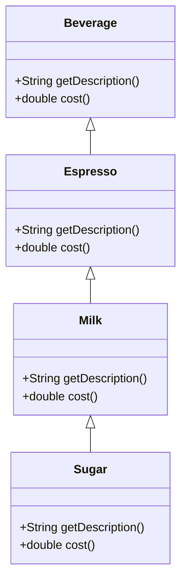
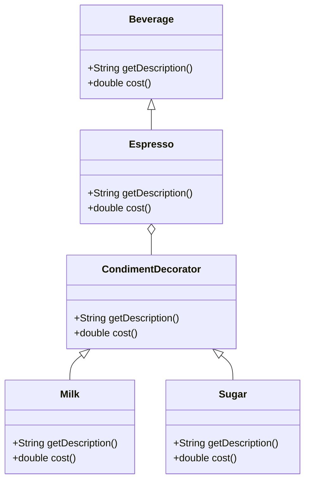

## 4.5.4 Decorator vs. Inheritance

In the realm of software design, the choice between using the Decorator pattern and inheritance is a pivotal decision that can significantly impact the flexibility, maintainability, and scalability of your code. Both approaches offer mechanisms to extend functionality, but they do so in fundamentally different ways. This section will delve into the nuances of these two approaches, highlighting their differences, advantages, and limitations.

### Understanding Inheritance

Inheritance is a cornerstone of object-oriented programming (OOP) that allows a new class to inherit properties and behaviors from an existing class. This mechanism facilitates code reuse and establishes a hierarchical relationship between classes.

#### How Inheritance Works

In Java, inheritance is achieved using the `extends` keyword. When a class inherits from another, it gains access to the parent class's methods and fields, allowing for the extension or modification of behavior.

```java
class Vehicle {
    void start() {
        System.out.println("Vehicle starting");
    }
}

class Car extends Vehicle {
    void start() {
        System.out.println("Car starting");
    }
}
```

In this example, `Car` inherits from `Vehicle` and overrides the `start` method to provide specific behavior.

#### Limitations of Inheritance

While inheritance is a powerful tool, it comes with several limitations:

- **Class Explosion**: As the number of features or variations increases, the number of subclasses can grow exponentially, leading to a complex and unmanageable class hierarchy.
- **Static Extension**: Inheritance is determined at compile time, meaning you cannot change the behavior of an object dynamically at runtime.
- **Tight Coupling**: Subclasses are tightly coupled to their parent classes, making changes in the base class potentially ripple through the hierarchy.
- **Single Inheritance Limitation**: Java supports single inheritance, which can be restrictive when a class needs to inherit behavior from multiple sources.

### Introducing the Decorator Pattern

The Decorator pattern provides a flexible alternative to inheritance by allowing behavior to be added to individual objects, dynamically and transparently, without affecting other objects of the same class.

#### How Decorators Work

Decorators are implemented by creating a set of decorator classes that are used to wrap concrete components. Each decorator class extends the functionality of the component it decorates.

```java
interface Coffee {
    String getDescription();
    double getCost();
}

class SimpleCoffee implements Coffee {
    public String getDescription() {
        return "Simple coffee";
    }

    public double getCost() {
        return 5.0;
    }
}

class MilkDecorator implements Coffee {
    private Coffee coffee;

    public MilkDecorator(Coffee coffee) {
        this.coffee = coffee;
    }

    public String getDescription() {
        return coffee.getDescription() + ", milk";
    }

    public double getCost() {
        return coffee.getCost() + 1.5;
    }
}
```

In this example, `MilkDecorator` adds milk to a `Coffee` object, enhancing its behavior without modifying the original `SimpleCoffee` class.

### Advantages of the Decorator Pattern

- **Dynamic Extension**: Decorators allow you to add responsibilities to objects at runtime, offering greater flexibility than static inheritance.
- **Adherence to the Open/Closed Principle**: Decorators enable you to extend functionality without modifying existing code, keeping classes open for extension but closed for modification.
- **Reduced Class Explosion**: By using decorators, you can combine behaviors in a modular way, reducing the need for numerous subclasses.
- **Loose Coupling**: Decorators work with interfaces, promoting loose coupling and enhancing the maintainability of the codebase.

### Decorator vs. Inheritance: A Comparative Analysis

#### Flexibility and Extensibility

- **Inheritance**: Offers a rigid structure where behavior is defined at compile time. Adding new behavior often requires creating new subclasses or modifying existing ones.
- **Decorator**: Provides a more flexible approach, allowing behavior to be composed and changed at runtime without altering existing classes.

#### Complexity and Maintainability

- **Inheritance**: Can lead to complex hierarchies that are difficult to manage and understand, especially as the number of features grows.
- **Decorator**: Encourages simpler class structures by allowing behavior to be added in a modular fashion, improving maintainability.

#### Use Cases

- **Inheritance**: Best suited for scenarios where a clear hierarchical relationship exists, and the behavior is unlikely to change dynamically.
- **Decorator**: Ideal for situations where objects require dynamic and interchangeable behavior, such as UI components, stream processing, or adding features to objects at runtime.

### When to Choose Decorators Over Inheritance

- **Dynamic Behavior**: When you need to add or remove responsibilities from objects at runtime.
- **Avoiding Class Explosion**: When the number of potential combinations of behaviors is large, decorators can help manage complexity.
- **Adhering to SOLID Principles**: When you want to keep classes closed for modification but open for extension, decorators align well with the Open/Closed Principle.

### Code Example: Decorator vs. Inheritance

Let's consider a scenario where we need to create different types of beverages with various add-ons like milk, sugar, and whipped cream. We'll explore both inheritance and decorator approaches.

#### Inheritance Approach

```java
class Beverage {
    String description = "Unknown Beverage";

    public String getDescription() {
        return description;
    }

    public double cost() {
        return 0.0;
    }
}

class Espresso extends Beverage {
    public Espresso() {
        description = "Espresso";
    }

    public double cost() {
        return 1.99;
    }
}

class EspressoWithMilk extends Espresso {
    public double cost() {
        return super.cost() + 0.50;
    }
}

class EspressoWithMilkAndSugar extends EspressoWithMilk {
    public double cost() {
        return super.cost() + 0.20;
    }
}
```

This approach quickly leads to a proliferation of subclasses as new combinations are needed.

#### Decorator Approach

```java
interface Beverage {
    String getDescription();
    double cost();
}

class Espresso implements Beverage {
    public String getDescription() {
        return "Espresso";
    }

    public double cost() {
        return 1.99;
    }
}

abstract class CondimentDecorator implements Beverage {
    protected Beverage beverage;

    public CondimentDecorator(Beverage beverage) {
        this.beverage = beverage;
    }
}

class Milk extends CondimentDecorator {
    public Milk(Beverage beverage) {
        super(beverage);
    }

    public String getDescription() {
        return beverage.getDescription() + ", Milk";
    }

    public double cost() {
        return beverage.cost() + 0.50;
    }
}

class Sugar extends CondimentDecorator {
    public Sugar(Beverage beverage) {
        super(beverage);
    }

    public String getDescription() {
        return beverage.getDescription() + ", Sugar";
    }

    public double cost() {
        return beverage.cost() + 0.20;
    }
}
```

With decorators, you can easily combine behaviors at runtime:

```java
Beverage beverage = new Espresso();
beverage = new Milk(beverage);
beverage = new Sugar(beverage);

System.out.println(beverage.getDescription() + " $" + beverage.cost());
```

### Visualizing Decorator vs. Inheritance

To better understand the differences, let's visualize the structure of both approaches.



**Inheritance Diagram**: Shows a rigid hierarchy with subclasses extending base classes.



**Decorator Diagram**: Illustrates a more flexible structure where decorators can be combined dynamically.

### Try It Yourself

Experiment with the decorator pattern by adding new condiments or creating a new type of beverage. Consider how easily you can extend functionality without modifying existing classes.

### Knowledge Check

- **What are the key differences between decorators and inheritance?**
- **Why might decorators be more suitable for dynamic behavior?**
- **How does the decorator pattern adhere to the Open/Closed Principle?**

### Conclusion

Choosing between the Decorator pattern and inheritance depends on the specific requirements of your application. Decorators offer a dynamic and flexible way to extend object behavior, making them ideal for scenarios where runtime flexibility is crucial. In contrast, inheritance provides a more static and hierarchical approach, suitable for well-defined and stable relationships. By understanding the strengths and limitations of each approach, you can make informed decisions that enhance the design and maintainability of your software.

## Quiz Time!



### What is a primary advantage of using the Decorator pattern over inheritance?

- [x] Dynamic behavior extension at runtime
- [ ] Easier to implement
- [ ] Better performance
- [ ] Simpler code structure

> **Explanation:** The Decorator pattern allows for dynamic behavior extension at runtime, offering greater flexibility than static inheritance.

### How does the Decorator pattern adhere to the Open/Closed Principle?

- [x] By allowing new functionality to be added without modifying existing code
- [ ] By simplifying the code structure
- [ ] By reducing the number of classes
- [ ] By improving performance

> **Explanation:** The Decorator pattern enables new functionality to be added without altering existing code, keeping classes open for extension but closed for modification.

### Which of the following is a limitation of inheritance?

- [x] Class explosion
- [ ] Dynamic behavior
- [ ] Loose coupling
- [ ] Simplified hierarchy

> **Explanation:** Inheritance can lead to class explosion, where the number of subclasses grows exponentially with new features.

### In which scenario is the Decorator pattern more suitable than inheritance?

- [x] When objects require dynamic and interchangeable behavior
- [ ] When a clear hierarchical relationship exists
- [ ] When performance is the primary concern
- [ ] When the behavior is unlikely to change

> **Explanation:** The Decorator pattern is more suitable when objects require dynamic and interchangeable behavior, allowing for runtime flexibility.

### What is a disadvantage of using inheritance for extending functionality?

- [x] Tight coupling between classes
- [ ] Increased flexibility
- [ ] Reduced code reuse
- [ ] Simplified testing

> **Explanation:** Inheritance creates tight coupling between classes, making changes in the base class affect all subclasses.

### How does the Decorator pattern promote loose coupling?

- [x] By working with interfaces
- [ ] By reducing the number of classes
- [ ] By simplifying the code structure
- [ ] By improving performance

> **Explanation:** The Decorator pattern promotes loose coupling by working with interfaces, allowing for flexible and interchangeable behavior.

### What is a common use case for the Decorator pattern?

- [x] Adding features to objects at runtime
- [ ] Creating a rigid class hierarchy
- [ ] Improving performance
- [ ] Simplifying code structure

> **Explanation:** The Decorator pattern is commonly used to add features to objects at runtime, providing flexibility and extensibility.

### Why might inheritance lead to a complex class hierarchy?

- [x] Due to the proliferation of subclasses
- [ ] Due to dynamic behavior
- [ ] Due to loose coupling
- [ ] Due to simplified testing

> **Explanation:** Inheritance can lead to a complex class hierarchy due to the proliferation of subclasses as new features are added.

### How can decorators be combined at runtime?

- [x] By wrapping objects with multiple decorators
- [ ] By creating new subclasses
- [ ] By modifying existing classes
- [ ] By simplifying the code structure

> **Explanation:** Decorators can be combined at runtime by wrapping objects with multiple decorators, allowing for dynamic behavior composition.

### True or False: The Decorator pattern is a form of static extension.

- [ ] True
- [x] False

> **Explanation:** False. The Decorator pattern is a form of dynamic extension, allowing behavior to be added to objects at runtime.


