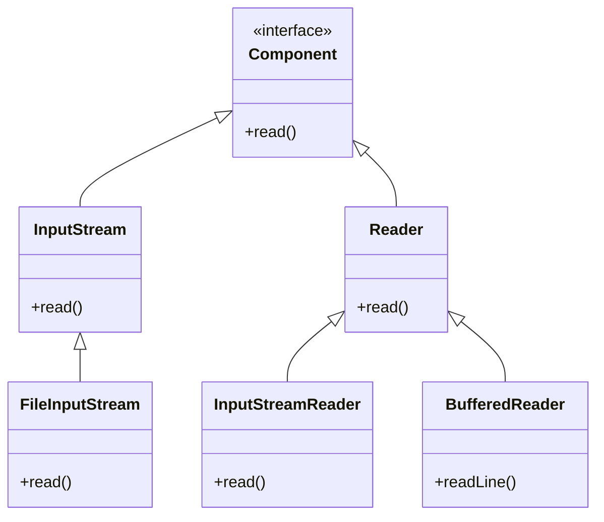
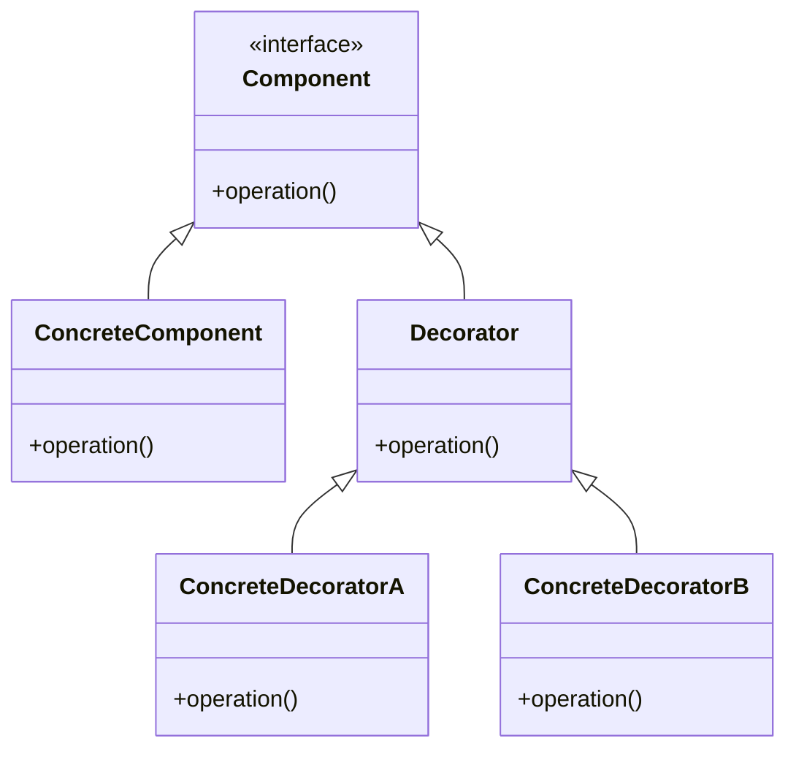

## 4.5.5 Use Cases and Examples

The Decorator pattern is a structural pattern that allows behavior to be added to individual objects, either statically or dynamically, without affecting the behavior of other objects from the same class. This pattern is particularly useful when you need to add responsibilities to objects without modifying their code, thus adhering to the Open/Closed Principle of object-oriented design.

### Understanding the Decorator Pattern

Before diving into specific use cases, let's briefly revisit the core concept of the Decorator pattern. The pattern involves a set of decorator classes that are used to wrap concrete components. Decorators provide a flexible alternative to subclassing for extending functionality.

#### Key Components of the Decorator Pattern

1. **Component Interface**: Defines the interface for objects that can have responsibilities added to them dynamically.
2. **Concrete Component**: The class that implements the component interface. It is the object to which additional responsibilities can be attached.
3. **Decorator**: Maintains a reference to a component object and defines an interface that conforms to the component's interface.
4. **Concrete Decorators**: Extend the functionality of the component by adding responsibilities.

### Use Case 1: Java I/O Streams

One of the most prominent examples of the Decorator pattern in Java is its implementation in the Java I/O streams library. The I/O streams library uses decorators to add functionality to input and output streams.

#### Example: Enhancing Input Streams

Consider the task of reading data from a file. Java's I/O library provides a `FileInputStream` class for this purpose. However, if you want to read the data line by line, you can use a `BufferedReader`, which is a decorator for the `InputStreamReader`, itself a decorator for `FileInputStream`.

```java
import java.io.*;

public class DecoratorExample {
    public static void main(String[] args) {
        try (BufferedReader bufferedReader = new BufferedReader(new InputStreamReader(new FileInputStream("example.txt")))) {
            String line;
            while ((line = bufferedReader.readLine()) != null) {
                System.out.println(line);
            }
        } catch (IOException e) {
            e.printStackTrace();
        }
    }
}
```

**Explanation**: In this example, `BufferedReader` adds functionality to `InputStreamReader` by providing a `readLine()` method, which reads text a line at a time. This is a classic use of the Decorator pattern, where each decorator adds its own functionality to the component it wraps.

#### Diagram: Java I/O Stream Decorators



### Use Case 2: Enhancing UI Components

In graphical user interfaces, the Decorator pattern is often used to add features like borders, scrollbars, or shadows to visual components without modifying the component's code.

#### Example: Adding Borders to UI Components

Imagine a UI framework where you want to add a border to a button. You can create a `BorderDecorator` that adds this functionality.

```java
interface UIComponent {
    void draw();
}

class Button implements UIComponent {
    @Override
    public void draw() {
        System.out.println("Drawing a button");
    }
}

abstract class ComponentDecorator implements UIComponent {
    protected UIComponent component;

    public ComponentDecorator(UIComponent component) {
        this.component = component;
    }

    public void draw() {
        component.draw();
    }
}

class BorderDecorator extends ComponentDecorator {
    public BorderDecorator(UIComponent component) {
        super(component);
    }

    @Override
    public void draw() {
        component.draw();
        drawBorder();
    }

    private void drawBorder() {
        System.out.println("Adding a border");
    }
}

public class DecoratorPatternDemo {
    public static void main(String[] args) {
        UIComponent button = new Button();
        UIComponent borderedButton = new BorderDecorator(button);
        borderedButton.draw();
    }
}
```

**Explanation**: The `BorderDecorator` class extends `ComponentDecorator` and adds a border to the `Button` component. This demonstrates how the Decorator pattern can be used to add new functionality to existing objects without altering their structure.

### Use Case 3: Data Processing Enhancements

The Decorator pattern is also useful in data processing applications where you might want to add features like logging, validation, or transformation to data processing objects.

#### Example: Adding Logging to Data Processors

Consider a data processor that processes data and logs each step. You can create a `LoggingDecorator` to add logging functionality.

```java
interface DataProcessor {
    void process();
}

class BasicDataProcessor implements DataProcessor {
    @Override
    public void process() {
        System.out.println("Processing data");
    }
}

class LoggingDecorator extends ComponentDecorator {
    public LoggingDecorator(DataProcessor processor) {
        super(processor);
    }

    @Override
    public void process() {
        log("Start processing");
        component.process();
        log("End processing");
    }

    private void log(String message) {
        System.out.println("LOG: " + message);
    }
}

public class DataProcessingDemo {
    public static void main(String[] args) {
        DataProcessor processor = new BasicDataProcessor();
        DataProcessor loggingProcessor = new LoggingDecorator(processor);
        loggingProcessor.process();
    }
}
```

**Explanation**: The `LoggingDecorator` adds logging before and after the data processing. This approach allows you to easily add or remove logging functionality without changing the core processing logic.

### Benefits of Using the Decorator Pattern

1. **Flexibility**: The Decorator pattern allows you to mix and match different decorators to achieve the desired functionality without altering the original object.
2. **Modularity**: By using decorators, you can keep each piece of functionality in its own class, making the code easier to maintain and extend.
3. **Adherence to SOLID Principles**: The pattern supports the Open/Closed Principle by allowing objects to be extended with new behavior without modifying existing code.

### Encouraging Dynamic Behavior Addition

When faced with the need to add behaviors to objects dynamically, consider the Decorator pattern. It provides a robust framework for extending functionality without the pitfalls of subclassing, such as increased complexity and reduced flexibility.

### Try It Yourself

To deepen your understanding of the Decorator pattern, try modifying the examples above:

- **Experiment with Java I/O**: Create a custom decorator that counts the number of lines read from a file.
- **Enhance UI Components**: Add additional decorators to the UI example, such as a `ShadowDecorator` or `ColorDecorator`.
- **Extend Data Processing**: Implement a `ValidationDecorator` that checks data integrity before processing.

### Visualizing the Decorator Pattern

Below is a class diagram illustrating the Decorator pattern structure:



**Diagram Description**: This diagram shows how the Decorator pattern allows multiple decorators to wrap a concrete component, each adding its own functionality.

### Conclusion

The Decorator pattern is a powerful tool in a developer's arsenal, providing a flexible and modular way to extend object functionality. By understanding and applying this pattern, you can create more maintainable and scalable Java applications.

## Quiz Time!



### What is the primary purpose of the Decorator pattern?

- [x] To add responsibilities to individual objects dynamically
- [ ] To create a single instance of a class
- [ ] To provide a simplified interface to a complex subsystem
- [ ] To allow incompatible interfaces to work together

> **Explanation:** The Decorator pattern is used to add responsibilities to individual objects dynamically without affecting other objects from the same class.

### Which Java library is a classic example of the Decorator pattern?

- [x] Java I/O streams
- [ ] Java Collections Framework
- [ ] Java Concurrency Utilities
- [ ] Java Reflection API

> **Explanation:** Java I/O streams are a classic example of the Decorator pattern, where input and output streams are decorated to add functionality like buffering and character conversion.

### In the UI component example, what does the `BorderDecorator` do?

- [x] Adds a border to the UI component
- [ ] Changes the color of the UI component
- [ ] Resizes the UI component
- [ ] Removes the UI component

> **Explanation:** The `BorderDecorator` adds a border to the UI component, demonstrating how the Decorator pattern can enhance UI elements.

### What principle does the Decorator pattern adhere to?

- [x] Open/Closed Principle
- [ ] Single Responsibility Principle
- [ ] Liskov Substitution Principle
- [ ] Interface Segregation Principle

> **Explanation:** The Decorator pattern adheres to the Open/Closed Principle by allowing objects to be extended with new behavior without modifying existing code.

### What is a benefit of using the Decorator pattern?

- [x] Increased flexibility and modularity
- [ ] Simplified class hierarchies
- [ ] Reduced memory usage
- [ ] Enhanced security

> **Explanation:** The Decorator pattern increases flexibility and modularity by allowing behaviors to be added to objects dynamically.

### How does the Decorator pattern differ from subclassing?

- [x] Decorators add functionality without altering the original object's code
- [ ] Decorators require modifying the original object's code
- [ ] Subclassing is more flexible than decorators
- [ ] Subclassing is the only way to add new behavior

> **Explanation:** Decorators add functionality without altering the original object's code, providing a more flexible alternative to subclassing.

### What is a potential drawback of using the Decorator pattern?

- [x] It can lead to a large number of small classes
- [ ] It makes the code less flexible
- [ ] It requires modifying the original class
- [ ] It reduces code readability

> **Explanation:** The Decorator pattern can lead to a large number of small classes, which can increase complexity.

### Which of the following is NOT a component of the Decorator pattern?

- [ ] Component Interface
- [ ] Concrete Component
- [x] Singleton
- [ ] Concrete Decorator

> **Explanation:** Singleton is not a component of the Decorator pattern. The pattern involves a component interface, concrete component, and concrete decorators.

### What method does `BufferedReader` add to `InputStreamReader`?

- [x] readLine()
- [ ] read()
- [ ] write()
- [ ] close()

> **Explanation:** `BufferedReader` adds the `readLine()` method to `InputStreamReader`, allowing for line-by-line reading of input.

### True or False: The Decorator pattern can only be used with graphical user interfaces.

- [ ] True
- [x] False

> **Explanation:** False. The Decorator pattern can be used in various contexts, including I/O operations, data processing, and more, not just graphical user interfaces.


