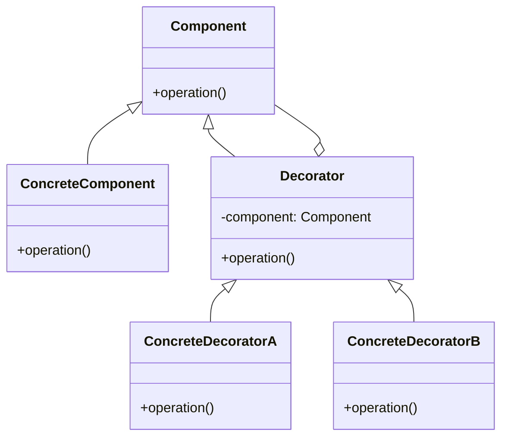
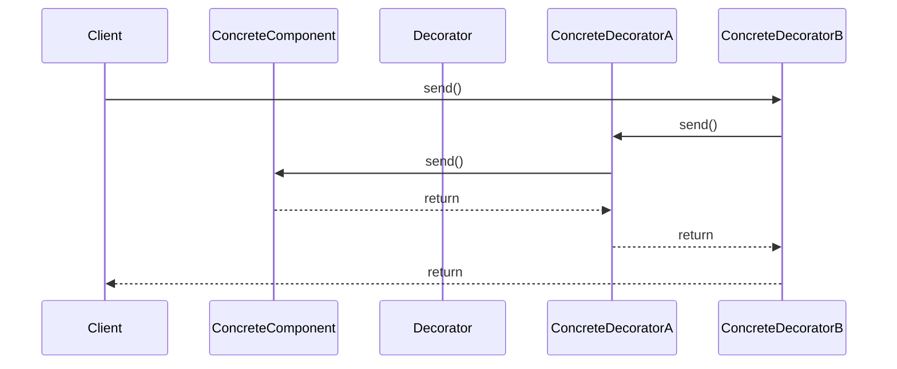

## 4.5 Decorator Pattern

In the realm of software design, flexibility and reusability are paramount. The Decorator Pattern is a structural design pattern that provides a powerful mechanism to extend the functionality of objects dynamically. By wrapping objects, it offers a flexible alternative to subclassing, adhering to the Open/Closed Principle, which states that software entities should be open for extension but closed for modification.

### Introduction to the Decorator Pattern

The Decorator Pattern allows behavior to be added to individual objects, either statically or dynamically, without affecting the behavior of other objects from the same class. This pattern is particularly useful when you want to add responsibilities to objects without altering their structure.

#### Problem Statement

In many software applications, there is a need to extend the functionality of classes. Traditionally, this has been achieved through inheritance. However, inheritance can lead to a rigid class hierarchy that is difficult to maintain and extend. The Decorator Pattern addresses this problem by allowing additional behavior to be added to objects dynamically, providing a more flexible and reusable solution.

### Structure of the Decorator Pattern

The Decorator Pattern involves several key components:

- **Component**: An interface or abstract class defining the core behavior.
- **ConcreteComponent**: A class implementing the Component interface, representing the primary object to which additional responsibilities can be attached.
- **Decorator**: An abstract class implementing the Component interface. It contains a reference to a Component object and delegates operations to it.
- **ConcreteDecorator**: A class extending the Decorator class, adding new behavior or responsibilities to the component.

#### UML Diagram

Below is a UML diagram illustrating the structure of the Decorator Pattern:



### How the Decorator Pattern Works

The Decorator Pattern works by wrapping a component with one or more decorators. Each decorator adds its own behavior before or after delegating the operation to the component it decorates. This allows for the dynamic composition of behavior.

#### Example: Enhancing I/O Streams

A classic example of the Decorator Pattern in Java is the enhancement of I/O streams. Java's I/O library uses decorators to add functionality to streams, such as buffering, filtering, and compression.

```java
import java.io.*;

public class DecoratorExample {
    public static void main(String[] args) {
        try {
            InputStream inputStream = new FileInputStream("input.txt");
            InputStream bufferedInputStream = new BufferedInputStream(inputStream);
            InputStream dataInputStream = new DataInputStream(bufferedInputStream);

            int data = dataInputStream.read();
            while (data != -1) {
                System.out.print((char) data);
                data = dataInputStream.read();
            }

            dataInputStream.close();
        } catch (IOException e) {
            e.printStackTrace();
        }
    }
}
```

In this example, `FileInputStream` is the `ConcreteComponent`, while `BufferedInputStream` and `DataInputStream` are `ConcreteDecorators` that add buffering and data reading capabilities, respectively.

### Benefits of the Decorator Pattern

The Decorator Pattern offers several advantages:

1. **Flexibility**: It allows for the dynamic composition of behavior, enabling the addition of new functionality without altering existing code.
2. **Adherence to the Open/Closed Principle**: By using decorators, classes can be extended without modifying their source code.
3. **Reusability**: Decorators can be reused across different components, promoting code reuse.

### Practical Implementation Strategies

When implementing the Decorator Pattern, consider the following strategies:

- **Identify the Core Component**: Determine the core functionality that will be extended.
- **Define Decorators**: Create decorators that add specific behavior to the component.
- **Compose Decorators**: Combine multiple decorators to achieve the desired functionality.

#### Example: Adding Features to a Notifier

Consider a scenario where you have a `Notifier` interface that sends notifications. You want to add additional features, such as sending notifications via email and SMS, without modifying the existing `Notifier` class.

```java
interface Notifier {
    void send(String message);
}

class BasicNotifier implements Notifier {
    @Override
    public void send(String message) {
        System.out.println("Sending notification: " + message);
    }
}

abstract class NotifierDecorator implements Notifier {
    protected Notifier notifier;

    public NotifierDecorator(Notifier notifier) {
        this.notifier = notifier;
    }

    @Override
    public void send(String message) {
        notifier.send(message);
    }
}

class EmailNotifier extends NotifierDecorator {
    public EmailNotifier(Notifier notifier) {
        super(notifier);
    }

    @Override
    public void send(String message) {
        super.send(message);
        System.out.println("Sending email notification: " + message);
    }
}

class SMSNotifier extends NotifierDecorator {
    public SMSNotifier(Notifier notifier) {
        super(notifier);
    }

    @Override
    public void send(String message) {
        super.send(message);
        System.out.println("Sending SMS notification: " + message);
    }
}

public class DecoratorPatternDemo {
    public static void main(String[] args) {
        Notifier notifier = new BasicNotifier();
        Notifier emailNotifier = new EmailNotifier(notifier);
        Notifier smsNotifier = new SMSNotifier(emailNotifier);

        smsNotifier.send("Hello, World!");
    }
}
```

In this example, `BasicNotifier` is the `ConcreteComponent`, while `EmailNotifier` and `SMSNotifier` are `ConcreteDecorators` that add email and SMS notification capabilities, respectively.

### Try It Yourself

To deepen your understanding of the Decorator Pattern, try modifying the examples provided:

- **Add a new decorator**: Create a `PushNotifier` that sends push notifications.
- **Chain decorators differently**: Experiment with different combinations of decorators to see how the behavior changes.
- **Implement a logging decorator**: Add a decorator that logs each notification sent.

### Visualizing the Decorator Pattern

To further illustrate the Decorator Pattern, consider the following sequence diagram that shows the interaction between components and decorators:



### Considerations and Best Practices

When using the Decorator Pattern, keep the following considerations in mind:

- **Avoid Overuse**: While decorators provide flexibility, excessive use can lead to complex and hard-to-maintain code.
- **Ensure Compatibility**: Decorators should be compatible with the components they wrap, ensuring seamless integration.
- **Maintain Transparency**: Decorators should not alter the interface of the component, maintaining transparency for clients.

### Use Cases for the Decorator Pattern

The Decorator Pattern is particularly useful in scenarios where:

- **Dynamic Behavior is Required**: When behavior needs to be added or removed at runtime.
- **Multiple Independent Extensions are Needed**: When multiple extensions are needed without creating a complex class hierarchy.
- **Functionality Needs to be Reused**: When functionality needs to be reused across different components.

### Summary

The Decorator Pattern is a powerful tool in the software engineer's toolkit, providing a flexible and reusable way to extend the functionality of objects. By adhering to the Open/Closed Principle, it allows for the dynamic composition of behavior, promoting flexibility and reusability.

### Further Reading

For more information on the Decorator Pattern and its applications, consider the following resources:

- [Design Patterns: Elements of Reusable Object-Oriented Software](https://www.amazon.com/Design-Patterns-Elements-Reusable-Object-Oriented/dp/0201633612) by Erich Gamma, Richard Helm, Ralph Johnson, and John Vlissides.
- [Java I/O: Tips and Techniques for Putting I/O to Work](https://www.oreilly.com/library/view/java-io/1565924851/) by Elliotte Rusty Harold.

## Quiz Time!



### What is the primary purpose of the Decorator Pattern?

- [x] To add responsibilities to objects dynamically without modifying their code.
- [ ] To create a complex class hierarchy for extending functionality.
- [ ] To replace inheritance as the primary method of extending classes.
- [ ] To ensure that objects are immutable.

> **Explanation:** The Decorator Pattern allows for dynamic extension of object functionality without modifying the original code, providing flexibility and adhering to the Open/Closed Principle.

### Which component in the Decorator Pattern defines the core behavior?

- [x] Component
- [ ] ConcreteComponent
- [ ] Decorator
- [ ] ConcreteDecorator

> **Explanation:** The Component defines the core behavior that can be extended by decorators.

### What role does the ConcreteDecorator play in the Decorator Pattern?

- [x] It adds new behavior or responsibilities to the component.
- [ ] It defines the core behavior of the component.
- [ ] It acts as a placeholder for the component.
- [ ] It removes responsibilities from the component.

> **Explanation:** The ConcreteDecorator extends the functionality of the component by adding new behavior or responsibilities.

### How does the Decorator Pattern adhere to the Open/Closed Principle?

- [x] By allowing classes to be extended without modifying their source code.
- [ ] By ensuring that all classes are final and cannot be extended.
- [ ] By creating a complex class hierarchy for each new feature.
- [ ] By using inheritance to add new functionality.

> **Explanation:** The Decorator Pattern allows for the extension of classes without modifying their source code, adhering to the Open/Closed Principle.

### In the provided I/O stream example, which class acts as the ConcreteComponent?

- [x] FileInputStream
- [ ] BufferedInputStream
- [ ] DataInputStream
- [ ] InputStream

> **Explanation:** The `FileInputStream` acts as the ConcreteComponent, providing the core functionality that is extended by decorators.

### What is a potential drawback of overusing the Decorator Pattern?

- [x] It can lead to complex and hard-to-maintain code.
- [ ] It makes objects immutable.
- [ ] It prevents the use of inheritance.
- [ ] It requires a new class for each new feature.

> **Explanation:** Overusing the Decorator Pattern can result in complex and hard-to-maintain code due to excessive chaining of decorators.

### Which of the following is NOT a benefit of the Decorator Pattern?

- [ ] Flexibility in adding functionality.
- [ ] Adherence to the Open/Closed Principle.
- [x] Simplification of class hierarchies.
- [ ] Reusability of decorators.

> **Explanation:** While the Decorator Pattern provides flexibility and reusability, it does not necessarily simplify class hierarchies; it can sometimes make them more complex.

### What is a common use case for the Decorator Pattern?

- [x] Enhancing I/O streams with additional functionality.
- [ ] Creating a complex class hierarchy for each new feature.
- [ ] Ensuring that objects are immutable.
- [ ] Replacing inheritance as the primary method of extending classes.

> **Explanation:** A common use case for the Decorator Pattern is enhancing I/O streams with additional functionality, as seen in Java's I/O library.

### True or False: Decorators should alter the interface of the component they wrap.

- [ ] True
- [x] False

> **Explanation:** Decorators should not alter the interface of the component they wrap, maintaining transparency for clients.

### Which principle is primarily promoted by the Decorator Pattern?

- [x] Open/Closed Principle
- [ ] Single Responsibility Principle
- [ ] Liskov Substitution Principle
- [ ] Dependency Inversion Principle

> **Explanation:** The Decorator Pattern primarily promotes the Open/Closed Principle by allowing classes to be extended without modifying their source code.


