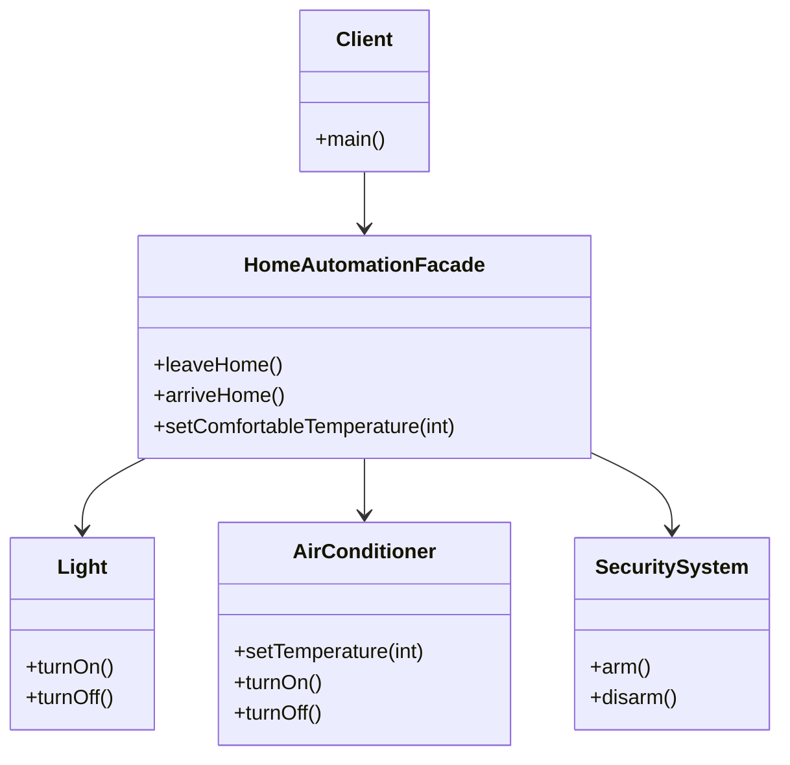

## 4.6.1 Implementing Facade in Java

In the realm of software design patterns, the Facade pattern stands out as a powerful tool for simplifying interactions with complex subsystems. By providing a unified interface, the Facade pattern allows clients to interact with a system in a more straightforward and intuitive manner. In this section, we will delve into the intricacies of implementing the Facade pattern in Java, exploring its benefits, best practices, and practical applications.

### Understanding the Facade Pattern

The Facade pattern is a structural design pattern that provides a simplified interface to a complex subsystem. It acts as a shield, hiding the complexities of the subsystem from the client and providing a clean and easy-to-use interface. This pattern is particularly useful when dealing with large and complex systems, where the client needs to interact with multiple components.

#### Key Concepts

- **Facade**: The main class that provides a simplified interface to the subsystem.
- **Subsystem Classes**: The complex classes that perform the actual work. The Facade delegates client requests to these classes.
- **Client**: The entity that uses the Facade to interact with the subsystem.

### Benefits of the Facade Pattern

1. **Simplification**: The Facade pattern simplifies the client's interaction with the subsystem by providing a single point of access.
2. **Decoupling**: It reduces the coupling between the client and the subsystem, making the system more modular and easier to maintain.
3. **Flexibility**: Changes in the subsystem do not affect the client as long as the Facade interface remains unchanged.
4. **Improved Readability**: By hiding the complexities of the subsystem, the Facade pattern improves the readability and maintainability of the client code.

### Implementing the Facade Pattern in Java

Let's walk through the process of implementing the Facade pattern in Java with a practical example. Suppose we are building a home automation system that controls various devices like lights, air conditioning, and security systems. Each device has its own set of complex operations. We will create a Facade to provide a simple interface for controlling these devices.

#### Step 1: Define Subsystem Classes

First, we need to define the subsystem classes that represent the various devices in our home automation system.

```java
// Subsystem Class: Light
public class Light {
    public void turnOn() {
        System.out.println("Light is turned on.");
    }

    public void turnOff() {
        System.out.println("Light is turned off.");
    }
}

// Subsystem Class: AirConditioner
public class AirConditioner {
    public void setTemperature(int temperature) {
        System.out.println("Setting air conditioner temperature to " + temperature + " degrees.");
    }

    public void turnOn() {
        System.out.println("Air conditioner is turned on.");
    }

    public void turnOff() {
        System.out.println("Air conditioner is turned off.");
    }
}

// Subsystem Class: SecuritySystem
public class SecuritySystem {
    public void arm() {
        System.out.println("Security system is armed.");
    }

    public void disarm() {
        System.out.println("Security system is disarmed.");
    }
}
```

#### Step 2: Create the Facade Class

Next, we create the Facade class that provides a simplified interface for controlling the devices.

```java
// Facade Class: HomeAutomationFacade
public class HomeAutomationFacade {
    private Light light;
    private AirConditioner airConditioner;
    private SecuritySystem securitySystem;

    public HomeAutomationFacade() {
        this.light = new Light();
        this.airConditioner = new AirConditioner();
        this.securitySystem = new SecuritySystem();
    }

    public void leaveHome() {
        System.out.println("Leaving home...");
        light.turnOff();
        airConditioner.turnOff();
        securitySystem.arm();
    }

    public void arriveHome() {
        System.out.println("Arriving home...");
        light.turnOn();
        airConditioner.turnOn();
        securitySystem.disarm();
    }

    public void setComfortableTemperature(int temperature) {
        System.out.println("Setting comfortable temperature...");
        airConditioner.setTemperature(temperature);
    }
}
```

#### Step 3: Use the Facade in Client Code

Finally, we use the Facade in the client code to interact with the subsystem.

```java
// Client Code
public class Client {
    public static void main(String[] args) {
        HomeAutomationFacade homeAutomation = new HomeAutomationFacade();

        homeAutomation.arriveHome();
        homeAutomation.setComfortableTemperature(22);
        homeAutomation.leaveHome();
    }
}
```

### Best Practices for Implementing the Facade Pattern

1. **Focus on Client Needs**: Design the Facade interface to meet the specific needs of the client. Avoid exposing unnecessary details of the subsystem.
2. **Encapsulation**: Keep the Facade class encapsulated and avoid exposing the subsystem classes to the client.
3. **Maintainability**: Ensure that changes to the subsystem do not affect the Facade interface. This improves the maintainability of the system.
4. **Modularity**: Use the Facade pattern to divide the system into modules, making it easier to manage and extend.

### Visualizing the Facade Pattern

To better understand the Facade pattern, let's visualize the interaction between the client, the Facade, and the subsystem classes using a class diagram.



### Try It Yourself

Now that we've covered the basics of implementing the Facade pattern, it's time to experiment with the code. Here are a few suggestions for modifications:

1. **Add New Devices**: Extend the system by adding new devices, such as a thermostat or a smart TV, and update the Facade to control them.
2. **Enhance Functionality**: Add new methods to the Facade, such as `setNightMode()`, which turns off all lights and arms the security system.
3. **Refactor Subsystem Classes**: Experiment with refactoring the subsystem classes to see how changes affect the Facade.

### Knowledge Check

Before we conclude, let's reinforce our understanding of the Facade pattern with a few questions:

1. What is the primary purpose of the Facade pattern?
2. How does the Facade pattern reduce coupling between the client and the subsystem?
3. What are some best practices for designing a Facade interface?

### Conclusion

The Facade pattern is a powerful tool for managing complexity in software systems. By providing a simplified interface to a complex subsystem, it enhances modularity, maintainability, and readability. As you continue to explore design patterns, remember that the Facade pattern is just one of many tools at your disposal for creating clean and efficient software architectures.

## Quiz Time!



### What is the primary purpose of the Facade pattern?

- [x] To provide a simplified interface to a complex subsystem.
- [ ] To increase the complexity of the client code.
- [ ] To expose all subsystem details to the client.
- [ ] To replace all subsystem classes with a single class.

> **Explanation:** The Facade pattern's primary purpose is to provide a simplified interface to a complex subsystem, making it easier for the client to interact with it.

### How does the Facade pattern reduce coupling between the client and the subsystem?

- [x] By providing a single point of access to the subsystem.
- [ ] By exposing all subsystem classes to the client.
- [ ] By increasing the number of dependencies in the client code.
- [ ] By making the client code more complex.

> **Explanation:** The Facade pattern reduces coupling by providing a single point of access to the subsystem, thus hiding the complexities and details of the subsystem from the client.

### Which of the following is a best practice for designing a Facade interface?

- [x] Focus on the specific needs of the client.
- [ ] Expose all internal details of the subsystem.
- [ ] Make the Facade interface as complex as possible.
- [ ] Ignore the client's requirements.

> **Explanation:** A best practice for designing a Facade interface is to focus on the specific needs of the client, ensuring that the interface is simple and meets the client's requirements.

### What is the role of the Facade class in the Facade pattern?

- [x] To provide a unified interface to the subsystem.
- [ ] To replace the subsystem classes entirely.
- [ ] To increase the complexity of the subsystem.
- [ ] To expose all subsystem methods to the client.

> **Explanation:** The Facade class provides a unified interface to the subsystem, simplifying the client's interaction with it.

### Which of the following is NOT a benefit of the Facade pattern?

- [ ] Simplification of client interactions.
- [ ] Improved readability of client code.
- [x] Increased coupling between client and subsystem.
- [ ] Flexibility in subsystem changes.

> **Explanation:** The Facade pattern reduces coupling between the client and the subsystem, not increases it.

### In the provided example, what does the `leaveHome()` method do?

- [x] Turns off the light, turns off the air conditioner, and arms the security system.
- [ ] Turns on the light, turns on the air conditioner, and disarms the security system.
- [ ] Only turns off the light.
- [ ] Only arms the security system.

> **Explanation:** The `leaveHome()` method turns off the light, turns off the air conditioner, and arms the security system, preparing the home for when the occupants leave.

### What is a key characteristic of the Facade pattern?

- [x] It hides the complexities of the subsystem from the client.
- [ ] It exposes all subsystem methods to the client.
- [ ] It increases the complexity of the client code.
- [ ] It requires the client to interact directly with subsystem classes.

> **Explanation:** A key characteristic of the Facade pattern is that it hides the complexities of the subsystem from the client, providing a simplified interface.

### How can the Facade pattern improve the maintainability of a system?

- [x] By reducing the dependency of the client on the subsystem.
- [ ] By making the subsystem more complex.
- [ ] By exposing all subsystem details to the client.
- [ ] By increasing the number of subsystem classes.

> **Explanation:** The Facade pattern improves maintainability by reducing the dependency of the client on the subsystem, allowing changes to the subsystem without affecting the client.

### What is the relationship between the Facade and subsystem classes?

- [x] The Facade delegates client requests to the subsystem classes.
- [ ] The Facade replaces the subsystem classes.
- [ ] The Facade increases the complexity of the subsystem classes.
- [ ] The Facade exposes all subsystem methods to the client.

> **Explanation:** The Facade delegates client requests to the subsystem classes, acting as an intermediary between the client and the subsystem.

### True or False: The Facade pattern is only useful for small systems.

- [ ] True
- [x] False

> **Explanation:** False. The Facade pattern is particularly useful for large and complex systems, where it can significantly simplify client interactions with the subsystem.



Remember, mastering design patterns like the Facade pattern is a journey. As you continue to explore and apply these patterns, you'll discover new ways to simplify and enhance your software designs. Keep experimenting, stay curious, and enjoy the journey!
