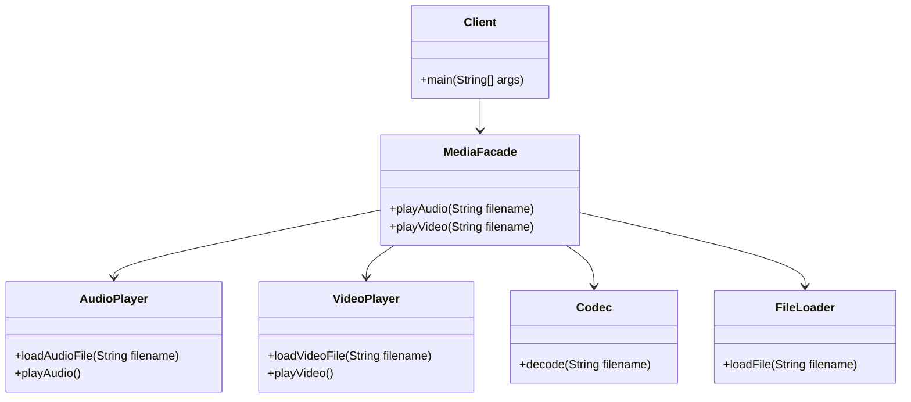

## 4.6.2 Simplifying Complex Subsystems

In the realm of software engineering, complexity is often an unavoidable aspect of developing robust and feature-rich systems. However, managing and mitigating this complexity is crucial for creating maintainable and user-friendly applications. One powerful tool in our arsenal for achieving this is the Facade pattern. This pattern allows us to simplify interactions with complex subsystems by providing a unified and straightforward interface. In this section, we will delve into the intricacies of the Facade pattern, explore its benefits, and demonstrate its implementation in Java.

### Understanding the Facade Pattern

The Facade pattern is a structural design pattern that provides a simplified interface to a complex subsystem. By doing so, it hides the complexities and intricacies of the subsystem from the client, making it easier to use and understand. The Facade pattern is particularly useful when a system is composed of multiple interdependent classes, each with its own set of methods and interfaces.

#### Key Concepts

- **Abstraction**: The Facade pattern abstracts the underlying complexity of the subsystem, presenting a simpler interface to the client.
- **Encapsulation**: It encapsulates the interactions with the subsystem, shielding the client from the details of its implementation.
- **Simplification**: By reducing the number of interactions required to perform a task, the Facade pattern simplifies the client's code.

### Why Use the Facade Pattern?

The primary motivation for using the Facade pattern is to reduce the complexity of interacting with a subsystem. This simplification offers several benefits:

- **Ease of Use**: Clients can perform complex tasks with minimal effort, as the Facade handles the intricate details.
- **Reduced Learning Curve**: New developers can quickly understand and use the system without needing to delve into its complexities.
- **Improved Maintainability**: Changes to the subsystem can be made without affecting the client, as long as the Facade's interface remains consistent.
- **Decoupling**: The Facade pattern decouples the client from the subsystem, allowing for greater flexibility and scalability.

### When to Use the Facade Pattern

Consider using the Facade pattern in the following scenarios:

- **Complex Subsystems**: When a subsystem is composed of multiple classes with complex interactions, a Facade can simplify its usage.
- **Legacy Systems**: If you need to integrate with a legacy system that has a convoluted API, a Facade can provide a cleaner interface.
- **Multiple Clients**: When multiple clients need to interact with a subsystem, a Facade can provide a consistent interface for all of them.

### Example of a Complex Subsystem

Let's consider an example of a complex subsystem: a multimedia library. This library allows clients to play audio and video files, but it requires interaction with multiple classes such as `AudioPlayer`, `VideoPlayer`, `Codec`, and `FileLoader`. Each class has its own methods and interfaces, making it cumbersome for clients to use the library effectively.

```java
// Complex subsystem classes

class AudioPlayer {
    public void loadAudioFile(String filename) {
        System.out.println("Loading audio file: " + filename);
    }

    public void playAudio() {
        System.out.println("Playing audio...");
    }
}

class VideoPlayer {
    public void loadVideoFile(String filename) {
        System.out.println("Loading video file: " + filename);
    }

    public void playVideo() {
        System.out.println("Playing video...");
    }
}

class Codec {
    public void decode(String filename) {
        System.out.println("Decoding file: " + filename);
    }
}

class FileLoader {
    public void loadFile(String filename) {
        System.out.println("Loading file: " + filename);
    }
}
```

### Implementing the Facade Pattern

To simplify the interaction with this multimedia library, we can create a `MediaFacade` class that provides a unified interface for clients to use.

```java
// Facade class

class MediaFacade {
    private AudioPlayer audioPlayer;
    private VideoPlayer videoPlayer;
    private Codec codec;
    private FileLoader fileLoader;

    public MediaFacade() {
        this.audioPlayer = new AudioPlayer();
        this.videoPlayer = new VideoPlayer();
        this.codec = new Codec();
        this.fileLoader = new FileLoader();
    }

    public void playAudio(String filename) {
        fileLoader.loadFile(filename);
        codec.decode(filename);
        audioPlayer.loadAudioFile(filename);
        audioPlayer.playAudio();
    }

    public void playVideo(String filename) {
        fileLoader.loadFile(filename);
        codec.decode(filename);
        videoPlayer.loadVideoFile(filename);
        videoPlayer.playVideo();
    }
}
```

### Simplified Client Interaction

With the `MediaFacade` in place, clients can now interact with the multimedia library using a much simpler interface.

```java
// Client code

public class Client {
    public static void main(String[] args) {
        MediaFacade mediaFacade = new MediaFacade();

        mediaFacade.playAudio("song.mp3");
        mediaFacade.playVideo("movie.mp4");
    }
}
```

### Benefits of Using the Facade Pattern

The Facade pattern provides several benefits to clients interacting with complex subsystems:

- **Simplified Interface**: Clients can perform complex tasks with a single method call, reducing the need for detailed knowledge of the subsystem.
- **Consistency**: The Facade provides a consistent interface for interacting with the subsystem, regardless of its internal changes.
- **Isolation**: Clients are isolated from the subsystem's implementation details, making it easier to refactor or replace components without affecting the client.
- **Improved Readability**: Client code becomes more readable and maintainable, as it focuses on high-level operations rather than low-level details.

### Visualizing the Facade Pattern

To better understand how the Facade pattern simplifies complex subsystems, let's visualize the interaction between the client, the Facade, and the subsystem components.



### Try It Yourself

To deepen your understanding of the Facade pattern, try modifying the `MediaFacade` to include additional functionality, such as pausing or stopping media playback. Consider how you might extend the Facade to support new media formats or additional features.

### Knowledge Check

- **What is the primary purpose of the Facade pattern?**
- **How does the Facade pattern improve maintainability?**
- **In what scenarios is the Facade pattern particularly useful?**

### Conclusion

The Facade pattern is a powerful tool for simplifying complex subsystems and improving the usability of software systems. By providing a unified and straightforward interface, it reduces the complexity of client interactions and enhances maintainability. As you continue to develop and refine your software systems, consider how the Facade pattern can help you manage complexity and create more user-friendly applications.

## Quiz Time!



### What is the primary purpose of the Facade pattern?

- [x] To provide a simplified interface to a complex subsystem.
- [ ] To increase the complexity of a subsystem.
- [ ] To replace the subsystem entirely.
- [ ] To expose all internal details of a subsystem.

> **Explanation:** The Facade pattern aims to simplify interactions with a complex subsystem by providing a unified interface.

### How does the Facade pattern improve maintainability?

- [x] By isolating clients from subsystem changes.
- [ ] By making the subsystem more complex.
- [ ] By requiring clients to understand all subsystem details.
- [ ] By increasing the number of classes in the system.

> **Explanation:** The Facade pattern improves maintainability by isolating clients from the details of the subsystem, allowing changes to be made without affecting the client.

### In what scenarios is the Facade pattern particularly useful?

- [x] When dealing with complex subsystems.
- [x] When integrating with legacy systems.
- [ ] When the subsystem is simple and straightforward.
- [ ] When the client needs to access every detail of the subsystem.

> **Explanation:** The Facade pattern is useful in scenarios where the subsystem is complex or when integrating with legacy systems that have convoluted APIs.

### What is a key benefit of using the Facade pattern?

- [x] It provides a consistent interface for clients.
- [ ] It makes the subsystem more difficult to use.
- [ ] It exposes all internal workings of the subsystem.
- [ ] It increases the learning curve for new developers.

> **Explanation:** A key benefit of the Facade pattern is that it provides a consistent and simplified interface for clients, making the subsystem easier to use.

### How does the Facade pattern affect client code readability?

- [x] It improves readability by focusing on high-level operations.
- [ ] It decreases readability by adding more complexity.
- [ ] It requires clients to understand all subsystem details.
- [ ] It makes client code more verbose.

> **Explanation:** The Facade pattern improves client code readability by allowing clients to focus on high-level operations rather than low-level details.

### Which of the following is NOT a benefit of the Facade pattern?

- [ ] Simplified interface for clients.
- [ ] Isolation from subsystem changes.
- [ ] Improved client code readability.
- [x] Increased complexity for clients.

> **Explanation:** The Facade pattern aims to simplify client interactions, not increase complexity.

### What role does the Facade play in the pattern?

- [x] It acts as a unified interface to the subsystem.
- [ ] It replaces all subsystem components.
- [ ] It exposes all subsystem methods to the client.
- [ ] It increases the number of interactions required by the client.

> **Explanation:** The Facade acts as a unified interface, simplifying interactions with the subsystem.

### How can the Facade pattern help with legacy systems?

- [x] By providing a cleaner interface to interact with the legacy system.
- [ ] By making the legacy system more complex.
- [ ] By requiring clients to understand the legacy system's API.
- [ ] By exposing all legacy system details to the client.

> **Explanation:** The Facade pattern can provide a cleaner and more modern interface for interacting with legacy systems, hiding their complexity.

### What is a common use case for the Facade pattern?

- [x] Simplifying interactions with a multimedia library.
- [ ] Making a simple system more complex.
- [ ] Exposing all details of a database system.
- [ ] Replacing all components of a web server.

> **Explanation:** A common use case for the Facade pattern is simplifying interactions with complex systems like multimedia libraries.

### True or False: The Facade pattern increases the learning curve for new developers.

- [ ] True
- [x] False

> **Explanation:** The Facade pattern reduces the learning curve for new developers by providing a simplified interface to complex subsystems.


