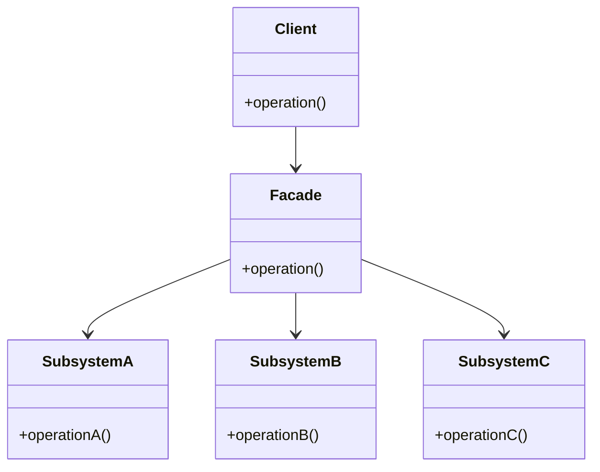
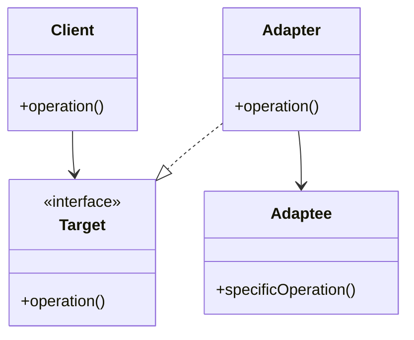

## 4.6.3 Facade vs. Adapter Pattern

In the realm of software design patterns, both the Facade and Adapter patterns play crucial roles in managing and simplifying interactions between classes. However, they serve distinct purposes and are applied in different contexts. This section aims to clarify the differences between these two patterns, providing guidance on when and how to use each effectively.

### Understanding the Facade Pattern

The Facade pattern is a structural design pattern that provides a simplified interface to a complex subsystem. It acts as a front-facing interface masking more complex underlying or structural code. The primary goal of the Facade pattern is to make a system easier to use by offering a single point of interaction.

#### Key Characteristics of the Facade Pattern

- **Simplification**: The Facade pattern simplifies the interface of a complex system, making it easier to use.
- **Unified Interface**: It provides a unified interface to a set of interfaces in a subsystem.
- **Decoupling**: It decouples the client from the subsystem, reducing the dependencies on the complex system.

#### Example Use Case for the Facade Pattern

Consider a home entertainment system with multiple components like a TV, sound system, and gaming console. Each component has its own interface and set of operations. A Facade can be used to provide a single interface to control all these components, simplifying the user interaction.

```java
// Subsystem classes
class Television {
    public void on() { System.out.println("TV is on"); }
    public void off() { System.out.println("TV is off"); }
}

class SoundSystem {
    public void setVolume(int level) { System.out.println("Volume set to " + level); }
}

class GamingConsole {
    public void startGame() { System.out.println("Game started"); }
}

// Facade class
class HomeTheaterFacade {
    private Television tv;
    private SoundSystem soundSystem;
    private GamingConsole gamingConsole;

    public HomeTheaterFacade(Television tv, SoundSystem soundSystem, GamingConsole gamingConsole) {
        this.tv = tv;
        this.soundSystem = soundSystem;
        this.gamingConsole = gamingConsole;
    }

    public void watchMovie() {
        tv.on();
        soundSystem.setVolume(5);
        gamingConsole.startGame();
    }
}

// Client code
public class FacadePatternDemo {
    public static void main(String[] args) {
        Television tv = new Television();
        SoundSystem soundSystem = new SoundSystem();
        GamingConsole gamingConsole = new GamingConsole();

        HomeTheaterFacade homeTheater = new HomeTheaterFacade(tv, soundSystem, gamingConsole);
        homeTheater.watchMovie();
    }
}
```

### Understanding the Adapter Pattern

The Adapter pattern is another structural design pattern that allows incompatible interfaces to work together. It acts as a bridge between two incompatible interfaces by converting the interface of a class into another interface that the client expects.

#### Key Characteristics of the Adapter Pattern

- **Interface Conversion**: The Adapter pattern converts the interface of a class into another interface that the client expects.
- **Compatibility**: It allows classes with incompatible interfaces to work together.
- **Reusability**: It promotes the reuse of existing classes that might otherwise be incompatible.

#### Example Use Case for the Adapter Pattern

Imagine you have a legacy system that outputs data in XML format, but your new system processes data in JSON. An Adapter can be used to convert XML data to JSON format, making the two systems compatible.

```java
// Existing class with an incompatible interface
class XmlData {
    public String getXml() {
        return "<data>XML Data</data>";
    }
}

// Target interface expected by the client
interface JsonData {
    String getJson();
}

// Adapter class
class XmlToJsonAdapter implements JsonData {
    private XmlData xmlData;

    public XmlToJsonAdapter(XmlData xmlData) {
        this.xmlData = xmlData;
    }

    @Override
    public String getJson() {
        // Convert XML to JSON (simplified for illustration)
        return "{ \"data\": \"XML Data\" }";
    }
}

// Client code
public class AdapterPatternDemo {
    public static void main(String[] args) {
        XmlData xmlData = new XmlData();
        JsonData jsonData = new XmlToJsonAdapter(xmlData);

        System.out.println(jsonData.getJson());
    }
}
```

### Structural Differences: Facade vs. Adapter

To further understand the differences between the Facade and Adapter patterns, let's visualize their structures using UML diagrams.

#### Facade Pattern UML Diagram



**Description**: The Facade pattern provides a unified interface to a set of interfaces in a subsystem, simplifying the interaction for the client.

#### Adapter Pattern UML Diagram



**Description**: The Adapter pattern converts the interface of a class into another interface that the client expects, allowing incompatible interfaces to work together.

### When to Use Each Pattern

Understanding when to apply each pattern is crucial for effective software design.

#### When to Use the Facade Pattern

- **Simplification**: Use the Facade pattern when you want to provide a simple interface to a complex subsystem.
- **Decoupling**: Apply it when you want to decouple the client from the subsystem, reducing dependencies.
- **Ease of Use**: It is ideal when you want to make a subsystem easier to use by providing a single point of interaction.

#### When to Use the Adapter Pattern

- **Compatibility**: Use the Adapter pattern when you need to make two incompatible interfaces work together.
- **Reusability**: Apply it when you want to reuse existing classes that might otherwise be incompatible with the system.
- **Interface Conversion**: It is suitable when you need to convert the interface of a class into another interface that the client expects.

### Try It Yourself

To deepen your understanding of these patterns, try modifying the code examples provided:

1. **Facade Pattern**: Extend the `HomeTheaterFacade` class to include more components, such as a DVD player or a streaming device. Implement methods to control these additional components through the Facade.

2. **Adapter Pattern**: Modify the `XmlToJsonAdapter` class to handle more complex XML structures and convert them into JSON format. Experiment with different conversion strategies.

### Visualizing the Differences

To further illustrate the differences between the Facade and Adapter patterns, let's consider a real-world analogy:

- **Facade Pattern**: Think of a universal remote control for your home entertainment system. It provides a single interface to control multiple devices like the TV, sound system, and gaming console, simplifying the user experience.

- **Adapter Pattern**: Consider a power adapter that allows a device with a US plug to be used in a European outlet. It converts the plug interface to be compatible with the outlet, enabling the device to function in a different environment.

### Knowledge Check

Let's reinforce your understanding with a few questions:

- **What is the primary goal of the Facade pattern?**
- **How does the Adapter pattern promote reusability?**
- **In what scenarios would you choose the Facade pattern over the Adapter pattern?**

### Conclusion

In summary, both the Facade and Adapter patterns are valuable tools in a software engineer's toolkit, each serving distinct purposes. The Facade pattern simplifies interactions with complex systems by providing a unified interface, while the Adapter pattern enables compatibility between incompatible interfaces. Understanding their differences and knowing when to apply each pattern will enhance your ability to design robust and maintainable software systems.

## Quiz Time!



### What is the primary purpose of the Facade pattern?

- [x] To provide a simplified interface to a complex subsystem.
- [ ] To convert one interface into another compatible interface.
- [ ] To enhance the performance of a system.
- [ ] To manage the lifecycle of objects in a system.

> **Explanation:** The Facade pattern is designed to provide a simplified interface to a complex subsystem, making it easier to use.

### How does the Adapter pattern promote reusability?

- [x] By allowing incompatible interfaces to work together.
- [ ] By providing a unified interface to a set of interfaces.
- [ ] By simplifying the interaction with a subsystem.
- [ ] By managing the lifecycle of objects.

> **Explanation:** The Adapter pattern promotes reusability by allowing existing classes with incompatible interfaces to be used in new contexts.

### In what scenario would you choose the Facade pattern over the Adapter pattern?

- [x] When you want to simplify the interaction with a complex subsystem.
- [ ] When you need to convert one interface into another.
- [ ] When you need to enhance performance.
- [ ] When you need to manage object lifecycles.

> **Explanation:** The Facade pattern is chosen when the goal is to simplify the interaction with a complex subsystem.

### What is a key difference between the Facade and Adapter patterns?

- [x] Facade simplifies a set of interfaces, while Adapter converts one interface into another.
- [ ] Facade enhances performance, while Adapter simplifies interfaces.
- [ ] Facade manages object lifecycles, while Adapter enhances performance.
- [ ] Facade and Adapter serve the same purpose.

> **Explanation:** The key difference is that the Facade pattern simplifies a set of interfaces, while the Adapter pattern converts one interface into another.

### Which pattern would you use to integrate a legacy system with a new system?

- [x] Adapter Pattern
- [ ] Facade Pattern
- [ ] Singleton Pattern
- [ ] Observer Pattern

> **Explanation:** The Adapter pattern is used to integrate a legacy system with a new system by converting incompatible interfaces.

### What does the Facade pattern primarily focus on?

- [x] Simplifying the interface of a complex system.
- [ ] Converting one interface into another.
- [ ] Enhancing system performance.
- [ ] Managing object lifecycles.

> **Explanation:** The Facade pattern focuses on simplifying the interface of a complex system.

### What is the main benefit of using the Adapter pattern?

- [x] It allows incompatible interfaces to work together.
- [ ] It simplifies the interaction with a subsystem.
- [ ] It enhances system performance.
- [ ] It manages object lifecycles.

> **Explanation:** The main benefit of the Adapter pattern is that it allows incompatible interfaces to work together.

### Which pattern would you use to provide a single point of interaction for a complex system?

- [x] Facade Pattern
- [ ] Adapter Pattern
- [ ] Observer Pattern
- [ ] Singleton Pattern

> **Explanation:** The Facade pattern is used to provide a single point of interaction for a complex system.

### Can the Adapter pattern be used to convert incompatible interfaces in a system?

- [x] True
- [ ] False

> **Explanation:** True, the Adapter pattern is specifically designed to convert incompatible interfaces in a system.

### Which pattern would you use to make a system easier to use by providing a single point of interaction?

- [x] Facade Pattern
- [ ] Adapter Pattern
- [ ] Observer Pattern
- [ ] Singleton Pattern

> **Explanation:** The Facade pattern is used to make a system easier to use by providing a single point of interaction.


