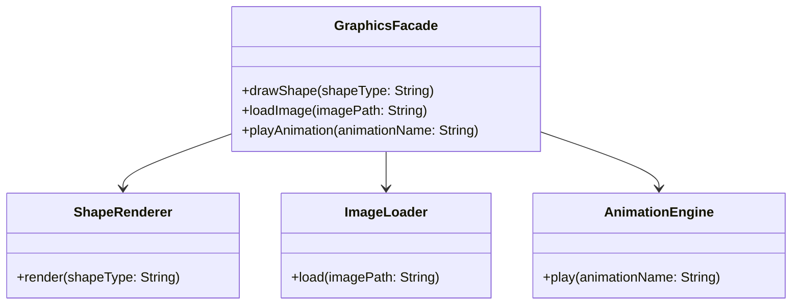

## 4.6.4 Use Cases and Examples

The Facade pattern is a structural design pattern that provides a simplified interface to a complex subsystem. It is particularly useful in scenarios where a system is composed of multiple interdependent classes or modules, and you want to provide a more straightforward interface for client interactions. In this section, we will explore various real-world use cases where the Facade pattern can be effectively applied, discuss the benefits it brings, and provide detailed code examples to illustrate its implementation in Java.

### Simplifying Complex Libraries or Frameworks

#### Scenario: Simplifying a Graphics Library

Imagine you are working with a graphics library that provides a wide range of functionalities for rendering shapes, images, and animations. This library might have multiple classes, each responsible for different aspects of rendering, such as `ShapeRenderer`, `ImageLoader`, `AnimationEngine`, and more. For a developer who wants to perform basic operations like drawing a shape or loading an image, interacting with all these classes can be overwhelming.

**Solution with Facade Pattern:**

By implementing a Facade, you can create a single class, `GraphicsFacade`, that provides high-level methods for common tasks, such as `drawShape()`, `loadImage()`, and `playAnimation()`. This facade interacts with the underlying classes, hiding their complexity from the client.

```java
public class GraphicsFacade {
    private ShapeRenderer shapeRenderer;
    private ImageLoader imageLoader;
    private AnimationEngine animationEngine;

    public GraphicsFacade() {
        this.shapeRenderer = new ShapeRenderer();
        this.imageLoader = new ImageLoader();
        this.animationEngine = new AnimationEngine();
    }

    public void drawShape(String shapeType) {
        shapeRenderer.render(shapeType);
    }

    public void loadImage(String imagePath) {
        imageLoader.load(imagePath);
    }

    public void playAnimation(String animationName) {
        animationEngine.play(animationName);
    }
}

// Usage
GraphicsFacade graphics = new GraphicsFacade();
graphics.drawShape("Circle");
graphics.loadImage("path/to/image.png");
graphics.playAnimation("Bounce");
```

**Benefits:**

- **Reduced Complexity:** Clients interact with a single interface rather than multiple classes.
- **Improved Usability:** Simplifies the API, making it easier for developers to use the library.
- **Encapsulation:** Hides the details of the subsystem, allowing for changes without affecting clients.

### Unified API for Different Modules

#### Scenario: Integrating Payment Gateways

In an e-commerce application, you might need to integrate multiple payment gateways, such as PayPal, Stripe, and Square. Each gateway has its own API, and handling them individually can lead to complex and error-prone code.

**Solution with Facade Pattern:**

Create a `PaymentFacade` that provides a unified interface for processing payments, regardless of the underlying gateway. This facade can handle the differences in API calls and data formats internally.

```java
public class PaymentFacade {
    private PayPalGateway payPal;
    private StripeGateway stripe;
    private SquareGateway square;

    public PaymentFacade() {
        this.payPal = new PayPalGateway();
        this.stripe = new StripeGateway();
        this.square = new SquareGateway();
    }

    public void processPayment(String gateway, double amount) {
        switch (gateway) {
            case "PayPal":
                payPal.processPayment(amount);
                break;
            case "Stripe":
                stripe.processPayment(amount);
                break;
            case "Square":
                square.processPayment(amount);
                break;
            default:
                throw new IllegalArgumentException("Unsupported gateway");
        }
    }
}

// Usage
PaymentFacade paymentFacade = new PaymentFacade();
paymentFacade.processPayment("PayPal", 100.00);
```

**Benefits:**

- **Consistency:** Provides a consistent interface for different payment gateways.
- **Flexibility:** Makes it easier to add or remove gateways without affecting client code.
- **Maintenance:** Centralizes payment processing logic, simplifying maintenance.

### Encapsulating Network Communication Protocols

#### Scenario: Simplifying Network Operations

Consider a scenario where your application needs to communicate with a remote server using various protocols, such as HTTP, FTP, and WebSocket. Each protocol requires different setup and handling, which can complicate the codebase.

**Solution with Facade Pattern:**

Implement a `NetworkFacade` that abstracts the details of each protocol, providing simple methods for common operations like `sendData()` and `receiveData()`.

```java
public class NetworkFacade {
    private HttpClient httpClient;
    private FtpClient ftpClient;
    private WebSocketClient webSocketClient;

    public NetworkFacade() {
        this.httpClient = new HttpClient();
        this.ftpClient = new FtpClient();
        this.webSocketClient = new WebSocketClient();
    }

    public void sendData(String protocol, String data) {
        switch (protocol) {
            case "HTTP":
                httpClient.send(data);
                break;
            case "FTP":
                ftpClient.upload(data);
                break;
            case "WebSocket":
                webSocketClient.send(data);
                break;
            default:
                throw new IllegalArgumentException("Unsupported protocol");
        }
    }

    public String receiveData(String protocol) {
        switch (protocol) {
            case "HTTP":
                return httpClient.receive();
            case "FTP":
                return ftpClient.download();
            case "WebSocket":
                return webSocketClient.receive();
            default:
                throw new IllegalArgumentException("Unsupported protocol");
        }
    }
}

// Usage
NetworkFacade networkFacade = new NetworkFacade();
networkFacade.sendData("HTTP", "Hello, World!");
String response = networkFacade.receiveData("HTTP");
```

**Benefits:**

- **Simplified Communication:** Provides a straightforward interface for network operations.
- **Protocol Abstraction:** Hides the complexity of different protocols from the client.
- **Ease of Use:** Makes it easier for developers to implement network features without deep protocol knowledge.

### Visualizing the Facade Pattern

To further illustrate the Facade pattern, let's visualize how it interacts with the underlying subsystems using a class diagram.



**Diagram Description:**

- **GraphicsFacade**: Acts as the facade, providing simplified methods for drawing shapes, loading images, and playing animations.
- **ShapeRenderer, ImageLoader, AnimationEngine**: Represent the complex subsystems that the facade interacts with.

### Additional Use Cases

#### Simplifying Database Access

In applications that interact with databases, the Facade pattern can be used to simplify database operations. A `DatabaseFacade` can provide methods for common tasks like `executeQuery()`, `insertRecord()`, and `updateRecord()`, abstracting the complexity of database connections and SQL statements.

#### Unified Logging System

For applications that require logging to multiple destinations (e.g., console, file, remote server), a `LoggingFacade` can provide a unified interface for logging messages. This facade can internally handle the different logging mechanisms and formats.

#### Encapsulating External APIs

When integrating with external APIs, such as social media platforms or cloud services, the Facade pattern can be used to encapsulate API calls and data transformations. This approach simplifies the client's interaction with the API and makes it easier to switch providers if needed.

### Try It Yourself

Now that we've explored various use cases of the Facade pattern, let's encourage you to experiment with it. Consider a complex subsystem in your current project and try to implement a facade for it. Here are some ideas to get you started:

- **Create a Facade for a Messaging System:** If your application supports multiple messaging protocols (e.g., SMS, email, push notifications), implement a facade to provide a unified interface for sending messages.
- **Simplify File Operations:** If your application performs various file operations (e.g., reading, writing, compressing), create a facade to streamline these tasks.
- **Encapsulate a Machine Learning Library:** If you're using a machine learning library with numerous classes and methods, implement a facade to simplify model training and prediction tasks.

### Knowledge Check

Before we conclude, let's reinforce what we've learned with some questions:

- What are the primary benefits of using the Facade pattern?
- How does the Facade pattern improve maintainability and usability?
- Can the Facade pattern be used to simplify interactions with external APIs? How?

### Conclusion

The Facade pattern is a powerful tool for simplifying complex systems and providing a more user-friendly interface for clients. By encapsulating the intricacies of subsystems, it enhances maintainability, usability, and flexibility. As you continue to develop software, consider the Facade pattern whenever you encounter complex interactions that could benefit from a simplified interface.

Remember, this is just the beginning. As you progress, you'll discover more opportunities to apply the Facade pattern and other design patterns to create robust, maintainable, and user-friendly software. Keep experimenting, stay curious, and enjoy the journey!

## Quiz Time!



### What is the main purpose of the Facade pattern?

- [x] To provide a simplified interface to a complex subsystem
- [ ] To enhance the performance of a system
- [ ] To create a new subsystem
- [ ] To replace existing subsystems

> **Explanation:** The Facade pattern is designed to provide a simplified interface to a complex subsystem, making it easier for clients to interact with it.

### How does the Facade pattern improve maintainability?

- [x] By centralizing complex interactions in one place
- [ ] By increasing the number of classes
- [ ] By making the system more complex
- [ ] By removing all subsystems

> **Explanation:** The Facade pattern centralizes complex interactions, which simplifies maintenance by reducing the number of places where changes need to be made.

### In which scenario is the Facade pattern most useful?

- [x] When a system has multiple interdependent classes
- [ ] When a system has only one class
- [ ] When a system is already simple
- [ ] When a system does not require any interaction

> **Explanation:** The Facade pattern is most useful when a system has multiple interdependent classes, as it provides a simplified interface for client interactions.

### What is a potential benefit of using a Facade for network communication?

- [x] Simplified communication with different protocols
- [ ] Increased network latency
- [ ] More complex client code
- [ ] Direct access to all protocols

> **Explanation:** A Facade can simplify communication by providing a unified interface for different network protocols, making it easier for clients to use.

### Can the Facade pattern be used to integrate multiple payment gateways?

- [x] Yes, it can provide a unified interface for different gateways
- [ ] No, it cannot handle multiple gateways
- [ ] Yes, but it requires significant changes to each gateway
- [ ] No, it is only for single gateway systems

> **Explanation:** The Facade pattern can be used to integrate multiple payment gateways by providing a unified interface that handles the differences in API calls and data formats.

### What is a key characteristic of a Facade class?

- [x] It provides high-level methods for common tasks
- [ ] It exposes all the details of the subsystem
- [ ] It replaces the subsystem entirely
- [ ] It duplicates the functionality of the subsystem

> **Explanation:** A Facade class provides high-level methods for common tasks, simplifying the client's interaction with the subsystem.

### How does the Facade pattern enhance usability?

- [x] By providing a straightforward interface for complex systems
- [ ] By making the system more complex
- [ ] By reducing the number of available features
- [ ] By increasing the number of classes

> **Explanation:** The Facade pattern enhances usability by providing a straightforward interface for complex systems, making it easier for clients to use.

### What is the role of a Facade in a logging system?

- [x] To provide a unified interface for logging to multiple destinations
- [ ] To increase the complexity of logging
- [ ] To remove logging functionality
- [ ] To expose all logging mechanisms

> **Explanation:** In a logging system, a Facade can provide a unified interface for logging to multiple destinations, simplifying the client's interaction with the logging system.

### Which of the following is NOT a benefit of the Facade pattern?

- [ ] Simplified client interactions
- [ ] Improved maintainability
- [x] Increased system complexity
- [ ] Encapsulation of subsystem details

> **Explanation:** The Facade pattern reduces system complexity by simplifying client interactions and encapsulating subsystem details, not increasing it.

### True or False: The Facade pattern can be used to encapsulate external APIs.

- [x] True
- [ ] False

> **Explanation:** True. The Facade pattern can be used to encapsulate external APIs, providing a simplified interface for client interactions.


