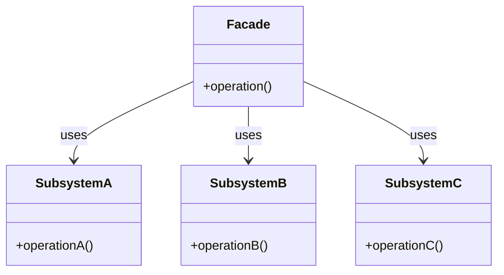
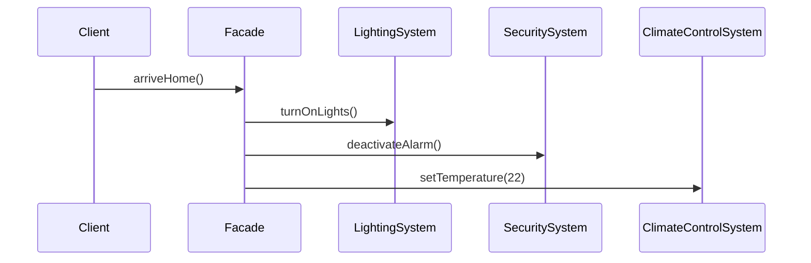

## 4.6 Facade Pattern

In the realm of software engineering, complexity is often an unavoidable aspect of developing robust applications. As systems grow, they tend to become intricate, with numerous components interacting with each other. This complexity can make it challenging for clients to interact with the system effectively. Enter the **Facade Pattern**—a structural design pattern that provides a simplified, unified interface to a complex subsystem, thereby making it easier for clients to interact with the system.

### Understanding the Facade Pattern

The Facade Pattern is all about abstraction and simplification. It acts as a front-facing interface masking more complex underlying or structural code. Think of it as a facade on a building, which hides the intricate details of the structure behind it, presenting a simple and unified appearance to the outside world.

#### Intent of the Facade Pattern

The primary intent of the Facade Pattern is to:

- **Simplify Client Interaction**: By providing a single entry point to a complex subsystem, the facade reduces the number of interfaces that clients need to interact with.
- **Reduce Dependencies**: It minimizes the dependencies of the client code on the internal workings of the subsystem, promoting loose coupling.
- **Improve Usability**: By hiding the complexities of the subsystem, the facade makes the system easier to use and understand.

### The Problem Facade Pattern Solves

In large systems, clients often need to interact with multiple components to perform a single task. This can lead to:

- **Complexity in Client Code**: Clients need to understand and interact with multiple interfaces, which can complicate the code and increase the likelihood of errors.
- **Tight Coupling**: Direct interaction with subsystem components can lead to tight coupling, making the system difficult to maintain and extend.
- **Reduced Maintainability**: Changes in the subsystem may require changes in the client code, leading to higher maintenance costs.

The Facade Pattern addresses these issues by providing a simplified interface that abstracts the complexities of the subsystem.

### Structure of the Facade Pattern

The Facade Pattern typically involves the following components:

- **Facade**: The main class that provides a simplified interface to the subsystem.
- **Subsystem Classes**: The complex components that the facade interacts with and abstracts from the client.

#### UML Diagram of the Facade Pattern

Below is a UML diagram illustrating the Facade Pattern:



In this diagram, the `Facade` class interacts with multiple subsystem classes (`SubsystemA`, `SubsystemB`, and `SubsystemC`). The client interacts only with the `Facade`, which simplifies the interaction by hiding the complexities of the subsystems.

### Promoting Loose Coupling with the Facade Pattern

The Facade Pattern promotes loose coupling in several ways:

- **Single Point of Interaction**: Clients interact with the facade rather than multiple subsystem classes, reducing the number of dependencies.
- **Encapsulation of Subsystem Complexity**: The facade encapsulates the complex interactions between subsystem components, presenting a simple interface to the client.
- **Ease of Maintenance**: Changes in the subsystem do not affect the client code, as long as the facade interface remains unchanged.

### Practical Implementation Strategies

Implementing the Facade Pattern involves creating a facade class that provides a simplified interface to the subsystem. Here are some practical strategies to consider:

1. **Identify the Subsystem Components**: Determine the components that the facade will interact with and abstract.
2. **Define the Facade Interface**: Create a facade class with methods that provide the desired functionality by internally calling the appropriate subsystem methods.
3. **Implement the Facade Methods**: In the facade methods, implement the logic to coordinate the subsystem components and provide the simplified functionality.

#### Example: Simplifying API Usage with the Facade Pattern

Consider a scenario where we have a complex system for managing a home automation system. The system involves multiple components like lighting, security, and climate control. The facade pattern can simplify the interaction with this system.

```java
// Subsystem classes
class LightingSystem {
    void turnOnLights() {
        System.out.println("Lights are turned on.");
    }
    void turnOffLights() {
        System.out.println("Lights are turned off.");
    }
}

class SecuritySystem {
    void activateAlarm() {
        System.out.println("Security alarm activated.");
    }
    void deactivateAlarm() {
        System.out.println("Security alarm deactivated.");
    }
}

class ClimateControlSystem {
    void setTemperature(int temperature) {
        System.out.println("Temperature set to " + temperature + " degrees.");
    }
}

// Facade class
class HomeAutomationFacade {
    private LightingSystem lighting;
    private SecuritySystem security;
    private ClimateControlSystem climate;

    public HomeAutomationFacade() {
        this.lighting = new LightingSystem();
        this.security = new SecuritySystem();
        this.climate = new ClimateControlSystem();
    }

    public void leaveHome() {
        lighting.turnOffLights();
        security.activateAlarm();
        climate.setTemperature(18);
        System.out.println("Home is set for leaving.");
    }

    public void arriveHome() {
        lighting.turnOnLights();
        security.deactivateAlarm();
        climate.setTemperature(22);
        System.out.println("Welcome home!");
    }
}

// Client code
public class FacadePatternDemo {
    public static void main(String[] args) {
        HomeAutomationFacade homeFacade = new HomeAutomationFacade();
        homeFacade.leaveHome();
        homeFacade.arriveHome();
    }
}
```

In this example, the `HomeAutomationFacade` class provides a simplified interface to the complex home automation system. The client interacts only with the facade, which internally manages the interactions with the `LightingSystem`, `SecuritySystem`, and `ClimateControlSystem`.

### Benefits of the Facade Pattern

The Facade Pattern offers several benefits:

- **Simplifies Client Code**: By providing a single interface, the facade reduces the complexity of client code.
- **Reduces System Dependencies**: Clients are decoupled from the subsystem, reducing dependencies and enhancing maintainability.
- **Improves Usability**: The facade makes the system easier to use by hiding the complexities of the subsystem.

### When to Use the Facade Pattern

The Facade Pattern is particularly useful in scenarios where:

- You have a complex subsystem with multiple components that clients need to interact with.
- You want to provide a simple interface to a complex system to improve usability.
- You want to reduce the dependencies of client code on the subsystem.

### Try It Yourself

To better understand the Facade Pattern, try modifying the example code:

- Add a new subsystem class, such as `EntertainmentSystem`, and extend the `HomeAutomationFacade` to include methods for controlling it.
- Experiment with different configurations of the facade to see how it affects client code complexity.

### Visualizing the Facade Pattern

To further enhance your understanding, let's visualize the interaction between the facade and the subsystem using a sequence diagram:



This sequence diagram illustrates how the `Client` interacts with the `Facade`, which in turn coordinates the actions of the `LightingSystem`, `SecuritySystem`, and `ClimateControlSystem`.

### Conclusion

The Facade Pattern is a powerful tool for managing complexity in software systems. By providing a simplified interface to a complex subsystem, it enhances usability, reduces dependencies, and promotes loose coupling. As you continue your journey in software design, consider the Facade Pattern as a valuable strategy for managing complexity and improving the maintainability of your systems.

Remember, this is just the beginning. As you progress, you'll build more complex and interactive systems. Keep experimenting, stay curious, and enjoy the journey!

## Quiz Time!



### What is the primary intent of the Facade Pattern?

- [x] To provide a simplified interface to a complex subsystem
- [ ] To increase the complexity of the client code
- [ ] To tightly couple the client with the subsystem
- [ ] To expose all subsystem components to the client

> **Explanation:** The primary intent of the Facade Pattern is to provide a simplified interface to a complex subsystem, making it easier for clients to interact with the system.

### Which of the following is NOT a benefit of using the Facade Pattern?

- [ ] Simplifies client code
- [ ] Reduces system dependencies
- [x] Increases the number of interfaces the client interacts with
- [ ] Improves usability

> **Explanation:** The Facade Pattern simplifies client code, reduces system dependencies, and improves usability by providing a single interface to the subsystem. It does not increase the number of interfaces the client interacts with.

### In the Facade Pattern, what role does the Facade class play?

- [x] It provides a simplified interface to the subsystem
- [ ] It exposes all subsystem details to the client
- [ ] It replaces the subsystem components
- [ ] It complicates the client interaction with the subsystem

> **Explanation:** The Facade class provides a simplified interface to the subsystem, hiding the complexities from the client.

### How does the Facade Pattern promote loose coupling?

- [x] By reducing the number of dependencies between the client and the subsystem
- [ ] By increasing the complexity of the subsystem
- [ ] By exposing all subsystem components to the client
- [ ] By tightly coupling the client with the subsystem

> **Explanation:** The Facade Pattern promotes loose coupling by reducing the number of dependencies between the client and the subsystem, allowing changes in the subsystem without affecting the client code.

### Which of the following scenarios is the Facade Pattern particularly useful for?

- [x] Simplifying API usage
- [ ] Increasing the complexity of client code
- [ ] Tightly coupling the client with the subsystem
- [ ] Exposing all subsystem components to the client

> **Explanation:** The Facade Pattern is particularly useful for simplifying API usage by providing a single interface to a complex subsystem.

### What is a key characteristic of the Facade Pattern?

- [x] It provides a single point of interaction for the client
- [ ] It increases the number of interfaces the client interacts with
- [ ] It exposes all subsystem details to the client
- [ ] It complicates the client interaction with the subsystem

> **Explanation:** A key characteristic of the Facade Pattern is that it provides a single point of interaction for the client, simplifying the interaction with the subsystem.

### In the provided example, what does the `HomeAutomationFacade` class do?

- [x] It provides a simplified interface to control the home automation system
- [ ] It exposes all details of the home automation system to the client
- [ ] It replaces the subsystem components
- [ ] It complicates the client interaction with the home automation system

> **Explanation:** The `HomeAutomationFacade` class provides a simplified interface to control the home automation system, hiding the complexities from the client.

### What is the role of subsystem classes in the Facade Pattern?

- [x] They perform the actual work and are hidden behind the facade
- [ ] They provide the simplified interface to the client
- [ ] They replace the facade
- [ ] They complicate the client interaction with the subsystem

> **Explanation:** Subsystem classes perform the actual work and are hidden behind the facade, which provides the simplified interface to the client.

### Which design principle does the Facade Pattern adhere to?

- [x] Encapsulation
- [ ] Inheritance
- [ ] Polymorphism
- [ ] Abstraction

> **Explanation:** The Facade Pattern adheres to the principle of encapsulation by hiding the complexities of the subsystem behind a simplified interface.

### True or False: The Facade Pattern can be used to tightly couple the client with the subsystem.

- [ ] True
- [x] False

> **Explanation:** False. The Facade Pattern is used to reduce dependencies and promote loose coupling between the client and the subsystem.


