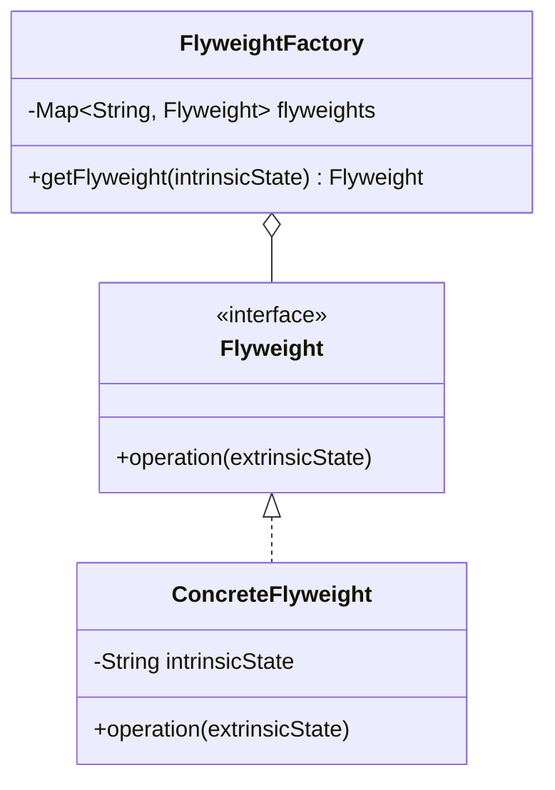

## 4.7.1 Implementing Flyweight in Java

The Flyweight pattern is a structural design pattern aimed at minimizing memory usage by sharing as much data as possible with similar objects. This pattern is particularly useful when dealing with a large number of objects that share common data. In this section, we will explore how to implement the Flyweight pattern in Java, focusing on separating intrinsic and extrinsic states, using a FlyweightFactory, and addressing thread safety concerns.

### Understanding the Flyweight Pattern

The Flyweight pattern is all about sharing. It allows you to create a large number of objects without consuming a lot of memory. The key idea is to separate the intrinsic state, which is shared among objects, from the extrinsic state, which is unique to each object.

#### Intrinsic vs. Extrinsic State

- **Intrinsic State**: This is the shared state that is common across many objects. It is stored in the flyweight object and is immutable, meaning it does not change over time.
- **Extrinsic State**: This is the unique state that varies from object to object. It is not stored in the flyweight object and must be supplied by the client code.

### Implementing the Flyweight Pattern in Java

Let's dive into a step-by-step guide to implementing the Flyweight pattern in Java.

#### Step 1: Define the Flyweight Interface

The first step is to define an interface for the flyweight objects. This interface will declare methods that accept extrinsic state as arguments.

```java
public interface Flyweight {
    void operation(String extrinsicState);
}
```

#### Step 2: Create Concrete Flyweight Classes

Next, implement the Flyweight interface in concrete classes. These classes will store the intrinsic state and use the extrinsic state provided by the client.

```java
public class ConcreteFlyweight implements Flyweight {
    private final String intrinsicState;

    public ConcreteFlyweight(String intrinsicState) {
        this.intrinsicState = intrinsicState;
    }

    @Override
    public void operation(String extrinsicState) {
        System.out.println("Intrinsic State: " + intrinsicState + ", Extrinsic State: " + extrinsicState);
    }
}
```

#### Step 3: Implement the Flyweight Factory

The FlyweightFactory is responsible for creating and managing flyweight objects. It ensures that flyweights are shared properly.

```java
import java.util.HashMap;
import java.util.Map;

public class FlyweightFactory {
    private final Map<String, Flyweight> flyweights = new HashMap<>();

    public Flyweight getFlyweight(String intrinsicState) {
        if (!flyweights.containsKey(intrinsicState)) {
            flyweights.put(intrinsicState, new ConcreteFlyweight(intrinsicState));
        }
        return flyweights.get(intrinsicState);
    }
}
```

#### Step 4: Use the Flyweight Pattern

Now, let's see how to use the Flyweight pattern in a client application.

```java
public class FlyweightPatternDemo {
    public static void main(String[] args) {
        FlyweightFactory factory = new FlyweightFactory();

        Flyweight flyweight1 = factory.getFlyweight("SharedState1");
        flyweight1.operation("UniqueStateA");

        Flyweight flyweight2 = factory.getFlyweight("SharedState1");
        flyweight2.operation("UniqueStateB");

        Flyweight flyweight3 = factory.getFlyweight("SharedState2");
        flyweight3.operation("UniqueStateC");

        // Verify that flyweight1 and flyweight2 are the same instance
        System.out.println("flyweight1 and flyweight2 are the same instance: " + (flyweight1 == flyweight2));
    }
}
```

### Thread Safety Considerations

When implementing the Flyweight pattern in a multi-threaded environment, thread safety becomes a crucial consideration. The FlyweightFactory must be designed to handle concurrent access, ensuring that flyweights are created and shared safely.

#### Ensuring Thread Safety

To make the FlyweightFactory thread-safe, you can use synchronization mechanisms or concurrent collections provided by Java.

```java
import java.util.concurrent.ConcurrentHashMap;
import java.util.concurrent.ConcurrentMap;

public class ThreadSafeFlyweightFactory {
    private final ConcurrentMap<String, Flyweight> flyweights = new ConcurrentHashMap<>();

    public Flyweight getFlyweight(String intrinsicState) {
        return flyweights.computeIfAbsent(intrinsicState, ConcreteFlyweight::new);
    }
}
```

### Best Practices for Efficient Memory Usage

1. **Minimize Intrinsic State**: Keep the intrinsic state as small as possible to maximize sharing.
2. **Immutable Flyweights**: Ensure that flyweight objects are immutable to prevent unintended modifications.
3. **Use Weak References**: Consider using weak references to allow garbage collection of unused flyweights.
4. **Profile and Optimize**: Use profiling tools to identify memory usage patterns and optimize accordingly.

### Visualizing the Flyweight Pattern

To better understand how the Flyweight pattern works, let's visualize the relationship between the FlyweightFactory, flyweight objects, and client code.



### Try It Yourself

Experiment with the Flyweight pattern by modifying the code examples:

- **Change Intrinsic State**: Add more intrinsic states and observe how the FlyweightFactory manages them.
- **Add New Flyweight Types**: Implement additional flyweight classes with different intrinsic states.
- **Test Thread Safety**: Simulate concurrent access to the FlyweightFactory and ensure it behaves correctly.

### References and Further Reading

- [Java Concurrency in Practice](https://www.oreilly.com/library/view/java-concurrency-in/0321349601/)
- [Design Patterns: Elements of Reusable Object-Oriented Software](https://www.amazon.com/Design-Patterns-Elements-Reusable-Object-Oriented/dp/0201633612)

### Knowledge Check

- What is the primary purpose of the Flyweight pattern?
- How do you separate intrinsic and extrinsic states in the Flyweight pattern?
- What are some best practices for implementing the Flyweight pattern in Java?

### Embrace the Journey

Remember, mastering design patterns like Flyweight is a journey. As you apply these patterns, you'll gain insights into optimizing memory usage and enhancing application performance. Keep experimenting, stay curious, and enjoy the process!

## Quiz Time!



### What is the primary purpose of the Flyweight pattern?

- [x] To minimize memory usage by sharing common data among objects.
- [ ] To enhance security by encapsulating data.
- [ ] To simplify code by reducing the number of classes.
- [ ] To improve performance by parallelizing tasks.

> **Explanation:** The Flyweight pattern is designed to minimize memory usage by sharing as much data as possible with similar objects.

### In the Flyweight pattern, what is the intrinsic state?

- [x] The shared state that is common across many objects.
- [ ] The unique state that varies from object to object.
- [ ] The state that is stored in the client code.
- [ ] The state that is mutable and changes over time.

> **Explanation:** The intrinsic state is the shared state that is common across many objects and is stored in the flyweight object.

### How can you ensure thread safety when implementing the Flyweight pattern in Java?

- [x] Use synchronization mechanisms or concurrent collections.
- [ ] Store all state in local variables.
- [ ] Avoid using any shared objects.
- [ ] Use static methods for all operations.

> **Explanation:** To ensure thread safety, you can use synchronization mechanisms or concurrent collections to manage access to shared flyweight objects.

### What is a best practice for efficient memory usage in the Flyweight pattern?

- [x] Minimize the intrinsic state to maximize sharing.
- [ ] Store all data in the extrinsic state.
- [ ] Use mutable flyweight objects.
- [ ] Avoid using a FlyweightFactory.

> **Explanation:** Minimizing the intrinsic state helps maximize sharing and efficient memory usage.

### Which of the following is true about flyweight objects?

- [x] They should be immutable.
- [ ] They should store extrinsic state.
- [x] They can be shared among multiple clients.
- [ ] They should be created for each client request.

> **Explanation:** Flyweight objects should be immutable and can be shared among multiple clients to optimize memory usage.

### What role does the FlyweightFactory play in the Flyweight pattern?

- [x] It manages and shares flyweight instances.
- [ ] It creates unique objects for each client.
- [ ] It stores extrinsic state for flyweights.
- [ ] It handles client requests directly.

> **Explanation:** The FlyweightFactory is responsible for managing and sharing flyweight instances to ensure efficient memory usage.

### How does the Flyweight pattern improve performance?

- [x] By reducing memory consumption through shared data.
- [ ] By increasing the number of classes in the system.
- [ ] By simplifying the code structure.
- [ ] By parallelizing tasks across multiple threads.

> **Explanation:** The Flyweight pattern improves performance by reducing memory consumption through shared data among objects.

### What is the extrinsic state in the Flyweight pattern?

- [x] The unique state that varies from object to object.
- [ ] The shared state common across many objects.
- [ ] The state stored in the FlyweightFactory.
- [ ] The state that is immutable and shared.

> **Explanation:** The extrinsic state is the unique state that varies from object to object and is not stored in the flyweight object.

### Why is it important to separate intrinsic and extrinsic states in the Flyweight pattern?

- [x] To maximize sharing and minimize memory usage.
- [ ] To simplify the FlyweightFactory implementation.
- [ ] To ensure all objects are unique.
- [ ] To enhance security by encapsulating data.

> **Explanation:** Separating intrinsic and extrinsic states allows for maximum sharing of common data, minimizing memory usage.

### True or False: Flyweight objects should be mutable to allow for flexible state changes.

- [ ] True
- [x] False

> **Explanation:** Flyweight objects should be immutable to ensure they can be safely shared among multiple clients without unintended modifications.


