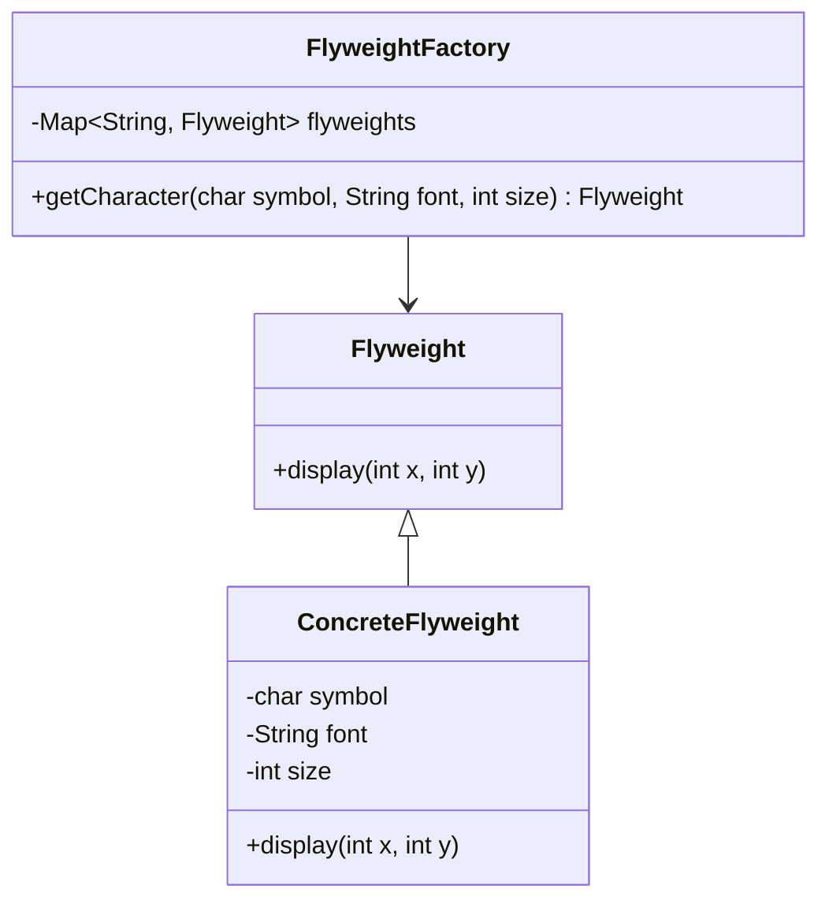

## 4.7.2 Intrinsic vs. Extrinsic State

In the realm of software design patterns, the Flyweight pattern stands out for its ability to optimize memory usage by sharing as much data as possible with similar objects. This pattern is particularly beneficial when dealing with a large number of objects that share common data. The key to the Flyweight pattern's efficiency lies in its separation of intrinsic and extrinsic states. Understanding these concepts is crucial for effectively implementing the Flyweight pattern in Java.

### Understanding Intrinsic and Extrinsic State

#### Intrinsic State

Intrinsic state refers to the information that is shared and stored within the flyweight itself. This state is invariant and independent of the flyweight's context. In other words, intrinsic state is the data that remains constant across different instances of the flyweight. By storing this shared data in a single location, the Flyweight pattern minimizes memory usage.

**Example of Intrinsic State:**

Consider a text editor that needs to display a large number of characters on the screen. Each character can be represented as a flyweight object. The intrinsic state of a character might include its font, style, and size, which are common to many instances of the character.

```java
public class CharacterFlyweight {
    private final char symbol;
    private final String font;
    private final int size;

    public CharacterFlyweight(char symbol, String font, int size) {
        this.symbol = symbol;
        this.font = font;
        this.size = size;
    }

    public void display(int x, int y) {
        // Display character at the given position
        System.out.println("Displaying " + symbol + " at (" + x + ", " + y + ") with font " + font + " and size " + size);
    }
}
```

In this example, `symbol`, `font`, and `size` are intrinsic states because they are shared among multiple instances of the same character.

#### Extrinsic State

Extrinsic state, on the other hand, is context-specific information that is supplied by the client. This state is not stored within the flyweight but is passed to it when needed. Extrinsic state allows the flyweight to be used in different contexts without duplicating the shared data.

**Example of Extrinsic State:**

Continuing with the text editor example, the extrinsic state for a character might include its position on the screen. This information is unique to each instance of the character and is provided by the client when the character is displayed.

```java
public class CharacterClient {
    public static void main(String[] args) {
        CharacterFlyweightFactory factory = new CharacterFlyweightFactory();
        
        CharacterFlyweight a = factory.getCharacter('A', "Arial", 12);
        a.display(10, 20); // Extrinsic state: position (10, 20)

        CharacterFlyweight b = factory.getCharacter('B', "Arial", 12);
        b.display(15, 25); // Extrinsic state: position (15, 25)

        CharacterFlyweight a2 = factory.getCharacter('A', "Arial", 12);
        a2.display(30, 40); // Extrinsic state: position (30, 40)
    }
}
```

In this example, the position `(x, y)` is the extrinsic state provided by the client when calling the `display` method.

### Separating Intrinsic and Extrinsic State

The separation of intrinsic and extrinsic states is fundamental to the Flyweight pattern's efficiency. By isolating the shared data (intrinsic state) from the context-specific data (extrinsic state), flyweights can be reused across different contexts, significantly reducing memory consumption.

#### Practical Implementation

To implement the Flyweight pattern effectively, follow these steps:

1. **Identify Shared Data**: Determine which parts of the object's state can be shared across multiple instances. This data will form the intrinsic state.

2. **Create Flyweight Objects**: Implement flyweight objects that store the intrinsic state. These objects should be lightweight and immutable.

3. **Manage Extrinsic State**: Ensure that extrinsic state is provided by the client when invoking methods on the flyweight. This state should not be stored within the flyweight.

4. **Use a Factory for Flyweight Creation**: Implement a factory to manage the creation and reuse of flyweight objects. The factory should return existing flyweights when possible, rather than creating new ones.

**Flyweight Factory Example:**

```java
import java.util.HashMap;
import java.util.Map;

public class CharacterFlyweightFactory {
    private final Map<String, CharacterFlyweight> flyweights = new HashMap<>();

    public CharacterFlyweight getCharacter(char symbol, String font, int size) {
        String key = symbol + font + size;
        if (!flyweights.containsKey(key)) {
            flyweights.put(key, new CharacterFlyweight(symbol, font, size));
        }
        return flyweights.get(key);
    }
}
```

In this example, the `CharacterFlyweightFactory` manages the creation and reuse of `CharacterFlyweight` objects. It uses a `HashMap` to store existing flyweights and returns them when requested, ensuring that new objects are only created when necessary.

### Benefits of Intrinsic and Extrinsic State Separation

The separation of intrinsic and extrinsic states offers several advantages:

- **Memory Efficiency**: By sharing intrinsic state, the Flyweight pattern reduces the memory footprint of applications that require a large number of similar objects.

- **Flexibility**: Extrinsic state allows flyweights to be used in various contexts without duplicating shared data. This flexibility is particularly useful in applications with dynamic or frequently changing contexts.

- **Scalability**: The Flyweight pattern enables applications to scale efficiently by minimizing the resources required to manage large numbers of objects.

### Importance of Client-Supplied Extrinsic State

In the Flyweight pattern, it is crucial for clients to supply the extrinsic state when invoking methods on flyweights. This requirement ensures that the flyweight can operate correctly in its specific context without storing unnecessary data.

#### Example of Client-Supplied Extrinsic State

Consider a graphical application that uses the Flyweight pattern to render a large number of shapes. Each shape has intrinsic properties such as color and texture, while its position and orientation are extrinsic.

```java
public class ShapeFlyweight {
    private final String color;
    private final String texture;

    public ShapeFlyweight(String color, String texture) {
        this.color = color;
        this.texture = texture;
    }

    public void render(int x, int y, double angle) {
        // Render shape at the given position and orientation
        System.out.println("Rendering shape at (" + x + ", " + y + ") with angle " + angle + ", color " + color + ", and texture " + texture);
    }
}
```

In this example, the `render` method requires the client to provide the extrinsic state `(x, y, angle)` to render the shape correctly.

### Visualizing Intrinsic and Extrinsic State

To better understand the relationship between intrinsic and extrinsic states, let's visualize the Flyweight pattern using a class diagram.



**Diagram Explanation:**

- **Flyweight**: An abstract class or interface that defines the `display` method, which requires extrinsic state as parameters.

- **ConcreteFlyweight**: A class that implements the `Flyweight` interface and stores intrinsic state such as `symbol`, `font`, and `size`.

- **FlyweightFactory**: A class that manages the creation and reuse of `ConcreteFlyweight` objects, storing them in a `Map` for efficient retrieval.

### Try It Yourself

To deepen your understanding of intrinsic and extrinsic states in the Flyweight pattern, try modifying the code examples provided. Experiment with different intrinsic states, such as adding new properties to the `CharacterFlyweight` or `ShapeFlyweight` classes. Observe how these changes affect memory usage and performance.

### Knowledge Check

To reinforce your understanding of intrinsic and extrinsic states, consider the following questions:

- What are the benefits of separating intrinsic and extrinsic states in the Flyweight pattern?
- How does the Flyweight pattern improve memory efficiency in applications with a large number of similar objects?
- Why is it important for clients to supply extrinsic state when using flyweights?

### Conclusion

The Flyweight pattern is a powerful tool for optimizing memory usage in applications that require a large number of similar objects. By separating intrinsic and extrinsic states, the pattern enables efficient sharing of data and flexible reuse of objects across different contexts. Understanding these concepts is essential for expert software engineers looking to implement the Flyweight pattern effectively in Java.

### Further Reading

For more information on the Flyweight pattern and its applications, consider exploring the following resources:

- [Design Patterns: Elements of Reusable Object-Oriented Software](https://en.wikipedia.org/wiki/Design_Patterns) by Erich Gamma, Richard Helm, Ralph Johnson, and John Vlissides.
- [Java Design Patterns](https://www.journaldev.com/1827/java-design-patterns-example-tutorial) by JournalDev.
- [Flyweight Pattern in Java](https://www.baeldung.com/java-flyweight-pattern) by Baeldung.

## Quiz Time!



### What is intrinsic state in the Flyweight pattern?

- [x] Information that is shared and stored in the flyweight.
- [ ] Context-specific information supplied by the client.
- [ ] Data that changes frequently.
- [ ] Information that is unique to each object instance.

> **Explanation:** Intrinsic state is the shared, invariant data stored within the flyweight itself.

### What is extrinsic state in the Flyweight pattern?

- [ ] Information that is shared and stored in the flyweight.
- [x] Context-specific information supplied by the client.
- [ ] Data that changes frequently.
- [ ] Information that is unique to each object instance.

> **Explanation:** Extrinsic state is the context-specific information provided by the client when using the flyweight.

### Why is it important to separate intrinsic and extrinsic states in the Flyweight pattern?

- [x] To optimize memory usage by sharing common data.
- [ ] To increase the complexity of the code.
- [ ] To ensure each object has its own copy of data.
- [ ] To make the flyweight pattern less efficient.

> **Explanation:** Separating intrinsic and extrinsic states allows for memory optimization by sharing common data among multiple objects.

### How does the Flyweight pattern improve memory efficiency?

- [x] By sharing intrinsic state among multiple objects.
- [ ] By duplicating data for each object.
- [ ] By storing all data in a single object.
- [ ] By eliminating the need for object creation.

> **Explanation:** The Flyweight pattern improves memory efficiency by sharing intrinsic state among multiple objects.

### What role does the client play in the Flyweight pattern?

- [x] Supplying extrinsic state when invoking methods on flyweights.
- [ ] Storing intrinsic state within the flyweight.
- [ ] Managing the creation of flyweight objects.
- [ ] Ensuring each object has its own data.

> **Explanation:** The client supplies the extrinsic state, which is necessary for the flyweight to function in its specific context.

### What is the purpose of a FlyweightFactory?

- [x] To manage the creation and reuse of flyweight objects.
- [ ] To store extrinsic state within flyweights.
- [ ] To duplicate objects for each context.
- [ ] To increase the memory usage of the application.

> **Explanation:** The FlyweightFactory manages the creation and reuse of flyweight objects, ensuring efficient memory usage.

### In the Flyweight pattern, what is the relationship between intrinsic and extrinsic states?

- [x] Intrinsic state is shared, while extrinsic state is context-specific.
- [ ] Both intrinsic and extrinsic states are shared.
- [ ] Both intrinsic and extrinsic states are context-specific.
- [ ] Intrinsic state is context-specific, while extrinsic state is shared.

> **Explanation:** Intrinsic state is shared among objects, while extrinsic state is specific to the context in which the flyweight is used.

### What is a key benefit of using the Flyweight pattern?

- [x] Reduced memory usage by sharing common data.
- [ ] Increased complexity of the code.
- [ ] Duplication of data for each object.
- [ ] Elimination of object creation.

> **Explanation:** The Flyweight pattern reduces memory usage by sharing common data among multiple objects.

### How does the Flyweight pattern enable scalability?

- [x] By minimizing resources required to manage large numbers of objects.
- [ ] By duplicating data for each object.
- [ ] By storing all data in a single object.
- [ ] By eliminating the need for object creation.

> **Explanation:** The Flyweight pattern enables scalability by minimizing the resources required to manage large numbers of objects.

### True or False: In the Flyweight pattern, extrinsic state is stored within the flyweight.

- [ ] True
- [x] False

> **Explanation:** False. Extrinsic state is not stored within the flyweight; it is supplied by the client when needed.


