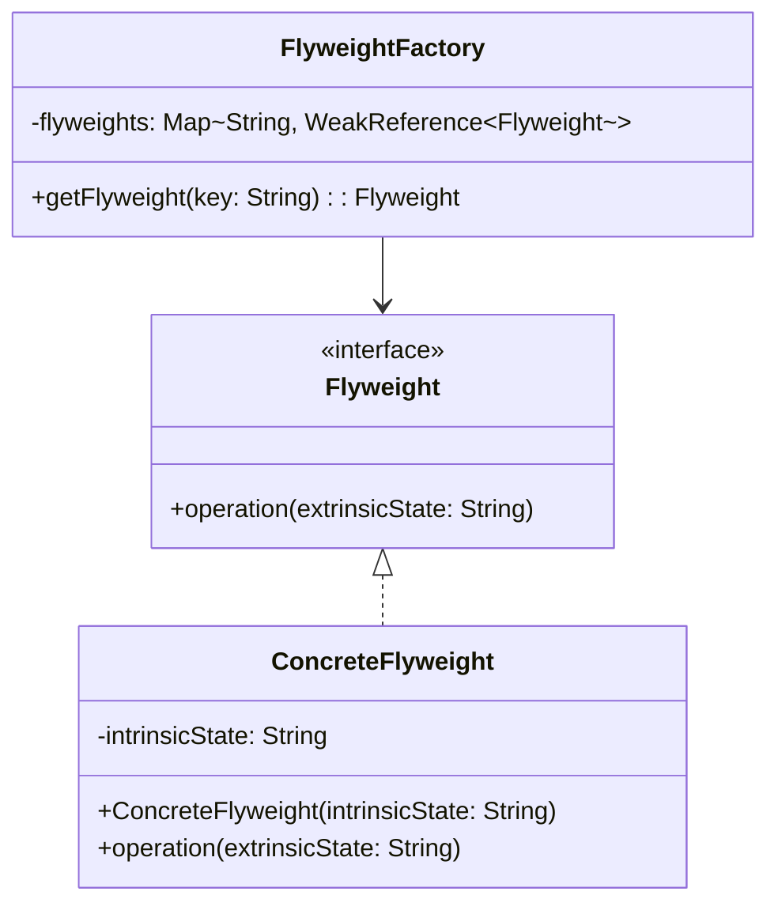

## 4.7.3 Managing Flyweight Factories

In the realm of software design patterns, the Flyweight Pattern stands out as a powerful tool for optimizing memory usage when dealing with a large number of similar objects. Central to this pattern is the FlyweightFactory, which plays a crucial role in managing the creation and sharing of flyweight instances. In this section, we will delve into the intricacies of managing Flyweight Factories, exploring their implementation, strategies for caching and retrieval, and considerations for efficient memory management.

### Understanding the Role of FlyweightFactory

The FlyweightFactory is a pivotal component in the Flyweight Pattern. Its primary responsibility is to ensure that flyweight instances are shared effectively, thereby minimizing memory usage. The factory maintains a pool of flyweight objects and provides a mechanism to either return an existing instance or create a new one if necessary.

#### Key Responsibilities of FlyweightFactory

1. **Object Sharing**: The factory ensures that identical flyweight objects are shared rather than duplicated. This is achieved by maintaining a cache of existing flyweights and returning them when requested.

2. **Object Creation**: When a requested flyweight does not exist in the cache, the factory is responsible for creating a new instance and adding it to the pool.

3. **Memory Management**: The factory must manage the lifecycle of flyweight objects, ensuring that unused instances are cleaned up to prevent memory leaks.

### Implementing a FlyweightFactory

Let's explore how to implement a FlyweightFactory in Java. We'll start with a simple example that demonstrates the creation and management of flyweight objects.

```java
import java.util.HashMap;
import java.util.Map;

// Flyweight interface
interface Flyweight {
    void operation(String extrinsicState);
}

// ConcreteFlyweight class
class ConcreteFlyweight implements Flyweight {
    private final String intrinsicState;

    public ConcreteFlyweight(String intrinsicState) {
        this.intrinsicState = intrinsicState;
    }

    @Override
    public void operation(String extrinsicState) {
        System.out.println("Intrinsic State: " + intrinsicState + ", Extrinsic State: " + extrinsicState);
    }
}

// FlyweightFactory class
class FlyweightFactory {
    private final Map<String, Flyweight> flyweights = new HashMap<>();

    public Flyweight getFlyweight(String key) {
        if (!flyweights.containsKey(key)) {
            flyweights.put(key, new ConcreteFlyweight(key));
            System.out.println("Creating new flyweight for key: " + key);
        } else {
            System.out.println("Reusing existing flyweight for key: " + key);
        }
        return flyweights.get(key);
    }
}

// Client code
public class FlyweightPatternDemo {
    public static void main(String[] args) {
        FlyweightFactory factory = new FlyweightFactory();

        Flyweight flyweight1 = factory.getFlyweight("A");
        flyweight1.operation("First Call");

        Flyweight flyweight2 = factory.getFlyweight("B");
        flyweight2.operation("Second Call");

        Flyweight flyweight3 = factory.getFlyweight("A");
        flyweight3.operation("Third Call");
    }
}
```

### Explanation of the Code

- **Flyweight Interface**: Defines the operation that flyweight objects must implement. In this example, the `operation` method takes an extrinsic state as a parameter.

- **ConcreteFlyweight Class**: Implements the Flyweight interface and stores intrinsic state, which is shared among multiple objects.

- **FlyweightFactory Class**: Manages the creation and sharing of flyweight objects. It uses a `HashMap` to store existing flyweights and returns them when requested. If a flyweight does not exist, it creates a new one.

- **Client Code**: Demonstrates the use of the FlyweightFactory to obtain and use flyweight objects. Notice how the factory reuses existing instances for the same key.

### Strategies for Caching and Retrieving Flyweights

Efficient caching and retrieval of flyweights are crucial for the Flyweight Pattern's success. Here are some strategies to consider:

1. **Lazy Initialization**: Delay the creation of flyweight objects until they are needed. This approach conserves resources by avoiding unnecessary object creation.

2. **Weak References**: Use weak references to store flyweights in the cache. This allows the garbage collector to reclaim memory when flyweights are no longer in use, preventing memory leaks.

3. **Eviction Policies**: Implement eviction policies to manage the size of the flyweight cache. Common policies include Least Recently Used (LRU) and Least Frequently Used (LFU).

4. **Thread Safety**: Ensure that the FlyweightFactory is thread-safe, especially in multi-threaded environments. Use synchronization or concurrent collections to manage access to the cache.

### Memory Management and Cleanup

Managing memory effectively is a critical aspect of the Flyweight Pattern. Here are some considerations for memory management and cleanup:

- **Garbage Collection**: Rely on Java's garbage collector to reclaim memory for unused flyweights. Use weak references to allow the garbage collector to clean up objects that are no longer referenced.

- **Explicit Cleanup**: Provide mechanisms for explicit cleanup of flyweights when they are no longer needed. This can be achieved by removing entries from the cache or using a reference queue.

- **Monitoring and Profiling**: Use monitoring and profiling tools to track memory usage and identify potential memory leaks. This helps in optimizing the FlyweightFactory's performance.

### Advanced FlyweightFactory Implementation

Let's enhance our FlyweightFactory implementation by incorporating some of the strategies discussed above.

```java
import java.lang.ref.WeakReference;
import java.util.Map;
import java.util.concurrent.ConcurrentHashMap;

// Enhanced FlyweightFactory class
class EnhancedFlyweightFactory {
    private final Map<String, WeakReference<Flyweight>> flyweights = new ConcurrentHashMap<>();

    public Flyweight getFlyweight(String key) {
        WeakReference<Flyweight> ref = flyweights.get(key);
        Flyweight flyweight = (ref != null) ? ref.get() : null;

        if (flyweight == null) {
            flyweight = new ConcreteFlyweight(key);
            flyweights.put(key, new WeakReference<>(flyweight));
            System.out.println("Creating new flyweight for key: " + key);
        } else {
            System.out.println("Reusing existing flyweight for key: " + key);
        }
        return flyweight;
    }
}
```

### Explanation of the Enhanced Code

- **WeakReference**: The flyweights are stored as weak references, allowing the garbage collector to reclaim memory when they are no longer in use.

- **ConcurrentHashMap**: A thread-safe collection is used to manage access to the flyweight cache, ensuring that the factory can be used in multi-threaded environments.

### Visualizing FlyweightFactory Management

To better understand the management of flyweight factories, let's visualize the process using a class diagram:



**Diagram Description**: This class diagram illustrates the relationship between the Flyweight interface, the ConcreteFlyweight class, and the FlyweightFactory. The factory manages a map of flyweights, using weak references to allow for garbage collection.

### Try It Yourself

Now that we've explored the FlyweightFactory in detail, it's time for you to experiment with the code. Here are some suggestions for modifications:

- **Add New Flyweight Types**: Extend the example by adding new types of flyweights with different intrinsic states.

- **Implement Eviction Policies**: Modify the factory to include an eviction policy, such as LRU, to manage the cache size.

- **Measure Performance**: Use Java's profiling tools to measure the performance and memory usage of the FlyweightFactory.

### Knowledge Check

Before we wrap up, let's reinforce what we've learned:

- **What is the primary role of a FlyweightFactory?**
  - To manage the creation and sharing of flyweight objects, ensuring efficient memory usage.

- **Why are weak references used in the FlyweightFactory?**
  - To allow the garbage collector to reclaim memory for unused flyweights, preventing memory leaks.

- **What are some strategies for caching flyweights efficiently?**
  - Lazy initialization, weak references, eviction policies, and thread safety.

### Conclusion

Managing Flyweight Factories is a critical aspect of implementing the Flyweight Pattern effectively. By understanding the role of the factory, implementing efficient caching strategies, and considering memory management, we can optimize the use of flyweight objects in our applications. Remember, the key to success with the Flyweight Pattern lies in balancing memory usage with performance, ensuring that our applications remain efficient and scalable.

## Quiz Time!



### What is the primary role of a FlyweightFactory?

- [x] To manage the creation and sharing of flyweight objects
- [ ] To create new instances of all objects
- [ ] To store all objects in memory indefinitely
- [ ] To handle user input in the application

> **Explanation:** The FlyweightFactory is responsible for managing the creation and sharing of flyweight objects to optimize memory usage.

### Why are weak references used in the FlyweightFactory?

- [x] To allow garbage collection of unused flyweights
- [ ] To prevent any object from being garbage collected
- [ ] To increase the speed of object creation
- [ ] To ensure objects are never reused

> **Explanation:** Weak references allow the garbage collector to reclaim memory for flyweights that are no longer in use, preventing memory leaks.

### Which collection is used in the enhanced FlyweightFactory for thread safety?

- [x] ConcurrentHashMap
- [ ] HashMap
- [ ] ArrayList
- [ ] LinkedList

> **Explanation:** ConcurrentHashMap is used to ensure thread-safe access to the flyweight cache in a multi-threaded environment.

### What is lazy initialization in the context of FlyweightFactory?

- [x] Creating objects only when they are needed
- [ ] Creating all objects at application startup
- [ ] Never creating objects
- [ ] Creating objects in a random order

> **Explanation:** Lazy initialization involves delaying the creation of objects until they are actually needed, conserving resources.

### What is an eviction policy in FlyweightFactory?

- [x] A strategy to manage the size of the flyweight cache
- [ ] A method to create new flyweights
- [ ] A way to ensure all objects are stored permanently
- [ ] A technique to speed up object retrieval

> **Explanation:** An eviction policy is used to manage the size of the flyweight cache, ensuring it does not grow indefinitely.

### What is the purpose of the `operation` method in the Flyweight interface?

- [x] To perform actions using intrinsic and extrinsic states
- [ ] To create new flyweight instances
- [ ] To delete flyweight instances
- [ ] To manage memory allocation

> **Explanation:** The `operation` method is used to perform actions using both intrinsic and extrinsic states of the flyweight.

### How does the FlyweightFactory ensure thread safety?

- [x] By using concurrent collections like ConcurrentHashMap
- [ ] By creating all objects at the start
- [ ] By using synchronized blocks everywhere
- [ ] By avoiding object creation

> **Explanation:** The FlyweightFactory uses concurrent collections like ConcurrentHashMap to ensure thread-safe access to the flyweight cache.

### What is the benefit of using the Flyweight Pattern?

- [x] Reduces memory usage by sharing objects
- [ ] Increases the number of objects in memory
- [ ] Simplifies object creation
- [ ] Ensures all objects are unique

> **Explanation:** The Flyweight Pattern reduces memory usage by sharing objects that have common intrinsic states.

### What is the intrinsic state in the Flyweight Pattern?

- [x] The shared state that is common across many objects
- [ ] The unique state specific to each object
- [ ] The temporary state used during object creation
- [ ] The state that changes frequently

> **Explanation:** The intrinsic state is the shared state that is common across many objects and does not change.

### True or False: The Flyweight Pattern is useful for optimizing performance in applications with a large number of similar objects.

- [x] True
- [ ] False

> **Explanation:** The Flyweight Pattern is designed to optimize performance by reducing memory usage in applications with many similar objects.


