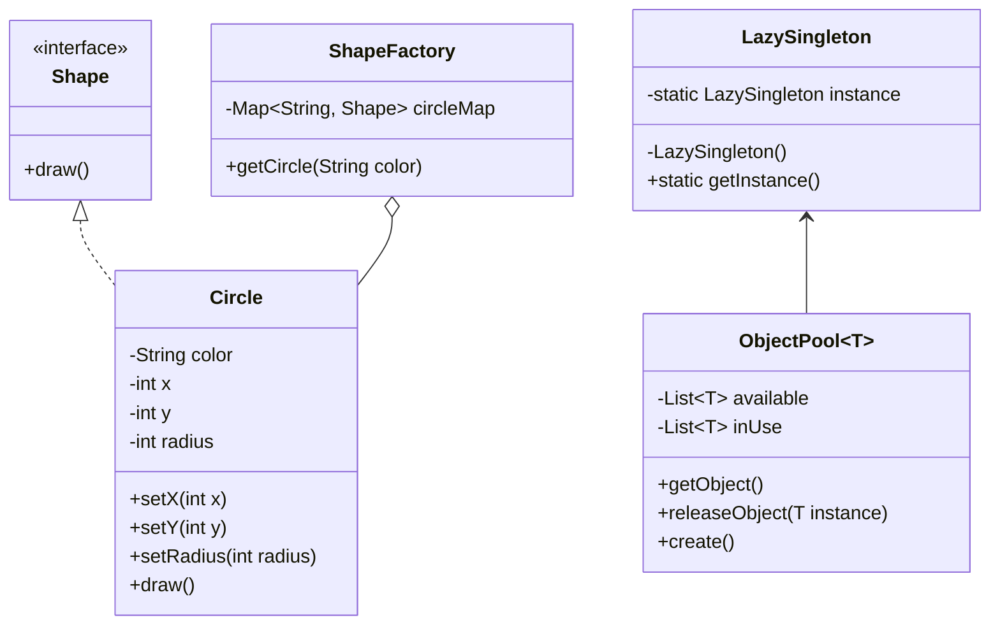

## 4.7.4 Memory Optimization Techniques

In today's software development landscape, efficient memory usage is crucial for building high-performance applications. As systems grow in complexity and scale, the demand for memory-efficient solutions becomes more pronounced. This section delves into memory optimization techniques, focusing on the Flyweight pattern, lazy initialization, and object pooling. These strategies, when used effectively, can significantly reduce memory consumption and enhance application performance.

### Understanding the Flyweight Pattern

The Flyweight pattern is a structural design pattern that enables the sharing of common parts of an object to minimize memory usage. It is particularly useful when dealing with a large number of similar objects. By sharing intrinsic state (the part of the object that is invariant), the Flyweight pattern reduces the number of objects in memory.

#### Key Concepts of the Flyweight Pattern

- **Intrinsic State**: Shared among multiple objects, it remains constant and can be stored in a shared object.
- **Extrinsic State**: Unique to each object instance, it must be provided by the client code.

Let's illustrate the Flyweight pattern with a simple example in Java:

```java
// Flyweight interface
interface Shape {
    void draw();
}

// Concrete Flyweight class
class Circle implements Shape {
    private String color;
    private int x;
    private int y;
    private int radius;

    public Circle(String color) {
        this.color = color;
    }

    public void setX(int x) {
        this.x = x;
    }

    public void setY(int y) {
        this.y = y;
    }

    public void setRadius(int radius) {
        this.radius = radius;
    }

    @Override
    public void draw() {
        System.out.println("Circle: Draw() [Color : " + color + ", x : " + x + ", y :" + y + ", radius :" + radius);
    }
}

// Flyweight Factory
class ShapeFactory {
    private static final Map<String, Shape> circleMap = new HashMap<>();

    public static Shape getCircle(String color) {
        Circle circle = (Circle) circleMap.get(color);

        if (circle == null) {
            circle = new Circle(color);
            circleMap.put(color, circle);
            System.out.println("Creating circle of color : " + color);
        }
        return circle;
    }
}

// Client code
public class FlyweightPatternDemo {
    private static final String[] colors = {"Red", "Green", "Blue", "White", "Black"};

    public static void main(String[] args) {
        for (int i = 0; i < 20; ++i) {
            Circle circle = (Circle) ShapeFactory.getCircle(getRandomColor());
            circle.setX(getRandomX());
            circle.setY(getRandomY());
            circle.setRadius(100);
            circle.draw();
        }
    }

    private static String getRandomColor() {
        return colors[(int) (Math.random() * colors.length)];
    }

    private static int getRandomX() {
        return (int) (Math.random() * 100);
    }

    private static int getRandomY() {
        return (int) (Math.random() * 100);
    }
}
```

In this example, the `ShapeFactory` class ensures that only one `Circle` object per color is created, thus optimizing memory usage by sharing the intrinsic state (color).

### Lazy Initialization

Lazy initialization is a technique where object creation is deferred until it is needed. This can significantly reduce memory usage and improve performance by avoiding unnecessary object creation.

#### Implementing Lazy Initialization in Java

Lazy initialization can be implemented using the Singleton pattern, where the instance is created only when it is first accessed. Here's an example:

```java
class LazySingleton {
    private static LazySingleton instance;

    private LazySingleton() {
        // private constructor
    }

    public static LazySingleton getInstance() {
        if (instance == null) {
            instance = new LazySingleton();
        }
        return instance;
    }
}
```

In this example, the `LazySingleton` instance is created only when `getInstance()` is called for the first time. This approach can be particularly useful for resource-intensive objects.

#### Trade-offs of Lazy Initialization

- **Pros**: Reduces initial memory footprint and improves startup time.
- **Cons**: Can introduce latency when the object is first accessed, and may complicate synchronization in multi-threaded environments.

### Object Pooling

Object pooling is a technique where a set of initialized objects is kept ready to use, rather than creating and destroying them on demand. This can significantly reduce the overhead of object creation and garbage collection.

#### Implementing Object Pooling in Java

Java provides the `ObjectPool` class to manage pooled objects. Here's a simple implementation:

```java
class ObjectPool<T> {
    private List<T> available = new ArrayList<>();
    private List<T> inUse = new ArrayList<>();

    public synchronized T getObject() {
        if (available.isEmpty()) {
            available.add(create());
        }
        T instance = available.remove(available.size() - 1);
        inUse.add(instance);
        return instance;
    }

    public synchronized void releaseObject(T instance) {
        inUse.remove(instance);
        available.add(instance);
    }

    protected T create() {
        // Create a new instance
        return null;
    }
}
```

In this example, the `ObjectPool` class manages a pool of objects, reusing them as needed. This can be particularly useful for objects that are expensive to create or destroy, such as database connections.

#### Trade-offs of Object Pooling

- **Pros**: Reduces object creation overhead and improves performance.
- **Cons**: Increases complexity and may lead to resource contention if not managed properly.

### Best Practices for Memory Optimization

1. **Balance Optimization with Maintainability**: While optimizing memory usage is important, it should not come at the cost of code readability and maintainability. Use design patterns judiciously and document their usage.

2. **Monitor and Profile Memory Usage**: Use profiling tools to monitor memory usage and identify bottlenecks. This can help in making informed decisions about where optimization is needed.

3. **Consider the Application Context**: The choice of optimization techniques should be guided by the specific requirements and constraints of the application. For instance, lazy initialization may be more suitable for applications with a high startup cost, while object pooling may be beneficial for applications with frequent object creation and destruction.

4. **Test for Performance Impact**: Always test the performance impact of optimization techniques. While they can improve memory usage, they may also introduce latency or complexity.

5. **Use Java's Built-in Features**: Leverage Java's built-in features, such as the `java.util.concurrent` package, which provides thread-safe collections and utilities for managing concurrency.

### Visualizing Memory Optimization Techniques

To better understand how these techniques work together, let's visualize their interactions using a class diagram:



This diagram illustrates the relationships between the Flyweight pattern, lazy initialization, and object pooling. The `ShapeFactory` manages `Circle` objects, `LazySingleton` demonstrates lazy initialization, and `ObjectPool` handles object pooling.

### Try It Yourself

To deepen your understanding of these techniques, try modifying the code examples:

- **Experiment with Different Colors**: Add more colors to the `ShapeFactory` and observe the memory usage.
- **Implement Lazy Initialization with Synchronization**: Modify the `LazySingleton` to be thread-safe using synchronized blocks.
- **Create a Custom Object Pool**: Implement an `ObjectPool` for a different type of object, such as database connections or threads.

### Knowledge Check

- **What is the primary benefit of the Flyweight pattern?**
- **How does lazy initialization improve performance?**
- **What are the trade-offs of using object pooling?**

### Conclusion

Memory optimization is a critical aspect of software development, especially for applications that require high performance and scalability. By leveraging design patterns such as Flyweight, along with techniques like lazy initialization and object pooling, developers can significantly reduce memory usage and improve application efficiency. However, it's important to balance optimization with maintainability and to carefully consider the specific needs of the application.

Remember, this is just the beginning. As you progress, you'll build more complex and memory-efficient applications. Keep experimenting, stay curious, and enjoy the journey!

## Quiz Time!



### What is the primary benefit of the Flyweight pattern?

- [x] Reduces memory usage by sharing common parts of an object.
- [ ] Increases object creation speed.
- [ ] Simplifies object interfaces.
- [ ] Enhances object security.

> **Explanation:** The Flyweight pattern reduces memory usage by sharing intrinsic state among multiple objects, thus minimizing the number of objects in memory.

### How does lazy initialization improve performance?

- [x] By deferring object creation until it is needed.
- [ ] By creating all objects at application startup.
- [ ] By using more memory to store objects.
- [ ] By simplifying object interfaces.

> **Explanation:** Lazy initialization improves performance by deferring object creation until it is actually needed, reducing the initial memory footprint and improving startup time.

### What are the trade-offs of using object pooling?

- [x] Reduces object creation overhead but increases complexity.
- [ ] Increases object creation overhead and reduces complexity.
- [ ] Simplifies object management but increases memory usage.
- [ ] Reduces memory usage but complicates object interfaces.

> **Explanation:** Object pooling reduces the overhead of creating and destroying objects but can increase complexity and may lead to resource contention if not managed properly.

### Which Java feature can be used to implement thread-safe lazy initialization?

- [x] Synchronized blocks.
- [ ] Volatile variables.
- [ ] Static initializers.
- [ ] Final variables.

> **Explanation:** Synchronized blocks can be used to ensure that lazy initialization is thread-safe by controlling access to the instance creation code.

### What is intrinsic state in the Flyweight pattern?

- [x] The shared part of an object that remains constant.
- [ ] The unique part of each object instance.
- [ ] The part of an object that changes frequently.
- [ ] The external state provided by the client.

> **Explanation:** Intrinsic state is the shared part of an object that remains constant and can be stored in a shared object, reducing memory usage.

### How does object pooling improve performance?

- [x] By reusing objects instead of creating and destroying them on demand.
- [ ] By creating new objects for each request.
- [ ] By storing objects in a database.
- [ ] By simplifying object interfaces.

> **Explanation:** Object pooling improves performance by reusing objects, reducing the overhead of object creation and garbage collection.

### What is the role of the ShapeFactory in the Flyweight pattern example?

- [x] To manage and provide shared Circle objects.
- [ ] To create new Circle objects for each request.
- [ ] To store the extrinsic state of Circle objects.
- [ ] To simplify the Circle interface.

> **Explanation:** The ShapeFactory manages and provides shared Circle objects, ensuring that only one Circle object per color is created, thus optimizing memory usage.

### What is a potential downside of lazy initialization?

- [x] It can introduce latency when the object is first accessed.
- [ ] It increases memory usage at startup.
- [ ] It simplifies object interfaces.
- [ ] It reduces code complexity.

> **Explanation:** Lazy initialization can introduce latency when the object is first accessed, as the object is created at that time.

### What is the primary goal of memory optimization techniques?

- [x] To reduce memory usage and improve application performance.
- [ ] To increase memory usage for faster processing.
- [ ] To simplify code interfaces.
- [ ] To enhance application security.

> **Explanation:** The primary goal of memory optimization techniques is to reduce memory usage and improve application performance by using resources more efficiently.

### True or False: Lazy initialization is always the best choice for improving performance.

- [ ] True
- [x] False

> **Explanation:** False. While lazy initialization can improve performance by reducing initial memory usage, it may not always be the best choice, especially if it introduces latency or complicates synchronization in multi-threaded environments.


