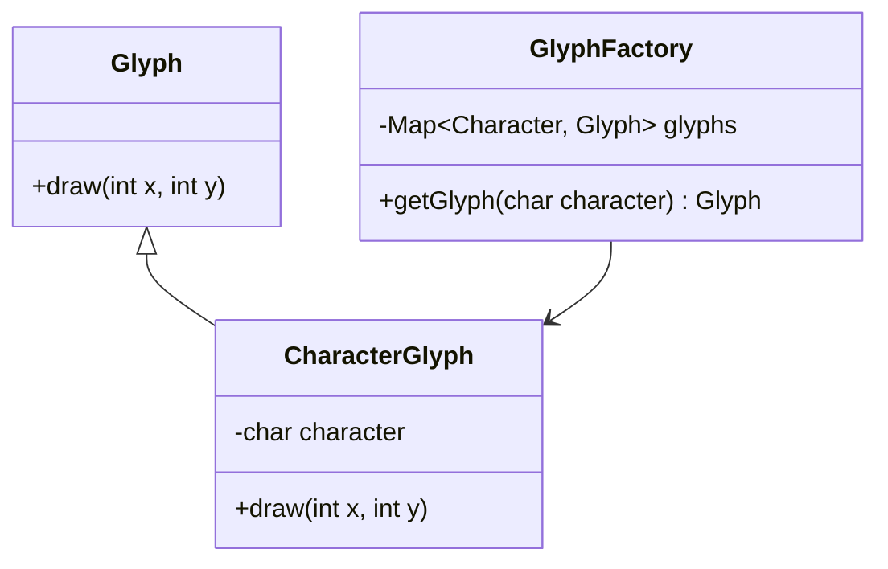

## 4.7.5 Use Cases and Examples

The Flyweight pattern is a structural design pattern that focuses on minimizing memory usage by sharing as much data as possible with similar objects. This pattern is particularly useful in scenarios where applications need to handle a large number of objects that share common data. In this section, we will explore practical applications of the Flyweight pattern, such as text editors, game development, and large-scale simulations, and demonstrate how this pattern can lead to significant memory savings and improved performance.

### Understanding the Flyweight Pattern

Before diving into specific use cases, let's briefly revisit the core concept of the Flyweight pattern. The Flyweight pattern allows you to create a large number of objects efficiently by sharing common parts of their state. The pattern divides the object state into intrinsic and extrinsic states:

- **Intrinsic State**: This is the state that is shared among many objects and is immutable. It is stored in the Flyweight object.
- **Extrinsic State**: This is the state that is unique to each object and is passed to the Flyweight object when it is used.

By separating these states, the Flyweight pattern reduces the amount of memory required to store objects.

### Use Case 1: Text Editors

One of the classic examples of the Flyweight pattern is its use in text editors. In a text editor, characters are rendered on the screen, and each character can be represented as an object. Without the Flyweight pattern, a text editor would need to create a separate object for each character in the document, leading to excessive memory usage.

#### Implementing Flyweight in Text Editors

In a text editor, the intrinsic state would be the character glyph (the visual representation of the character), and the extrinsic state would be the position of the character on the screen. By using the Flyweight pattern, we can share glyph objects among all occurrences of the same character.

```java
// Flyweight interface
interface Glyph {
    void draw(int x, int y);
}

// Concrete Flyweight class
class CharacterGlyph implements Glyph {
    private final char character;

    public CharacterGlyph(char character) {
        this.character = character;
    }

    @Override
    public void draw(int x, int y) {
        // Render the character at the given position
        System.out.println("Drawing character " + character + " at position (" + x + ", " + y + ")");
    }
}

// Flyweight Factory
class GlyphFactory {
    private final Map<Character, Glyph> glyphs = new HashMap<>();

    public Glyph getGlyph(char character) {
        Glyph glyph = glyphs.get(character);
        if (glyph == null) {
            glyph = new CharacterGlyph(character);
            glyphs.put(character, glyph);
        }
        return glyph;
    }
}

// Client code
public class TextEditor {
    public static void main(String[] args) {
        GlyphFactory factory = new GlyphFactory();

        String document = "Hello, World!";
        for (int i = 0; i < document.length(); i++) {
            char character = document.charAt(i);
            Glyph glyph = factory.getGlyph(character);
            glyph.draw(i * 10, 0); // Example positions
        }
    }
}
```

In this example, the `GlyphFactory` ensures that only one `CharacterGlyph` object is created for each unique character. The `draw` method uses the extrinsic state (position) to render the character.

#### Benefits in Text Editors

By applying the Flyweight pattern, text editors can significantly reduce memory consumption, especially in documents with repeated characters. This leads to faster rendering times and a more responsive user experience.

### Use Case 2: Game Development

In game development, the Flyweight pattern is often used to manage visual assets like sprites. Games typically have numerous entities, such as characters, enemies, and items, that share visual characteristics. Creating separate objects for each entity would be inefficient and consume a lot of memory.

#### Implementing Flyweight in Games

Consider a game where multiple characters share the same sprite. The intrinsic state is the sprite image, while the extrinsic state includes the position and state of the character.

```java
// Flyweight interface
interface Sprite {
    void render(int x, int y, String state);
}

// Concrete Flyweight class
class CharacterSprite implements Sprite {
    private final String image;

    public CharacterSprite(String image) {
        this.image = image;
    }

    @Override
    public void render(int x, int y, String state) {
        // Render the sprite at the given position with the given state
        System.out.println("Rendering sprite " + image + " at position (" + x + ", " + y + ") with state " + state);
    }
}

// Flyweight Factory
class SpriteFactory {
    private final Map<String, Sprite> sprites = new HashMap<>();

    public Sprite getSprite(String image) {
        Sprite sprite = sprites.get(image);
        if (sprite == null) {
            sprite = new CharacterSprite(image);
            sprites.put(image, sprite);
        }
        return sprite;
    }
}

// Client code
public class Game {
    public static void main(String[] args) {
        SpriteFactory factory = new SpriteFactory();

        String[] characters = {"hero", "villain", "npc"};
        for (String character : characters) {
            Sprite sprite = factory.getSprite(character);
            sprite.render(100, 200, "idle"); // Example positions and states
        }
    }
}
```

In this example, the `SpriteFactory` ensures that only one `CharacterSprite` object is created for each unique image. The `render` method uses the extrinsic state (position and state) to render the sprite.

#### Benefits in Game Development

The Flyweight pattern allows games to handle large numbers of entities efficiently, reducing memory usage and improving performance. This is especially important in games with complex graphics and numerous on-screen characters.

### Use Case 3: Large-Scale Simulations

Large-scale simulations, such as traffic simulations or crowd simulations, often involve thousands or millions of similar objects. The Flyweight pattern is ideal for managing these objects efficiently.

#### Implementing Flyweight in Simulations

In a traffic simulation, vehicles can be represented as objects. The intrinsic state includes the vehicle type and model, while the extrinsic state includes the position and speed.

```java
// Flyweight interface
interface Vehicle {
    void move(int x, int y, int speed);
}

// Concrete Flyweight class
class Car implements Vehicle {
    private final String model;

    public Car(String model) {
        this.model = model;
    }

    @Override
    public void move(int x, int y, int speed) {
        // Move the car to the given position with the given speed
        System.out.println("Moving car " + model + " to position (" + x + ", " + y + ") at speed " + speed);
    }
}

// Flyweight Factory
class VehicleFactory {
    private final Map<String, Vehicle> vehicles = new HashMap<>();

    public Vehicle getVehicle(String model) {
        Vehicle vehicle = vehicles.get(model);
        if (vehicle == null) {
            vehicle = new Car(model);
            vehicles.put(model, vehicle);
        }
        return vehicle;
    }
}

// Client code
public class TrafficSimulation {
    public static void main(String[] args) {
        VehicleFactory factory = new VehicleFactory();

        String[] models = {"sedan", "suv", "truck"};
        for (String model : models) {
            Vehicle vehicle = factory.getVehicle(model);
            vehicle.move(50, 100, 60); // Example positions and speeds
        }
    }
}
```

In this example, the `VehicleFactory` ensures that only one `Car` object is created for each unique model. The `move` method uses the extrinsic state (position and speed) to simulate the vehicle's movement.

#### Benefits in Simulations

The Flyweight pattern enables simulations to manage large numbers of objects without consuming excessive memory. This leads to faster simulation times and the ability to handle more complex scenarios.

### Visualizing the Flyweight Pattern

To better understand how the Flyweight pattern works, let's visualize the relationship between the Flyweight objects and their states using a class diagram.



In this diagram, the `Glyph` interface defines the `draw` method, which is implemented by the `CharacterGlyph` class. The `GlyphFactory` manages the creation and sharing of `CharacterGlyph` objects.

### Try It Yourself

To gain a deeper understanding of the Flyweight pattern, try modifying the code examples provided:

- **Experiment with Different Intrinsic States**: Add more character glyphs or sprite images to see how the Flyweight pattern handles them.
- **Adjust Extrinsic States**: Change the positions and states of characters or vehicles to observe how the Flyweight pattern maintains efficiency.
- **Create Your Own Use Case**: Think of a scenario in your current projects where the Flyweight pattern could be applied and implement a prototype.

### Knowledge Check

Let's reinforce your understanding of the Flyweight pattern with a few questions:

- How does the Flyweight pattern differentiate between intrinsic and extrinsic states?
- What are the benefits of using the Flyweight pattern in a text editor?
- How can the Flyweight pattern improve performance in a game with numerous entities?

### Conclusion

The Flyweight pattern is a powerful tool for optimizing memory usage and performance in applications that require handling large numbers of similar objects. By sharing common data among objects, the Flyweight pattern reduces memory consumption and enhances efficiency. Whether you're developing a text editor, a game, or a large-scale simulation, consider the Flyweight pattern as a solution to manage your resources effectively.

## Quiz Time!



### How does the Flyweight pattern differentiate between intrinsic and extrinsic states?

- [x] Intrinsic state is shared and immutable, while extrinsic state is unique and passed during use.
- [ ] Intrinsic state is unique and passed during use, while extrinsic state is shared and immutable.
- [ ] Both intrinsic and extrinsic states are shared and immutable.
- [ ] Both intrinsic and extrinsic states are unique and passed during use.

> **Explanation:** The Flyweight pattern separates the state into intrinsic (shared and immutable) and extrinsic (unique and passed during use) to optimize memory usage.

### What is a key benefit of using the Flyweight pattern in a text editor?

- [x] It significantly reduces memory consumption by sharing character glyphs.
- [ ] It increases the complexity of rendering characters.
- [ ] It requires more memory to store character positions.
- [ ] It simplifies the implementation of text formatting.

> **Explanation:** The Flyweight pattern reduces memory consumption by sharing glyph objects among repeated characters, which is crucial in text editors.

### In game development, what does the Flyweight pattern help optimize?

- [x] Memory usage by sharing sprite images among entities.
- [ ] Network latency by reducing data transfer.
- [ ] Game logic by simplifying AI algorithms.
- [ ] User input handling by improving response times.

> **Explanation:** The Flyweight pattern optimizes memory usage by allowing multiple game entities to share the same sprite images, reducing the need for duplicate objects.

### How does the Flyweight pattern benefit large-scale simulations?

- [x] It allows efficient management of numerous similar objects.
- [ ] It simplifies the simulation logic.
- [ ] It increases the number of unique objects required.
- [ ] It reduces the need for extrinsic state management.

> **Explanation:** The Flyweight pattern enables efficient management of numerous similar objects by sharing common data, which is essential in large-scale simulations.

### What is the role of the Flyweight Factory in the Flyweight pattern?

- [x] It manages the creation and sharing of Flyweight objects.
- [ ] It handles the rendering of Flyweight objects.
- [ ] It stores the extrinsic state of Flyweight objects.
- [ ] It defines the intrinsic state of Flyweight objects.

> **Explanation:** The Flyweight Factory is responsible for creating and managing the shared Flyweight objects, ensuring that only one instance of each intrinsic state exists.

### Which of the following is an example of intrinsic state in a text editor?

- [x] The character glyph.
- [ ] The position of the character.
- [ ] The font size of the character.
- [ ] The color of the character.

> **Explanation:** In a text editor, the character glyph is the intrinsic state that is shared among all occurrences of the same character.

### In the Flyweight pattern, what is an example of extrinsic state in a game?

- [x] The position of a sprite on the screen.
- [ ] The sprite image used for rendering.
- [ ] The game engine version.
- [ ] The player's score.

> **Explanation:** The position of a sprite on the screen is an example of extrinsic state, as it is unique to each instance of the sprite in the game.

### What is a potential drawback of using the Flyweight pattern?

- [x] Increased complexity in managing extrinsic state.
- [ ] Higher memory usage due to shared objects.
- [ ] Reduced performance due to object creation.
- [ ] Difficulty in implementing intrinsic state sharing.

> **Explanation:** The Flyweight pattern can increase complexity in managing extrinsic state, as it requires careful handling to ensure correct behavior.

### How can the Flyweight pattern improve performance in applications?

- [x] By reducing memory usage and enabling faster object creation.
- [ ] By simplifying the application's logic and reducing code complexity.
- [ ] By increasing the number of objects created at runtime.
- [ ] By eliminating the need for object factories.

> **Explanation:** The Flyweight pattern improves performance by reducing memory usage through shared objects and enabling faster object creation.

### True or False: The Flyweight pattern is only applicable in graphical applications.

- [ ] True
- [x] False

> **Explanation:** False. The Flyweight pattern is applicable in any scenario where there are a large number of similar objects, not just graphical applications.


