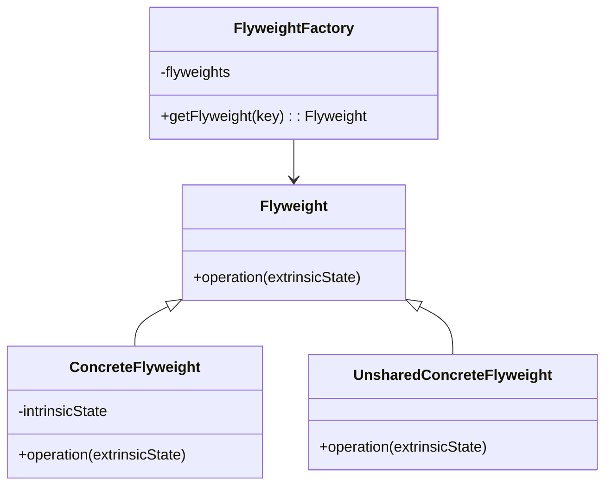

## 4.7 Flyweight Pattern

### Introduction to the Flyweight Pattern

The Flyweight Pattern is a structural design pattern that focuses on minimizing memory usage by sharing as much data as possible with similar objects. This pattern is particularly useful when dealing with a large number of objects that share common data, which can be stored centrally to reduce redundancy. By applying the Flyweight Pattern, we can significantly reduce the memory footprint of applications, especially those that require a large number of fine-grained objects.

### The Problem: Memory Constraints with Many Similar Objects

In software development, especially in applications like text editors, graphic applications, or games, we often encounter scenarios where we need to create and manage a large number of similar objects. Each object, if created independently, can consume a significant amount of memory, leading to performance issues and resource constraints.

For instance, consider a text editor that needs to render millions of characters on the screen. If each character is represented by a separate object containing all its properties, the memory consumption can become prohibitive. This is where the Flyweight Pattern comes into play, allowing us to share common data among these objects and thus optimize memory usage.

### Structure of the Flyweight Pattern

The Flyweight Pattern involves several key components:

- **Flyweight**: This is the interface or abstract class through which flyweights can receive and act on extrinsic state.
- **ConcreteFlyweight**: Implements the Flyweight interface and adds storage for intrinsic state. Instances of ConcreteFlyweight are shared.
- **UnsharedConcreteFlyweight**: Not all Flyweight subclasses need to be shared. The Flyweight interface enables sharing, but it doesn't enforce it.
- **FlyweightFactory**: Creates and manages flyweight objects. Ensures that flyweights are shared properly. When a client requests a flyweight, the FlyweightFactory provides an existing instance or creates one if it doesn't exist.

#### UML Diagram of the Flyweight Pattern

Below is a UML diagram illustrating the Flyweight Pattern:



### Intrinsic and Extrinsic State

The Flyweight Pattern relies on the concepts of intrinsic and extrinsic state to enable sharing:

- **Intrinsic State**: This is the state that is shared among multiple objects. It is stored in the flyweight object and remains constant across different contexts. For example, the font and style of a character in a text editor can be considered intrinsic state.
  
- **Extrinsic State**: This is the state that is not shared and can vary between different flyweight objects. It is passed to the flyweight methods and is not stored within the flyweight. For example, the position of a character in a text document is extrinsic state.

By separating these two types of state, the Flyweight Pattern allows us to share intrinsic state among multiple objects, while extrinsic state is handled externally.

### Practical Implementation in Java

Let's explore how to implement the Flyweight Pattern in Java with a practical example. We'll consider a scenario where we need to render a large number of characters on the screen, each with potentially different positions but shared font and style.

#### Step 1: Define the Flyweight Interface

First, we define the Flyweight interface that declares a method for rendering characters:

```java
public interface CharacterFlyweight {
    void render(int x, int y);
}
```

#### Step 2: Implement the ConcreteFlyweight Class

Next, we implement the ConcreteFlyweight class that stores the intrinsic state (font and style) and implements the rendering method:

```java
public class ConcreteCharacterFlyweight implements CharacterFlyweight {
    private final char character;
    private final String font;
    private final String style;

    public ConcreteCharacterFlyweight(char character, String font, String style) {
        this.character = character;
        this.font = font;
        this.style = style;
    }

    @Override
    public void render(int x, int y) {
        System.out.println("Rendering character '" + character + "' at (" + x + ", " + y + ") with font " + font + " and style " + style);
    }
}
```

#### Step 3: Create the FlyweightFactory

The FlyweightFactory is responsible for managing flyweight instances and ensuring they are shared:

```java
import java.util.HashMap;
import java.util.Map;

public class CharacterFlyweightFactory {
    private final Map<String, CharacterFlyweight> flyweights = new HashMap<>();

    public CharacterFlyweight getFlyweight(char character, String font, String style) {
        String key = character + font + style;
        if (!flyweights.containsKey(key)) {
            flyweights.put(key, new ConcreteCharacterFlyweight(character, font, style));
        }
        return flyweights.get(key);
    }
}
```

#### Step 4: Use the Flyweight Pattern

Finally, we demonstrate how to use the Flyweight Pattern to render characters:

```java
public class FlyweightPatternDemo {
    public static void main(String[] args) {
        CharacterFlyweightFactory factory = new CharacterFlyweightFactory();

        CharacterFlyweight a1 = factory.getFlyweight('a', "Arial", "Bold");
        CharacterFlyweight a2 = factory.getFlyweight('a', "Arial", "Bold");
        CharacterFlyweight b1 = factory.getFlyweight('b', "Arial", "Italic");

        a1.render(10, 20);
        a2.render(30, 40);
        b1.render(50, 60);

        // Check if a1 and a2 are the same instance
        System.out.println("a1 and a2 are the same instance: " + (a1 == a2));
    }
}
```

### Try It Yourself

To better understand the Flyweight Pattern, try modifying the code examples above:

- Change the intrinsic state (font or style) and observe how it affects the sharing of flyweight instances.
- Add more characters and render them at different positions to see the memory savings in action.
- Implement additional features, such as changing colors or adding new styles, and consider how they can be integrated into the Flyweight Pattern.

### Visualizing the Flyweight Pattern

To further illustrate how the Flyweight Pattern works, let's visualize the sharing of intrinsic state among multiple flyweight objects:

```mermaid
graph TD;
    A[FlyweightFactory] -->|getFlyweight| B[ConcreteCharacterFlyweight 'a']
    A -->|getFlyweight| C[ConcreteCharacterFlyweight 'b']
    B -->|render| D[Position (10, 20)]
    B -->|render| E[Position (30, 40)]
    C -->|render| F[Position (50, 60)]
```

In this diagram, the FlyweightFactory provides shared instances of ConcreteCharacterFlyweight for characters 'a' and 'b'. The intrinsic state (font and style) is shared, while the extrinsic state (position) is passed during rendering.

### Use Cases for the Flyweight Pattern

The Flyweight Pattern is particularly useful in scenarios where:

- **Text Editors**: Rendering large amounts of text with shared font and style properties.
- **Graphic Applications**: Managing graphical objects with shared attributes, such as color or texture.
- **Games**: Handling a large number of similar game objects, like trees or enemies, with shared properties.
- **Network Applications**: Managing connections or sessions with shared configuration settings.

### Practical Considerations

When implementing the Flyweight Pattern, consider the following:

- **Identify Intrinsic and Extrinsic State**: Clearly distinguish between shared and unique state to maximize memory savings.
- **Manage Complexity**: The Flyweight Pattern can introduce complexity in managing state, so ensure that the benefits outweigh the costs.
- **Performance Trade-offs**: While memory usage is reduced, there may be a performance overhead in managing flyweight instances and extrinsic state.

### Conclusion

The Flyweight Pattern is a powerful tool for optimizing memory usage in applications that require a large number of similar objects. By sharing intrinsic state and managing extrinsic state externally, we can significantly reduce the memory footprint and improve the performance of our applications. As you continue to explore design patterns, remember that the Flyweight Pattern is just one of many tools available to you. Keep experimenting, stay curious, and enjoy the journey of mastering design patterns in Java!

## Quiz Time!



### What is the primary purpose of the Flyweight Pattern?

- [x] To minimize memory usage by sharing data among similar objects.
- [ ] To enhance the performance of complex algorithms.
- [ ] To simplify the structure of a software system.
- [ ] To improve the security of a software application.

> **Explanation:** The Flyweight Pattern is designed to reduce memory usage by sharing common data among similar objects.

### Which of the following is an example of intrinsic state in the Flyweight Pattern?

- [x] Font and style of a character.
- [ ] Position of a character on the screen.
- [ ] Color of a graphical object.
- [ ] Size of a window.

> **Explanation:** Intrinsic state is the shared data among flyweights, such as font and style in a text editor.

### What role does the FlyweightFactory play in the Flyweight Pattern?

- [x] It manages and provides shared flyweight instances.
- [ ] It stores the extrinsic state of flyweights.
- [ ] It defines the interface for flyweight objects.
- [ ] It handles the rendering of flyweights.

> **Explanation:** The FlyweightFactory is responsible for managing and providing shared instances of flyweights.

### How does the Flyweight Pattern handle extrinsic state?

- [x] Extrinsic state is passed to flyweight methods and not stored within flyweights.
- [ ] Extrinsic state is stored within flyweights and shared among instances.
- [ ] Extrinsic state is ignored in the Flyweight Pattern.
- [ ] Extrinsic state is managed by the FlyweightFactory.

> **Explanation:** Extrinsic state is passed to flyweight methods and is not stored within the flyweight objects.

### Which of the following scenarios is the Flyweight Pattern particularly useful for?

- [x] Rendering large amounts of text with shared properties.
- [ ] Implementing a complex algorithm with multiple steps.
- [ ] Designing a user interface with multiple screens.
- [ ] Managing a small number of unique objects.

> **Explanation:** The Flyweight Pattern is useful for scenarios where many objects share common properties, such as rendering text.

### What is the main benefit of using the Flyweight Pattern?

- [x] Reduced memory usage.
- [ ] Improved algorithm complexity.
- [ ] Enhanced security.
- [ ] Simplified code structure.

> **Explanation:** The main benefit of the Flyweight Pattern is reduced memory usage through shared data.

### In the Flyweight Pattern, what is the difference between intrinsic and extrinsic state?

- [x] Intrinsic state is shared, while extrinsic state is unique to each instance.
- [ ] Intrinsic state is unique, while extrinsic state is shared.
- [ ] Both intrinsic and extrinsic state are shared.
- [ ] Both intrinsic and extrinsic state are unique.

> **Explanation:** Intrinsic state is shared among flyweights, while extrinsic state is unique to each instance.

### What type of objects does the Flyweight Pattern typically deal with?

- [x] Fine-grained objects with shared data.
- [ ] Coarse-grained objects with unique data.
- [ ] Singleton objects.
- [ ] Immutable objects.

> **Explanation:** The Flyweight Pattern deals with fine-grained objects that share common data to optimize memory usage.

### How does the Flyweight Pattern affect the complexity of a software system?

- [x] It can introduce complexity in managing state.
- [ ] It simplifies the overall structure of the system.
- [ ] It has no impact on complexity.
- [ ] It reduces complexity by eliminating redundant code.

> **Explanation:** The Flyweight Pattern can introduce complexity in managing shared and unique state.

### True or False: The Flyweight Pattern is only applicable to graphical applications.

- [ ] True
- [x] False

> **Explanation:** The Flyweight Pattern is applicable to any scenario where memory optimization is needed, not just graphical applications.


