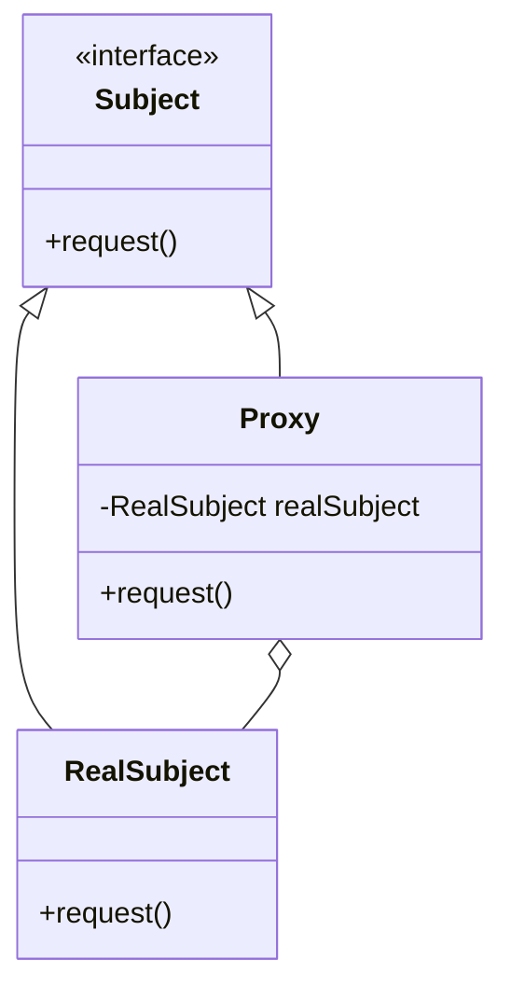

## 4.8.1 Implementing Proxy in Java

The Proxy Pattern is a structural design pattern that provides a surrogate or placeholder for another object to control access to it. This pattern is particularly useful in situations where direct access to an object is either not desirable or possible. In this section, we will explore how to implement the Proxy Pattern in Java, understand its components, and examine its applications through detailed examples.

### Understanding the Proxy Pattern

The Proxy Pattern involves three main components:

1. **Subject Interface**: This defines the common interface for RealSubject and Proxy, allowing Proxy to be used anywhere RealSubject is expected.
2. **RealSubject**: This is the actual object that the proxy represents.
3. **Proxy**: This acts as an intermediary, controlling access to the RealSubject. It can add additional behaviors such as logging, access control, or lazy initialization.

### Implementing a Proxy Class in Java

Let's start by defining a simple example to illustrate the Proxy Pattern. We'll create a `Subject` interface, a `RealSubject` class, and a `Proxy` class that implements the `Subject` interface.

#### Step 1: Define the Subject Interface

The `Subject` interface declares common operations for both the RealSubject and the Proxy. This allows the Proxy to be used interchangeably with the RealSubject.

```java
public interface Subject {
    void request();
}
```

#### Step 2: Implement the RealSubject Class

The `RealSubject` class implements the `Subject` interface and contains the actual business logic.

```java
public class RealSubject implements Subject {
    @Override
    public void request() {
        System.out.println("RealSubject: Handling request.");
    }
}
```

#### Step 3: Implement the Proxy Class

The `Proxy` class also implements the `Subject` interface. It maintains a reference to the `RealSubject` and delegates requests to it. The Proxy can add additional behavior before or after forwarding the request.

```java
public class Proxy implements Subject {
    private RealSubject realSubject;

    @Override
    public void request() {
        if (realSubject == null) {
            realSubject = new RealSubject();
        }
        System.out.println("Proxy: Logging request.");
        realSubject.request();
    }
}
```

### How the Proxy Delegates Requests

In the example above, the `Proxy` class controls access to the `RealSubject`. When the `request()` method is called on the Proxy, it first logs the request and then delegates the call to the `RealSubject`. This demonstrates how the Proxy can add additional behavior to the method call.

### Different Types of Proxies

There are several types of proxies, each serving a different purpose:

1. **Virtual Proxy**: Controls access to a resource that is expensive to create. It can delay the creation of the RealSubject until it is needed.
2. **Protection Proxy**: Controls access to the RealSubject based on access rights.
3. **Remote Proxy**: Represents an object in a different address space.
4. **Smart Proxy**: Provides additional functionality like reference counting or caching.

#### Example: Virtual Proxy

A Virtual Proxy is useful when dealing with resources that are expensive to create. Let's modify our example to demonstrate a Virtual Proxy.

```java
public class VirtualProxy implements Subject {
    private RealSubject realSubject;

    @Override
    public void request() {
        if (realSubject == null) {
            System.out.println("VirtualProxy: Creating RealSubject.");
            realSubject = new RealSubject();
        }
        realSubject.request();
    }
}
```

In this example, the `RealSubject` is created only when the `request()` method is called for the first time. This can save resources if the RealSubject is not always needed.

### Best Practices for Implementing Proxies

- **Maintain Transparency**: Ensure that the Proxy implements the same interface as the RealSubject. This allows clients to use the Proxy without knowing about its existence.
- **Minimize Performance Overhead**: Be mindful of the additional overhead introduced by the Proxy. Avoid unnecessary operations that could degrade performance.
- **Ensure Thread Safety**: If the Proxy will be accessed by multiple threads, ensure that it is thread-safe. Consider using synchronization or other concurrency mechanisms.

### Considerations and Challenges

- **Performance**: The Proxy adds an extra layer of indirection, which can impact performance. It's important to balance the benefits of using a Proxy with the potential performance costs.
- **Complexity**: Introducing a Proxy can add complexity to the system. Ensure that the benefits outweigh the additional complexity.
- **Thread Safety**: If the Proxy is used in a multi-threaded environment, ensure that it handles concurrent access safely.

### Code Example: Protection Proxy

Let's implement a Protection Proxy that restricts access based on user roles.

```java
public class ProtectionProxy implements Subject {
    private RealSubject realSubject;
    private String userRole;

    public ProtectionProxy(String userRole) {
        this.userRole = userRole;
    }

    @Override
    public void request() {
        if ("ADMIN".equalsIgnoreCase(userRole)) {
            if (realSubject == null) {
                realSubject = new RealSubject();
            }
            realSubject.request();
        } else {
            System.out.println("ProtectionProxy: Access denied.");
        }
    }
}
```

In this example, the `ProtectionProxy` checks the user's role before allowing access to the `RealSubject`. Only users with the "ADMIN" role can access the `request()` method.

### Try It Yourself

Experiment with the Proxy Pattern by modifying the examples above:

- **Add Logging**: Enhance the Proxy to log the time taken by the `request()` method.
- **Implement a Smart Proxy**: Create a Proxy that caches the result of the `request()` method for repeated calls.
- **Test Thread Safety**: Modify the Proxy to handle concurrent access and test its behavior in a multi-threaded environment.

### Visualizing the Proxy Pattern

To better understand the Proxy Pattern, let's visualize the relationship between the components using a class diagram.



**Diagram Explanation**: This class diagram shows the `Subject` interface implemented by both `RealSubject` and `Proxy`. The `Proxy` maintains a reference to the `RealSubject`, allowing it to delegate requests.

### References and Further Reading

- [Oracle Java Documentation](https://docs.oracle.com/javase/8/docs/)
- [Design Patterns: Elements of Reusable Object-Oriented Software](https://en.wikipedia.org/wiki/Design_Patterns) by Erich Gamma, Richard Helm, Ralph Johnson, and John Vlissides
- [Effective Java](https://www.oreilly.com/library/view/effective-java-3rd/9780134686097/) by Joshua Bloch

### Knowledge Check

- What are the main components of the Proxy Pattern?
- How does a Virtual Proxy differ from a Protection Proxy?
- What are some best practices for implementing a Proxy in Java?

### Summary

In this section, we've explored how to implement the Proxy Pattern in Java. We've covered the basic components, different types of proxies, and best practices for implementation. By understanding and applying the Proxy Pattern, you can control access to objects, add additional behaviors, and optimize resource usage in your Java applications.

Remember, this is just the beginning. As you progress, you'll discover more complex and interactive ways to apply design patterns in your projects. Keep experimenting, stay curious, and enjoy the journey!

## Quiz Time!



### What is the primary purpose of the Proxy Pattern?

- [x] To control access to another object
- [ ] To enhance performance by caching
- [ ] To simplify complex subsystems
- [ ] To provide a simplified interface to a complex system

> **Explanation:** The Proxy Pattern is primarily used to control access to another object, often adding additional behavior or functionality.

### Which component of the Proxy Pattern defines the common interface for RealSubject and Proxy?

- [x] Subject
- [ ] RealSubject
- [ ] Proxy
- [ ] Client

> **Explanation:** The Subject interface defines the common interface for both RealSubject and Proxy, allowing them to be used interchangeably.

### What type of Proxy controls access based on user roles?

- [ ] Virtual Proxy
- [x] Protection Proxy
- [ ] Remote Proxy
- [ ] Smart Proxy

> **Explanation:** A Protection Proxy controls access based on user roles or permissions, ensuring only authorized users can access certain methods.

### In the Proxy Pattern, which class is responsible for the actual business logic?

- [ ] Subject
- [x] RealSubject
- [ ] Proxy
- [ ] Client

> **Explanation:** The RealSubject class is responsible for the actual business logic, while the Proxy controls access to it.

### What is a potential downside of using the Proxy Pattern?

- [x] Performance overhead
- [ ] Increased security
- [ ] Simplified code
- [ ] Reduced complexity

> **Explanation:** The Proxy Pattern can introduce performance overhead due to the additional layer of indirection.

### How can a Proxy add additional behavior to a method call?

- [x] By executing code before or after delegating the call to RealSubject
- [ ] By modifying the Subject interface
- [ ] By changing the RealSubject's implementation
- [ ] By altering the client's code

> **Explanation:** A Proxy can add additional behavior by executing code before or after delegating the call to the RealSubject.

### Which type of Proxy is used to represent an object in a different address space?

- [ ] Virtual Proxy
- [ ] Protection Proxy
- [x] Remote Proxy
- [ ] Smart Proxy

> **Explanation:** A Remote Proxy is used to represent an object in a different address space, often in distributed systems.

### What is a best practice when implementing a Proxy?

- [x] Ensure the Proxy implements the same interface as the RealSubject
- [ ] Always use a Proxy for every object
- [ ] Avoid using Proxies in multi-threaded environments
- [ ] Implement Proxies without considering performance

> **Explanation:** A best practice is to ensure the Proxy implements the same interface as the RealSubject, maintaining transparency.

### What additional functionality can a Smart Proxy provide?

- [x] Reference counting or caching
- [ ] Role-based access control
- [ ] Delayed object creation
- [ ] Simplified interfaces

> **Explanation:** A Smart Proxy can provide additional functionality like reference counting or caching to optimize resource usage.

### True or False: The Proxy Pattern can be used to enhance security by controlling access to sensitive resources.

- [x] True
- [ ] False

> **Explanation:** True. The Proxy Pattern can enhance security by controlling access to sensitive resources, often using a Protection Proxy.


