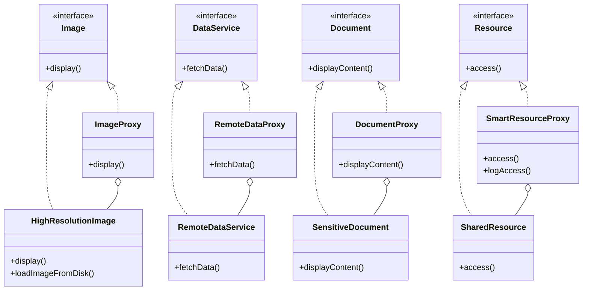

## 4.8.2 Types of Proxies

In the world of software design patterns, the Proxy Pattern is a structural pattern that provides a surrogate or placeholder for another object to control access to it. This pattern is particularly useful in scenarios where direct access to an object is either not feasible or not desirable. Proxies can serve various purposes, such as controlling access, adding additional functionality, or optimizing resource usage. In this section, we will explore four main types of proxies: Virtual Proxy, Remote Proxy, Protection Proxy, and Smart Reference. Each type serves a unique purpose and can be applied in different contexts to solve specific problems.

### Virtual Proxy

**Definition**: A Virtual Proxy is used to control access to resource-intensive objects. It delays the creation and initialization of these objects until they are actually needed, thereby optimizing resource usage and improving performance.

**Use Case**: Imagine an application that loads high-resolution images from a disk. Loading all images at once can be resource-intensive and slow down the application. A Virtual Proxy can be used to load images on demand, only when they are needed for display.

**Example**: Let's consider a scenario where we have a `HighResolutionImage` class that represents a large image file. We can use a Virtual Proxy to manage the loading of this image.

```java
// The Subject interface
interface Image {
    void display();
}

// RealSubject class that represents the actual image
class HighResolutionImage implements Image {
    private String fileName;

    public HighResolutionImage(String fileName) {
        this.fileName = fileName;
        loadImageFromDisk();
    }

    private void loadImageFromDisk() {
        System.out.println("Loading " + fileName);
    }

    @Override
    public void display() {
        System.out.println("Displaying " + fileName);
    }
}

// Proxy class that controls access to the real image
class ImageProxy implements Image {
    private HighResolutionImage highResolutionImage;
    private String fileName;

    public ImageProxy(String fileName) {
        this.fileName = fileName;
    }

    @Override
    public void display() {
        if (highResolutionImage == null) {
            highResolutionImage = new HighResolutionImage(fileName);
        }
        highResolutionImage.display();
    }
}

// Client code
public class ProxyPatternDemo {
    public static void main(String[] args) {
        Image image = new ImageProxy("test_image.jpg");
        // Image will be loaded from disk
        image.display();
        // Image will not be loaded from disk again
        image.display();
    }
}
```

**Benefits**:
- **Lazy Initialization**: The object is created only when it is needed, saving resources.
- **Performance Improvement**: Reduces the initial load time by deferring the creation of resource-intensive objects.

**Considerations**:
- **Complexity**: Introduces additional complexity in the codebase.
- **Synchronization**: In a multi-threaded environment, care must be taken to ensure thread safety.

### Remote Proxy

**Definition**: A Remote Proxy represents an object located in a different address space, typically on a different machine. It is used to communicate with remote objects as if they were local.

**Use Case**: Remote Proxies are commonly used in distributed systems where objects need to interact across network boundaries. For instance, a client application might use a Remote Proxy to interact with a service hosted on a remote server.

**Example**: Consider a scenario where a client application needs to interact with a remote service to fetch data.

```java
// The Subject interface
interface DataService {
    String fetchData();
}

// RealSubject class that represents the remote service
class RemoteDataService implements DataService {
    @Override
    public String fetchData() {
        return "Data from remote service";
    }
}

// Proxy class that represents the remote service
class RemoteDataProxy implements DataService {
    private RemoteDataService remoteDataService;

    @Override
    public String fetchData() {
        if (remoteDataService == null) {
            remoteDataService = new RemoteDataService();
        }
        return remoteDataService.fetchData();
    }
}

// Client code
public class RemoteProxyDemo {
    public static void main(String[] args) {
        DataService dataService = new RemoteDataProxy();
        System.out.println(dataService.fetchData());
    }
}
```

**Benefits**:
- **Abstraction**: Hides the complexity of network communication from the client.
- **Location Transparency**: Allows clients to interact with remote objects as if they were local.

**Considerations**:
- **Network Latency**: Communication over a network can introduce latency.
- **Error Handling**: Network failures and exceptions need to be handled gracefully.

### Protection Proxy

**Definition**: A Protection Proxy controls access to an object based on access rights. It is used to enforce security policies and manage permissions.

**Use Case**: Protection Proxies are useful in scenarios where access to sensitive data or operations needs to be restricted based on user roles or permissions.

**Example**: Let's consider a scenario where we have a `Document` class that represents a sensitive document. We can use a Protection Proxy to manage access to this document.

```java
// The Subject interface
interface Document {
    void displayContent();
}

// RealSubject class that represents the actual document
class SensitiveDocument implements Document {
    private String content;

    public SensitiveDocument(String content) {
        this.content = content;
    }

    @Override
    public void displayContent() {
        System.out.println("Document Content: " + content);
    }
}

// Proxy class that controls access to the document
class DocumentProxy implements Document {
    private SensitiveDocument sensitiveDocument;
    private String userRole;

    public DocumentProxy(String content, String userRole) {
        this.sensitiveDocument = new SensitiveDocument(content);
        this.userRole = userRole;
    }

    @Override
    public void displayContent() {
        if ("ADMIN".equals(userRole)) {
            sensitiveDocument.displayContent();
        } else {
            System.out.println("Access Denied: Insufficient permissions");
        }
    }
}

// Client code
public class ProtectionProxyDemo {
    public static void main(String[] args) {
        Document document = new DocumentProxy("Confidential Document", "USER");
        document.displayContent(); // Access Denied

        Document adminDocument = new DocumentProxy("Confidential Document", "ADMIN");
        adminDocument.displayContent(); // Access Granted
    }
}
```

**Benefits**:
- **Security**: Enforces access control policies and protects sensitive data.
- **Flexibility**: Allows dynamic permission checks based on user roles.

**Considerations**:
- **Performance Overhead**: Additional checks can introduce performance overhead.
- **Complexity**: Managing access rights can increase code complexity.

### Smart Reference

**Definition**: A Smart Reference Proxy adds additional actions when an object is accessed. It can be used to perform operations such as logging, reference counting, or caching.

**Use Case**: Smart References are useful in scenarios where additional actions need to be performed automatically when an object is accessed, such as logging access times or maintaining usage statistics.

**Example**: Consider a scenario where we have a `Resource` class that represents a shared resource. We can use a Smart Reference to log access to this resource.

```java
// The Subject interface
interface Resource {
    void access();
}

// RealSubject class that represents the actual resource
class SharedResource implements Resource {
    @Override
    public void access() {
        System.out.println("Accessing shared resource");
    }
}

// Proxy class that adds additional actions
class SmartResourceProxy implements Resource {
    private SharedResource sharedResource;

    public SmartResourceProxy() {
        this.sharedResource = new SharedResource();
    }

    @Override
    public void access() {
        logAccess();
        sharedResource.access();
    }

    private void logAccess() {
        System.out.println("Logging access to resource");
    }
}

// Client code
public class SmartReferenceDemo {
    public static void main(String[] args) {
        Resource resource = new SmartResourceProxy();
        resource.access(); // Logs access and accesses the resource
    }
}
```

**Benefits**:
- **Additional Functionality**: Automatically performs actions such as logging or caching.
- **Transparency**: The client code remains unaware of the additional actions.

**Considerations**:
- **Overhead**: Additional actions can introduce performance overhead.
- **Complexity**: Managing additional functionality can increase code complexity.

### Visualizing Proxy Types

To better understand the relationships and interactions between different types of proxies, let's visualize the structure using a class diagram.



**Diagram Description**: The diagram illustrates the relationships between the interface, real subject, and proxy classes for each type of proxy. The proxy classes implement the same interface as the real subject, ensuring that they can be used interchangeably by the client.

### Choosing the Right Proxy Type

When deciding which type of proxy to use, consider the specific needs of your application:

- **Virtual Proxy**: Use when you need to defer the creation of resource-intensive objects until they are needed.
- **Remote Proxy**: Use when you need to interact with objects located in different address spaces or on remote servers.
- **Protection Proxy**: Use when you need to enforce access control policies and manage permissions for sensitive data or operations.
- **Smart Reference**: Use when you need to perform additional actions automatically when an object is accessed, such as logging or caching.

### Try It Yourself

To deepen your understanding of proxies, try modifying the code examples provided:

- **Virtual Proxy**: Experiment with different types of resource-intensive objects, such as large data files or complex calculations.
- **Remote Proxy**: Simulate network latency or failures to see how the proxy handles these scenarios.
- **Protection Proxy**: Implement more complex access control policies based on user roles or permissions.
- **Smart Reference**: Add additional actions, such as caching or reference counting, to the smart reference proxy.

### Conclusion

Proxies are a powerful tool in the software engineer's toolkit, providing a flexible way to control access to objects, optimize resource usage, and add additional functionality. By understanding the different types of proxies and their use cases, you can choose the right proxy type for your application's needs and implement it effectively in your Java code.

## Quiz Time!



### What is the primary purpose of a Virtual Proxy?

- [x] To control access to resource-intensive objects by delaying their creation until needed.
- [ ] To represent objects in different address spaces.
- [ ] To manage access rights to an object.
- [ ] To add additional actions when an object is accessed.

> **Explanation:** A Virtual Proxy is used to control access to resource-intensive objects by delaying their creation until they are actually needed, optimizing resource usage.

### Which type of proxy is commonly used in distributed systems?

- [ ] Virtual Proxy
- [x] Remote Proxy
- [ ] Protection Proxy
- [ ] Smart Reference

> **Explanation:** A Remote Proxy is used in distributed systems to represent objects located in different address spaces, allowing communication across network boundaries.

### What additional functionality does a Smart Reference Proxy provide?

- [ ] It delays the creation of resource-intensive objects.
- [ ] It represents remote objects.
- [ ] It manages access rights.
- [x] It adds additional actions when an object is accessed.

> **Explanation:** A Smart Reference Proxy adds additional actions, such as logging or caching, when an object is accessed.

### What is a key benefit of using a Protection Proxy?

- [ ] It improves performance by delaying object creation.
- [ ] It allows interaction with remote objects.
- [x] It enforces access control policies and manages permissions.
- [ ] It adds additional actions when an object is accessed.

> **Explanation:** A Protection Proxy enforces access control policies and manages permissions, providing security for sensitive data or operations.

### Which proxy type would you use to log access times to a resource?

- [ ] Virtual Proxy
- [ ] Remote Proxy
- [ ] Protection Proxy
- [x] Smart Reference

> **Explanation:** A Smart Reference Proxy can be used to log access times or perform other additional actions when a resource is accessed.

### What is a potential downside of using a Virtual Proxy?

- [ ] Increased network latency
- [ ] Complexity in managing access rights
- [x] Additional complexity in the codebase
- [ ] Lack of additional functionality

> **Explanation:** A Virtual Proxy introduces additional complexity in the codebase due to the deferred creation and initialization of objects.

### How does a Remote Proxy handle network failures?

- [ ] It delays object creation until needed.
- [x] It requires error handling to manage network failures gracefully.
- [ ] It enforces access control policies.
- [ ] It adds additional actions when an object is accessed.

> **Explanation:** A Remote Proxy requires error handling to manage network failures and exceptions gracefully, as it involves communication over a network.

### What is the main consideration when using a Protection Proxy?

- [ ] Network latency
- [x] Performance overhead due to additional checks
- [ ] Delayed object creation
- [ ] Lack of additional functionality

> **Explanation:** A Protection Proxy can introduce performance overhead due to the additional checks required to enforce access control policies.

### Which proxy type is best for optimizing resource usage?

- [x] Virtual Proxy
- [ ] Remote Proxy
- [ ] Protection Proxy
- [ ] Smart Reference

> **Explanation:** A Virtual Proxy is best for optimizing resource usage by delaying the creation of resource-intensive objects until they are needed.

### True or False: A Smart Reference Proxy can perform caching.

- [x] True
- [ ] False

> **Explanation:** True. A Smart Reference Proxy can perform caching or other additional actions when an object is accessed.


