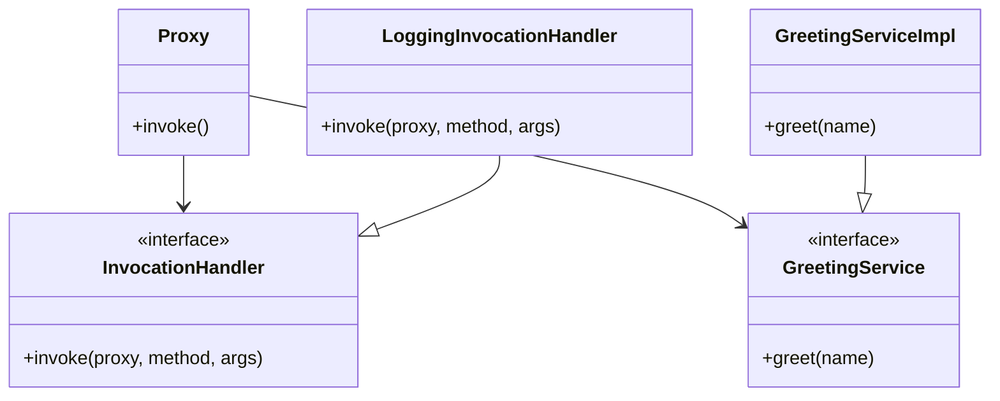

## 4.8.3 Dynamic Proxies in Java

Dynamic proxies in Java provide a powerful mechanism for creating proxy instances at runtime. This feature is part of the Java Reflection API and allows developers to intercept method calls on proxy instances, enabling a wide range of applications such as Aspect-Oriented Programming (AOP), logging, and transaction management. In this section, we will delve into the details of dynamic proxies, explore how to implement them using Java's `Proxy` class and `InvocationHandler`, and discuss their practical uses.

### Introduction to Dynamic Proxies

Java's dynamic proxies are part of the `java.lang.reflect` package, which provides classes and interfaces for obtaining reflective information about classes and objects. A dynamic proxy allows you to create a proxy instance for a set of interfaces at runtime. This proxy can then intercept method calls and delegate them to an `InvocationHandler`, which defines the behavior of the proxy.

#### Key Concepts

- **Proxy**: An object that acts as an intermediary for another object, intercepting method calls and potentially altering their behavior.
- **InvocationHandler**: An interface that must be implemented to define the behavior of a proxy instance. It contains a single method, `invoke`, which is called whenever a method is invoked on the proxy.

### Creating a Dynamic Proxy

To create a dynamic proxy in Java, you use the `Proxy` class's static method `newProxyInstance`. This method requires three parameters:

1. **ClassLoader**: The class loader to define the proxy class.
2. **Interfaces**: An array of interfaces that the proxy class should implement.
3. **InvocationHandler**: An instance of a class that implements the `InvocationHandler` interface.

Let's walk through the process of creating a dynamic proxy with a simple example.

#### Step-by-Step Example

Suppose we have an interface `GreetingService`:

```java
public interface GreetingService {
    void greet(String name);
}
```

We want to create a dynamic proxy for this interface that logs every method call. First, we need to implement the `InvocationHandler` interface:

```java
import java.lang.reflect.InvocationHandler;
import java.lang.reflect.Method;

public class LoggingInvocationHandler implements InvocationHandler {
    private final Object target;

    public LoggingInvocationHandler(Object target) {
        this.target = target;
    }

    @Override
    public Object invoke(Object proxy, Method method, Object[] args) throws Throwable {
        System.out.println("Method " + method.getName() + " is called with args: " + java.util.Arrays.toString(args));
        return method.invoke(target, args);
    }
}
```

Next, we create the dynamic proxy:

```java
import java.lang.reflect.Proxy;

public class DynamicProxyDemo {
    public static void main(String[] args) {
        GreetingService originalService = new GreetingServiceImpl();
        GreetingService proxyInstance = (GreetingService) Proxy.newProxyInstance(
                GreetingService.class.getClassLoader(),
                new Class[]{GreetingService.class},
                new LoggingInvocationHandler(originalService)
        );

        proxyInstance.greet("World");
    }
}

class GreetingServiceImpl implements GreetingService {
    @Override
    public void greet(String name) {
        System.out.println("Hello, " + name);
    }
}
```

In this example, the `LoggingInvocationHandler` intercepts calls to the `greet` method, logs the method name and arguments, and then delegates the call to the original `GreetingServiceImpl` instance.

### Understanding `InvocationHandler`

The `InvocationHandler` interface is central to the dynamic proxy mechanism. It allows you to define custom behavior for method calls on proxy instances. The `invoke` method has the following signature:

```java
Object invoke(Object proxy, Method method, Object[] args) throws Throwable;
```

- **proxy**: The proxy instance on which the method was invoked.
- **method**: The `Method` object corresponding to the interface method invoked on the proxy.
- **args**: An array of objects containing the values of the arguments passed in the method invocation.

The `invoke` method can perform any logic, such as logging, security checks, or transaction management, before or after delegating the call to the target object.

### Use Cases for Dynamic Proxies

Dynamic proxies are versatile and can be used in various scenarios:

#### Aspect-Oriented Programming (AOP)

Dynamic proxies are commonly used in AOP to implement cross-cutting concerns like logging, security, and transaction management. By intercepting method calls, you can apply additional behavior without modifying the original class.

#### Logging

As demonstrated in the example, dynamic proxies can log method calls, arguments, and return values, providing valuable insights for debugging and monitoring.

#### Transaction Management

Dynamic proxies can manage transactions by starting a transaction before a method call and committing or rolling back the transaction based on the method's success or failure.

#### Remote Method Invocation (RMI)

Dynamic proxies can be used to create client-side stubs for remote services, allowing method calls to be forwarded to a remote server transparently.

### Benefits of Dynamic Proxies

Dynamic proxies offer several advantages:

- **Reduced Boilerplate Code**: By using dynamic proxies, you can avoid writing repetitive code for common tasks like logging and transaction management.
- **Separation of Concerns**: Dynamic proxies enable you to separate cross-cutting concerns from business logic, leading to cleaner and more maintainable code.
- **Flexibility**: You can easily change the behavior of a proxy by modifying the `InvocationHandler`, without altering the original class or interface.

### Visualizing Dynamic Proxies

To better understand how dynamic proxies work, let's visualize the process using a class diagram:



In this diagram, the `Proxy` class represents the dynamic proxy instance, which implements the `GreetingService` interface. The `LoggingInvocationHandler` is an implementation of the `InvocationHandler` interface, responsible for handling method calls on the proxy.

### Try It Yourself

To deepen your understanding of dynamic proxies, try modifying the example code:

- **Add a new method** to the `GreetingService` interface and implement it in `GreetingServiceImpl`. Update the `LoggingInvocationHandler` to log calls to this new method.
- **Experiment with different behaviors** in the `invoke` method, such as timing method execution or conditionally blocking certain method calls.
- **Create a proxy for a different interface** and explore how dynamic proxies can be applied to other use cases.

### References and Further Reading

For more information on dynamic proxies and related topics, consider exploring the following resources:

- [Java Documentation on Proxy](https://docs.oracle.com/javase/8/docs/api/java/lang/reflect/Proxy.html)
- [Java Reflection API](https://docs.oracle.com/javase/tutorial/reflect/)
- [Aspect-Oriented Programming with Spring](https://spring.io/guides/gs/aop/)

### Knowledge Check

To reinforce your understanding of dynamic proxies, consider the following questions:

- What are the key components of a dynamic proxy in Java?
- How does the `InvocationHandler` interface facilitate method interception?
- In what scenarios might dynamic proxies be particularly useful?

### Conclusion

Dynamic proxies in Java provide a powerful tool for intercepting and modifying method calls at runtime. By leveraging the `Proxy` class and `InvocationHandler` interface, you can implement cross-cutting concerns like logging and transaction management in a clean and maintainable way. As you continue to explore Java's reflection capabilities, dynamic proxies will prove to be an invaluable asset in your software engineering toolkit.

## Quiz Time!



### What is the primary purpose of a dynamic proxy in Java?

- [x] To intercept method calls and delegate them to an `InvocationHandler`.
- [ ] To create a static proxy class at compile time.
- [ ] To replace the need for interfaces in Java.
- [ ] To enhance performance by bypassing method calls.

> **Explanation:** Dynamic proxies are used to intercept method calls on proxy instances and delegate them to an `InvocationHandler`, allowing for custom behavior.

### Which method must be implemented when creating an `InvocationHandler`?

- [x] `invoke`
- [ ] `handle`
- [ ] `process`
- [ ] `execute`

> **Explanation:** The `InvocationHandler` interface requires the implementation of the `invoke` method, which is called whenever a method is invoked on a proxy instance.

### What are some common use cases for dynamic proxies?

- [x] Logging, AOP, transaction management
- [ ] GUI development, data storage, networking
- [ ] Machine learning, AI, data analysis
- [ ] Game development, graphics rendering, animation

> **Explanation:** Dynamic proxies are often used for logging, Aspect-Oriented Programming (AOP), and transaction management, among other cross-cutting concerns.

### How does a dynamic proxy reduce boilerplate code?

- [x] By allowing common behaviors to be defined in a single `InvocationHandler`.
- [ ] By automatically generating all necessary classes at runtime.
- [ ] By eliminating the need for interfaces.
- [ ] By compiling code more efficiently.

> **Explanation:** Dynamic proxies reduce boilerplate code by allowing common behaviors to be encapsulated in an `InvocationHandler`, which can be reused across multiple proxy instances.

### What is the role of the `Proxy.newProxyInstance` method?

- [x] To create a new proxy instance that implements specified interfaces.
- [ ] To compile a new class at runtime.
- [ ] To replace existing classes with proxy classes.
- [ ] To delete unused classes from memory.

> **Explanation:** The `Proxy.newProxyInstance` method is used to create a new proxy instance that implements the specified interfaces and delegates method calls to an `InvocationHandler`.

### Which of the following is NOT a benefit of using dynamic proxies?

- [ ] Reduced boilerplate code
- [ ] Separation of concerns
- [x] Improved execution speed
- [ ] Flexibility in modifying behavior

> **Explanation:** While dynamic proxies offer reduced boilerplate code, separation of concerns, and flexibility, they do not inherently improve execution speed.

### What parameters are required by `Proxy.newProxyInstance`?

- [x] ClassLoader, interfaces, InvocationHandler
- [ ] ClassLoader, interfaces, target object
- [ ] Interfaces, target object, method
- [ ] Method, arguments, return type

> **Explanation:** `Proxy.newProxyInstance` requires a ClassLoader, an array of interfaces, and an `InvocationHandler` to create a proxy instance.

### In a dynamic proxy, what does the `invoke` method's `args` parameter represent?

- [x] The arguments passed to the method being invoked.
- [ ] The return value of the method being invoked.
- [ ] The proxy instance itself.
- [ ] The exception thrown by the method.

> **Explanation:** The `args` parameter in the `invoke` method represents the arguments passed to the method being invoked on the proxy.

### Can dynamic proxies be used with classes that do not implement interfaces?

- [ ] Yes, dynamic proxies can be used with any class.
- [x] No, dynamic proxies require interfaces to function.
- [ ] Yes, but only with abstract classes.
- [ ] No, dynamic proxies are only for final classes.

> **Explanation:** Dynamic proxies in Java require interfaces to function, as they create proxy instances that implement specified interfaces.

### True or False: Dynamic proxies can be used to implement cross-cutting concerns like security and caching.

- [x] True
- [ ] False

> **Explanation:** True. Dynamic proxies are well-suited for implementing cross-cutting concerns such as security and caching by intercepting method calls and applying additional behavior.


