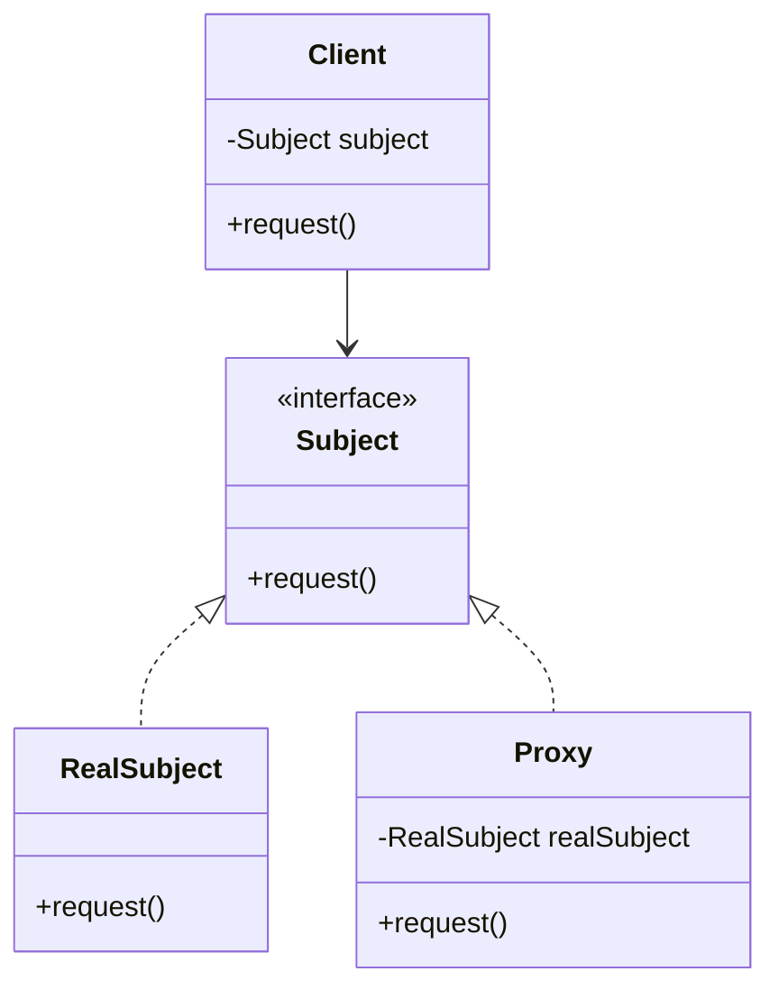
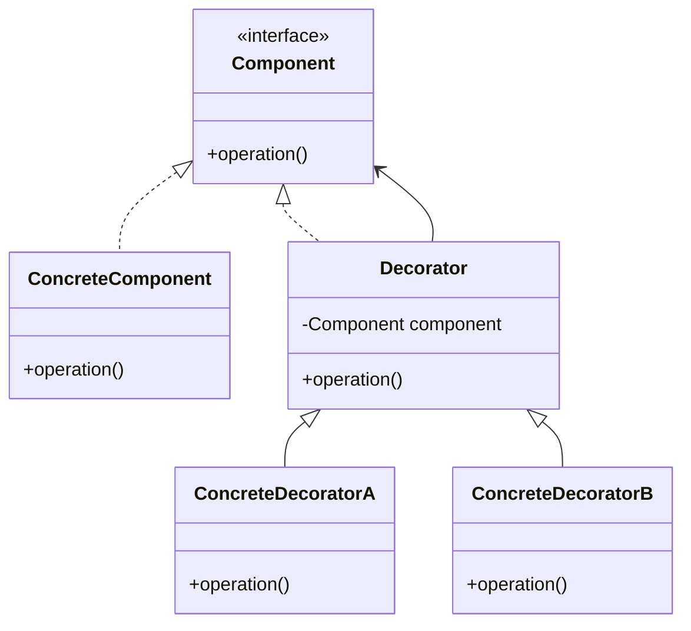

## 4.8.4 Proxy vs. Decorator Pattern

In the realm of software design patterns, the Proxy and Decorator patterns are often discussed together due to their structural similarities. Both patterns involve wrapping an object to extend its functionality, but they serve distinct purposes and are used in different contexts. Understanding the nuances between these two patterns is crucial for expert software engineers who aim to write maintainable and scalable code.

### Understanding the Proxy Pattern

**Proxy Pattern** is a structural design pattern that provides a surrogate or placeholder for another object to control access to it. The proxy object acts as an intermediary between the client and the real object, allowing for additional functionality such as lazy initialization, access control, logging, or caching.

#### Key Characteristics of Proxy Pattern

- **Control Access**: The primary purpose of a proxy is to control access to the real object. This can involve checking permissions, managing resource usage, or delaying object creation until it's needed.
- **Interface Consistency**: The proxy implements the same interface as the real object, ensuring that the client can interact with the proxy as if it were the real object.
- **Types of Proxies**: Common types include virtual proxies (for lazy loading), protection proxies (for access control), and remote proxies (for accessing objects in different address spaces).

#### Example: Virtual Proxy in Java

Let's consider a scenario where we have a large image that is expensive to load. We can use a virtual proxy to delay the loading of the image until it is actually needed.

```java
interface Image {
    void display();
}

class RealImage implements Image {
    private String filename;

    public RealImage(String filename) {
        this.filename = filename;
        loadFromDisk();
    }

    private void loadFromDisk() {
        System.out.println("Loading " + filename);
    }

    @Override
    public void display() {
        System.out.println("Displaying " + filename);
    }
}

class ProxyImage implements Image {
    private RealImage realImage;
    private String filename;

    public ProxyImage(String filename) {
        this.filename = filename;
    }

    @Override
    public void display() {
        if (realImage == null) {
            realImage = new RealImage(filename);
        }
        realImage.display();
    }
}

public class ProxyPatternDemo {
    public static void main(String[] args) {
        Image image = new ProxyImage("test.jpg");
        // Image will be loaded from disk
        image.display();
        // Image will not be loaded from disk
        image.display();
    }
}
```

In this example, `ProxyImage` controls the access to `RealImage`, loading it only when necessary.

### Understanding the Decorator Pattern

**Decorator Pattern** is another structural design pattern that allows behavior to be added to individual objects, either statically or dynamically, without affecting the behavior of other objects from the same class. The decorator pattern is often used to adhere to the Single Responsibility Principle as it allows functionality to be divided between classes with unique areas of concern.

#### Key Characteristics of Decorator Pattern

- **Add Responsibilities**: The primary purpose of a decorator is to add new responsibilities to an object dynamically.
- **Flexible Composition**: Decorators provide a flexible alternative to subclassing for extending functionality.
- **Interface Consistency**: Like proxies, decorators implement the same interface as the objects they decorate, ensuring that they can be used interchangeably.

#### Example: Decorator Pattern in Java

Consider a scenario where we want to add additional features to a simple coffee order. We can use decorators to add milk, sugar, or other ingredients.

```java
interface Coffee {
    String getDescription();
    double getCost();
}

class SimpleCoffee implements Coffee {
    @Override
    public String getDescription() {
        return "Simple coffee";
    }

    @Override
    public double getCost() {
        return 5.0;
    }
}

abstract class CoffeeDecorator implements Coffee {
    protected Coffee decoratedCoffee;

    public CoffeeDecorator(Coffee coffee) {
        this.decoratedCoffee = coffee;
    }

    @Override
    public String getDescription() {
        return decoratedCoffee.getDescription();
    }

    @Override
    public double getCost() {
        return decoratedCoffee.getCost();
    }
}

class MilkDecorator extends CoffeeDecorator {
    public MilkDecorator(Coffee coffee) {
        super(coffee);
    }

    @Override
    public String getDescription() {
        return decoratedCoffee.getDescription() + ", Milk";
    }

    @Override
    public double getCost() {
        return decoratedCoffee.getCost() + 1.5;
    }
}

class SugarDecorator extends CoffeeDecorator {
    public SugarDecorator(Coffee coffee) {
        super(coffee);
    }

    @Override
    public String getDescription() {
        return decoratedCoffee.getDescription() + ", Sugar";
    }

    @Override
    public double getCost() {
        return decoratedCoffee.getCost() + 0.5;
    }
}

public class DecoratorPatternDemo {
    public static void main(String[] args) {
        Coffee coffee = new SimpleCoffee();
        System.out.println(coffee.getDescription() + " $" + coffee.getCost());

        Coffee milkCoffee = new MilkDecorator(new SimpleCoffee());
        System.out.println(milkCoffee.getDescription() + " $" + milkCoffee.getCost());

        Coffee sugarMilkCoffee = new SugarDecorator(new MilkDecorator(new SimpleCoffee()));
        System.out.println(sugarMilkCoffee.getDescription() + " $" + sugarMilkCoffee.getCost());
    }
}
```

In this example, we use decorators to add milk and sugar to a simple coffee, dynamically enhancing its functionality.

### Comparing Proxy and Decorator Patterns

While both Proxy and Decorator patterns involve wrapping objects, their intents and applications differ significantly.

#### Intent and Purpose

- **Proxy**: The intent is to control access to an object. It acts as an intermediary, adding a layer of control over the object it wraps.
- **Decorator**: The intent is to add new functionality to an object. It enhances or modifies the behavior of the object it wraps.

#### Structural Differences

Let's visualize the structural differences using UML diagrams.



**Diagram 1: Proxy Pattern Structure**

In the Proxy pattern, the `Proxy` class implements the `Subject` interface and controls access to the `RealSubject`.



**Diagram 2: Decorator Pattern Structure**

In the Decorator pattern, the `Decorator` class wraps a `Component` and adds additional behavior.

#### Use Cases

- **Proxy**: Use when you need to control access to an object, such as in lazy loading, access control, logging, or remote access scenarios.
- **Decorator**: Use when you need to add responsibilities to objects dynamically, such as in GUI components, stream processing, or adding features to objects without altering their structure.

#### Design Motivations

- **Proxy**: Motivated by the need to manage access and control over a resource. It is often used to defer resource-intensive operations until necessary.
- **Decorator**: Motivated by the need to extend functionality without modifying existing code. It provides a flexible way to add features to individual objects.

### Try It Yourself

To deepen your understanding, try modifying the examples provided:

- **Proxy Pattern**: Implement a protection proxy that checks user permissions before allowing access to a method.
- **Decorator Pattern**: Create additional decorators for the coffee example, such as `VanillaDecorator` or `WhippedCreamDecorator`, and see how they can be combined.

### Knowledge Check

- Explain the primary intent of the Proxy pattern.
- Describe a scenario where the Decorator pattern would be more appropriate than the Proxy pattern.
- What are the key differences in the structure of Proxy and Decorator patterns?

### Conclusion

Understanding the differences between the Proxy and Decorator patterns is essential for expert software engineers. While both patterns involve wrapping objects, their purposes and applications are distinct. By mastering these patterns, you can write more flexible, maintainable, and scalable code.

## Quiz Time!



### What is the primary purpose of the Proxy pattern?

- [x] To control access to an object
- [ ] To add responsibilities to an object dynamically
- [ ] To create a new instance of an object
- [ ] To remove responsibilities from an object

> **Explanation:** The Proxy pattern is used to control access to an object, often adding a layer of control such as lazy initialization or access permissions.

### In which scenario would you use the Decorator pattern?

- [ ] To control access to a remote object
- [x] To add new functionality to an object dynamically
- [ ] To ensure a single instance of a class
- [ ] To manage a pool of reusable objects

> **Explanation:** The Decorator pattern is used to add new functionality to an object dynamically, allowing for flexible extension of behavior.

### Which pattern involves implementing the same interface as the object it wraps?

- [x] Both Proxy and Decorator
- [ ] Only Proxy
- [ ] Only Decorator
- [ ] Neither Proxy nor Decorator

> **Explanation:** Both Proxy and Decorator patterns involve implementing the same interface as the object they wrap to ensure they can be used interchangeably.

### What is a common use case for the Proxy pattern?

- [x] Lazy loading of resources
- [ ] Adding new features to a class
- [ ] Sorting a collection
- [ ] Managing a database connection

> **Explanation:** A common use case for the Proxy pattern is lazy loading, where the real object is loaded only when it is needed.

### How does the Decorator pattern adhere to the Single Responsibility Principle?

- [x] By dividing functionality into separate classes
- [ ] By centralizing all functionality in one class
- [ ] By ensuring only one instance of a class
- [ ] By removing unnecessary functionality

> **Explanation:** The Decorator pattern adheres to the Single Responsibility Principle by dividing functionality into separate classes, each with a unique area of concern.

### What is the main structural difference between Proxy and Decorator patterns?

- [x] Proxy controls access, while Decorator adds functionality
- [ ] Proxy adds functionality, while Decorator controls access
- [ ] Proxy and Decorator have the same structure
- [ ] Proxy and Decorator do not wrap objects

> **Explanation:** The main structural difference is that Proxy controls access to an object, while Decorator adds functionality to an object.

### Which pattern is best suited for adding features to a GUI component?

- [ ] Proxy
- [x] Decorator
- [ ] Factory
- [ ] Singleton

> **Explanation:** The Decorator pattern is best suited for adding features to a GUI component, allowing for dynamic enhancement of functionality.

### What is a virtual proxy?

- [x] A proxy that delays the creation of an object until it is needed
- [ ] A proxy that adds new features to an object
- [ ] A proxy that ensures only one instance of a class
- [ ] A proxy that manages a pool of objects

> **Explanation:** A virtual proxy is a type of proxy that delays the creation of an object until it is needed, often used for resource-intensive objects.

### Which pattern would you use to add logging functionality to an object?

- [ ] Proxy
- [x] Decorator
- [ ] Singleton
- [ ] Factory

> **Explanation:** The Decorator pattern is often used to add logging functionality to an object, allowing for dynamic addition of behavior.

### True or False: The Proxy pattern can be used for remote object access.

- [x] True
- [ ] False

> **Explanation:** True. The Proxy pattern can be used for remote object access by providing a surrogate that communicates with the remote object.


