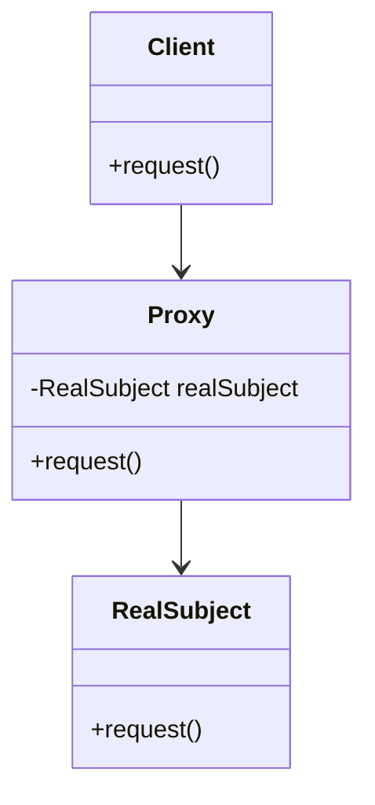

## 4.8.5 Use Cases and Examples

The Proxy pattern is a structural design pattern that provides a surrogate or placeholder for another object to control access to it. This pattern is particularly useful in scenarios where direct access to an object is either costly or undesirable. In this section, we will explore various practical applications of the Proxy pattern, demonstrating its versatility and effectiveness in real-world software engineering challenges.

### Use Case 1: Lazy Initialization with Virtual Proxy

Lazy initialization is a common technique used to defer the creation of an object until it is actually needed. This can be particularly beneficial when dealing with expensive resources, such as large data sets or complex objects. The Virtual Proxy is a type of Proxy pattern that facilitates lazy initialization.

#### Example: Image Viewer Application

Consider an image viewer application where images are loaded from disk. Loading images can be resource-intensive, especially if the images are large. By using a Virtual Proxy, we can delay loading the image until it is actually needed for display.

```java
// Image interface
interface Image {
    void display();
}

// RealImage class that loads image from disk
class RealImage implements Image {
    private String filename;

    public RealImage(String filename) {
        this.filename = filename;
        loadImageFromDisk();
    }

    private void loadImageFromDisk() {
        System.out.println("Loading " + filename);
    }

    @Override
    public void display() {
        System.out.println("Displaying " + filename);
    }
}

// ProxyImage class that controls access to RealImage
class ProxyImage implements Image {
    private RealImage realImage;
    private String filename;

    public ProxyImage(String filename) {
        this.filename = filename;
    }

    @Override
    public void display() {
        if (realImage == null) {
            realImage = new RealImage(filename);
        }
        realImage.display();
    }
}

// Client code
public class ProxyPatternDemo {
    public static void main(String[] args) {
        Image image = new ProxyImage("test_image.jpg");
        // Image will be loaded from disk
        image.display();
        // Image will not be loaded from disk
        image.display();
    }
}
```

**Explanation**: In this example, the `ProxyImage` class acts as a proxy for `RealImage`. The `RealImage` is only instantiated when the `display()` method is called for the first time, thus saving resources if the image is never actually displayed.

**Advantages**:
- **Performance**: Reduces the initial load time by deferring resource-intensive operations.
- **Resource Management**: Minimizes memory usage by only loading necessary resources.

### Use Case 2: Securing Access with Protection Proxy

In scenarios where access to certain methods or resources needs to be controlled, the Protection Proxy can be employed. This type of proxy ensures that only authorized users or processes can access specific functionalities.

#### Example: Secure Document Access

Imagine a document management system where certain documents are restricted to specific users. A Protection Proxy can enforce access control policies.

```java
// Document interface
interface Document {
    void displayContent();
}

// RealDocument class that holds document content
class RealDocument implements Document {
    private String content;

    public RealDocument(String content) {
        this.content = content;
    }

    @Override
    public void displayContent() {
        System.out.println("Document Content: " + content);
    }
}

// ProxyDocument class that controls access to RealDocument
class ProxyDocument implements Document {
    private RealDocument realDocument;
    private String userRole;

    public ProxyDocument(String content, String userRole) {
        this.realDocument = new RealDocument(content);
        this.userRole = userRole;
    }

    @Override
    public void displayContent() {
        if (userRole.equals("ADMIN")) {
            realDocument.displayContent();
        } else {
            System.out.println("Access Denied: Insufficient Permissions");
        }
    }
}

// Client code
public class ProtectionProxyDemo {
    public static void main(String[] args) {
        Document document = new ProxyDocument("Sensitive Document Content", "USER");
        document.displayContent(); // Access Denied

        Document adminDocument = new ProxyDocument("Sensitive Document Content", "ADMIN");
        adminDocument.displayContent(); // Document Content displayed
    }
}
```

**Explanation**: Here, the `ProxyDocument` checks the user's role before granting access to the document's content. Only users with the "ADMIN" role can view the content.

**Advantages**:
- **Security**: Enforces access control policies, protecting sensitive data.
- **Flexibility**: Easily adaptable to different access control requirements.

### Use Case 3: Remote Object Access with Remote Proxy

The Remote Proxy pattern is used to interact with objects located in different address spaces, such as remote servers or services. This pattern is common in distributed systems where objects need to communicate over a network.

#### Example: Remote Service Invocation

Consider a scenario where a client application needs to interact with a remote weather service. The Remote Proxy can manage the network communication and provide a local interface for the client.

```java
// WeatherService interface
interface WeatherService {
    String getWeatherReport(String location);
}

// RealWeatherService class that connects to a remote service
class RealWeatherService implements WeatherService {
    @Override
    public String getWeatherReport(String location) {
        // Simulate network call
        return "Weather report for " + location;
    }
}

// ProxyWeatherService class that acts as a remote proxy
class ProxyWeatherService implements WeatherService {
    private RealWeatherService realWeatherService;

    @Override
    public String getWeatherReport(String location) {
        if (realWeatherService == null) {
            realWeatherService = new RealWeatherService();
        }
        return realWeatherService.getWeatherReport(location);
    }
}

// Client code
public class RemoteProxyDemo {
    public static void main(String[] args) {
        WeatherService weatherService = new ProxyWeatherService();
        System.out.println(weatherService.getWeatherReport("New York"));
    }
}
```

**Explanation**: The `ProxyWeatherService` acts as a local representative for the `RealWeatherService`, which simulates a remote service. The client interacts with the proxy as if it were the actual service.

**Advantages**:
- **Abstraction**: Hides the complexity of network communication from the client.
- **Scalability**: Facilitates interaction with distributed systems.

### Use Case 4: Resource Management with Smart Reference

The Smart Reference Proxy pattern is used to manage additional responsibilities like reference counting, resource locking, or caching. This pattern is useful when managing resources that require careful handling.

#### Example: Reference Counting for Database Connections

In a database application, managing connections efficiently is crucial. A Smart Reference Proxy can help by implementing reference counting to manage connection lifecycles.

```java
// DatabaseConnection interface
interface DatabaseConnection {
    void connect();
    void disconnect();
}

// RealDatabaseConnection class that handles actual connection
class RealDatabaseConnection implements DatabaseConnection {
    @Override
    public void connect() {
        System.out.println("Connecting to the database...");
    }

    @Override
    public void disconnect() {
        System.out.println("Disconnecting from the database...");
    }
}

// ProxyDatabaseConnection class that manages reference counting
class ProxyDatabaseConnection implements DatabaseConnection {
    private RealDatabaseConnection realDatabaseConnection;
    private int referenceCount = 0;

    @Override
    public void connect() {
        if (realDatabaseConnection == null) {
            realDatabaseConnection = new RealDatabaseConnection();
        }
        referenceCount++;
        realDatabaseConnection.connect();
    }

    @Override
    public void disconnect() {
        if (referenceCount > 0) {
            referenceCount--;
            if (referenceCount == 0) {
                realDatabaseConnection.disconnect();
                realDatabaseConnection = null;
            }
        }
    }
}

// Client code
public class SmartReferenceProxyDemo {
    public static void main(String[] args) {
        DatabaseConnection connection = new ProxyDatabaseConnection();
        connection.connect(); // Connecting to the database...
        connection.connect(); // Already connected, reference count increases
        connection.disconnect(); // Reference count decreases
        connection.disconnect(); // Disconnecting from the database...
    }
}
```

**Explanation**: The `ProxyDatabaseConnection` manages a reference count to ensure that the database connection is only closed when all references are released.

**Advantages**:
- **Efficiency**: Optimizes resource usage by managing connections based on demand.
- **Reliability**: Prevents premature resource release, ensuring stability.

### Visualizing the Proxy Pattern

To better understand the Proxy pattern, let's visualize the interaction between the client, proxy, and real subject using a class diagram.



**Diagram Explanation**: 
- The `Client` interacts with the `Proxy`, which in turn delegates the request to the `RealSubject`.
- The `Proxy` holds a reference to the `RealSubject` and controls access to it.

### When to Use the Proxy Pattern

Consider using the Proxy pattern in the following scenarios:
- **Lazy Initialization**: When you need to defer the creation of expensive objects until they are needed.
- **Access Control**: When you need to enforce access restrictions on certain methods or resources.
- **Remote Access**: When interacting with remote services or APIs, where direct access is not feasible.
- **Resource Management**: When managing resources that require careful handling, such as database connections or file handles.

### Try It Yourself

Experiment with the provided examples by:
- Modifying the `ProxyImage` to handle different image formats.
- Extending the `ProxyDocument` to support multiple user roles with varying access levels.
- Implementing a caching mechanism in the `ProxyWeatherService` to store recent weather reports.
- Adding logging functionality to the `ProxyDatabaseConnection` to track connection usage.

### Conclusion

The Proxy pattern is a powerful tool in a software engineer's toolkit, offering a flexible way to control access to objects and manage additional responsibilities. By understanding and applying the Proxy pattern, you can enhance the performance, security, and maintainability of your Java applications.

## Quiz Time!



### What is the primary purpose of the Proxy pattern?

- [x] To control access to another object
- [ ] To enhance the performance of algorithms
- [ ] To simplify complex code structures
- [ ] To manage memory usage

> **Explanation:** The Proxy pattern is primarily used to control access to another object, often adding additional functionality like lazy initialization or access control.

### Which type of Proxy is used for lazy initialization?

- [x] Virtual Proxy
- [ ] Protection Proxy
- [ ] Remote Proxy
- [ ] Smart Reference Proxy

> **Explanation:** A Virtual Proxy is used for lazy initialization, deferring the creation of an object until it is needed.

### In the Protection Proxy example, what role does the Proxy play?

- [x] It enforces access control policies
- [ ] It manages network communication
- [ ] It handles resource locking
- [ ] It optimizes memory usage

> **Explanation:** The Protection Proxy enforces access control policies, ensuring that only authorized users can access certain functionalities.

### What is a key advantage of using a Remote Proxy?

- [x] It abstracts network communication from the client
- [ ] It enhances local computation speed
- [ ] It reduces code complexity
- [ ] It manages memory allocation

> **Explanation:** A Remote Proxy abstracts the complexity of network communication, allowing the client to interact with remote services as if they were local.

### How does a Smart Reference Proxy manage resources?

- [x] By implementing reference counting
- [ ] By caching data
- [ ] By deferring object creation
- [ ] By encrypting data

> **Explanation:** A Smart Reference Proxy manages resources by implementing reference counting, ensuring that resources are only released when no longer needed.

### What is a common use case for the Proxy pattern?

- [x] Access control for sensitive data
- [ ] Sorting large datasets
- [ ] Rendering complex graphics
- [ ] Compiling source code

> **Explanation:** The Proxy pattern is commonly used for access control, especially for sensitive data or restricted functionalities.

### Which Proxy type is best suited for interacting with remote services?

- [x] Remote Proxy
- [ ] Virtual Proxy
- [ ] Protection Proxy
- [ ] Smart Reference Proxy

> **Explanation:** A Remote Proxy is specifically designed for interacting with remote services, managing the necessary network communication.

### What does the Proxy pattern add to the client-object interaction?

- [x] An additional layer of control
- [ ] A direct connection
- [ ] A simplified interface
- [ ] A faster execution path

> **Explanation:** The Proxy pattern adds an additional layer of control, allowing for functionalities like access control and lazy initialization.

### In the provided examples, what does the ProxyImage class do?

- [x] Delays image loading until display is needed
- [ ] Enhances image resolution
- [ ] Compresses image data
- [ ] Converts image formats

> **Explanation:** The ProxyImage class delays the loading of an image until it is actually needed for display, demonstrating lazy initialization.

### True or False: The Proxy pattern can only be used for network communication.

- [ ] True
- [x] False

> **Explanation:** False. The Proxy pattern is versatile and can be used for various purposes, including lazy initialization, access control, and resource management, not just network communication.


