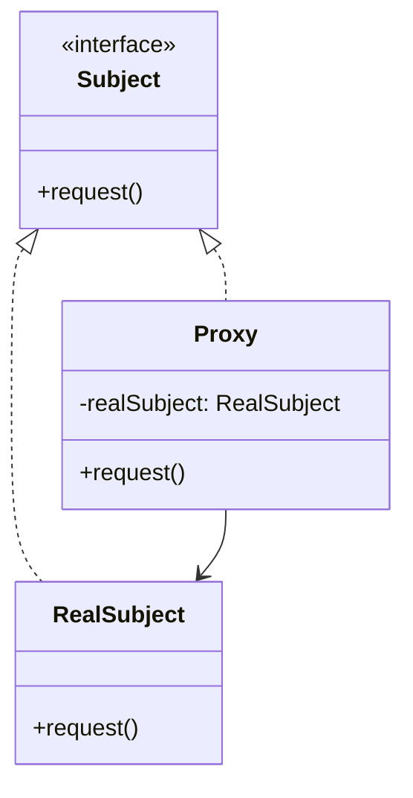
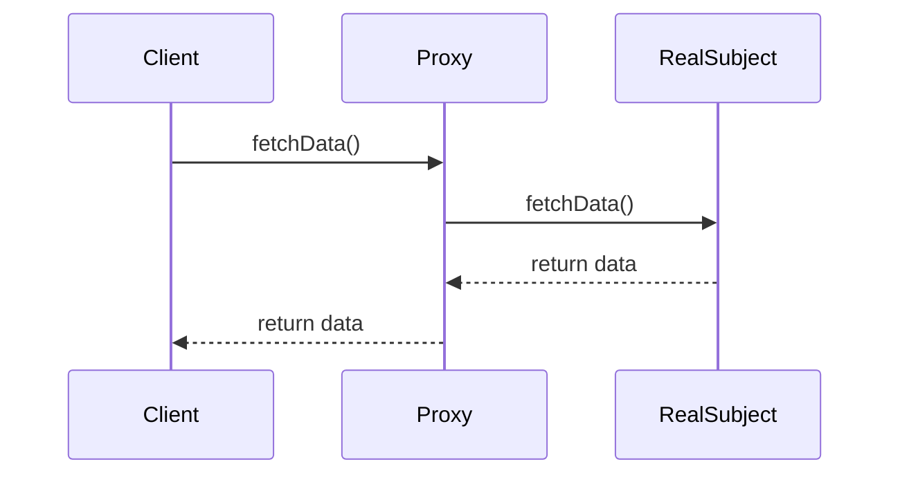

## 4.8 Proxy Pattern

### Introduction to the Proxy Pattern

In the realm of software design, the Proxy Pattern stands out as a powerful structural pattern that provides a surrogate or placeholder for another object to control access to it. This pattern is particularly useful when direct access to an object is either undesirable or impractical. By introducing a level of indirection, the Proxy Pattern allows for additional functionalities such as lazy initialization, access control, logging, and more.

### Problem Statement

Imagine a scenario where you have a resource-intensive object, such as a large image or a complex network connection. Instantiating such an object directly might be costly in terms of performance or memory usage. Additionally, there might be situations where you need to control access to sensitive resources, ensuring that only authorized users can interact with them. The Proxy Pattern addresses these challenges by providing a controlled interface to the underlying object, thereby enhancing flexibility and security.

### Structure of the Proxy Pattern

The Proxy Pattern involves three main components:

1. **Subject**: This is an interface that defines the common operations for both the RealSubject and the Proxy. It ensures that the Proxy can be used interchangeably with the RealSubject.

2. **RealSubject**: This is the actual object that the Proxy represents. It contains the core functionality that clients are interested in.

3. **Proxy**: This acts as an intermediary between the client and the RealSubject. It controls access to the RealSubject and may add additional behavior.

#### UML Diagram

To better understand the interactions between these components, let's visualize the Proxy Pattern using a UML diagram.



**Diagram Description**: The UML diagram illustrates the relationship between the Subject interface, the RealSubject, and the Proxy. The Proxy holds a reference to the RealSubject and implements the Subject interface, allowing it to be used in place of the RealSubject.

### Types of Proxies

The Proxy Pattern can be implemented in various forms, each serving a different purpose:

1. **Virtual Proxy**: This type of proxy is used to manage the creation and initialization of resource-intensive objects. It defers the creation of the RealSubject until it is absolutely necessary.

2. **Remote Proxy**: This proxy represents an object located in a different address space, such as on a different machine. It handles the communication between the client and the remote object.

3. **Protection Proxy**: This proxy controls access to the RealSubject by checking permissions or credentials before allowing operations.

4. **Smart Reference Proxy**: This proxy adds additional behavior when an object is accessed, such as reference counting, logging, or access tracking.

### Practical Implementation Strategies

When implementing the Proxy Pattern in Java, consider the following strategies:

- **Interface Implementation**: Ensure that the Proxy and RealSubject implement a common interface, allowing them to be used interchangeably.
  
- **Lazy Initialization**: In a Virtual Proxy, delay the creation of the RealSubject until it is needed, improving performance and resource utilization.

- **Access Control**: In a Protection Proxy, implement security checks to verify user permissions before delegating requests to the RealSubject.

- **Remote Communication**: In a Remote Proxy, handle network communication and serialization to interact with remote objects seamlessly.

### Example: Virtual Proxy

Let's explore a practical example of a Virtual Proxy in Java. Consider a scenario where we have a large image that should only be loaded when it's actually needed.

```java
// Subject interface
interface Image {
    void display();
}

// RealSubject class
class RealImage implements Image {
    private String fileName;

    public RealImage(String fileName) {
        this.fileName = fileName;
        loadFromDisk();
    }

    private void loadFromDisk() {
        System.out.println("Loading " + fileName);
    }

    @Override
    public void display() {
        System.out.println("Displaying " + fileName);
    }
}

// Proxy class
class ProxyImage implements Image {
    private RealImage realImage;
    private String fileName;

    public ProxyImage(String fileName) {
        this.fileName = fileName;
    }

    @Override
    public void display() {
        if (realImage == null) {
            realImage = new RealImage(fileName);
        }
        realImage.display();
    }
}

// Client code
public class ProxyPatternDemo {
    public static void main(String[] args) {
        Image image = new ProxyImage("test_image.jpg");
        // Image will be loaded from disk
        image.display();
        // Image will not be loaded from disk again
        image.display();
    }
}
```

**Code Explanation**: In this example, the `ProxyImage` class acts as a virtual proxy for the `RealImage` class. The `RealImage` is only loaded from disk when the `display` method is called for the first time, demonstrating lazy initialization.

### Example: Protection Proxy

Consider a scenario where access to certain operations needs to be restricted based on user roles. A Protection Proxy can be used to enforce these restrictions.

```java
// Subject interface
interface Document {
    void displayContent();
}

// RealSubject class
class SecureDocument implements Document {
    private String content;

    public SecureDocument(String content) {
        this.content = content;
    }

    @Override
    public void displayContent() {
        System.out.println("Content: " + content);
    }
}

// Proxy class
class DocumentProxy implements Document {
    private SecureDocument secureDocument;
    private String userRole;

    public DocumentProxy(String content, String userRole) {
        this.secureDocument = new SecureDocument(content);
        this.userRole = userRole;
    }

    @Override
    public void displayContent() {
        if ("ADMIN".equals(userRole)) {
            secureDocument.displayContent();
        } else {
            System.out.println("Access Denied: Insufficient permissions.");
        }
    }
}

// Client code
public class ProtectionProxyDemo {
    public static void main(String[] args) {
        Document document = new DocumentProxy("Top Secret Document", "USER");
        document.displayContent(); // Access Denied

        Document adminDocument = new DocumentProxy("Top Secret Document", "ADMIN");
        adminDocument.displayContent(); // Content displayed
    }
}
```

**Code Explanation**: In this example, the `DocumentProxy` class checks the user's role before allowing access to the `SecureDocument`. This ensures that only users with the appropriate permissions can view the document content.

### Example: Remote Proxy

A Remote Proxy is useful when dealing with objects located on different machines. It abstracts the complexities of network communication.

```java
// Subject interface
interface RemoteService {
    String fetchData();
}

// RealSubject class
class RealRemoteService implements RemoteService {
    @Override
    public String fetchData() {
        return "Data from remote service";
    }
}

// Proxy class
class RemoteServiceProxy implements RemoteService {
    private RealRemoteService realRemoteService;

    @Override
    public String fetchData() {
        if (realRemoteService == null) {
            realRemoteService = new RealRemoteService();
        }
        // Simulate network communication
        System.out.println("Fetching data through proxy...");
        return realRemoteService.fetchData();
    }
}

// Client code
public class RemoteProxyDemo {
    public static void main(String[] args) {
        RemoteService service = new RemoteServiceProxy();
        System.out.println(service.fetchData());
    }
}
```

**Code Explanation**: In this example, the `RemoteServiceProxy` acts as a stand-in for the `RealRemoteService`, simulating network communication. This allows the client to interact with the remote service as if it were local.

### Try It Yourself

Experiment with the provided code examples by making the following modifications:

- **Virtual Proxy**: Add a method to the `RealImage` class that simulates a time-consuming operation, such as applying a filter, and observe how the Proxy delays this operation until necessary.

- **Protection Proxy**: Extend the `DocumentProxy` to support multiple user roles with different access levels, such as "VIEWER" and "EDITOR", and implement corresponding access controls.

- **Remote Proxy**: Simulate network latency in the `RemoteServiceProxy` by introducing a delay before fetching data, and observe how this affects the client experience.

### Visualizing Proxy Types

To further illustrate the different types of proxies, let's use a sequence diagram to show how a client interacts with a Remote Proxy.



**Diagram Description**: This sequence diagram shows the interaction between the client, the proxy, and the real subject in a Remote Proxy scenario. The client requests data through the proxy, which then communicates with the real subject to retrieve the data.

### Key Takeaways

- The Proxy Pattern provides a surrogate or placeholder for another object, controlling access and adding additional functionalities.
- It is particularly useful for managing resource-intensive objects, controlling access, and handling remote communication.
- Different types of proxies, such as Virtual, Protection, and Remote, serve distinct purposes and can be tailored to specific use cases.
- Implementing the Proxy Pattern in Java involves defining a common interface for the RealSubject and Proxy, ensuring they can be used interchangeably.

### Further Reading

For more in-depth exploration of the Proxy Pattern and its applications, consider the following resources:

- [Design Patterns: Elements of Reusable Object-Oriented Software](https://en.wikipedia.org/wiki/Design_Patterns) by Erich Gamma, Richard Helm, Ralph Johnson, and John Vlissides.
- [Java Design Patterns](https://www.journaldev.com/1827/java-design-patterns-example-tutorial) by JournalDev.
- [Effective Java](https://www.oreilly.com/library/view/effective-java-3rd/9780134686097/) by Joshua Bloch.

## Quiz Time!



### What is the primary purpose of the Proxy Pattern?

- [x] To provide a surrogate or placeholder for another object to control access to it.
- [ ] To encapsulate a request as an object.
- [ ] To define a family of algorithms, encapsulate each one, and make them interchangeable.
- [ ] To compose objects into tree structures to represent part-whole hierarchies.

> **Explanation:** The Proxy Pattern is used to provide a surrogate or placeholder for another object to control access to it.

### Which of the following is NOT a type of Proxy?

- [ ] Virtual Proxy
- [ ] Remote Proxy
- [ ] Protection Proxy
- [x] Singleton Proxy

> **Explanation:** Singleton Proxy is not a recognized type of Proxy. The common types are Virtual, Remote, Protection, and Smart Reference Proxies.

### In the Proxy Pattern, what role does the Proxy class play?

- [x] It acts as an intermediary between the client and the RealSubject.
- [ ] It defines the common interface for RealSubject and Proxy.
- [ ] It contains the core functionality that clients are interested in.
- [ ] It is responsible for creating instances of the RealSubject.

> **Explanation:** The Proxy acts as an intermediary between the client and the RealSubject, controlling access to the RealSubject.

### What is the main advantage of using a Virtual Proxy?

- [x] It defers the creation of a resource-intensive object until it is needed.
- [ ] It provides access control based on user permissions.
- [ ] It handles network communication for remote objects.
- [ ] It adds additional behavior when an object is accessed.

> **Explanation:** A Virtual Proxy defers the creation of a resource-intensive object until it is needed, improving performance and resource utilization.

### How does a Protection Proxy enhance security?

- [x] By checking permissions or credentials before allowing operations.
- [ ] By managing network communication for remote objects.
- [ ] By deferring the creation of resource-intensive objects.
- [ ] By adding additional behavior when an object is accessed.

> **Explanation:** A Protection Proxy enhances security by checking permissions or credentials before allowing operations on the RealSubject.

### Which of the following best describes a Remote Proxy?

- [x] It represents an object located in a different address space.
- [ ] It defers the creation of a resource-intensive object.
- [ ] It controls access based on user roles.
- [ ] It adds additional behavior when an object is accessed.

> **Explanation:** A Remote Proxy represents an object located in a different address space, handling communication between the client and the remote object.

### What is a common use case for a Smart Reference Proxy?

- [x] Logging or tracking access to an object.
- [ ] Deferring the creation of a resource-intensive object.
- [ ] Handling network communication for remote objects.
- [ ] Checking permissions before allowing operations.

> **Explanation:** A Smart Reference Proxy is commonly used for logging or tracking access to an object, adding additional behavior when the object is accessed.

### In the provided Virtual Proxy example, when is the RealImage loaded from disk?

- [x] When the display method is called for the first time.
- [ ] When the ProxyImage is instantiated.
- [ ] When the RealImage is instantiated.
- [ ] When the display method is called for the second time.

> **Explanation:** In the Virtual Proxy example, the RealImage is loaded from disk when the display method is called for the first time, demonstrating lazy initialization.

### True or False: The Proxy Pattern can be used to enhance performance by reducing the need for expensive operations.

- [x] True
- [ ] False

> **Explanation:** True. The Proxy Pattern can enhance performance by deferring expensive operations, such as object creation, until they are necessary.

### Which of the following is a benefit of using the Proxy Pattern?

- [x] It provides a controlled interface to the underlying object.
- [ ] It defines a family of algorithms, encapsulates each one, and makes them interchangeable.
- [ ] It composes objects into tree structures to represent part-whole hierarchies.
- [ ] It encapsulates a request as an object.

> **Explanation:** The Proxy Pattern provides a controlled interface to the underlying object, allowing for additional functionalities such as access control and lazy initialization.


