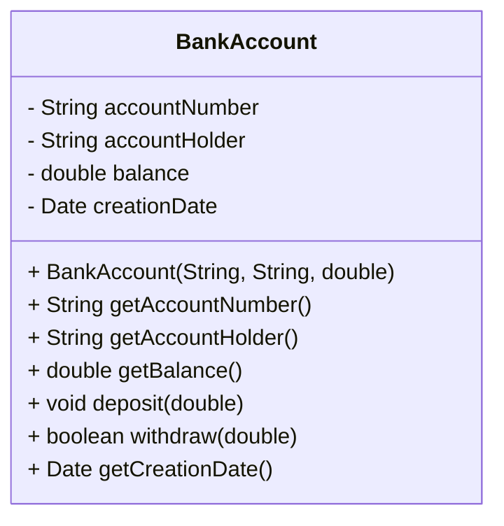

## 4.9.1 Implementing Private Class Data in Java

In the realm of software engineering, encapsulation is a fundamental principle that ensures the integrity and security of an object's internal state. The Private Class Data pattern is a structural design pattern that focuses on encapsulating class data to control access and protect the integrity of the data. In this section, we will explore how to implement this pattern in Java, emphasizing best practices such as immutability, defensive copying, and minimizing the exposure of internal state.

### Understanding Encapsulation

Encapsulation is the process of bundling the data (variables) and the methods (functions) that operate on the data into a single unit, known as a class. In Java, encapsulation is achieved by declaring class attributes as private and providing public methods to access and modify these attributes. This approach not only hides the internal state of the object but also provides a controlled way to interact with it.

#### Declaring Class Attributes as Private

The first step in implementing the Private Class Data pattern is to declare class attributes as private. This ensures that the data cannot be accessed directly from outside the class. Instead, accessor methods (getters and setters) are provided to interact with the data.

```java
public class Employee {
    private String name;
    private int age;
    private double salary;

    // Constructor
    public Employee(String name, int age, double salary) {
        this.name = name;
        this.age = age;
        this.salary = salary;
    }

    // Getter for name
    public String getName() {
        return name;
    }

    // Setter for name
    public void setName(String name) {
        this.name = name;
    }

    // Getter for age
    public int getAge() {
        return age;
    }

    // Setter for age
    public void setAge(int age) {
        this.age = age;
    }

    // Getter for salary
    public double getSalary() {
        return salary;
    }

    // Setter for salary
    public void setSalary(double salary) {
        this.salary = salary;
    }
}
```

In the example above, the `Employee` class encapsulates its data by declaring the attributes `name`, `age`, and `salary` as private. Public getter and setter methods are provided to access and modify these attributes.

### Immutability and Final Variables

Immutability is a powerful concept in Java that enhances the security and integrity of an object's state. An immutable object is one whose state cannot be modified after it is created. This is achieved by declaring the class variables as `final` and not providing any setter methods.

#### Creating Immutable Classes

To create an immutable class, follow these steps:

1. Declare the class as `final` to prevent subclassing.
2. Declare all fields as `private` and `final`.
3. Provide a constructor to initialize the fields.
4. Do not provide any setter methods.
5. Ensure that methods returning mutable objects return copies instead of the original objects.

```java
public final class ImmutableEmployee {
    private final String name;
    private final int age;
    private final double salary;

    // Constructor
    public ImmutableEmployee(String name, int age, double salary) {
        this.name = name;
        this.age = age;
        this.salary = salary;
    }

    // Getter for name
    public String getName() {
        return name;
    }

    // Getter for age
    public int getAge() {
        return age;
    }

    // Getter for salary
    public double getSalary() {
        return salary;
    }
}
```

In this example, the `ImmutableEmployee` class is immutable because its fields are declared as `final`, and no setter methods are provided. Once an instance of `ImmutableEmployee` is created, its state cannot be changed.

### Defensive Copying

Defensive copying is a technique used to protect mutable objects from being modified by external code. When a class contains mutable objects, it should return a copy of the object instead of the original object to ensure that the internal state remains unchanged.

#### Implementing Defensive Copying

Consider a class that contains a list of employee names. To protect the list from external modification, we can use defensive copying.

```java
import java.util.ArrayList;
import java.util.Collections;
import java.util.List;

public final class Department {
    private final List<String> employeeNames;

    // Constructor
    public Department(List<String> employeeNames) {
        this.employeeNames = new ArrayList<>(employeeNames); // Defensive copy
    }

    // Getter for employee names
    public List<String> getEmployeeNames() {
        return Collections.unmodifiableList(new ArrayList<>(employeeNames)); // Defensive copy
    }
}
```

In the `Department` class, the constructor creates a defensive copy of the input list, and the `getEmployeeNames` method returns an unmodifiable view of a copy of the list. This ensures that the original list remains unchanged.

### Best Practices for Encapsulation

1. **Minimize Exposure of Internal State**: Only expose what is necessary. Use private access for fields and provide public methods only when needed.

2. **Use Immutability Where Possible**: Favor immutable objects to enhance security and reduce the risk of unintended side effects.

3. **Implement Defensive Copying**: Protect mutable objects by returning copies instead of the original objects.

4. **Encapsulate Collections**: When exposing collections, return unmodifiable views or defensive copies to prevent external modification.

5. **Avoid Public Fields**: Public fields expose the internal state and violate encapsulation. Always use private fields with accessor methods.

### Importance of Encapsulation in Object-Oriented Design

Encapsulation is a cornerstone of object-oriented design. It allows us to:

- **Maintain Object Integrity**: By controlling access to the internal state, we ensure that objects remain in a valid state throughout their lifecycle.

- **Enhance Security**: Encapsulation prevents unauthorized access and modification of sensitive data.

- **Improve Maintainability**: By hiding the internal implementation details, we can change the implementation without affecting external code.

- **Facilitate Reusability**: Encapsulated objects can be reused in different contexts without exposing their internal complexities.

### Code Example: Implementing Private Class Data Pattern

Let's implement a more comprehensive example that demonstrates the Private Class Data pattern in a real-world scenario.

```java
import java.util.Date;

public final class BankAccount {
    private final String accountNumber;
    private final String accountHolder;
    private double balance;
    private final Date creationDate;

    // Constructor
    public BankAccount(String accountNumber, String accountHolder, double initialBalance) {
        this.accountNumber = accountNumber;
        this.accountHolder = accountHolder;
        this.balance = initialBalance;
        this.creationDate = new Date(); // Current date
    }

    // Getter for account number
    public String getAccountNumber() {
        return accountNumber;
    }

    // Getter for account holder
    public String getAccountHolder() {
        return accountHolder;
    }

    // Getter for balance
    public double getBalance() {
        return balance;
    }

    // Method to deposit money
    public void deposit(double amount) {
        if (amount > 0) {
            balance += amount;
        }
    }

    // Method to withdraw money
    public boolean withdraw(double amount) {
        if (amount > 0 && balance >= amount) {
            balance -= amount;
            return true;
        }
        return false;
    }

    // Getter for creation date
    public Date getCreationDate() {
        return new Date(creationDate.getTime()); // Defensive copy
    }
}
```

In the `BankAccount` class, we encapsulate the account data by declaring fields as private and providing public methods to interact with the data. The `creationDate` field is a mutable object, so we return a defensive copy in the `getCreationDate` method to protect the internal state.

### Try It Yourself

To deepen your understanding of the Private Class Data pattern, try modifying the `BankAccount` class to include additional features, such as:

- Implementing a method to transfer money between accounts.
- Adding a transaction history feature to track deposits and withdrawals.
- Ensuring thread safety by synchronizing methods or using concurrent data structures.

### Visualizing Encapsulation and Data Protection

To better understand how encapsulation and data protection work, let's visualize the relationship between the class, its attributes, and the methods that provide controlled access.



In this diagram, the `BankAccount` class encapsulates its data with private fields and provides public methods to interact with the data. The use of defensive copying for the `creationDate` field ensures that the internal state remains protected.

### References and Further Reading

- [Java Encapsulation](https://www.w3schools.com/java/java_encapsulation.asp) - W3Schools
- [Effective Java by Joshua Bloch](https://www.oreilly.com/library/view/effective-java-3rd/9780134686097/) - A comprehensive guide on best practices in Java programming.
- [Java: The Complete Reference by Herbert Schildt](https://www.oreilly.com/library/view/java-the-complete/9781260440249/) - A detailed reference for Java programming.

### Knowledge Check

1. What is encapsulation, and why is it important in object-oriented design?
2. How does immutability enhance the security and integrity of an object's state?
3. What is defensive copying, and when should it be used?
4. Why should class attributes be declared as private?
5. How can you ensure that a class is immutable?

### Embrace the Journey

Remember, mastering the Private Class Data pattern is just one step in your journey to becoming an expert software engineer. As you continue to explore design patterns and object-oriented principles, you'll gain deeper insights into building robust, maintainable, and secure applications. Keep experimenting, stay curious, and enjoy the journey!

## Quiz Time!



### What is the primary purpose of the Private Class Data pattern?

- [x] To encapsulate class data for controlled access
- [ ] To enhance performance by reducing data access time
- [ ] To simplify class design by removing unnecessary methods
- [ ] To allow direct access to class attributes

> **Explanation:** The Private Class Data pattern is primarily used to encapsulate class data, providing controlled access to maintain object integrity and security.

### Which keyword is used to declare a variable as immutable in Java?

- [x] final
- [ ] static
- [ ] private
- [ ] protected

> **Explanation:** The `final` keyword is used to declare a variable as immutable, meaning its value cannot be changed after initialization.

### What is defensive copying?

- [x] Creating a copy of a mutable object to prevent external modification
- [ ] Encrypting data before storing it in a class
- [ ] Using private access modifiers for all class attributes
- [ ] Implementing error handling for data access methods

> **Explanation:** Defensive copying involves creating a copy of a mutable object before returning it, ensuring that the original object remains unchanged by external code.

### How can you ensure that a class is immutable?

- [x] Declare all fields as private and final, and provide no setter methods
- [ ] Use public fields for all attributes
- [ ] Implement only getter methods without any constructors
- [ ] Allow subclassing to extend functionality

> **Explanation:** To ensure a class is immutable, declare all fields as private and final, provide no setter methods, and avoid subclassing.

### What is the benefit of encapsulating collections in a class?

- [x] It prevents external modification by returning unmodifiable views or copies
- [ ] It increases the performance of collection operations
- [ ] It allows direct access to collection elements
- [ ] It simplifies the class design by reducing methods

> **Explanation:** Encapsulating collections prevents external modification by returning unmodifiable views or copies, maintaining the integrity of the internal state.

### Why should class attributes be declared as private?

- [x] To hide the internal state and provide controlled access
- [ ] To allow direct access from other classes
- [ ] To increase the visibility of the attributes
- [ ] To simplify the class design

> **Explanation:** Class attributes should be declared as private to hide the internal state and provide controlled access through public methods.

### What is the role of accessor methods in encapsulation?

- [x] They provide controlled access to private class attributes
- [ ] They allow direct modification of class attributes
- [ ] They increase the performance of data access
- [ ] They simplify the class design by removing unnecessary methods

> **Explanation:** Accessor methods provide controlled access to private class attributes, allowing interaction with the data while maintaining encapsulation.

### How does immutability contribute to security in Java?

- [x] It prevents unauthorized modification of an object's state
- [ ] It allows direct access to class attributes
- [ ] It simplifies the class design by reducing methods
- [ ] It increases the performance of data access

> **Explanation:** Immutability contributes to security by preventing unauthorized modification of an object's state, ensuring that the data remains consistent and secure.

### What is the significance of the `final` keyword in Java?

- [x] It indicates that a variable cannot be reassigned after initialization
- [ ] It allows direct access to class attributes
- [ ] It simplifies the class design by reducing methods
- [ ] It increases the performance of data access

> **Explanation:** The `final` keyword indicates that a variable cannot be reassigned after initialization, contributing to immutability and security.

### True or False: Encapsulation is only important for large-scale applications.

- [ ] True
- [x] False

> **Explanation:** Encapsulation is important for applications of all sizes, as it helps maintain object integrity, enhance security, and improve maintainability.


