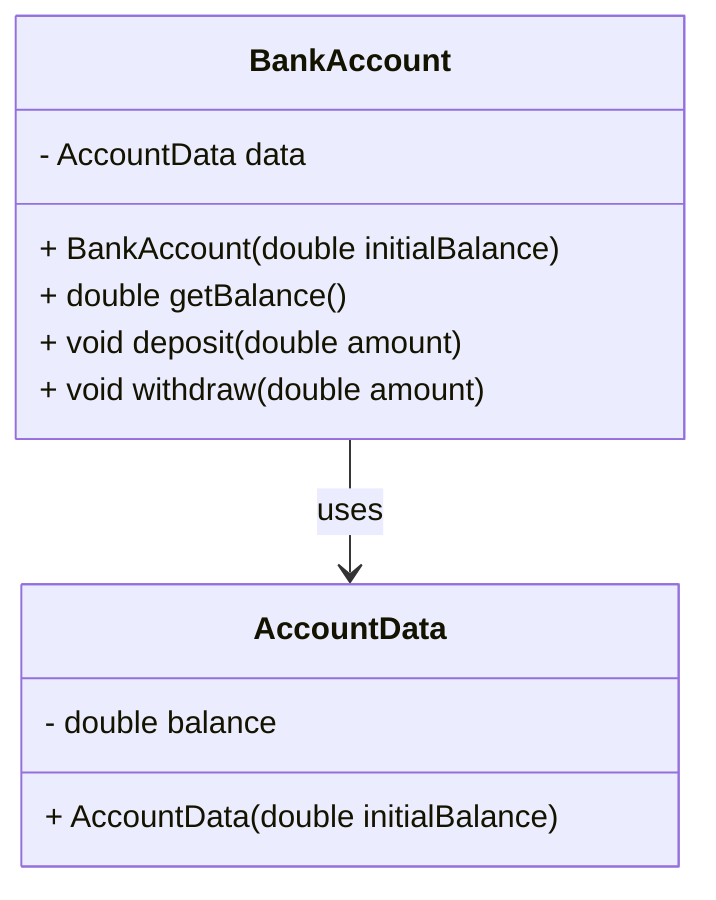

## 4.9.2 Benefits in Security and Encapsulation

In the realm of software engineering, security and encapsulation are two pillars that uphold the integrity and robustness of applications. The Private Class Data pattern is a structural design pattern that plays a crucial role in enhancing these aspects by controlling access to an object's data. This pattern not only prevents unauthorized or accidental modifications but also leads to cleaner interfaces and reduced coupling. Let's delve into how this pattern contributes to software security and encapsulation, supported by examples and best practices.

### Understanding the Private Class Data Pattern

The Private Class Data pattern is designed to encapsulate class attributes and control access to them. By doing so, it restricts direct manipulation of sensitive data, thereby safeguarding the internal state of an object. This pattern is particularly beneficial in scenarios where maintaining the integrity of data is paramount.

#### Key Concepts

- **Encapsulation**: The bundling of data with the methods that operate on that data. It restricts direct access to some of an object's components, which can prevent the accidental modification of data.
  
- **Data Hiding**: A principle that prevents external entities from accessing the internal state of an object directly. This is achieved by making class attributes private and providing controlled access through methods.

- **Invariants**: Conditions that are always true for a class's state. The Private Class Data pattern helps enforce these invariants by controlling how data is accessed and modified.

### Enhancing Security through Controlled Access

One of the primary benefits of the Private Class Data pattern is its ability to enhance security by controlling access to data. By encapsulating data, we can prevent unauthorized access and modifications, which are common sources of security vulnerabilities.

#### Preventing Unauthorized Modifications

Consider a banking application where account balances must be protected from unauthorized changes. By using the Private Class Data pattern, we can ensure that only authorized methods can modify the balance.

```java
public class BankAccount {
    private class AccountData {
        private double balance;

        private AccountData(double initialBalance) {
            this.balance = initialBalance;
        }
    }

    private AccountData data;

    public BankAccount(double initialBalance) {
        this.data = new AccountData(initialBalance);
    }

    public double getBalance() {
        return data.balance;
    }

    public void deposit(double amount) {
        if (amount > 0) {
            data.balance += amount;
        }
    }

    public void withdraw(double amount) {
        if (amount > 0 && amount <= data.balance) {
            data.balance -= amount;
        }
    }
}
```

In this example, the `AccountData` class is private, and its `balance` attribute is not directly accessible from outside the `BankAccount` class. This encapsulation ensures that balance modifications can only occur through controlled methods, reducing the risk of unauthorized changes.

#### Protecting Against Accidental Changes

Accidental modifications to data can lead to bugs and inconsistencies. By encapsulating data, we can protect against such accidental changes. For instance, in a configuration management system, settings should not be altered without validation.

```java
public class Configuration {
    private class ConfigData {
        private String setting;

        private ConfigData(String initialSetting) {
            this.setting = initialSetting;
        }
    }

    private ConfigData data;

    public Configuration(String initialSetting) {
        this.data = new ConfigData(initialSetting);
    }

    public String getSetting() {
        return data.setting;
    }

    public void updateSetting(String newSetting) {
        if (validateSetting(newSetting)) {
            data.setting = newSetting;
        }
    }

    private boolean validateSetting(String setting) {
        // Validation logic here
        return true;
    }
}
```

Here, the `ConfigData` class encapsulates the `setting` attribute, and changes are only made through the `updateSetting` method, which includes validation logic.

### Promoting Encapsulation for Cleaner Interfaces

Encapsulation leads to cleaner interfaces by hiding the complexity of data management from the user. This results in a more intuitive and maintainable codebase.

#### Reducing Coupling

By encapsulating data, we reduce the coupling between different parts of the application. This means changes to the internal data structure do not affect external code, as long as the interface remains consistent.

```java
public class User {
    private class UserData {
        private String name;
        private String email;

        private UserData(String name, String email) {
            this.name = name;
            this.email = email;
        }
    }

    private UserData data;

    public User(String name, String email) {
        this.data = new UserData(name, email);
    }

    public String getName() {
        return data.name;
    }

    public String getEmail() {
        return data.email;
    }

    public void updateEmail(String newEmail) {
        if (validateEmail(newEmail)) {
            data.email = newEmail;
        }
    }

    private boolean validateEmail(String email) {
        // Email validation logic
        return true;
    }
}
```

In this example, the `UserData` class encapsulates user information. The `User` class provides a clean interface for accessing and modifying this data, without exposing the internal structure.

#### Cleaner Code through Data Hiding

Data hiding leads to cleaner code by reducing the complexity visible to the user. This makes it easier to understand and maintain the codebase.

```java
public class Product {
    private class ProductData {
        private String id;
        private double price;

        private ProductData(String id, double price) {
            this.id = id;
            this.price = price;
        }
    }

    private ProductData data;

    public Product(String id, double price) {
        this.data = new ProductData(id, price);
    }

    public String getId() {
        return data.id;
    }

    public double getPrice() {
        return data.price;
    }

    public void setPrice(double newPrice) {
        if (newPrice > 0) {
            data.price = newPrice;
        }
    }
}
```

Here, the `ProductData` class encapsulates product details, and the `Product` class provides a simple interface for interacting with this data.

### Preventing Bugs and Security Vulnerabilities

Data hiding is a powerful tool for preventing bugs and security vulnerabilities. By controlling access to data, we can ensure that only valid operations are performed, reducing the risk of errors and exploits.

#### Enforcing Invariants

Invariants are conditions that must always hold true for an object's state. The Private Class Data pattern helps enforce these invariants by controlling how data is accessed and modified.

```java
public class TemperatureSensor {
    private class SensorData {
        private double temperature;

        private SensorData(double initialTemperature) {
            this.temperature = initialTemperature;
        }
    }

    private SensorData data;

    public TemperatureSensor(double initialTemperature) {
        this.data = new SensorData(initialTemperature);
    }

    public double getTemperature() {
        return data.temperature;
    }

    public void setTemperature(double newTemperature) {
        if (newTemperature >= -273.15) { // Absolute zero check
            data.temperature = newTemperature;
        }
    }
}
```

In this example, the `SensorData` class encapsulates the `temperature` attribute, and the `TemperatureSensor` class ensures that the temperature never falls below absolute zero, maintaining the invariant.

#### Consistent Object State

By encapsulating data, we can ensure that objects remain in a consistent state, even in the presence of errors or exceptions.

```java
public class Transaction {
    private class TransactionData {
        private double amount;
        private boolean completed;

        private TransactionData(double amount) {
            this.amount = amount;
            this.completed = false;
        }
    }

    private TransactionData data;

    public Transaction(double amount) {
        this.data = new TransactionData(amount);
    }

    public double getAmount() {
        return data.amount;
    }

    public boolean isCompleted() {
        return data.completed;
    }

    public void completeTransaction() {
        if (!data.completed) {
            // Perform transaction logic
            data.completed = true;
        }
    }
}
```

Here, the `TransactionData` class encapsulates transaction details, and the `Transaction` class ensures that a transaction can only be completed once, maintaining a consistent state.

### Encouraging Data Encapsulation as a Fundamental Practice

Data encapsulation is a fundamental practice that should be adopted by all developers. It not only enhances security and reduces bugs but also leads to cleaner, more maintainable code.

#### Best Practices for Data Encapsulation

1. **Make Attributes Private**: Always make class attributes private and provide controlled access through methods.

2. **Use Getter and Setter Methods**: Provide getter and setter methods for accessing and modifying data. Ensure that setters include validation logic.

3. **Encapsulate Complex Data**: For complex data structures, consider using inner classes to encapsulate data and provide a clean interface.

4. **Enforce Invariants**: Use encapsulation to enforce invariants and ensure consistent object state.

5. **Minimize Exposure**: Minimize the exposure of internal data and logic to reduce the risk of unauthorized access and modifications.

6. **Review and Refactor**: Regularly review and refactor code to ensure that encapsulation principles are being followed.

### Visualizing the Private Class Data Pattern

To better understand the Private Class Data pattern, let's visualize its structure and interactions using a class diagram.



**Diagram Description**: This class diagram illustrates the relationship between the `BankAccount` and `AccountData` classes. The `BankAccount` class uses the `AccountData` class to encapsulate the `balance` attribute, providing controlled access through public methods.

### Try It Yourself

To reinforce your understanding of the Private Class Data pattern, try modifying the code examples provided. For instance, add additional validation logic to the `BankAccount` class, or create a new class that uses the pattern to encapsulate data. Experiment with different scenarios to see how encapsulation can enhance security and maintainability.

### References and Further Reading

- [Oracle Java Documentation](https://docs.oracle.com/javase/tutorial/java/javaOO/accesscontrol.html) - Learn more about access control in Java.
- [Effective Java by Joshua Bloch](https://www.oreilly.com/library/view/effective-java/9780134686097/) - A comprehensive guide to best practices in Java programming.
- [Design Patterns: Elements of Reusable Object-Oriented Software](https://www.oreilly.com/library/view/design-patterns-elements/0201633612/) - The seminal book on design patterns by the "Gang of Four".

### Knowledge Check

Before we conclude, let's test your understanding of the Private Class Data pattern with a few questions.

## Quiz Time!



### What is the primary purpose of the Private Class Data pattern?

- [x] To encapsulate class attributes and control access to them
- [ ] To provide a public interface for all class methods
- [ ] To increase the number of public methods in a class
- [ ] To expose internal data for easier access

> **Explanation:** The Private Class Data pattern is designed to encapsulate class attributes and control access to them, enhancing security and encapsulation.

### How does encapsulation lead to cleaner interfaces?

- [x] By hiding the complexity of data management from the user
- [ ] By exposing all internal data to the user
- [ ] By increasing the number of public methods
- [ ] By allowing direct manipulation of class attributes

> **Explanation:** Encapsulation hides the complexity of data management from the user, resulting in cleaner and more intuitive interfaces.

### Which of the following is a benefit of data hiding?

- [x] Preventing unauthorized or accidental modifications
- [ ] Increasing the number of public methods
- [ ] Exposing internal data for easier access
- [ ] Reducing the need for validation logic

> **Explanation:** Data hiding prevents unauthorized or accidental modifications, enhancing security and reducing bugs.

### What is an invariant in the context of the Private Class Data pattern?

- [x] A condition that must always hold true for an object's state
- [ ] A method that modifies class attributes
- [ ] A public interface for accessing data
- [ ] A class that encapsulates data

> **Explanation:** An invariant is a condition that must always hold true for an object's state, and the Private Class Data pattern helps enforce these invariants.

### How can encapsulation reduce coupling in a codebase?

- [x] By ensuring changes to internal data structures do not affect external code
- [ ] By exposing all internal data to external code
- [ ] By increasing the number of dependencies between classes
- [ ] By allowing direct manipulation of class attributes

> **Explanation:** Encapsulation ensures that changes to internal data structures do not affect external code, reducing coupling.

### What is a best practice for implementing data encapsulation?

- [x] Making class attributes private and providing controlled access through methods
- [ ] Making all class attributes public for easier access
- [ ] Avoiding the use of getter and setter methods
- [ ] Exposing internal data structures to external code

> **Explanation:** A best practice for implementing data encapsulation is to make class attributes private and provide controlled access through methods.

### Why is it important to enforce invariants in a class?

- [x] To ensure consistent object state and prevent errors
- [ ] To increase the number of public methods
- [ ] To expose internal data for easier access
- [ ] To allow direct manipulation of class attributes

> **Explanation:** Enforcing invariants ensures consistent object state and prevents errors, maintaining the integrity of the application.

### What role does the Private Class Data pattern play in security?

- [x] It controls access to data, preventing unauthorized modifications
- [ ] It exposes internal data for easier access
- [ ] It increases the number of public methods
- [ ] It allows direct manipulation of class attributes

> **Explanation:** The Private Class Data pattern controls access to data, preventing unauthorized modifications and enhancing security.

### How can data encapsulation prevent bugs?

- [x] By controlling access to data and ensuring only valid operations are performed
- [ ] By exposing all internal data to the user
- [ ] By increasing the number of public methods
- [ ] By allowing direct manipulation of class attributes

> **Explanation:** Data encapsulation controls access to data and ensures only valid operations are performed, preventing bugs.

### True or False: The Private Class Data pattern increases the number of public methods in a class.

- [ ] True
- [x] False

> **Explanation:** The Private Class Data pattern does not increase the number of public methods; instead, it focuses on encapsulating data and controlling access through a limited set of methods.



Remember, this is just the beginning. As you progress, you'll build more secure and maintainable applications by embracing data encapsulation. Keep experimenting, stay curious, and enjoy the journey!
