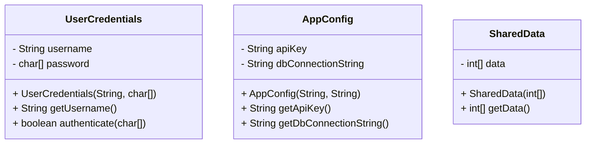

## 4.9.3 Use Cases and Examples

The Private Class Data pattern is a structural design pattern that focuses on encapsulating class data to protect it from unauthorized access and modification. This pattern is particularly useful in scenarios where data integrity and security are paramount. In this section, we will explore various use cases and examples where the Private Class Data pattern can be effectively applied, such as managing sensitive user information, protecting configuration settings, and ensuring thread safety.

### Understanding the Private Class Data Pattern

Before diving into use cases, let's briefly revisit what the Private Class Data pattern entails. The core idea is to encapsulate the data within a class, exposing only the necessary operations to manipulate that data. This minimizes the exposure of the internal state and reduces the risk of unintended modifications.

The pattern typically involves:

- **Encapsulation**: Keeping data private and providing controlled access through methods.
- **Immutability**: Using immutable objects to prevent changes after creation.
- **Data Protection**: Ensuring that sensitive data is not exposed directly to clients.

### Use Case 1: Managing User Credentials

One of the most common applications of the Private Class Data pattern is in managing user credentials and personal information. In today's digital landscape, protecting user data is not just a best practice but a legal requirement in many jurisdictions.

#### Example: User Credentials Management

Consider a system that handles user authentication. User credentials, such as passwords, need to be stored securely and accessed in a controlled manner.

```java
public class UserCredentials {
    private final String username;
    private final char[] password; // Using char[] for security reasons

    public UserCredentials(String username, char[] password) {
        this.username = username;
        this.password = password.clone(); // Clone to prevent external modification
    }

    public String getUsername() {
        return username;
    }

    public boolean authenticate(char[] inputPassword) {
        return Arrays.equals(password, inputPassword);
    }

    // No getter for password to prevent exposure
}
```

In this example, the `UserCredentials` class encapsulates the username and password. The password is stored as a `char[]` instead of a `String` to enhance security, as `char[]` can be explicitly cleared from memory after use. The class provides methods to authenticate the user without exposing the password directly.

#### Security Enhancement

By not providing a getter for the password, we ensure that the password cannot be accessed or modified directly. This encapsulation is crucial for maintaining the integrity of user credentials.

### Use Case 2: Protecting Configuration Settings

Configuration settings often contain sensitive information, such as API keys or database connection strings. These settings need to be protected from unauthorized changes, especially in a production environment.

#### Example: Configuration Management

Let's consider a scenario where we manage application configuration settings using the Private Class Data pattern.

```java
public class AppConfig {
    private final String apiKey;
    private final String dbConnectionString;

    public AppConfig(String apiKey, String dbConnectionString) {
        this.apiKey = apiKey;
        this.dbConnectionString = dbConnectionString;
    }

    public String getApiKey() {
        return apiKey;
    }

    public String getDbConnectionString() {
        return dbConnectionString;
    }

    // No setters to prevent modification
}
```

In this example, the `AppConfig` class encapsulates the API key and database connection string. By making these fields final and not providing setters, we ensure that the configuration settings cannot be altered once initialized.

#### Best Practices

- **Immutability**: Use immutable objects to prevent changes to configuration settings after initialization.
- **Access Control**: Limit access to configuration settings to only those components that require it.

### Use Case 3: Ensuring Thread Safety

In multi-threaded applications, shared data can lead to concurrency issues if not handled properly. The Private Class Data pattern can help ensure thread safety by preventing external modification of shared data.

#### Example: Thread-Safe Data Access

Consider a scenario where multiple threads need to access shared data safely.

```java
public class SharedData {
    private final int[] data;

    public SharedData(int[] data) {
        this.data = data.clone(); // Clone to ensure thread safety
    }

    public int[] getData() {
        return data.clone(); // Return a clone to prevent modification
    }
}
```

In this example, the `SharedData` class encapsulates an array of integers. By cloning the array both during initialization and when returning it, we ensure that the original data cannot be modified by external threads.

#### Thread Safety Considerations

- **Cloning**: Always return a clone of mutable data to prevent external modification.
- **Synchronization**: Use synchronization mechanisms if data needs to be modified concurrently.

### Balancing Data Protection with Accessibility

While the Private Class Data pattern enhances security and integrity, it's essential to balance data protection with necessary accessibility. Here are some best practices:

- **Expose Only Necessary Operations**: Provide only the methods required to manipulate the data, without exposing the data itself.
- **Use Interfaces**: Define interfaces to specify the operations that can be performed on the data, allowing for flexibility and abstraction.
- **Consider Performance**: Be mindful of the performance implications of cloning or creating immutable objects, especially in performance-critical applications.

### Encouraging the Use of Private Class Data Pattern

When designing systems that handle sensitive or critical data, consider the Private Class Data pattern as a tool to enhance security and integrity. By encapsulating data and controlling access, you can reduce the risk of data breaches and ensure that your application remains robust and reliable.

### Try It Yourself

To deepen your understanding of the Private Class Data pattern, try modifying the examples provided:

1. **Extend the UserCredentials Example**: Add additional fields such as email and phone number, and implement methods to update these fields securely.
2. **Enhance the AppConfig Example**: Introduce a mechanism to reload configuration settings from a file, ensuring that changes are applied safely.
3. **Experiment with Thread Safety**: Create a multi-threaded application that uses the `SharedData` class, and observe how the encapsulation prevents data races.

### Visualizing the Private Class Data Pattern

To better understand the structure and flow of the Private Class Data pattern, let's visualize it using a class diagram.



In this diagram, we see the encapsulated fields and the public methods provided by each class. The private fields are not directly accessible, ensuring data protection.

### Key Takeaways

- The Private Class Data pattern is essential for protecting sensitive data and ensuring data integrity.
- It is particularly useful in scenarios involving user credentials, configuration settings, and thread safety.
- By encapsulating data and controlling access, you can enhance the security and robustness of your application.
- Always balance data protection with necessary accessibility to ensure that your application remains functional and performant.

### Further Reading

For more information on the Private Class Data pattern and related topics, consider exploring the following resources:

- [Design Patterns: Elements of Reusable Object-Oriented Software](https://www.amazon.com/Design-Patterns-Elements-Reusable-Object-Oriented/dp/0201633612) by Erich Gamma et al.
- [Effective Java](https://www.amazon.com/Effective-Java-Joshua-Bloch/dp/0134685997) by Joshua Bloch
- [Java Concurrency in Practice](https://www.amazon.com/Java-Concurrency-Practice-Brian-Goetz/dp/0321349601) by Brian Goetz et al.

### Embrace the Journey

Remember, the Private Class Data pattern is just one of many tools available to you as a software engineer. As you continue to develop your skills, keep exploring new patterns and techniques to enhance your applications. Stay curious, keep experimenting, and enjoy the journey!

## Quiz Time!



### Which of the following best describes the Private Class Data pattern?

- [x] A pattern that encapsulates class data to protect it from unauthorized access and modification.
- [ ] A pattern that focuses on creating a single instance of a class.
- [ ] A pattern that provides a simplified interface to a complex subsystem.
- [ ] A pattern that allows incompatible interfaces to work together.

> **Explanation:** The Private Class Data pattern is designed to encapsulate and protect class data, ensuring that it is not exposed or modified directly.

### Why is it recommended to use `char[]` instead of `String` for storing passwords in Java?

- [x] Because `char[]` can be explicitly cleared from memory after use.
- [ ] Because `char[]` is faster to process than `String`.
- [ ] Because `char[]` takes up less memory than `String`.
- [ ] Because `char[]` is immutable.

> **Explanation:** `char[]` can be explicitly cleared from memory, reducing the risk of sensitive data being exposed in memory dumps.

### In the context of the Private Class Data pattern, what is the primary benefit of making class fields `final`?

- [x] It prevents the fields from being modified after initialization.
- [ ] It makes the fields accessible from other classes.
- [ ] It allows the fields to be serialized.
- [ ] It improves the performance of the class.

> **Explanation:** Making fields `final` ensures that they cannot be modified after they are initialized, enhancing data integrity.

### How does the Private Class Data pattern contribute to thread safety?

- [x] By preventing external modification of shared data.
- [ ] By allowing multiple threads to access the same data simultaneously.
- [ ] By using locks to synchronize data access.
- [ ] By making all data immutable.

> **Explanation:** The pattern prevents external modification, reducing the risk of data races and ensuring thread safety.

### What is a potential downside of using the Private Class Data pattern?

- [x] It can lead to performance overhead due to cloning or creating immutable objects.
- [ ] It makes the code more difficult to understand.
- [ ] It increases the risk of data corruption.
- [ ] It reduces the security of the application.

> **Explanation:** Cloning or creating immutable objects can introduce performance overhead, especially in performance-critical applications.

### Which of the following is a best practice when using the Private Class Data pattern?

- [x] Expose only the necessary operations to manipulate the data.
- [ ] Provide public getters and setters for all fields.
- [ ] Use mutable objects to allow flexibility.
- [ ] Avoid using interfaces to define operations.

> **Explanation:** Exposing only necessary operations minimizes the risk of unauthorized access or modification.

### What is the main advantage of using immutable objects in the Private Class Data pattern?

- [x] They prevent changes to data after initialization.
- [ ] They are easier to serialize.
- [ ] They take up less memory.
- [ ] They are faster to process.

> **Explanation:** Immutable objects cannot be changed after they are created, ensuring that data remains consistent and protected.

### How can the Private Class Data pattern enhance security in a system?

- [x] By reducing the exposure of sensitive data.
- [ ] By allowing direct access to all class fields.
- [ ] By increasing the complexity of the code.
- [ ] By making all data public.

> **Explanation:** By encapsulating data and controlling access, the pattern reduces the risk of sensitive data being exposed or modified.

### In a multi-threaded application, how does the Private Class Data pattern help prevent data races?

- [x] By ensuring that shared data is not modified externally.
- [ ] By allowing multiple threads to access data simultaneously.
- [ ] By using locks to synchronize data access.
- [ ] By making all data mutable.

> **Explanation:** The pattern ensures that shared data is not modified externally, reducing the risk of data races.

### True or False: The Private Class Data pattern should always be used in every Java application.

- [ ] True
- [x] False

> **Explanation:** While the Private Class Data pattern is beneficial in many scenarios, it should be used judiciously based on the specific requirements and context of the application.


