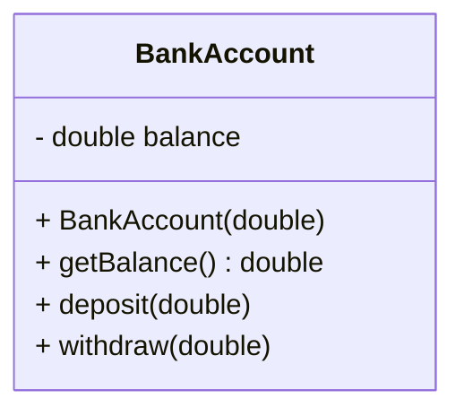

## 4.9 Private Class Data Pattern

In the realm of software design, the Private Class Data pattern is a structural pattern that plays a pivotal role in controlling access to class attributes. This pattern is instrumental in enhancing security and flexibility by encapsulating mutable state and promoting data hiding. Let's delve into the intricacies of this pattern, understand the problems it addresses, and explore its implementation in Java.

### Introduction to the Private Class Data Pattern

The Private Class Data pattern is designed to restrict access to the internal data of a class, thereby preventing unintended modifications and enhancing the security of the application. By encapsulating data and providing controlled access through methods, this pattern ensures that the internal state of an object remains consistent and protected from unauthorized changes.

#### Intent of the Private Class Data Pattern

The primary intent of the Private Class Data pattern is to encapsulate class attributes and provide a controlled mechanism for accessing and modifying these attributes. This pattern is particularly useful in scenarios where the internal state of an object needs to be protected from external interference, ensuring that the object's behavior remains predictable and consistent.

### The Problem: Unintended Modifications to Object State

In object-oriented programming, objects often encapsulate state and behavior. However, exposing the internal state of an object through public fields can lead to unintended modifications, resulting in inconsistent or erroneous behavior. This is where the Private Class Data pattern comes into play, providing a robust solution to this problem.

#### Example Scenario

Consider a class representing a bank account. If the account balance is exposed as a public field, any external code can modify it directly, potentially leading to incorrect account balances. By encapsulating the balance within the class and providing controlled access through methods, we can ensure that the balance is modified only through legitimate operations, such as deposits or withdrawals.

### Encapsulation and Controlled Access

The Private Class Data pattern encapsulates data within a class and provides controlled access through methods. This encapsulation ensures that the internal state of the object is not exposed directly, preventing unauthorized modifications.

#### Implementing Encapsulation

To implement encapsulation using the Private Class Data pattern, we define private fields within the class and provide public methods to access and modify these fields. These methods act as gatekeepers, ensuring that any changes to the internal state are validated and authorized.

```java
public class BankAccount {
    private double balance;

    public BankAccount(double initialBalance) {
        this.balance = initialBalance;
    }

    public double getBalance() {
        return balance;
    }

    public void deposit(double amount) {
        if (amount > 0) {
            balance += amount;
        }
    }

    public void withdraw(double amount) {
        if (amount > 0 && amount <= balance) {
            balance -= amount;
        }
    }
}
```

In this example, the `balance` field is private, and access to it is controlled through the `getBalance`, `deposit`, and `withdraw` methods. This ensures that the balance is modified only through valid operations.

### Benefits of Immutable Objects and Data Hiding

The Private Class Data pattern promotes the use of immutable objects and data hiding, which offer several benefits in software design.

#### Immutable Objects

Immutable objects are objects whose state cannot be modified after they are created. By designing classes to be immutable, we can ensure that the internal state remains consistent and protected from unauthorized changes.

```java
public final class ImmutableBankAccount {
    private final double balance;

    public ImmutableBankAccount(double initialBalance) {
        this.balance = initialBalance;
    }

    public double getBalance() {
        return balance;
    }

    public ImmutableBankAccount deposit(double amount) {
        if (amount > 0) {
            return new ImmutableBankAccount(balance + amount);
        }
        return this;
    }

    public ImmutableBankAccount withdraw(double amount) {
        if (amount > 0 && amount <= balance) {
            return new ImmutableBankAccount(balance - amount);
        }
        return this;
    }
}
```

In this example, the `ImmutableBankAccount` class is immutable. Any modification results in the creation of a new object, preserving the original state.

#### Data Hiding

Data hiding is a fundamental principle of object-oriented design that involves restricting access to the internal state of an object. By hiding data, we can prevent unauthorized modifications and ensure that the object's behavior remains consistent.

### Practical Implementation Strategies

Implementing the Private Class Data pattern involves several strategies to ensure that the internal state of an object is protected and accessible only through controlled mechanisms.

#### Use of Accessor and Mutator Methods

Accessor methods (getters) and mutator methods (setters) are commonly used to provide controlled access to private fields. These methods validate and authorize any changes to the internal state, ensuring that the object remains consistent.

```java
public class Employee {
    private String name;
    private double salary;

    public String getName() {
        return name;
    }

    public void setName(String name) {
        if (name != null && !name.isEmpty()) {
            this.name = name;
        }
    }

    public double getSalary() {
        return salary;
    }

    public void setSalary(double salary) {
        if (salary > 0) {
            this.salary = salary;
        }
    }
}
```

In this example, the `Employee` class uses accessor and mutator methods to control access to the `name` and `salary` fields.

#### Use of Final Fields

Final fields are fields that cannot be modified after they are initialized. By using final fields, we can ensure that the internal state of an object remains consistent and protected from unauthorized changes.

```java
public class Configuration {
    private final String databaseUrl;
    private final int maxConnections;

    public Configuration(String databaseUrl, int maxConnections) {
        this.databaseUrl = databaseUrl;
        this.maxConnections = maxConnections;
    }

    public String getDatabaseUrl() {
        return databaseUrl;
    }

    public int getMaxConnections() {
        return maxConnections;
    }
}
```

In this example, the `Configuration` class uses final fields to ensure that the `databaseUrl` and `maxConnections` fields cannot be modified after they are initialized.

### Enhancing Security and Robustness

The Private Class Data pattern enhances security and robustness by ensuring that the internal state of an object is protected from unauthorized modifications. This pattern is particularly useful in scenarios where data integrity and consistency are critical.

#### Security Considerations

By encapsulating data and providing controlled access, the Private Class Data pattern helps prevent unauthorized access and modifications, enhancing the security of the application.

#### Robustness and Consistency

By ensuring that the internal state of an object is protected and consistent, the Private Class Data pattern enhances the robustness of the application, reducing the likelihood of errors and inconsistencies.

### Try It Yourself

To gain a deeper understanding of the Private Class Data pattern, try modifying the code examples provided in this section. Experiment with different scenarios, such as adding validation logic to the accessor and mutator methods, or creating immutable classes with different fields.

### Visualizing the Private Class Data Pattern

To better understand the Private Class Data pattern, let's visualize the encapsulation of data and the controlled access through methods using a class diagram.



This diagram illustrates the encapsulation of the `balance` field within the `BankAccount` class and the controlled access through the `getBalance`, `deposit`, and `withdraw` methods.

### References and Further Reading

For more information on the Private Class Data pattern and related concepts, consider exploring the following resources:

- [Oracle Java Documentation](https://docs.oracle.com/javase/tutorial/java/concepts/)
- [Effective Java by Joshua Bloch](https://www.oreilly.com/library/view/effective-java-3rd/9780134686097/)
- [Design Patterns: Elements of Reusable Object-Oriented Software by Erich Gamma, Richard Helm, Ralph Johnson, John Vlissides](https://www.oreilly.com/library/view/design-patterns-elements/0201633612/)

### Knowledge Check

To reinforce your understanding of the Private Class Data pattern, consider the following questions and challenges:

- How does the Private Class Data pattern enhance security in software design?
- What are the benefits of using immutable objects in conjunction with the Private Class Data pattern?
- How can accessor and mutator methods be used to provide controlled access to private fields?

### Embrace the Journey

Remember, mastering design patterns is a journey. As you continue to explore and experiment with different patterns, you'll gain a deeper understanding of how they can enhance your software design. Keep experimenting, stay curious, and enjoy the journey!

## Quiz Time!



### What is the primary intent of the Private Class Data pattern?

- [x] To encapsulate class attributes and provide controlled access
- [ ] To expose class attributes for easy modification
- [ ] To simplify class design by removing methods
- [ ] To increase the complexity of class interactions

> **Explanation:** The Private Class Data pattern is designed to encapsulate class attributes and provide controlled access through methods, ensuring data security and consistency.

### How does the Private Class Data pattern enhance security?

- [x] By preventing unauthorized modifications to an object's state
- [ ] By exposing all internal data for transparency
- [ ] By allowing direct access to private fields
- [ ] By removing all access control mechanisms

> **Explanation:** The pattern enhances security by encapsulating data and providing controlled access, preventing unauthorized modifications.

### What is a key benefit of using immutable objects?

- [x] They ensure that the internal state remains consistent
- [ ] They allow for unrestricted modification of data
- [ ] They simplify the class design by removing methods
- [ ] They increase the complexity of data handling

> **Explanation:** Immutable objects ensure that the internal state remains consistent and protected from unauthorized changes.

### Which of the following is a strategy used in the Private Class Data pattern?

- [x] Use of accessor and mutator methods
- [ ] Direct access to private fields
- [ ] Removal of all methods from the class
- [ ] Exposing all internal data as public fields

> **Explanation:** Accessor and mutator methods provide controlled access to private fields, ensuring data security and consistency.

### What is the role of final fields in the Private Class Data pattern?

- [x] To ensure that fields cannot be modified after initialization
- [ ] To allow fields to be modified at any time
- [ ] To expose fields for direct access
- [ ] To remove all access control mechanisms

> **Explanation:** Final fields ensure that fields cannot be modified after initialization, maintaining data consistency.

### How does data hiding contribute to software design?

- [x] By preventing unauthorized modifications to an object's state
- [ ] By exposing all internal data for transparency
- [ ] By allowing direct access to private fields
- [ ] By removing all access control mechanisms

> **Explanation:** Data hiding prevents unauthorized modifications and ensures that the object's behavior remains consistent.

### What is the purpose of accessor methods?

- [x] To provide controlled access to private fields
- [ ] To expose private fields for direct access
- [ ] To remove all access control mechanisms
- [ ] To simplify class design by removing methods

> **Explanation:** Accessor methods provide controlled access to private fields, ensuring data security and consistency.

### What is a potential challenge when using the Private Class Data pattern?

- [x] Balancing encapsulation with usability
- [ ] Exposing all internal data for transparency
- [ ] Allowing direct access to private fields
- [ ] Removing all access control mechanisms

> **Explanation:** Balancing encapsulation with usability can be a challenge, as excessive encapsulation may hinder usability.

### How can the Private Class Data pattern enhance robustness?

- [x] By ensuring that the internal state of an object is protected and consistent
- [ ] By exposing all internal data for transparency
- [ ] By allowing direct access to private fields
- [ ] By removing all access control mechanisms

> **Explanation:** The pattern enhances robustness by protecting the internal state and ensuring consistency.

### True or False: The Private Class Data pattern is only applicable to Java.

- [ ] True
- [x] False

> **Explanation:** The Private Class Data pattern is applicable to any object-oriented programming language, not just Java.


