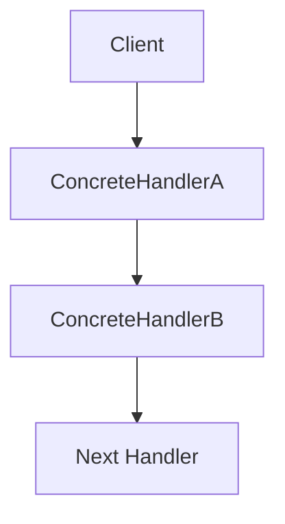
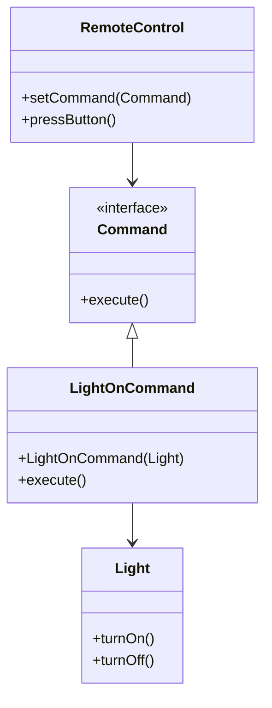

## 5.1 Overview of Behavioral Patterns

In the realm of software engineering, design patterns serve as a toolkit for solving common problems that arise during software development. Among these, behavioral design patterns play a crucial role in defining how objects interact and communicate within a system. This section delves into the essence of behavioral patterns, their significance, and how they contribute to creating maintainable and scalable systems.

### Understanding Behavioral Patterns

Behavioral patterns are concerned with the interaction and responsibility of objects. Unlike creational patterns, which focus on object creation, or structural patterns, which deal with object composition, behavioral patterns emphasize the communication between objects. They help define the flow of control and the delegation of responsibilities among different objects, ensuring that the system remains flexible and easy to maintain.

#### The Role of Behavioral Patterns in Software Design

Behavioral patterns address several challenges in software design:

- **Complex Control Flow**: As software systems grow, the control flow can become intricate and difficult to manage. Behavioral patterns help simplify this complexity by defining clear pathways for object interactions.
  
- **Communication Between Objects**: Objects in a system often need to communicate with each other to perform tasks. Behavioral patterns provide a structured approach to facilitate this communication, ensuring that objects remain decoupled and flexible.
  
- **Delegation of Responsibilities**: By clearly defining the roles and responsibilities of each object, behavioral patterns help distribute tasks efficiently, preventing any single object from becoming a bottleneck.

### Problems Solved by Behavioral Patterns

Behavioral patterns solve several key problems in software design:

1. **Decoupling Object Interactions**: By defining clear interfaces and communication protocols, behavioral patterns reduce the dependencies between objects, making the system more modular and easier to modify.

2. **Managing State and Behavior**: Many behavioral patterns help manage the state and behavior of objects, allowing them to change dynamically in response to different events or conditions.

3. **Enhancing Flexibility**: By promoting loose coupling and clear communication pathways, behavioral patterns make it easier to extend and modify the system without disrupting existing functionality.

4. **Improving Code Reusability**: By encapsulating behavior in reusable components, behavioral patterns enable developers to apply the same solutions across different parts of the system.

### Increasing Flexibility with Behavioral Patterns

One of the primary benefits of behavioral patterns is the increased flexibility they bring to software systems. By promoting loose coupling and clear communication pathways, these patterns make it easier to extend and modify the system without disrupting existing functionality. This flexibility is crucial for maintaining large and complex systems, where changes are inevitable and often frequent.

### List of Behavioral Patterns

In this section, we will explore the following behavioral patterns:

- **Chain of Responsibility**: Allows a request to be passed along a chain of handlers, with each handler deciding whether to process the request or pass it on.

- **Command**: Encapsulates a request as an object, allowing for parameterization and queuing of requests.

- **Interpreter**: Defines a representation of a grammar and an interpreter to process it.

- **Iterator**: Provides a way to access elements of a collection sequentially without exposing the underlying representation.

- **Mediator**: Defines an object that encapsulates how a set of objects interact, promoting loose coupling.

- **Memento**: Captures and restores an object's internal state without violating encapsulation.

- **Observer**: Establishes a one-to-many dependency between objects, so that when one object changes state, all its dependents are notified.

- **State**: Allows an object to alter its behavior when its internal state changes.

- **Strategy**: Defines a family of algorithms, encapsulates each one, and makes them interchangeable.

- **Template Method**: Defines the skeleton of an algorithm, deferring exact steps to subclasses.

- **Visitor**: Represents an operation to be performed on elements of an object structure, allowing new operations to be defined without changing the classes of the elements.

### Importance of Understanding Object Interactions

Understanding how objects interact is fundamental to creating maintainable and scalable systems. Behavioral patterns provide a framework for managing these interactions, ensuring that the system remains flexible and adaptable to change. By mastering these patterns, developers can design systems that are not only robust and efficient but also easy to extend and maintain.

### Code Examples and Visualizations

To illustrate the concepts discussed, let's explore some code examples and visualizations for a few behavioral patterns.

#### Chain of Responsibility Pattern

The Chain of Responsibility pattern allows a request to be passed along a chain of handlers. Each handler decides whether to process the request or pass it on to the next handler in the chain.

```java
// Handler interface
interface Handler {
    void setNext(Handler handler);
    void handleRequest(String request);
}

// Concrete handler
class ConcreteHandlerA implements Handler {
    private Handler nextHandler;

    @Override
    public void setNext(Handler handler) {
        this.nextHandler = handler;
    }

    @Override
    public void handleRequest(String request) {
        if (request.equals("A")) {
            System.out.println("Handler A processed the request.");
        } else if (nextHandler != null) {
            nextHandler.handleRequest(request);
        }
    }
}

// Another concrete handler
class ConcreteHandlerB implements Handler {
    private Handler nextHandler;

    @Override
    public void setNext(Handler handler) {
        this.nextHandler = handler;
    }

    @Override
    public void handleRequest(String request) {
        if (request.equals("B")) {
            System.out.println("Handler B processed the request.");
        } else if (nextHandler != null) {
            nextHandler.handleRequest(request);
        }
    }
}

// Client code
public class ChainOfResponsibilityDemo {
    public static void main(String[] args) {
        Handler handlerA = new ConcreteHandlerA();
        Handler handlerB = new ConcreteHandlerB();

        handlerA.setNext(handlerB);

        handlerA.handleRequest("A");
        handlerA.handleRequest("B");
        handlerA.handleRequest("C");
    }
}
```

In this example, we have two handlers, `ConcreteHandlerA` and `ConcreteHandlerB`, each capable of processing specific requests. The client sets up the chain and sends requests, which are processed by the appropriate handler.

#### Visualizing the Chain of Responsibility



This diagram illustrates the flow of requests through the chain of handlers, with each handler deciding whether to process the request or pass it on.

#### Try It Yourself

Experiment with the Chain of Responsibility pattern by adding additional handlers or modifying the conditions under which each handler processes a request. Observe how the flexibility of the pattern allows you to easily extend the chain without altering existing handlers.

### Command Pattern

The Command pattern encapsulates a request as an object, allowing for parameterization and queuing of requests.

```java
// Command interface
interface Command {
    void execute();
}

// Concrete command
class LightOnCommand implements Command {
    private Light light;

    public LightOnCommand(Light light) {
        this.light = light;
    }

    @Override
    public void execute() {
        light.turnOn();
    }
}

// Receiver
class Light {
    public void turnOn() {
        System.out.println("The light is on.");
    }

    public void turnOff() {
        System.out.println("The light is off.");
    }
}

// Invoker
class RemoteControl {
    private Command command;

    public void setCommand(Command command) {
        this.command = command;
    }

    public void pressButton() {
        command.execute();
    }
}

// Client code
public class CommandPatternDemo {
    public static void main(String[] args) {
        Light light = new Light();
        Command lightOn = new LightOnCommand(light);

        RemoteControl remote = new RemoteControl();
        remote.setCommand(lightOn);
        remote.pressButton();
    }
}
```

In this example, the `LightOnCommand` encapsulates the request to turn on the light. The `RemoteControl` acts as the invoker, executing the command when the button is pressed.

#### Visualizing the Command Pattern



This class diagram illustrates the relationships between the command, receiver, and invoker in the Command pattern.

#### Try It Yourself

Try creating additional commands, such as `LightOffCommand`, and modify the `RemoteControl` to execute different commands. Notice how the Command pattern allows you to easily add new commands without changing the existing code.

### Importance of Behavioral Patterns

Behavioral patterns are essential for designing systems that are both flexible and maintainable. By understanding and applying these patterns, developers can create systems that are easier to extend and modify, reducing the risk of introducing errors when changes are made. This flexibility is crucial for maintaining large and complex systems, where changes are inevitable and often frequent.

### Conclusion

In this overview, we have explored the fundamental concepts of behavioral patterns and their role in software design. By facilitating communication and delegation of responsibilities among objects, these patterns help create systems that are both flexible and maintainable. As we delve deeper into each pattern in the following sections, we will uncover the specific challenges they address and the solutions they provide, equipping you with the tools to design robust and scalable software systems.

## Quiz Time!



### What is the primary focus of behavioral design patterns?

- [x] Interaction and communication between objects
- [ ] Object creation mechanisms
- [ ] Object composition and structure
- [ ] User interface design

> **Explanation:** Behavioral patterns focus on how objects interact and communicate within a system, rather than on how they are created or composed.

### Which problem is NOT typically addressed by behavioral patterns?

- [ ] Complex control flow
- [ ] Communication between objects
- [x] Memory management
- [ ] Delegation of responsibilities

> **Explanation:** Behavioral patterns primarily address interaction and communication issues, not memory management.

### How do behavioral patterns enhance flexibility in a system?

- [x] By promoting loose coupling and clear communication pathways
- [ ] By enforcing strict object hierarchies
- [ ] By increasing the number of dependencies
- [ ] By reducing the number of classes

> **Explanation:** Behavioral patterns enhance flexibility by reducing dependencies and promoting clear communication between objects.

### Which pattern encapsulates a request as an object?

- [ ] Iterator
- [x] Command
- [ ] Observer
- [ ] State

> **Explanation:** The Command pattern encapsulates a request as an object, allowing for parameterization and queuing of requests.

### What is the role of the Invoker in the Command pattern?

- [x] To execute commands
- [ ] To define command interfaces
- [ ] To handle object interactions
- [ ] To manage object states

> **Explanation:** The Invoker in the Command pattern is responsible for executing commands.

### Which pattern allows an object to alter its behavior when its internal state changes?

- [ ] Observer
- [ ] Command
- [x] State
- [ ] Mediator

> **Explanation:** The State pattern allows an object to change its behavior based on its internal state.

### What is the primary benefit of the Chain of Responsibility pattern?

- [x] Decoupling request senders from receivers
- [ ] Encapsulating requests as objects
- [ ] Managing object states
- [ ] Providing a way to access collection elements

> **Explanation:** The Chain of Responsibility pattern decouples request senders from receivers by passing requests along a chain of handlers.

### Which pattern establishes a one-to-many dependency between objects?

- [ ] Command
- [ ] State
- [x] Observer
- [ ] Iterator

> **Explanation:** The Observer pattern establishes a one-to-many dependency, allowing objects to be notified of changes in another object.

### What does the Mediator pattern primarily aim to reduce?

- [x] Tight coupling between objects
- [ ] The number of classes
- [ ] Object creation complexity
- [ ] Memory usage

> **Explanation:** The Mediator pattern reduces tight coupling by centralizing communication between objects.

### True or False: Behavioral patterns are only useful for small-scale systems.

- [ ] True
- [x] False

> **Explanation:** Behavioral patterns are beneficial for systems of all sizes, especially large-scale systems where flexibility and maintainability are crucial.


