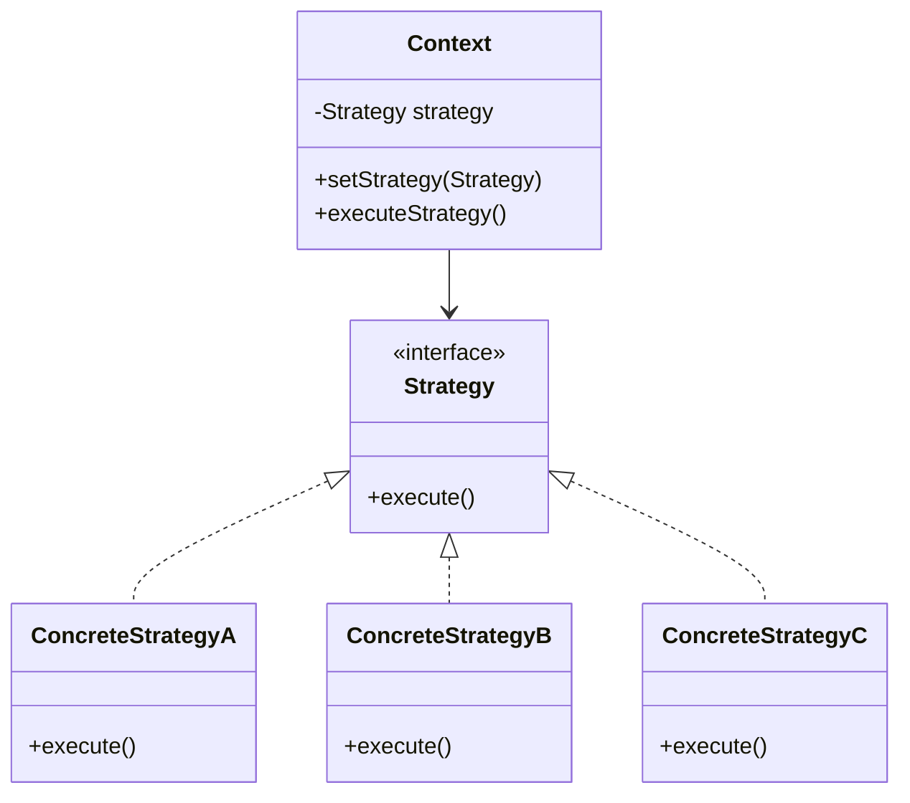

## 5.10.1 Implementing Strategy in Java

In the world of software design, flexibility and adaptability are key to building robust systems. The Strategy Pattern is a powerful tool in the arsenal of a software engineer, allowing for the definition of a family of algorithms, encapsulating each one, and making them interchangeable. This pattern is particularly useful when you need to switch between different algorithms or behaviors at runtime without altering the client code.

### Understanding the Strategy Pattern

The Strategy Pattern is a behavioral design pattern that enables selecting an algorithm's behavior at runtime. It defines a family of algorithms, encapsulates each one, and makes them interchangeable. This pattern allows the algorithm to vary independently from the clients that use it.

#### Key Components of the Strategy Pattern

1. **Strategy Interface**: Defines a common interface for all supported algorithms. This interface is used by the Context to call the algorithm defined by a Concrete Strategy.

2. **Concrete Strategies**: Implement the Strategy interface, providing specific implementations of the algorithm.

3. **Context**: Maintains a reference to a Strategy object and delegates the algorithm execution to the Strategy object.

### Implementing the Strategy Pattern in Java

Let's dive into the implementation of the Strategy Pattern in Java. We'll create a simple example to illustrate how the pattern works.

#### Step 1: Define the Strategy Interface

The first step is to define a Strategy interface that declares a method for executing an algorithm. This interface will be implemented by all concrete strategies.

```java
// Strategy.java
public interface Strategy {
    void execute();
}
```

#### Step 2: Implement Concrete Strategies

Next, we implement several concrete strategies that provide different implementations of the algorithm. Each concrete strategy will implement the Strategy interface.

```java
// ConcreteStrategyA.java
public class ConcreteStrategyA implements Strategy {
    @Override
    public void execute() {
        System.out.println("Executing strategy A");
    }
}

// ConcreteStrategyB.java
public class ConcreteStrategyB implements Strategy {
    @Override
    public void execute() {
        System.out.println("Executing strategy B");
    }
}

// ConcreteStrategyC.java
public class ConcreteStrategyC implements Strategy {
    @Override
    public void execute() {
        System.out.println("Executing strategy C");
    }
}
```

#### Step 3: Create the Context Class

The Context class uses a Strategy object to execute the algorithm. It maintains a reference to a Strategy object and delegates the algorithm execution to this object.

```java
// Context.java
public class Context {
    private Strategy strategy;

    public Context(Strategy strategy) {
        this.strategy = strategy;
    }

    public void setStrategy(Strategy strategy) {
        this.strategy = strategy;
    }

    public void executeStrategy() {
        strategy.execute();
    }
}
```

#### Step 4: Use the Strategy Pattern

Finally, we can use the Strategy Pattern in a client application. We create a Context object and configure it with different strategies at runtime.

```java
// StrategyPatternDemo.java
public class StrategyPatternDemo {
    public static void main(String[] args) {
        Context context = new Context(new ConcreteStrategyA());
        context.executeStrategy(); // Output: Executing strategy A

        context.setStrategy(new ConcreteStrategyB());
        context.executeStrategy(); // Output: Executing strategy B

        context.setStrategy(new ConcreteStrategyC());
        context.executeStrategy(); // Output: Executing strategy C
    }
}
```

### Best Practices for Implementing the Strategy Pattern

1. **Encapsulation**: Ensure that each strategy encapsulates its own behavior and is interchangeable without affecting the client code.

2. **Interface Segregation**: Keep the Strategy interface simple and focused on a single responsibility to adhere to the Interface Segregation Principle.

3. **Strategy Selection**: Use configuration files, dependency injection, or factory patterns to select and switch strategies dynamically.

4. **Performance Considerations**: Be mindful of the overhead introduced by strategy switching, especially in performance-critical applications.

5. **Testing and Maintenance**: Write unit tests for each strategy to ensure they operate correctly. This makes it easier to maintain and extend the system.

### Visualizing the Strategy Pattern

To better understand the Strategy Pattern, let's visualize the relationships between the components using a class diagram.



### Try It Yourself

Now that we've covered the basics of the Strategy Pattern, try modifying the code examples to further solidify your understanding:

- **Add a New Strategy**: Implement a new concrete strategy and integrate it into the existing system.
- **Dynamic Strategy Selection**: Modify the `StrategyPatternDemo` class to select strategies based on user input or configuration files.
- **Performance Testing**: Measure the performance impact of switching strategies in a loop with a large number of iterations.

### Knowledge Check

Before we conclude, let's reinforce what we've learned with a few questions:

- What are the key components of the Strategy Pattern?
- How does the Context class interact with Strategy objects?
- What are some best practices for implementing the Strategy Pattern?

### Conclusion

The Strategy Pattern is a versatile design pattern that provides a way to define a family of algorithms, encapsulate each one, and make them interchangeable. By following best practices and understanding the nuances of the pattern, you can create flexible and maintainable systems that adapt to changing requirements.

Remember, this is just the beginning. As you progress, you'll build more complex and interactive systems. Keep experimenting, stay curious, and enjoy the journey!

## Quiz Time!



### What is the primary purpose of the Strategy Pattern?

- [x] To define a family of algorithms and make them interchangeable.
- [ ] To encapsulate object creation.
- [ ] To manage object lifecycles.
- [ ] To provide a simplified interface to a complex subsystem.

> **Explanation:** The Strategy Pattern is used to define a family of algorithms, encapsulate each one, and make them interchangeable.

### Which component of the Strategy Pattern is responsible for executing the algorithm?

- [ ] Context
- [x] Strategy
- [ ] Concrete Strategy
- [ ] Client

> **Explanation:** The Strategy component defines the interface for executing the algorithm, which is implemented by Concrete Strategies.

### How does the Context class interact with Strategy objects?

- [x] It maintains a reference to a Strategy object and delegates the algorithm execution to it.
- [ ] It directly implements the algorithm.
- [ ] It creates Strategy objects.
- [ ] It modifies the Strategy interface.

> **Explanation:** The Context class maintains a reference to a Strategy object and delegates the algorithm execution to this object.

### What is a best practice for selecting and switching strategies?

- [x] Use configuration files, dependency injection, or factory patterns.
- [ ] Hard-code the strategy selection in the client code.
- [ ] Use global variables to manage strategies.
- [ ] Avoid switching strategies at runtime.

> **Explanation:** Using configuration files, dependency injection, or factory patterns allows for dynamic and flexible strategy selection.

### Which principle is important to follow when designing the Strategy interface?

- [x] Interface Segregation Principle
- [ ] Single Responsibility Principle
- [ ] Dependency Inversion Principle
- [ ] Open/Closed Principle

> **Explanation:** The Interface Segregation Principle ensures that the Strategy interface is simple and focused on a single responsibility.

### What is a potential downside of using the Strategy Pattern?

- [x] It may introduce overhead due to strategy switching.
- [ ] It makes the code less flexible.
- [ ] It increases coupling between classes.
- [ ] It reduces code reuse.

> **Explanation:** The Strategy Pattern may introduce overhead due to the need to switch strategies, especially in performance-critical applications.

### How can you ensure that each strategy is interchangeable?

- [x] By encapsulating each strategy's behavior and adhering to the Strategy interface.
- [ ] By using inheritance to share behavior between strategies.
- [ ] By implementing strategies as static methods.
- [ ] By hard-coding strategy behavior in the Context class.

> **Explanation:** Encapsulating each strategy's behavior and adhering to the Strategy interface ensures interchangeability.

### What is a common use case for the Strategy Pattern?

- [x] Implementing different sorting algorithms.
- [ ] Managing database connections.
- [ ] Handling user authentication.
- [ ] Rendering UI components.

> **Explanation:** The Strategy Pattern is commonly used to implement different algorithms, such as sorting algorithms, that can be selected at runtime.

### True or False: The Strategy Pattern allows the algorithm to vary independently from the clients that use it.

- [x] True
- [ ] False

> **Explanation:** The Strategy Pattern allows the algorithm to vary independently from the clients that use it, providing flexibility and adaptability.

### Which of the following is NOT a component of the Strategy Pattern?

- [ ] Strategy
- [ ] Concrete Strategy
- [x] Singleton
- [ ] Context

> **Explanation:** The Strategy Pattern consists of Strategy, Concrete Strategy, and Context components. Singleton is not part of this pattern.


