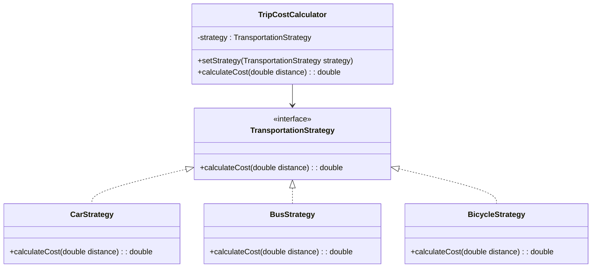

## 5.10.2 Context and Strategy Interfaces

In the realm of software design patterns, the Strategy Pattern stands out for its ability to define a family of algorithms, encapsulate each one, and make them interchangeable. This pattern is particularly useful when you want to select an algorithm's behavior at runtime. Central to this pattern are the concepts of Context and Strategy interfaces, which ensure that strategies are interchangeable and adhere to the open/closed principle. In this section, we will delve into the importance of these interfaces, their roles, and how they interact to promote flexibility and maintainability in software design.

### Understanding the Strategy Pattern

Before we dive into the specifics of Context and Strategy interfaces, let's briefly revisit the Strategy Pattern itself. The Strategy Pattern is a behavioral design pattern that enables selecting an algorithm's behavior at runtime. It achieves this by defining a family of algorithms, encapsulating each one, and making them interchangeable. This pattern is particularly useful when you have multiple algorithms for a specific task and want to switch between them seamlessly.

### The Importance of the Strategy Interface

The Strategy interface is the cornerstone of the Strategy Pattern. It defines a common interface for all the algorithms (or strategies) that can be used interchangeably. By adhering to this interface, each strategy ensures that it can be used in place of any other strategy, thus promoting flexibility and interchangeability.

#### Key Benefits of the Strategy Interface

1. **Interchangeability**: By defining a common interface, the Strategy Pattern allows different algorithms to be swapped in and out without altering the client code. This interchangeability is crucial for maintaining flexibility and adaptability in software design.

2. **Adherence to the Open/Closed Principle**: The open/closed principle, one of the SOLID principles of object-oriented design, states that software entities should be open for extension but closed for modification. By using a Strategy interface, new strategies can be added without modifying existing code, thus adhering to this principle.

3. **Encapsulation of Behavior**: Each strategy encapsulates a specific behavior or algorithm, allowing for clear separation of concerns. This encapsulation makes the codebase easier to understand and maintain.

### The Role of the Context Class

The Context class plays a pivotal role in the Strategy Pattern. It maintains a reference to a Strategy object and delegates the task of executing the algorithm to the Strategy. The Context class is responsible for interacting with the client and selecting the appropriate strategy based on the client's needs.

#### How the Context Class Interacts with Strategies

1. **Strategy Selection**: The Context class is responsible for selecting the appropriate strategy based on the client's requirements. This selection can be made at runtime, allowing for dynamic behavior changes.

2. **Delegation of Behavior**: Once the strategy is selected, the Context class delegates the execution of the algorithm to the Strategy object. This delegation ensures that the Context class remains agnostic to the specific implementation details of the strategies.

3. **Maintaining a Reference to the Strategy**: The Context class maintains a reference to the current Strategy object. This reference allows the Context to switch strategies seamlessly, promoting flexibility and adaptability.

### Implementing the Strategy Pattern in Java

To illustrate the concepts discussed above, let's explore a practical example of implementing the Strategy Pattern in Java. We'll create a simple application that calculates the cost of a trip using different transportation strategies: car, bus, and bicycle.

#### Step 1: Define the Strategy Interface

The first step is to define the Strategy interface, which will be implemented by all the transportation strategies.

```java
// Strategy Interface
public interface TransportationStrategy {
    double calculateCost(double distance);
}
```

#### Step 2: Implement Concrete Strategies

Next, we'll implement the concrete strategies for car, bus, and bicycle transportation.

```java
// Concrete Strategy for Car
public class CarStrategy implements TransportationStrategy {
    private static final double COST_PER_KM = 0.5;

    @Override
    public double calculateCost(double distance) {
        return distance * COST_PER_KM;
    }
}

// Concrete Strategy for Bus
public class BusStrategy implements TransportationStrategy {
    private static final double COST_PER_KM = 0.3;

    @Override
    public double calculateCost(double distance) {
        return distance * COST_PER_KM;
    }
}

// Concrete Strategy for Bicycle
public class BicycleStrategy implements TransportationStrategy {
    private static final double COST_PER_KM = 0.1;

    @Override
    public double calculateCost(double distance) {
        return distance * COST_PER_KM;
    }
}
```

#### Step 3: Implement the Context Class

The Context class will maintain a reference to the current Strategy object and delegate the calculation of the cost to the Strategy.

```java
// Context Class
public class TripCostCalculator {
    private TransportationStrategy strategy;

    public void setStrategy(TransportationStrategy strategy) {
        this.strategy = strategy;
    }

    public double calculateCost(double distance) {
        if (strategy == null) {
            throw new IllegalStateException("Transportation strategy not set.");
        }
        return strategy.calculateCost(distance);
    }
}
```

#### Step 4: Demonstrate the Strategy Pattern in Action

Finally, let's demonstrate how the Strategy Pattern allows us to switch between different transportation strategies seamlessly.

```java
public class StrategyPatternDemo {
    public static void main(String[] args) {
        TripCostCalculator calculator = new TripCostCalculator();

        // Set strategy to Car and calculate cost
        calculator.setStrategy(new CarStrategy());
        System.out.println("Car cost: " + calculator.calculateCost(100));

        // Set strategy to Bus and calculate cost
        calculator.setStrategy(new BusStrategy());
        System.out.println("Bus cost: " + calculator.calculateCost(100));

        // Set strategy to Bicycle and calculate cost
        calculator.setStrategy(new BicycleStrategy());
        System.out.println("Bicycle cost: " + calculator.calculateCost(100));
    }
}
```

### Visualizing the Strategy Pattern

To better understand the interaction between the Context and Strategy interfaces, let's visualize the Strategy Pattern using a class diagram.



**Diagram Description**: The diagram illustrates the Strategy Pattern with the `TransportationStrategy` interface, which is implemented by `CarStrategy`, `BusStrategy`, and `BicycleStrategy`. The `TripCostCalculator` class maintains a reference to the `TransportationStrategy` and delegates the calculation of the cost to the strategy.

### Promoting the Open/Closed Principle

The Strategy Pattern is a prime example of adhering to the open/closed principle. By defining a common interface for strategies, the pattern allows new strategies to be added without modifying existing code. This adherence to the open/closed principle promotes flexibility and maintainability in software design.

#### Adding New Strategies

Suppose we want to add a new transportation strategy, such as a train. With the Strategy Pattern, we can easily add this new strategy without altering the existing codebase.

```java
// Concrete Strategy for Train
public class TrainStrategy implements TransportationStrategy {
    private static final double COST_PER_KM = 0.4;

    @Override
    public double calculateCost(double distance) {
        return distance * COST_PER_KM;
    }
}
```

By implementing the `TransportationStrategy` interface, the `TrainStrategy` can be seamlessly integrated into the existing system.

### Try It Yourself

To gain a deeper understanding of the Strategy Pattern, try experimenting with the code examples provided. Here are a few suggestions:

1. **Add a New Strategy**: Implement a new transportation strategy, such as a scooter or a plane, and integrate it into the existing system.

2. **Modify the Cost Calculation**: Change the cost calculation logic for one of the strategies and observe how it affects the overall system.

3. **Implement a User Interface**: Create a simple user interface that allows users to select a transportation strategy and calculate the cost of a trip.

### Knowledge Check

To reinforce your understanding of the Strategy Pattern and its components, consider the following questions:

- What is the primary purpose of the Strategy interface in the Strategy Pattern?
- How does the Context class interact with the Strategy interface?
- How does the Strategy Pattern adhere to the open/closed principle?
- What are the benefits of using the Strategy Pattern in software design?

### Summary

In this section, we've explored the critical roles of Context and Strategy interfaces in the Strategy Pattern. By defining a common interface for strategies, the pattern ensures interchangeability and adherence to the open/closed principle. The Context class interacts with strategies through this interface, promoting flexibility and maintainability in software design. By experimenting with the code examples and considering the knowledge check questions, you'll gain a deeper understanding of how the Strategy Pattern can be applied to create adaptable and robust software solutions.

### Embrace the Journey

Remember, mastering design patterns is a journey. As you continue to explore and apply these patterns, you'll discover new ways to enhance the flexibility and maintainability of your software designs. Keep experimenting, stay curious, and enjoy the journey!

## Quiz Time!



### What is the primary role of the Strategy interface in the Strategy Pattern?

- [x] To define a common interface for all interchangeable algorithms.
- [ ] To implement the algorithm directly.
- [ ] To maintain the state of the Context class.
- [ ] To handle user input.

> **Explanation:** The Strategy interface defines a common interface for all interchangeable algorithms, ensuring they can be used interchangeably.

### How does the Context class interact with the Strategy interface?

- [x] By maintaining a reference to a Strategy object and delegating tasks to it.
- [ ] By implementing the Strategy interface directly.
- [ ] By modifying the Strategy object at runtime.
- [ ] By storing multiple Strategy objects simultaneously.

> **Explanation:** The Context class maintains a reference to a Strategy object and delegates the execution of tasks to it, allowing for flexibility and interchangeability.

### Which principle does the Strategy Pattern adhere to by allowing new strategies to be added without modifying existing code?

- [x] Open/Closed Principle
- [ ] Single Responsibility Principle
- [ ] Liskov Substitution Principle
- [ ] Interface Segregation Principle

> **Explanation:** The Strategy Pattern adheres to the open/closed principle by allowing new strategies to be added without modifying existing code, promoting flexibility and maintainability.

### What is the benefit of encapsulating behavior within strategies?

- [x] It promotes clear separation of concerns and makes the codebase easier to maintain.
- [ ] It increases the complexity of the code.
- [ ] It requires more memory usage.
- [ ] It limits the flexibility of the code.

> **Explanation:** Encapsulating behavior within strategies promotes clear separation of concerns, making the codebase easier to understand and maintain.

### In the Strategy Pattern, what is the responsibility of the Context class?

- [x] To select and delegate tasks to the appropriate Strategy.
- [ ] To implement all strategies directly.
- [ ] To store the results of the strategies.
- [ ] To handle user authentication.

> **Explanation:** The Context class is responsible for selecting and delegating tasks to the appropriate Strategy, allowing for dynamic behavior changes.

### How can new strategies be added to a system using the Strategy Pattern?

- [x] By implementing the Strategy interface and integrating the new strategy into the Context class.
- [ ] By modifying the existing Context class to include the new strategy.
- [ ] By creating a new Context class for each strategy.
- [ ] By directly altering the client code.

> **Explanation:** New strategies can be added by implementing the Strategy interface and integrating the new strategy into the existing Context class, adhering to the open/closed principle.

### What is a potential drawback of using the Strategy Pattern?

- [x] It can lead to an increase in the number of classes in the system.
- [ ] It limits the flexibility of the code.
- [ ] It makes the code harder to maintain.
- [ ] It reduces the interchangeability of algorithms.

> **Explanation:** A potential drawback of the Strategy Pattern is that it can lead to an increase in the number of classes in the system, as each strategy requires its own class.

### How does the Strategy Pattern promote flexibility in software design?

- [x] By allowing algorithms to be selected and changed at runtime.
- [ ] By hardcoding algorithms into the client code.
- [ ] By limiting the number of algorithms available.
- [ ] By requiring all algorithms to be implemented in a single class.

> **Explanation:** The Strategy Pattern promotes flexibility by allowing algorithms to be selected and changed at runtime, enabling dynamic behavior changes.

### What is the primary advantage of using the Strategy Pattern over hardcoding algorithms?

- [x] It allows for easy swapping and addition of algorithms without modifying existing code.
- [ ] It simplifies the code by reducing the number of classes.
- [ ] It eliminates the need for a Context class.
- [ ] It requires less memory usage.

> **Explanation:** The primary advantage of using the Strategy Pattern is that it allows for easy swapping and addition of algorithms without modifying existing code, promoting flexibility and maintainability.

### True or False: The Context class in the Strategy Pattern must implement the Strategy interface.

- [ ] True
- [x] False

> **Explanation:** False. The Context class does not implement the Strategy interface; instead, it maintains a reference to a Strategy object and delegates tasks to it.


