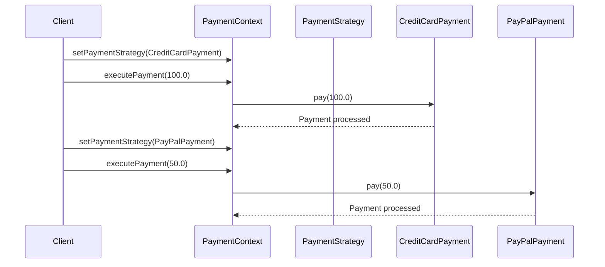

## 5.10.3 Runtime Strategy Selection

In the realm of software design, flexibility and adaptability are paramount. The Strategy Pattern is a powerful tool that allows developers to define a family of algorithms, encapsulate each one, and make them interchangeable. This pattern is particularly useful when you need to dynamically change the behavior of an application based on context or conditions at runtime. In this section, we will delve into the techniques for selecting and switching strategies at runtime, provide code examples, discuss thread safety and performance considerations, and highlight scenarios where dynamic strategy selection is beneficial.

### Understanding the Strategy Pattern

Before we dive into runtime strategy selection, let's briefly revisit the Strategy Pattern. The Strategy Pattern defines a family of algorithms, encapsulates each one, and makes them interchangeable. This pattern allows the algorithm to vary independently from the clients that use it.

The primary components of the Strategy Pattern are:

- **Strategy Interface**: Defines a common interface for all supported algorithms.
- **Concrete Strategies**: Implement the strategy interface with specific algorithms.
- **Context**: Maintains a reference to a strategy object and delegates the algorithm execution to the strategy object.

### Dynamic Strategy Selection

Dynamic strategy selection involves choosing and switching strategies at runtime based on specific conditions or context. This capability is crucial in scenarios where the behavior of an application needs to adapt to changing requirements or environments.

#### Techniques for Runtime Strategy Selection

1. **Conditional Logic**: Use conditional statements to select strategies based on input or state. This approach is straightforward but can lead to complex and hard-to-maintain code if not managed properly.

2. **Configuration Files**: Store strategy configurations in external files (e.g., XML, JSON) and load them at runtime. This method decouples strategy selection from the codebase, allowing for easier updates and maintenance.

3. **Dependency Injection**: Use dependency injection frameworks (e.g., Spring) to inject strategies at runtime based on configuration or context. This approach promotes loose coupling and enhances testability.

4. **Factory Pattern**: Combine the Strategy Pattern with the Factory Pattern to create strategies at runtime. The factory can decide which strategy to instantiate based on input parameters or configuration.

5. **Reflection**: Use Java Reflection to dynamically load and instantiate strategy classes at runtime. This technique provides maximum flexibility but can introduce performance overhead and complexity.

#### Code Example: Conditional Strategy Selection

Let's explore a simple example of selecting strategies based on input conditions. Consider a payment processing system that supports multiple payment methods.

```java
// Strategy Interface
interface PaymentStrategy {
    void pay(double amount);
}

// Concrete Strategies
class CreditCardPayment implements PaymentStrategy {
    @Override
    public void pay(double amount) {
        System.out.println("Paid " + amount + " using Credit Card.");
    }
}

class PayPalPayment implements PaymentStrategy {
    @Override
    public void pay(double amount) {
        System.out.println("Paid " + amount + " using PayPal.");
    }
}

// Context
class PaymentContext {
    private PaymentStrategy strategy;

    public void setPaymentStrategy(PaymentStrategy strategy) {
        this.strategy = strategy;
    }

    public void executePayment(double amount) {
        strategy.pay(amount);
    }
}

// Client Code
public class PaymentProcessor {
    public static void main(String[] args) {
        PaymentContext context = new PaymentContext();

        // Select strategy based on input
        String paymentMethod = "CreditCard"; // This could be user input or configuration

        if ("CreditCard".equals(paymentMethod)) {
            context.setPaymentStrategy(new CreditCardPayment());
        } else if ("PayPal".equals(paymentMethod)) {
            context.setPaymentStrategy(new PayPalPayment());
        }

        // Execute payment
        context.executePayment(100.0);
    }
}
```

In this example, the `PaymentContext` class allows the client to set a payment strategy at runtime. The client code selects the appropriate strategy based on the `paymentMethod` variable.

#### Considerations for Thread Safety and Performance

When implementing runtime strategy selection, it's essential to consider thread safety and performance:

- **Thread Safety**: Ensure that the strategy selection and execution are thread-safe, especially in multi-threaded environments. Consider using synchronized blocks or concurrent data structures to manage shared resources.

- **Performance**: Avoid frequent strategy switching if it incurs significant overhead. Cache strategies when possible to reduce instantiation costs. Use lazy initialization to defer strategy creation until it's needed.

#### Scenarios for Dynamic Strategy Selection

Dynamic strategy selection is beneficial in various scenarios:

- **User Preferences**: Allow users to choose different behaviors or algorithms based on their preferences. For example, a text editor might offer multiple spell-checking algorithms.

- **Environment Changes**: Adapt to changes in the environment, such as network conditions or hardware capabilities. For instance, a video streaming application might switch between different compression algorithms based on bandwidth availability.

- **Business Rules**: Implement complex business rules that change frequently. By decoupling the rules from the code, you can update them without redeploying the application.

- **Testing and Experimentation**: Facilitate A/B testing or experimentation by dynamically switching strategies to evaluate different approaches.

### Visualizing Strategy Selection

To better understand the flow of strategy selection, let's visualize the process using a sequence diagram.



This diagram illustrates how the client sets different payment strategies and executes payments using the selected strategy.

### Try It Yourself

To deepen your understanding, try modifying the code example:

- Add a new payment strategy, such as `BitcoinPayment`, and update the client code to select it based on a new condition.
- Implement a caching mechanism to store and reuse strategy instances.
- Experiment with using a configuration file to load strategies dynamically.

### References and Further Reading

- [Java Design Patterns](https://www.journaldev.com/1827/java-design-patterns-example-tutorial)
- [Strategy Pattern in Java](https://refactoring.guru/design-patterns/strategy/java)
- [Effective Java by Joshua Bloch](https://www.oreilly.com/library/view/effective-java-3rd/9780134686097/)

### Knowledge Check

- Why is it important to consider thread safety when implementing runtime strategy selection?
- How can the Factory Pattern be combined with the Strategy Pattern for dynamic selection?
- What are some potential performance concerns with frequent strategy switching?

### Embrace the Journey

Remember, mastering design patterns is a journey. As you continue to explore and experiment with different patterns, you'll gain a deeper understanding of how to build flexible, maintainable, and scalable software. Keep experimenting, stay curious, and enjoy the journey!

## Quiz Time!



### What is the primary purpose of the Strategy Pattern?

- [x] To define a family of algorithms and make them interchangeable.
- [ ] To encapsulate object creation logic.
- [ ] To provide a simplified interface to a complex subsystem.
- [ ] To ensure a class has only one instance.

> **Explanation:** The Strategy Pattern is used to define a family of algorithms, encapsulate each one, and make them interchangeable.

### Which technique can be used for runtime strategy selection?

- [x] Conditional Logic
- [x] Configuration Files
- [x] Dependency Injection
- [ ] Singleton Pattern

> **Explanation:** Conditional Logic, Configuration Files, and Dependency Injection are techniques for runtime strategy selection, while the Singleton Pattern is unrelated.

### What is a key consideration when implementing runtime strategy selection?

- [x] Thread Safety
- [ ] Singleton Instance
- [ ] Static Initialization
- [ ] Hard Coding

> **Explanation:** Thread safety is crucial when implementing runtime strategy selection, especially in multi-threaded environments.

### How can the Factory Pattern enhance the Strategy Pattern?

- [x] By creating strategies at runtime based on input parameters.
- [ ] By ensuring only one instance of a strategy exists.
- [ ] By providing a simplified interface to strategies.
- [ ] By encapsulating the algorithm in a single class.

> **Explanation:** The Factory Pattern can be used to create strategies at runtime based on input parameters, enhancing the flexibility of the Strategy Pattern.

### Which scenario benefits from dynamic strategy selection?

- [x] User Preferences
- [x] Environment Changes
- [ ] Singleton Initialization
- [ ] Static Configuration

> **Explanation:** Dynamic strategy selection is beneficial for adapting to user preferences and environment changes.

### What is a potential downside of using Java Reflection for strategy selection?

- [x] Performance Overhead
- [ ] Simplified Code
- [ ] Enhanced Readability
- [ ] Reduced Flexibility

> **Explanation:** Java Reflection can introduce performance overhead and complexity.

### How can caching improve performance in strategy selection?

- [x] By reducing instantiation costs.
- [ ] By ensuring thread safety.
- [ ] By simplifying code logic.
- [ ] By increasing coupling.

> **Explanation:** Caching strategies can reduce instantiation costs and improve performance.

### What is a benefit of using configuration files for strategy selection?

- [x] Decoupling strategy selection from the codebase.
- [ ] Ensuring singleton instances.
- [ ] Simplifying algorithm complexity.
- [ ] Hard coding strategies.

> **Explanation:** Configuration files decouple strategy selection from the codebase, allowing for easier updates.

### Which design pattern is often combined with the Strategy Pattern for dynamic selection?

- [x] Factory Pattern
- [ ] Singleton Pattern
- [ ] Observer Pattern
- [ ] Decorator Pattern

> **Explanation:** The Factory Pattern is often combined with the Strategy Pattern for dynamic selection.

### True or False: The Strategy Pattern allows algorithms to vary independently from clients that use them.

- [x] True
- [ ] False

> **Explanation:** True. The Strategy Pattern allows algorithms to vary independently from clients that use them.


