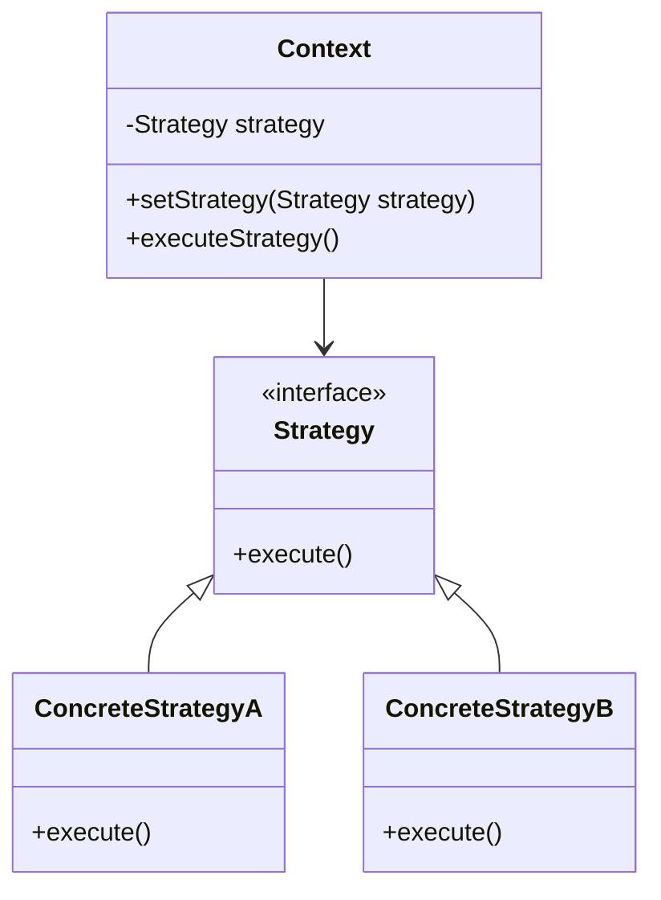
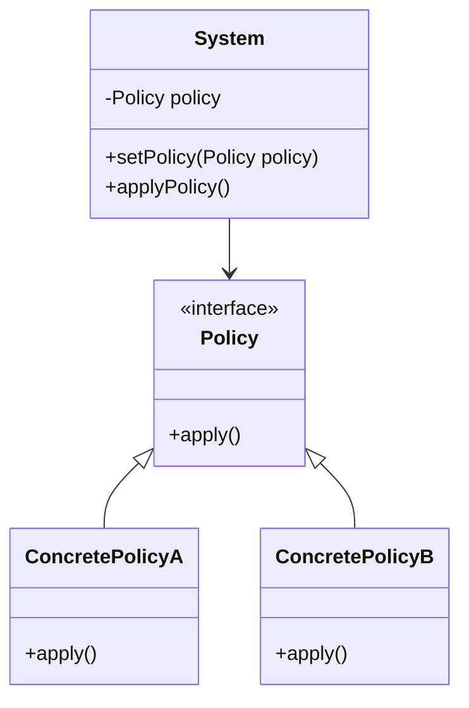

## 5.10.4 Strategy Pattern vs. Policy Pattern

In the realm of software design patterns, the Strategy and Policy patterns are often discussed together due to their conceptual similarities. However, understanding their distinctions is crucial for expert software engineers who aim to implement these patterns effectively in Java. This section will delve into the nuances between the Strategy and Policy patterns, providing clear definitions, examples, and guidance on their appropriate usage.

### Understanding the Strategy Pattern

The Strategy pattern is a behavioral design pattern that enables selecting an algorithm's behavior at runtime. It defines a family of algorithms, encapsulates each one, and makes them interchangeable. The Strategy pattern allows the algorithm to vary independently from the clients that use it.

#### Key Components of the Strategy Pattern

- **Context**: The class that uses a Strategy. It maintains a reference to a Strategy object and delegates the algorithm execution to the Strategy.
- **Strategy Interface**: An interface common to all supported algorithms. The Context uses this interface to call the algorithm defined by a Concrete Strategy.
- **Concrete Strategies**: Classes that implement the Strategy interface. Each Concrete Strategy provides a different implementation of the algorithm.

#### Example of the Strategy Pattern in Java

```java
// Strategy interface
interface PaymentStrategy {
    void pay(int amount);
}

// Concrete Strategy for Credit Card payment
class CreditCardPayment implements PaymentStrategy {
    private String cardNumber;

    public CreditCardPayment(String cardNumber) {
        this.cardNumber = cardNumber;
    }

    @Override
    public void pay(int amount) {
        System.out.println("Paid " + amount + " using Credit Card.");
    }
}

// Concrete Strategy for PayPal payment
class PayPalPayment implements PaymentStrategy {
    private String email;

    public PayPalPayment(String email) {
        this.email = email;
    }

    @Override
    public void pay(int amount) {
        System.out.println("Paid " + amount + " using PayPal.");
    }
}

// Context class
class ShoppingCart {
    private PaymentStrategy paymentStrategy;

    public void setPaymentStrategy(PaymentStrategy paymentStrategy) {
        this.paymentStrategy = paymentStrategy;
    }

    public void checkout(int amount) {
        paymentStrategy.pay(amount);
    }
}

// Client code
public class StrategyPatternDemo {
    public static void main(String[] args) {
        ShoppingCart cart = new ShoppingCart();

        // Pay using Credit Card
        cart.setPaymentStrategy(new CreditCardPayment("1234-5678-9876-5432"));
        cart.checkout(100);

        // Pay using PayPal
        cart.setPaymentStrategy(new PayPalPayment("user@example.com"));
        cart.checkout(200);
    }
}
```

### Defining the Policy Pattern

The Policy pattern, while similar to the Strategy pattern, is often considered a broader concept. It involves defining a set of rules or policies that govern the behavior of a system. The Policy pattern is not as formally defined as the Strategy pattern in classic design pattern literature, but it shares the idea of encapsulating behavior that can be changed independently of the system.

#### Key Characteristics of the Policy Pattern

- **Rule-Based**: The Policy pattern is often used to define rules or policies that dictate system behavior.
- **Configuration-Driven**: Policies can be configured or changed without altering the system's core logic.
- **Behavior Encapsulation**: Like the Strategy pattern, the Policy pattern encapsulates behavior, allowing it to be modified independently.

#### Example of the Policy Pattern in Java

```java
// Policy interface
interface DiscountPolicy {
    double applyDiscount(double price);
}

// Concrete Policy for No Discount
class NoDiscountPolicy implements DiscountPolicy {
    @Override
    public double applyDiscount(double price) {
        return price;
    }
}

// Concrete Policy for Seasonal Discount
class SeasonalDiscountPolicy implements DiscountPolicy {
    private double discountRate;

    public SeasonalDiscountPolicy(double discountRate) {
        this.discountRate = discountRate;
    }

    @Override
    public double applyDiscount(double price) {
        return price * (1 - discountRate);
    }
}

// Context class
class Product {
    private String name;
    private double price;
    private DiscountPolicy discountPolicy;

    public Product(String name, double price) {
        this.name = name;
        this.price = price;
        this.discountPolicy = new NoDiscountPolicy(); // Default policy
    }

    public void setDiscountPolicy(DiscountPolicy discountPolicy) {
        this.discountPolicy = discountPolicy;
    }

    public double getPrice() {
        return discountPolicy.applyDiscount(price);
    }
}

// Client code
public class PolicyPatternDemo {
    public static void main(String[] args) {
        Product product = new Product("Laptop", 1000);

        // No discount
        System.out.println("Price without discount: " + product.getPrice());

        // Apply seasonal discount
        product.setDiscountPolicy(new SeasonalDiscountPolicy(0.1));
        System.out.println("Price with seasonal discount: " + product.getPrice());
    }
}
```

### Strategy Pattern vs. Policy Pattern: Are They Synonymous?

While the Strategy and Policy patterns share similarities, they are not synonymous. The Strategy pattern is a well-defined design pattern that focuses on encapsulating algorithms and making them interchangeable. The Policy pattern, on the other hand, is a broader concept that involves defining rules or policies that govern system behavior.

#### Differences Between Strategy and Policy Patterns

1. **Focus**: The Strategy pattern focuses on encapsulating algorithms, while the Policy pattern is more about defining rules or policies.
2. **Formal Definition**: The Strategy pattern is a formally defined design pattern, whereas the Policy pattern is a broader concept not formally defined in classic design pattern literature.
3. **Use Cases**: The Strategy pattern is often used when there is a need to switch between different algorithms, while the Policy pattern is used when there are rules or policies that need to be applied to a system.

### Clarifying Confusion: Correct Usage of Strategy and Policy Patterns

To effectively use the Strategy and Policy patterns, it's essential to understand their differences and appropriate use cases. The Strategy pattern is ideal for scenarios where you need to switch between different algorithms or behaviors at runtime. The Policy pattern is suitable for situations where you need to define and apply rules or policies that govern system behavior.

#### When to Use the Strategy Pattern

- When you have multiple algorithms or behaviors that can be interchanged at runtime.
- When you want to encapsulate algorithms to make them interchangeable and independent of the clients that use them.
- When you need to add new algorithms or behaviors without modifying existing code.

#### When to Use the Policy Pattern

- When you need to define rules or policies that govern system behavior.
- When you want to configure or change system behavior without altering the core logic.
- When you need to apply different policies based on different conditions or configurations.

### Visualizing the Differences

To further clarify the differences between the Strategy and Policy patterns, let's visualize their structures using Mermaid.js diagrams.



**Figure 1: Strategy Pattern Structure**

In the Strategy pattern, the `Context` class maintains a reference to a `Strategy` object and delegates the algorithm execution to the `Strategy`. The `Strategy` interface defines a common interface for all supported algorithms, and `ConcreteStrategyA` and `ConcreteStrategyB` provide different implementations of the algorithm.



**Figure 2: Policy Pattern Structure**

In the Policy pattern, the `System` class maintains a reference to a `Policy` object and applies the policy using the `Policy` interface. `ConcretePolicyA` and `ConcretePolicyB` provide different implementations of the policy.

### Try It Yourself

To deepen your understanding of the Strategy and Policy patterns, try modifying the code examples provided. Experiment with adding new strategies or policies, and observe how the system behavior changes. Consider the following exercises:

1. **Add a New Payment Method**: Extend the Strategy pattern example by adding a new payment method, such as Bitcoin. Implement a new `ConcreteStrategy` class for Bitcoin payment and integrate it into the `ShoppingCart`.

2. **Implement a New Discount Policy**: Extend the Policy pattern example by adding a new discount policy, such as a loyalty discount. Implement a new `ConcretePolicy` class for the loyalty discount and integrate it into the `Product`.

3. **Visualize the Patterns**: Use the Mermaid.js diagrams provided to create your own visualizations of the Strategy and Policy patterns. Experiment with different configurations and observe how the structure changes.

### Knowledge Check

To reinforce your understanding of the Strategy and Policy patterns, consider the following questions:

- What are the key differences between the Strategy and Policy patterns?
- When would you use the Strategy pattern over the Policy pattern, and vice versa?
- How do the Strategy and Policy patterns promote flexibility and maintainability in software design?

### Conclusion

The Strategy and Policy patterns are powerful tools in the software engineer's toolkit, enabling flexible and maintainable design. By understanding their differences and appropriate use cases, you can effectively apply these patterns to solve complex design challenges in Java.

Remember, this is just the beginning. As you progress, you'll build more complex and interactive systems. Keep experimenting, stay curious, and enjoy the journey!

## Quiz Time!



### What is the primary focus of the Strategy pattern?

- [x] Encapsulating algorithms and making them interchangeable
- [ ] Defining rules or policies that govern system behavior
- [ ] Managing system configurations
- [ ] Encapsulating data for transfer

> **Explanation:** The Strategy pattern focuses on encapsulating algorithms and making them interchangeable, allowing the algorithm to vary independently from the clients that use it.

### Which of the following is a characteristic of the Policy pattern?

- [ ] It is a formally defined design pattern.
- [x] It involves defining rules or policies that dictate system behavior.
- [ ] It is primarily used for encapsulating algorithms.
- [ ] It is synonymous with the Strategy pattern.

> **Explanation:** The Policy pattern involves defining rules or policies that dictate system behavior. It is not a formally defined design pattern like the Strategy pattern.

### In the Strategy pattern, what role does the Context class play?

- [x] It maintains a reference to a Strategy object and delegates algorithm execution.
- [ ] It defines the common interface for all supported algorithms.
- [ ] It provides different implementations of the algorithm.
- [ ] It encapsulates data for transfer.

> **Explanation:** In the Strategy pattern, the Context class maintains a reference to a Strategy object and delegates algorithm execution to the Strategy.

### When should you use the Policy pattern?

- [ ] When you need to switch between different algorithms at runtime.
- [x] When you need to define and apply rules or policies that govern system behavior.
- [ ] When you need to encapsulate data for transfer.
- [ ] When you need to manage system configurations.

> **Explanation:** The Policy pattern is used when you need to define and apply rules or policies that govern system behavior.

### Which of the following is a difference between the Strategy and Policy patterns?

- [x] The Strategy pattern focuses on encapsulating algorithms, while the Policy pattern focuses on defining rules or policies.
- [ ] The Policy pattern is a formally defined design pattern, while the Strategy pattern is not.
- [ ] The Strategy pattern is used for managing system configurations, while the Policy pattern is not.
- [ ] The Policy pattern is synonymous with the Strategy pattern.

> **Explanation:** The Strategy pattern focuses on encapsulating algorithms, while the Policy pattern focuses on defining rules or policies. The Policy pattern is not a formally defined design pattern like the Strategy pattern.

### What is a common use case for the Strategy pattern?

- [x] Switching between different algorithms or behaviors at runtime
- [ ] Defining rules or policies that govern system behavior
- [ ] Managing system configurations
- [ ] Encapsulating data for transfer

> **Explanation:** A common use case for the Strategy pattern is switching between different algorithms or behaviors at runtime.

### How does the Policy pattern promote flexibility in software design?

- [ ] By encapsulating algorithms and making them interchangeable
- [x] By allowing rules or policies to be configured or changed without altering the core logic
- [ ] By managing system configurations
- [ ] By encapsulating data for transfer

> **Explanation:** The Policy pattern promotes flexibility by allowing rules or policies to be configured or changed without altering the core logic.

### Which of the following is true about the Strategy pattern?

- [x] It is a formally defined design pattern.
- [ ] It is primarily used for defining rules or policies.
- [ ] It is synonymous with the Policy pattern.
- [ ] It is used for managing system configurations.

> **Explanation:** The Strategy pattern is a formally defined design pattern that focuses on encapsulating algorithms and making them interchangeable.

### True or False: The Policy pattern is synonymous with the Strategy pattern.

- [ ] True
- [x] False

> **Explanation:** False. The Policy pattern is not synonymous with the Strategy pattern. They share similarities but have distinct differences in focus and use cases.


